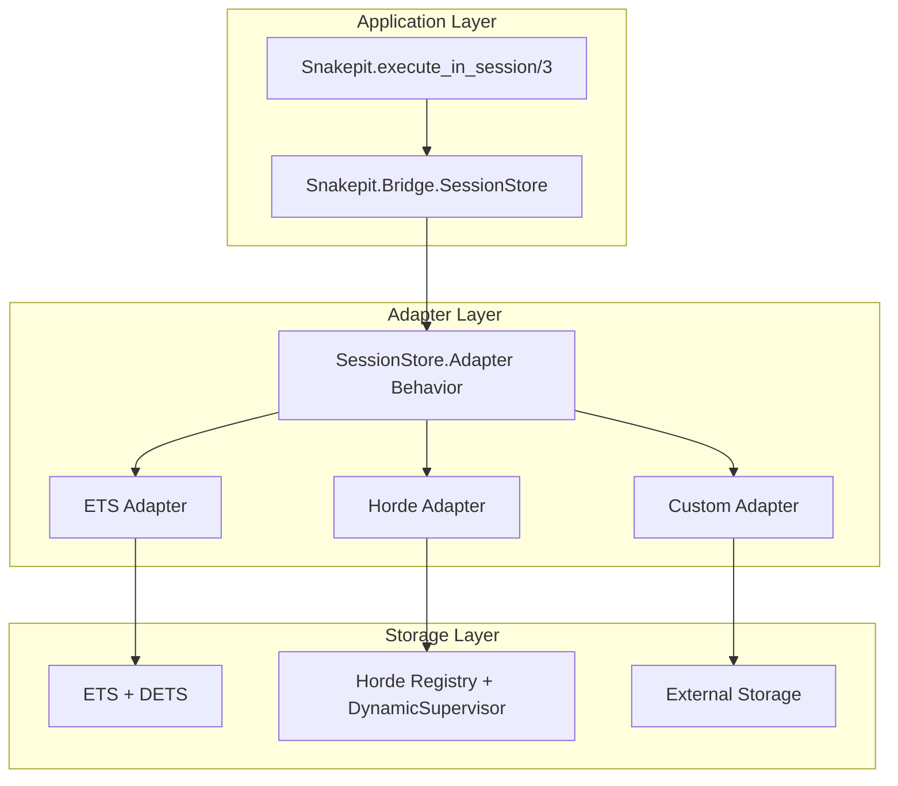
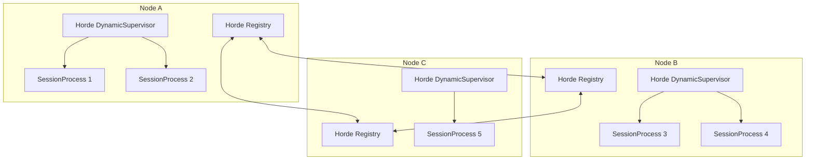

# Design Document

## Overview

The Distributed Session Registry implements a pluggable adapter architecture that enables Snakepit sessions to operate in both single-node and distributed environments. The design maintains 100% backward compatibility while providing a clear migration path to distributed session management using Horde for CRDT-based state replication.

## Architecture

### Component Diagram



### Adapter Behavior Interface

The core abstraction is the `SessionStore.Adapter` behavior that defines a consistent interface for all session storage implementations:

```elixir
defmodule Snakepit.SessionStore.Adapter do
  @type session_id :: String.t()
  @type session :: Snakepit.Bridge.Session.t()
  @type opts :: keyword()
  
  @callback create_session(session_id, opts) :: {:ok, session} | {:error, term()}
  @callback get_session(session_id) :: {:ok, session} | {:error, :not_found}
  @callback update_session(session_id, (session -> session)) :: {:ok, session} | {:error, term()}
  @callback delete_session(session_id) :: :ok | {:error, term()}
  @callback list_sessions() :: [session_id]
  @callback session_exists?(session_id) :: boolean()
  @callback store_program(session_id, String.t(), map()) :: :ok | {:error, term()}
  @callback get_program(session_id, String.t()) :: {:ok, map()} | {:error, term()}
  @callback get_stats() :: map()
end
```

### SessionStore Facade

The existing `SessionStore` module becomes a facade that delegates to the configured adapter:

```elixir
defmodule Snakepit.Bridge.SessionStore do
  # Public API remains unchanged for backward compatibility
  def create_session(session_id, opts \\ [])
  def get_session(session_id)
  def update_session(session_id, update_fn)
  # ... existing functions
  
  # New adapter management functions
  def get_adapter_stats()
  def health_check()
  
  # Private delegation
  defp adapter do
    Application.get_env(:snakepit, :session_adapter, Snakepit.SessionStore.ETS)
  end
  
  defp delegate_with_fallback(operation) do
    try do
      operation.()
    rescue
      error -> handle_adapter_error(error)
    end
  end
end
```

## Components and Interfaces

### ETS Adapter (Refactored)

The existing ETS/DETS implementation is extracted into a dedicated adapter:

**Key Features:**
- Maintains current performance characteristics (<1ms latency)
- Preserves DETS persistence for crash recovery
- Zero configuration required (default adapter)
- Optimized for single-node deployments

**Implementation Strategy:**
- Extract current SessionStore logic into `Snakepit.SessionStore.ETS`
- Maintain all existing optimizations (ETS read concurrency, DETS batching)
- Add telemetry events for monitoring
- Implement adapter behavior interface

### Horde Adapter (New)

A distributed adapter using Horde for CRDT-based session replication:

**Key Features:**
- Sessions as supervised GenServer processes
- Automatic distribution across cluster nodes
- Fault tolerance through process replication
- Eventual consistency with conflict resolution

**Architecture:**


**SessionProcess Implementation:**
Each session runs as a GenServer that:
- Holds session state in memory
- Handles concurrent updates with optimistic locking
- Implements TTL-based expiration
- Provides program storage and retrieval
- Emits telemetry for monitoring

### Configuration System

The adapter is selected through application configuration:

```elixir
# Single-node (default, backward compatible)
config :snakepit,
  session_adapter: Snakepit.SessionStore.ETS

# Distributed with Horde
config :snakepit,
  session_adapter: Snakepit.SessionStore.Horde,
  horde_registry: MyApp.SessionRegistry,
  horde_supervisor: MyApp.SessionSupervisor

# Custom implementation
config :snakepit,
  session_adapter: MyApp.CustomSessionAdapter,
  custom_opts: [redis_url: "redis://localhost:6379"]
```

## Data Models

### Session Structure

The session data model remains unchanged to maintain compatibility:

```elixir
defmodule Snakepit.Bridge.Session do
  defstruct [
    :id,                    # String - unique session identifier
    :created_at,           # DateTime - when session was created
    :last_accessed,        # DateTime - last access time for TTL
    :ttl,                  # Integer - time to live in seconds
    :metadata,             # Map - arbitrary session metadata
    :programs,             # Map - stored program data
    :variables             # Map - session variables (future use)
  ]
end
```

### Adapter Statistics

Each adapter provides standardized statistics:

```elixir
%{
  type: :ets | :horde | :custom,
  node_count: integer(),
  session_count: integer(),
  health: :healthy | :degraded | :unhealthy,
  latency_ms: float(),
  memory_usage: integer(),
  error_rate: float(),
  # Adapter-specific metrics
  custom_metrics: map()
}
```

## Error Handling

### Error Classification

Errors are classified into categories for appropriate handling:

1. **Transient Errors** - Network timeouts, temporary unavailability
2. **Permanent Errors** - Session not found, validation failures
3. **System Errors** - Adapter failures, configuration issues

### Fallback Strategies

```elixir
defmodule Snakepit.SessionStore.ErrorHandler do
  def handle_adapter_error(error, operation, context) do
    case classify_error(error) do
      :transient ->
        retry_with_backoff(operation, max_attempts: 3)
      
      :permanent ->
        {:error, normalize_error(error)}
      
      :system ->
        log_system_error(error, context)
        {:error, {:adapter_failure, error}}
    end
  end
end
```

### Circuit Breaker Pattern

For distributed adapters, implement circuit breaker to prevent cascade failures:

```elixir
defmodule Snakepit.SessionStore.CircuitBreaker do
  # Open circuit when error rate > 50% over 1 minute
  # Half-open after 30 seconds to test recovery
  # Close when 5 consecutive successes
end
```

## Testing Strategy

### Adapter Compliance Testing

All adapters must pass the same compliance test suite:

```elixir
defmodule Snakepit.SessionStore.ComplianceTest do
  def test_adapter(adapter_module) do
    # Test all behavior callbacks
    # Verify idempotency requirements
    # Check error handling
    # Validate performance characteristics
  end
end
```

### Multi-Node Integration Tests

For distributed adapters, test cluster scenarios:

```elixir
defmodule Snakepit.SessionStore.ClusterTest do
  use ExUnit.Case
  
  @tag :cluster
  test "sessions survive node failures" do
    # Start 3-node cluster
    # Create sessions across nodes
    # Kill one node
    # Verify sessions accessible from remaining nodes
  end
  
  @tag :cluster  
  test "network partition recovery" do
    # Create network partition
    # Verify both sides continue operating
    # Heal partition
    # Verify state reconciliation
  end
end
```

### Property-Based Testing

Verify consistency across different adapters:

```elixir
property "adapter operations are equivalent" do
  forall operations <- operation_sequence() do
    ets_result = execute_on_adapter(ETS, operations)
    horde_result = execute_on_adapter(Horde, operations)
    
    normalize_results(ets_result) == normalize_results(horde_result)
  end
end
```

## Performance Considerations

### Latency Targets

| Adapter | Create | Get | Update | Delete |
|---------|--------|-----|--------|--------|
| ETS | <1ms | <0.1ms | <1ms | <1ms |
| Horde | <10ms | <5ms | <15ms | <10ms |

### Memory Usage

- **ETS**: Linear with session count, ~1KB per session
- **Horde**: Distributed across nodes, ~2x overhead for replication
- **Optimization**: Lazy loading of large program data

### Scalability Limits

- **ETS**: ~1M sessions per node (memory limited)
- **Horde**: Horizontal scaling, ~10K sessions per node recommended
- **Network**: Horde performance degrades with >10 nodes

## Monitoring and Observability

### Telemetry Events

```elixir
# Session lifecycle
[:snakepit, :session, :created]
[:snakepit, :session, :accessed] 
[:snakepit, :session, :updated]
[:snakepit, :session, :deleted]

# Adapter operations
[:snakepit, :session_adapter, :operation]
[:snakepit, :session_adapter, :error]

# Distributed events (Horde only)
[:snakepit, :horde, :rebalance]
[:snakepit, :horde, :node_join]
[:snakepit, :horde, :node_leave]
```

### Health Checks

```elixir
defmodule Snakepit.SessionStore.HealthCheck do
  def check() do
    adapter = current_adapter()
    
    with {:ok, stats} <- adapter.get_stats(),
         :ok <- validate_health(stats) do
      {:ok, %{status: :healthy, adapter: adapter, stats: stats}}
    else
      error -> {:error, %{status: :unhealthy, reason: error}}
    end
  end
end
```

### Metrics Dashboard

Key metrics to track:
- Session count per adapter/node
- Operation latency percentiles
- Error rates by operation type
- Cluster membership changes
- Memory usage trends

## Migration Strategy

### Zero-Downtime Migration

1. **Preparation Phase**
   - Deploy new code with ETS adapter (no change)
   - Verify health and performance

2. **Migration Phase**
   - Run migration utility to copy sessions to Horde
   - Validate all sessions transferred correctly
   - Switch configuration to Horde adapter

3. **Verification Phase**
   - Monitor for errors or performance issues
   - Validate distributed behavior
   - Clean up old ETS data

### Migration Utilities

```elixir
defmodule Snakepit.SessionStore.Migrator do
  def migrate_sessions(from: from_adapter, to: to_adapter, opts \\ []) do
    # Batch migration with progress reporting
    # Validation and rollback capabilities
    # Zero-downtime operation
  end
  
  def validate_migration(from_adapter, to_adapter) do
    # Compare session counts and data integrity
    # Report missing or corrupted sessions
    # Provide detailed migration report
  end
end
```

## Security Considerations

### Access Control

- Adapter selection restricted to application configuration
- No runtime adapter switching without proper authorization
- Session data encryption in transit (Horde uses Erlang distribution)

### Data Protection

- Session TTL enforced consistently across all adapters
- Automatic cleanup of expired sessions
- No sensitive data logged in telemetry events

### Network Security

- Horde relies on Erlang distribution security
- Recommend TLS for inter-node communication
- Firewall rules for cluster ports

## Deployment Patterns

### Kubernetes StatefulSet

```yaml
apiVersion: apps/v1
kind: StatefulSet
metadata:
  name: snakepit-cluster
spec:
  serviceName: snakepit
  replicas: 3
  template:
    spec:
      containers:
      - name: snakepit
        env:
        - name: SESSION_ADAPTER
          value: "Snakepit.SessionStore.Horde"
        - name: CLUSTER_STRATEGY  
          value: "kubernetes"
```

### Docker Compose Development

```yaml
services:
  snakepit-1:
    environment:
      - SESSION_ADAPTER=Snakepit.SessionStore.Horde
      - NODE_NAME=snakepit@snakepit-1
  snakepit-2:
    environment:
      - SESSION_ADAPTER=Snakepit.SessionStore.Horde  
      - NODE_NAME=snakepit@snakepit-2
```

## Future Enhancements

### Planned Improvements

1. **Redis Adapter** - For external session storage
2. **Session Sharding** - Partition sessions across adapters
3. **Cross-Cluster Replication** - Multi-datacenter support
4. **Session Compression** - Reduce memory usage for large sessions
5. **Async Replication** - Improve write performance

### Extension Points

- Custom serialization formats
- Pluggable conflict resolution strategies  
- External health check integrations
- Custom telemetry exporters