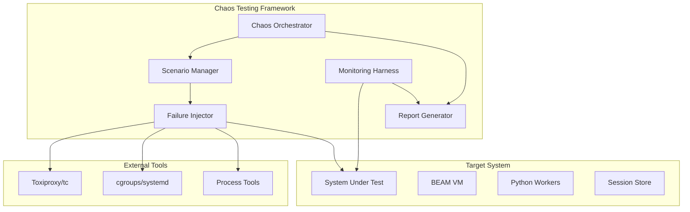

# Design Document

## Overview

The Chaos Testing Framework is a comprehensive testing system that validates Snakepit's behavior under catastrophic failure conditions. It implements chaos engineering principles through automated failure injection, systematic scenario execution, and detailed result analysis.

The framework consists of a test orchestrator, failure injection modules, monitoring systems, and reporting components that work together to simulate real-world production failures and validate system resilience.

## Architecture

### High-Level Architecture



### Component Responsibilities

#### Chaos Orchestrator
- Coordinates test execution across multiple scenarios
- Manages test lifecycle and resource cleanup
- Provides CLI and programmatic interfaces
- Handles test scheduling and parallel execution

#### Scenario Manager
- Defines and manages chaos scenarios
- Implements scenario composition and sequencing
- Provides scenario templates and customization
- Manages scenario state and transitions

#### Failure Injector
- Implements specific failure types (process kills, network partitions, resource limits)
- Provides platform-specific failure mechanisms
- Manages failure timing and coordination
- Ensures safe failure injection and cleanup

#### Monitoring Harness
- Captures system state before, during, and after chaos events
- Monitors key metrics and health indicators
- Validates success criteria and failure conditions
- Provides real-time test progress feedback

#### Report Generator
- Analyzes test results and generates comprehensive reports
- Provides trend analysis and historical comparisons
- Creates visualizations and dashboards
- Exports results in multiple formats

## Components and Interfaces

### 1. Chaos Orchestrator

```elixir
defmodule Snakepit.Chaos.Orchestrator do
  @moduledoc """
  Main orchestrator for chaos testing scenarios.
  Coordinates test execution and manages system state.
  """
  
  @type scenario_config :: %{
    name: String.t(),
    duration: pos_integer(),
    intensity: float(),
    parallel: boolean(),
    cleanup_timeout: pos_integer()
  }
  
  @type test_result :: %{
    scenario: String.t(),
    status: :passed | :failed | :timeout,
    duration: pos_integer(),
    metrics: map(),
    failures: [String.t()]
  }
  
  @callback run_scenario(scenario_config()) :: {:ok, test_result()} | {:error, term()}
  @callback run_suite([scenario_config()]) :: {:ok, [test_result()]} | {:error, term()}
  @callback cleanup_all() :: :ok | {:error, term()}
end
```

### 2. Scenario Manager

```elixir
defmodule Snakepit.Chaos.ScenarioManager do
  @moduledoc """
  Manages chaos scenario definitions and execution.
  """
  
  @type scenario :: %{
    id: atom(),
    name: String.t(),
    description: String.t(),
    steps: [scenario_step()],
    success_criteria: [success_criterion()],
    cleanup_steps: [cleanup_step()]
  }
  
  @type scenario_step :: %{
    type: :failure_injection | :validation | :wait,
    action: String.t(),
    params: map(),
    timeout: pos_integer()
  }
  
  @callback get_scenario(atom()) :: {:ok, scenario()} | {:error, :not_found}
  @callback list_scenarios() :: [scenario()]
  @callback execute_scenario(scenario(), map()) :: {:ok, term()} | {:error, term()}
end
```

### 3. Failure Injector

```elixir
defmodule Snakepit.Chaos.FailureInjector do
  @moduledoc """
  Implements various failure injection mechanisms.
  """
  
  @type failure_type :: 
    :beam_crash | :worker_kill | :network_partition | 
    :resource_exhaustion | :disk_full | :memory_pressure
  
  @type injection_config :: %{
    type: failure_type(),
    target: String.t() | pid(),
    intensity: float(),
    duration: pos_integer(),
    recovery_time: pos_integer()
  }
  
  @callback inject_failure(injection_config()) :: {:ok, reference()} | {:error, term()}
  @callback stop_failure(reference()) :: :ok | {:error, term()}
  @callback list_active_failures() :: [reference()]
end
```

### 4. Monitoring Harness

```elixir
defmodule Snakepit.Chaos.MonitoringHarness do
  @moduledoc """
  Monitors system state during chaos testing.
  """
  
  @type metric :: %{
    name: String.t(),
    value: term(),
    timestamp: DateTime.t(),
    tags: map()
  }
  
  @type health_check :: %{
    component: String.t(),
    status: :healthy | :degraded | :failed,
    details: map()
  }
  
  @callback start_monitoring(String.t()) :: {:ok, reference()} | {:error, term()}
  @callback stop_monitoring(reference()) :: :ok
  @callback get_metrics(reference()) :: [metric()]
  @callback check_health() :: [health_check()]
end
```

## Data Models

### Test Configuration

```elixir
defmodule Snakepit.Chaos.TestConfig do
  @type t :: %__MODULE__{
    name: String.t(),
    scenarios: [String.t()],
    duration: pos_integer(),
    parallel_execution: boolean(),
    cleanup_timeout: pos_integer(),
    success_threshold: float(),
    failure_tolerance: pos_integer(),
    environment: map()
  }
  
  defstruct [
    :name,
    scenarios: [],
    duration: 300_000,  # 5 minutes
    parallel_execution: false,
    cleanup_timeout: 30_000,
    success_threshold: 0.95,
    failure_tolerance: 5,
    environment: %{}
  ]
end
```

### Test Results

```elixir
defmodule Snakepit.Chaos.TestResult do
  @type t :: %__MODULE__{
    test_id: String.t(),
    start_time: DateTime.t(),
    end_time: DateTime.t(),
    status: :passed | :failed | :timeout,
    scenarios: [scenario_result()],
    summary: result_summary(),
    artifacts: [String.t()]
  }
  
  @type scenario_result :: %{
    name: String.t(),
    status: :passed | :failed | :timeout,
    duration: pos_integer(),
    failures: [failure_detail()],
    metrics: [metric()],
    logs: [String.t()]
  }
  
  @type failure_detail :: %{
    type: String.t(),
    message: String.t(),
    timestamp: DateTime.t(),
    context: map()
  }
  
  @type result_summary :: %{
    total_scenarios: pos_integer(),
    passed: pos_integer(),
    failed: pos_integer(),
    success_rate: float(),
    total_duration: pos_integer()
  }
end
```

## Error Handling

### Failure Classification

The framework classifies failures into categories for proper handling:

1. **Expected Failures**: Failures that are part of the chaos scenario
2. **Test Infrastructure Failures**: Issues with the testing framework itself
3. **System Under Test Failures**: Unexpected failures in Snakepit
4. **Environment Failures**: External system issues (network, OS, etc.)

### Error Recovery

```elixir
defmodule Snakepit.Chaos.ErrorHandler do
  @moduledoc """
  Handles errors and recovery during chaos testing.
  """
  
  def handle_failure(failure_type, context) do
    case failure_type do
      :expected_failure ->
        log_expected_failure(context)
        :continue
        
      :test_infrastructure_failure ->
        cleanup_test_resources(context)
        {:abort, :infrastructure_error}
        
      :system_failure ->
        capture_system_state(context)
        attempt_recovery(context)
        
      :environment_failure ->
        wait_for_environment_recovery(context)
        :retry
    end
  end
  
  defp attempt_recovery(context) do
    with :ok <- stop_all_failures(),
         :ok <- cleanup_system_state(),
         :ok <- wait_for_system_recovery() do
      :recovered
    else
      error -> {:recovery_failed, error}
    end
  end
end
```

## Testing Strategy

### Test Categories

#### 1. Unit Tests
- Individual component functionality
- Failure injection mechanisms
- Monitoring and reporting logic
- Configuration validation

#### 2. Integration Tests
- End-to-end scenario execution
- Component interaction validation
- External tool integration
- Cleanup and recovery procedures

#### 3. Meta-Tests
- Testing the chaos testing framework itself
- Validation of failure injection accuracy
- Monitoring system reliability
- Report generation correctness

### Test Scenarios

#### Core Scenarios

1. **BEAM Crash Scenarios**
   - Sudden BEAM termination (SIGKILL)
   - Graceful BEAM shutdown (SIGTERM)
   - BEAM restart during active requests
   - Multiple rapid BEAM crashes

2. **Network Failure Scenarios**
   - Complete network partition
   - Intermittent connectivity loss
   - High latency injection
   - Packet loss simulation

3. **Resource Exhaustion Scenarios**
   - Memory pressure simulation
   - CPU saturation testing
   - Disk space exhaustion
   - File descriptor limits

4. **Compound Failure Scenarios**
   - BEAM crash + network partition
   - Resource exhaustion + worker failures
   - Multiple simultaneous component failures

#### Advanced Scenarios

1. **Time-based Failures**
   - Gradual degradation patterns
   - Periodic failure injection
   - Recovery time validation

2. **Load-based Failures**
   - Failures under high request load
   - Capacity limit testing
   - Performance degradation analysis

### Validation Criteria

Each scenario includes specific validation criteria:

```elixir
defmodule Snakepit.Chaos.ValidationCriteria do
  @type criterion :: %{
    name: String.t(),
    type: :metric_threshold | :process_count | :response_time | :error_rate,
    expected: term(),
    tolerance: float(),
    timeout: pos_integer()
  }
  
  def validate_criterion(%{type: :process_count} = criterion, actual_count) do
    expected = criterion.expected
    tolerance = criterion.tolerance
    
    if abs(actual_count - expected) <= tolerance do
      {:ok, :passed}
    else
      {:error, {:threshold_exceeded, actual_count, expected, tolerance}}
    end
  end
  
  def validate_criterion(%{type: :response_time} = criterion, response_times) do
    p95 = Enum.at(Enum.sort(response_times), round(length(response_times) * 0.95))
    
    if p95 <= criterion.expected do
      {:ok, :passed}
    else
      {:error, {:response_time_exceeded, p95, criterion.expected}}
    end
  end
end
```

## Implementation Phases

### Phase 1: Core Framework (Week 1-2)
- Chaos Orchestrator implementation
- Basic scenario management
- Simple failure injection (process kills)
- Basic monitoring and reporting

### Phase 2: Advanced Failure Injection (Week 3)
- Network partition simulation
- Resource exhaustion testing
- Platform-specific implementations
- External tool integration

### Phase 3: Comprehensive Monitoring (Week 4)
- Advanced metrics collection
- Real-time monitoring dashboards
- Health check integration
- Performance impact measurement

### Phase 4: Reporting and Analysis (Week 5)
- Comprehensive report generation
- Trend analysis and visualization
- Historical data management
- Export and integration capabilities

### Phase 5: CI Integration and Polish (Week 6)
- CI/CD pipeline integration
- Automated test scheduling
- Documentation and examples
- Performance optimization

## Configuration Examples

### Basic Chaos Test Configuration

```elixir
config :snakepit, :chaos_testing,
  enabled: true,
  scenarios: [
    %{
      name: "beam_crash_recovery",
      type: :beam_crash,
      duration: 60_000,
      intensity: 1.0,
      success_criteria: [
        %{type: :process_count, expected: 0, tolerance: 0},
        %{type: :recovery_time, expected: 30_000, tolerance: 5_000}
      ]
    },
    %{
      name: "network_partition",
      type: :network_failure,
      duration: 120_000,
      intensity: 0.8,
      success_criteria: [
        %{type: :error_rate, expected: 0.0, tolerance: 0.01},
        %{type: :session_consistency, expected: true}
      ]
    }
  ],
  reporting: %{
    format: [:json, :html],
    output_dir: "chaos_reports",
    include_metrics: true,
    include_logs: true
  }
```

### Advanced Scenario Configuration

```elixir
config :snakepit, :chaos_testing,
  scenarios: [
    %{
      name: "compound_failure_scenario",
      steps: [
        %{type: :start_load, params: %{rps: 100}},
        %{type: :wait, duration: 30_000},
        %{type: :inject_failure, failure: :beam_crash},
        %{type: :wait, duration: 5_000},
        %{type: :inject_failure, failure: :network_partition},
        %{type: :validate, criteria: :zero_orphaned_processes},
        %{type: :wait, duration: 60_000},
        %{type: :stop_failures},
        %{type: :validate, criteria: :full_recovery}
      ]
    }
  ]
```

This design provides a comprehensive framework for chaos testing that validates Snakepit's resilience under extreme conditions while maintaining safety and providing detailed insights into system behavior.