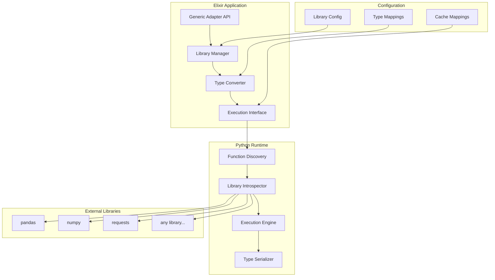

# Design Document

## Overview

The Generic Python Adapter System provides zero-code integration with any Python library through automatic function discovery, intelligent type mapping, and configuration-driven library loading. The system eliminates the need for custom adapter development by introspecting Python libraries at runtime and creating standardized interfaces automatically.

The architecture consists of a library manager, function discovery engine, type conversion system, and execution interface that work together to provide seamless integration between Elixir and arbitrary Python libraries.

## Architecture

### High-Level Architecture



### Component Responsibilities

#### Library Manager (Elixir)
- Manages library lifecycle and configuration
- Handles library loading, unloading, and dependency resolution
- Provides library registry and metadata management
- Coordinates with Python runtime for library operations

#### Function Discovery (Python)
- Introspects Python libraries to discover callable functions
- Extracts function signatures, docstrings, and type hints
- Builds function metadata for registration with Elixir
- Handles nested modules and class method discovery

#### Type Converter (Elixir/Python Bridge)
- Provides bidirectional type conversion between Elixir and Python
- Handles complex data types like NumPy arrays and Pandas DataFrames
- Implements efficient serialization for large data transfers
- Manages type validation and error reporting

#### Execution Interface (Elixir)
- Provides unified API for calling Python functions
- Handles function resolution and parameter mapping
- Manages execution context and error propagation
- Integrates with existing Snakepit features (sessions, telemetry)

## Components and Interfaces

### 1. Library Manager

```elixir
defmodule Snakepit.GenericAdapter.LibraryManager do
  @moduledoc """
  Manages Python library lifecycle and configuration.
  """
  
  @type library_config :: %{
    name: String.t(),
    module: String.t(),
    pip_package: String.t() | nil,
    version: String.t() | nil,
    auto_install: boolean(),
    custom_serializers: map(),
    initialization_hooks: [String.t()]
  }
  
  @type library_metadata :: %{
    name: String.t(),
    version: String.t(),
    functions: [function_metadata()],
    classes: [class_metadata()],
    loaded_at: DateTime.t(),
    dependencies: [String.t()]
  }
  
  @type function_metadata :: %{
    name: String.t(),
    full_path: String.t(),
    signature: String.t(),
    docstring: String.t() | nil,
    parameters: [parameter_info()],
    return_type: String.t() | nil,
    is_async: boolean()
  }
  
  @callback load_library(library_config()) :: {:ok, library_metadata()} | {:error, term()}
  @callback unload_library(String.t()) :: :ok | {:error, term()}
  @callback list_libraries() :: [library_metadata()]
  @callback get_function_metadata(String.t(), String.t()) :: {:ok, function_metadata()} | {:error, term()}
end
```

### 2. Function Discovery Engine

```python
class FunctionDiscovery:
    """
    Discovers and introspects Python library functions.
    """
    
    def discover_library(self, module_name: str) -> LibraryMetadata:
        """Discover all functions and classes in a library."""
        
    def introspect_function(self, func: callable) -> FunctionMetadata:
        """Extract detailed metadata from a function."""
        
    def get_function_signature(self, func: callable) -> FunctionSignature:
        """Get function signature with type hints."""
        
    def extract_docstring(self, func: callable) -> Optional[str]:
        """Extract and format function docstring."""
        
    def discover_nested_modules(self, module) -> List[str]:
        """Discover functions in nested modules."""

class LibraryMetadata:
    name: str
    version: str
    functions: List[FunctionMetadata]
    classes: List[ClassMetadata]
    submodules: List[str]
    dependencies: List[str]

class FunctionMetadata:
    name: str
    full_path: str
    signature: str
    docstring: Optional[str]
    parameters: List[ParameterInfo]
    return_type: Optional[str]
    is_async: bool
    is_method: bool
    class_name: Optional[str]
```

### 3. Type Conversion System

```elixir
defmodule Snakepit.GenericAdapter.TypeConverter do
  @moduledoc """
  Handles bidirectional type conversion between Elixir and Python.
  """
  
  @type conversion_rule :: %{
    elixir_type: atom(),
    python_type: String.t(),
    converter: function(),
    validator: function()
  }
  
  @type conversion_context :: %{
    direction: :elixir_to_python | :python_to_elixir,
    function_name: String.t(),
    parameter_name: String.t() | nil,
    type_hint: String.t() | nil
  }
  
  def convert_to_python(elixir_value, context) do
    case detect_elixir_type(elixir_value) do
      :map -> convert_map_to_dict(elixir_value, context)
      :list -> convert_list_to_python(elixir_value, context)
      :binary -> convert_binary_to_python(elixir_value, context)
      :atom -> convert_atom_to_python(elixir_value, context)
      type -> {:error, {:unsupported_type, type}}
    end
  end
  
  def convert_from_python(python_value, context) do
    case python_value do
      %{"__type__" => "numpy.ndarray"} = array ->
        convert_numpy_array(array, context)
      %{"__type__" => "pandas.DataFrame"} = df ->
        convert_pandas_dataframe(df, context)
      %{} = dict ->
        convert_dict_to_map(dict, context)
      list when is_list(list) ->
        convert_python_list(list, context)
      value ->
        {:ok, value}
    end
  end
end
```

### 4. Execution Interface

```elixir
defmodule Snakepit.GenericAdapter.ExecutionInterface do
  @moduledoc """
  Provides unified interface for executing Python functions.
  """
  
  @type execution_options :: %{
    timeout: pos_integer(),
    cache_result: boolean(),
    cache_ttl: pos_integer(),
    async: boolean(),
    session_id: String.t() | nil
  }
  
  @type execution_result :: %{
    result: term(),
    execution_time: pos_integer(),
    from_cache: boolean(),
    metadata: map()
  }
  
  def execute(function_path, args, opts \\ %{}) do
    with {:ok, {library, function}} <- parse_function_path(function_path),
         {:ok, metadata} <- get_function_metadata(library, function),
         {:ok, converted_args} <- convert_arguments(args, metadata),
         {:ok, result} <- call_python_function(library, function, converted_args, opts),
         {:ok, elixir_result} <- convert_result(result, metadata) do
      {:ok, %{result: elixir_result, metadata: build_result_metadata(result, opts)}}
    end
  end
  
  def execute_async(function_path, args, opts \\ %{}) do
    Task.async(fn -> execute(function_path, args, Map.put(opts, :async, true)) end)
  end
  
  def list_available_functions(library_name \\ nil) do
    case library_name do
      nil -> list_all_functions()
      name -> list_library_functions(name)
    end
  end
end
```

## Data Models

### Library Configuration

```elixir
defmodule Snakepit.GenericAdapter.LibraryConfig do
  @type t :: %__MODULE__{
    name: String.t(),
    module: String.t(),
    pip_package: String.t() | nil,
    version: String.t() | nil,
    auto_install: boolean(),
    initialization_code: String.t() | nil,
    custom_serializers: map(),
    function_filters: [String.t()],
    class_filters: [String.t()],
    cache_config: cache_config(),
    security_config: security_config()
  }
  
  @type cache_config :: %{
    enabled: boolean(),
    default_ttl: pos_integer(),
    max_size: pos_integer(),
    per_function_config: map()
  }
  
  @type security_config :: %{
    allowed_modules: [String.t()],
    blocked_functions: [String.t()],
    file_access: boolean(),
    network_access: boolean()
  }
  
  defstruct [
    :name,
    :module,
    pip_package: nil,
    version: nil,
    auto_install: true,
    initialization_code: nil,
    custom_serializers: %{},
    function_filters: [],
    class_filters: [],
    cache_config: %{enabled: false, default_ttl: 300_000, max_size: 1000, per_function_config: %{}},
    security_config: %{allowed_modules: [], blocked_functions: [], file_access: true, network_access: true}
  ]
end
```

### Function Registry

```elixir
defmodule Snakepit.GenericAdapter.FunctionRegistry do
  @type function_entry :: %{
    library: String.t(),
    name: String.t(),
    full_path: String.t(),
    signature: function_signature(),
    metadata: function_metadata(),
    cached_at: DateTime.t(),
    call_count: non_neg_integer(),
    avg_execution_time: float()
  }
  
  @type function_signature :: %{
    parameters: [parameter_spec()],
    return_type: String.t() | nil,
    is_async: boolean(),
    is_generator: boolean()
  }
  
  @type parameter_spec :: %{
    name: String.t(),
    type: String.t() | nil,
    default: term() | :no_default,
    required: boolean(),
    kind: :positional | :keyword | :var_positional | :var_keyword
  }
  
  def register_function(library, function_metadata) do
    entry = %{
      library: library,
      name: function_metadata.name,
      full_path: function_metadata.full_path,
      signature: parse_signature(function_metadata.signature),
      metadata: function_metadata,
      cached_at: DateTime.utc_now(),
      call_count: 0,
      avg_execution_time: 0.0
    }
    
    :ets.insert(:function_registry, {function_metadata.full_path, entry})
  end
end
```

## Error Handling

### Error Classification and Recovery

```elixir
defmodule Snakepit.GenericAdapter.ErrorHandler do
  @type adapter_error :: 
    :library_not_found | :function_not_found | :type_conversion_error |
    :execution_error | :dependency_error | :configuration_error |
    :security_violation | :timeout_error
  
  def handle_error(error_type, context, original_error) do
    case error_type do
      :library_not_found ->
        suggest_library_installation(context.library_name)
        
      :function_not_found ->
        suggest_similar_functions(context.library_name, context.function_name)
        
      :type_conversion_error ->
        explain_type_mismatch(context.expected_type, context.actual_type)
        
      :execution_error ->
        propagate_python_exception(original_error, context)
        
      :dependency_error ->
        suggest_dependency_resolution(original_error)
        
      _ ->
        format_generic_error(error_type, original_error, context)
    end
  end
  
  defp suggest_similar_functions(library, function_name) do
    available_functions = list_library_functions(library)
    suggestions = find_similar_names(function_name, available_functions)
    
    error_message = """
    Function '#{function_name}' not found in library '#{library}'.
    
    Did you mean one of these?
    #{Enum.map(suggestions, &"  - #{&1}") |> Enum.join("\n")}
    
    Available functions:
    #{Enum.take(available_functions, 10) |> Enum.map(&"  - #{&1}") |> Enum.join("\n")}
    """
    
    {:error, {:function_not_found, error_message}}
  end
end
```

## Testing Strategy

### Test Categories

#### 1. Library Discovery Tests
- Function introspection accuracy
- Type hint extraction
- Docstring preservation
- Nested module handling

#### 2. Type Conversion Tests
- Bidirectional conversion accuracy
- Complex data type handling (NumPy, Pandas)
- Binary data preservation
- Error handling for unsupported types

#### 3. Execution Tests
- Function call accuracy
- Parameter mapping
- Return value handling
- Error propagation

#### 4. Integration Tests
- End-to-end library usage
- Session integration
- Telemetry integration
- Performance benchmarking

### Example Test Scenarios

```elixir
defmodule Snakepit.GenericAdapter.IntegrationTest do
  use ExUnit.Case
  
  describe "pandas integration" do
    test "can load pandas and create DataFrame" do
      config = %{
        name: "pandas",
        module: "pandas",
        pip_package: "pandas",
        auto_install: true
      }
      
      assert {:ok, _metadata} = LibraryManager.load_library(config)
      
      # Create DataFrame
      data = %{"A" => [1, 2, 3], "B" => [4, 5, 6]}
      assert {:ok, result} = ExecutionInterface.execute("pandas.DataFrame", [data])
      
      # Verify result structure
      assert %{"__type__" => "pandas.DataFrame"} = result.result
      assert result.result["shape"] == [3, 2]
    end
    
    test "can perform DataFrame operations" do
      # Setup DataFrame
      data = %{"values" => [1, 2, 3, 4, 5]}
      {:ok, df_result} = ExecutionInterface.execute("pandas.DataFrame", [data])
      
      # Test method chaining through session
      session_id = "test_session"
      {:ok, _} = Snakepit.execute_in_session(session_id, "set_df", [df_result.result])
      
      # Call DataFrame methods
      {:ok, mean_result} = ExecutionInterface.execute("pandas.DataFrame.mean", [], %{session_id: session_id})
      assert is_number(mean_result.result["values"])
    end
  end
  
  describe "numpy integration" do
    test "can create and manipulate arrays" do
      # Create array
      {:ok, array_result} = ExecutionInterface.execute("numpy.array", [[1, 2, 3, 4, 5]])
      
      # Verify array properties
      assert %{"__type__" => "numpy.ndarray"} = array_result.result
      assert array_result.result["shape"] == [5]
      
      # Perform operations
      {:ok, sum_result} = ExecutionInterface.execute("numpy.sum", [array_result.result])
      assert sum_result.result == 15
    end
  end
end
```

## Configuration Examples

### Basic Library Configuration

```elixir
config :snakepit, :generic_adapter,
  libraries: [
    %{
      name: "pandas",
      module: "pandas",
      pip_package: "pandas>=1.5.0",
      auto_install: true
    },
    %{
      name: "numpy", 
      module: "numpy",
      pip_package: "numpy>=1.21.0",
      auto_install: true
    },
    %{
      name: "requests",
      module: "requests", 
      pip_package: "requests>=2.28.0",
      auto_install: true
    }
  ]
```

### Advanced Configuration with Customization

```elixir
config :snakepit, :generic_adapter,
  libraries: [
    %{
      name: "scikit_learn",
      module: "sklearn",
      pip_package: "scikit-learn>=1.1.0",
      auto_install: true,
      initialization_code: """
      import warnings
      warnings.filterwarnings('ignore')
      """,
      custom_serializers: %{
        "sklearn.base.BaseEstimator" => "pickle_serializer",
        "numpy.ndarray" => "binary_serializer"
      },
      function_filters: ["fit", "predict", "transform", "fit_transform"],
      cache_config: %{
        enabled: true,
        default_ttl: 600_000,  # 10 minutes
        per_function_config: %{
          "fit" => %{ttl: 1_800_000, max_size: 10},  # 30 minutes, max 10 models
          "predict" => %{ttl: 60_000, max_size: 1000}  # 1 minute, max 1000 predictions
        }
      },
      security_config: %{
        allowed_modules: ["sklearn.*", "numpy.*", "pandas.*"],
        blocked_functions: ["pickle.load", "eval", "exec"],
        file_access: false,
        network_access: false
      }
    }
  ],
  type_conversion: %{
    numpy_array_format: :binary,  # :binary | :list | :nested_list
    pandas_dataframe_format: :map,  # :map | :list_of_maps | :csv_string
    large_data_threshold: 1_000_000,  # bytes
    compression_enabled: true
  },
  execution: %{
    default_timeout: 30_000,
    max_concurrent_calls: 100,
    cache_enabled: true,
    telemetry_enabled: true
  }
```

### Usage Examples

```elixir
# Simple function calls
{:ok, result} = Snakepit.execute("pandas.DataFrame", [%{"A" => [1, 2, 3]}])
{:ok, array} = Snakepit.execute("numpy.array", [[1, 2, 3, 4, 5]])
{:ok, response} = Snakepit.execute("requests.get", ["https://api.example.com"])

# Method chaining with sessions
session_id = "data_analysis"
{:ok, _} = Snakepit.execute_in_session(session_id, "pandas.read_csv", ["data.csv"])
{:ok, _} = Snakepit.execute_in_session(session_id, "df.dropna", [])
{:ok, result} = Snakepit.execute_in_session(session_id, "df.describe", [])

# Async execution
task = Snakepit.GenericAdapter.execute_async("sklearn.ensemble.RandomForestClassifier.fit", [X_train, y_train])
{:ok, model} = Task.await(task, 60_000)

# Function discovery
functions = Snakepit.GenericAdapter.list_available_functions("pandas")
{:ok, signature} = Snakepit.GenericAdapter.get_function_signature("pandas.DataFrame.merge")
```

This design provides a comprehensive framework for zero-code Python library integration that eliminates the adoption barrier while maintaining performance, security, and integration with existing Snakepit features.