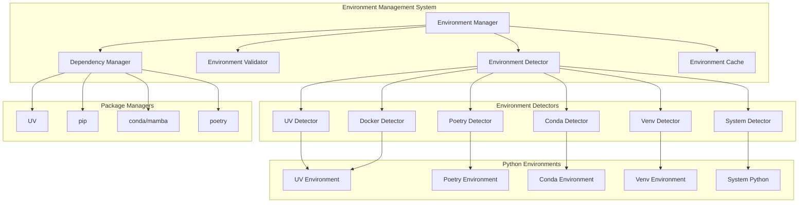

# Design Document

## Overview

The Python Environment Management system provides intelligent detection, validation, and management of Python environments across different tools and platforms. It abstracts the complexity of Python environment setup while maintaining compatibility with existing workflows, enabling a "just works" experience for developers using UV, Poetry, Conda, venv, or system Python.

The system uses a pluggable detector architecture with environment-specific handlers, automatic dependency management, and comprehensive validation to ensure reliable Python environment integration.

## Architecture

### High-Level Architecture



### Component Responsibilities

#### Environment Manager
- Orchestrates environment detection and management
- Provides unified API for environment operations
- Manages environment lifecycle and caching
- Coordinates with Snakepit worker system

#### Environment Detector
- Implements pluggable detection strategy pattern
- Coordinates multiple detector implementations
- Handles detection priority and fallback logic
- Provides environment comparison and selection

#### Environment Validator
- Validates detected environments for compatibility
- Checks Python version and package requirements
- Performs health checks and diagnostics
- Provides validation reporting and recommendations

#### Dependency Manager
- Handles package installation across different managers
- Manages dependency resolution and conflict detection
- Provides unified interface for package operations
- Implements installation progress tracking

## Components and Interfaces

### 1. Environment Manager

```elixir
defmodule Snakepit.Environment.Manager do
  @moduledoc """
  Main interface for Python environment management.
  Orchestrates detection, validation, and dependency management.
  """
  
  @type environment :: %{
    type: environment_type(),
    path: String.t(),
    python_executable: String.t(),
    version: String.t(),
    packages: [package_info()],
    metadata: map(),
    health_status: :healthy | :degraded | :unhealthy
  }
  
  @type environment_type :: 
    :uv | :poetry | :conda | :venv | :system | :docker
  
  @type package_info :: %{
    name: String.t(),
    version: String.t(),
    location: String.t()
  }
  
  @type detection_options :: %{
    preferred_types: [environment_type()],
    auto_install: boolean(),
    cache_ttl: pos_integer(),
    validation_level: :basic | :full | :strict
  }
  
  @callback detect_environment(detection_options()) :: {:ok, environment()} | {:error, term()}
  @callback validate_environment(environment()) :: {:ok, :valid} | {:error, [validation_error()]}
  @callback install_dependencies(environment(), [String.t()]) :: {:ok, :installed} | {:error, term()}
  @callback get_environment_info(environment()) :: map()
end
```

### 2. Environment Detector Interface

```elixir
defmodule Snakepit.Environment.Detector do
  @moduledoc """
  Behavior for environment-specific detectors.
  """
  
  @type detection_result :: %{
    confidence: float(),
    environment: Snakepit.Environment.Manager.environment(),
    detection_method: String.t(),
    warnings: [String.t()]
  }
  
  @callback detect() :: {:ok, detection_result()} | {:error, term()}
  @callback validate(Snakepit.Environment.Manager.environment()) :: {:ok, :valid} | {:error, term()}
  @callback get_package_manager() :: atom()
  @callback get_priority() :: pos_integer()
  @callback supports_platform?(atom()) :: boolean()
end
```

### 3. UV Environment Detector

```elixir
defmodule Snakepit.Environment.Detectors.UV do
  @behaviour Snakepit.Environment.Detector
  
  def detect() do
    with {:ok, uv_path} <- find_uv_executable(),
         {:ok, python_version} <- get_uv_python_version(),
         {:ok, venv_path} <- find_uv_venv(),
         {:ok, packages} <- list_uv_packages(venv_path) do
      
      environment = %{
        type: :uv,
        path: venv_path,
        python_executable: Path.join(venv_path, "bin/python"),
        version: python_version,
        packages: packages,
        metadata: %{
          uv_executable: uv_path,
          lock_file: find_uv_lock_file(),
          python_version_file: find_python_version_file()
        },
        health_status: :healthy
      }
      
      {:ok, %{
        confidence: calculate_confidence(environment),
        environment: environment,
        detection_method: "uv_project_detection",
        warnings: []
      }}
    end
  end
  
  defp find_uv_executable() do
    case System.find_executable("uv") do
      nil -> {:error, :uv_not_found}
      path -> {:ok, path}
    end
  end
  
  defp find_uv_venv() do
    # Check for .venv directory
    # Check UV_PROJECT_ENVIRONMENT
    # Check uv venv list output
  end
  
  defp calculate_confidence(environment) do
    base_confidence = 0.7
    
    confidence = base_confidence
    |> add_confidence_if(File.exists?("pyproject.toml"), 0.2)
    |> add_confidence_if(File.exists?(".python-version"), 0.1)
    |> add_confidence_if(File.exists?("uv.lock"), 0.1)
    
    min(confidence, 1.0)
  end
end
```

### 4. Poetry Environment Detector

```elixir
defmodule Snakepit.Environment.Detectors.Poetry do
  @behaviour Snakepit.Environment.Detector
  
  def detect() do
    with {:ok, poetry_path} <- find_poetry_executable(),
         {:ok, project_info} <- get_poetry_project_info(),
         {:ok, venv_path} <- get_poetry_venv_path(),
         {:ok, python_executable} <- find_poetry_python(venv_path),
         {:ok, packages} <- list_poetry_packages() do
      
      environment = %{
        type: :poetry,
        path: venv_path,
        python_executable: python_executable,
        version: project_info.python_version,
        packages: packages,
        metadata: %{
          poetry_executable: poetry_path,
          pyproject_toml: "pyproject.toml",
          poetry_lock: "poetry.lock",
          project_name: project_info.name
        },
        health_status: :healthy
      }
      
      {:ok, %{
        confidence: calculate_poetry_confidence(environment),
        environment: environment,
        detection_method: "poetry_project_detection",
        warnings: validate_poetry_setup(environment)
      }}
    end
  end
  
  defp get_poetry_project_info() do
    case File.read("pyproject.toml") do
      {:ok, content} ->
        # Parse TOML and extract Poetry configuration
        parse_pyproject_toml(content)
      {:error, _} ->
        {:error, :no_pyproject_toml}
    end
  end
  
  defp get_poetry_venv_path() do
    case System.cmd("poetry", ["env", "info", "--path"], stderr_to_stdout: true) do
      {path, 0} -> {:ok, String.trim(path)}
      {error, _} -> {:error, {:poetry_env_error, error}}
    end
  end
end
```

### 5. Conda Environment Detector

```elixir
defmodule Snakepit.Environment.Detectors.Conda do
  @behaviour Snakepit.Environment.Detector
  
  def detect() do
    with {:ok, conda_info} <- get_conda_info(),
         {:ok, active_env} <- get_active_conda_env(),
         {:ok, packages} <- list_conda_packages(active_env) do
      
      environment = %{
        type: :conda,
        path: active_env.path,
        python_executable: Path.join(active_env.path, "bin/python"),
        version: active_env.python_version,
        packages: packages,
        metadata: %{
          conda_executable: conda_info.executable,
          environment_name: active_env.name,
          conda_version: conda_info.version,
          channels: active_env.channels
        },
        health_status: :healthy
      }
      
      {:ok, %{
        confidence: calculate_conda_confidence(environment),
        environment: environment,
        detection_method: "conda_env_detection",
        warnings: []
      }}
    end
  end
  
  defp get_conda_info() do
    conda_executable = System.find_executable("conda") || System.find_executable("mamba")
    
    case conda_executable do
      nil -> {:error, :conda_not_found}
      path ->
        case System.cmd(path, ["info", "--json"]) do
          {output, 0} ->
            info = Jason.decode!(output)
            {:ok, %{
              executable: path,
              version: info["conda_version"],
              root_prefix: info["root_prefix"]
            }}
          {error, _} ->
            {:error, {:conda_info_error, error}}
        end
    end
  end
  
  defp get_active_conda_env() do
    case System.get_env("CONDA_DEFAULT_ENV") do
      nil -> {:error, :no_active_conda_env}
      env_name -> get_conda_env_info(env_name)
    end
  end
end
```

### 6. Dependency Manager

```elixir
defmodule Snakepit.Environment.DependencyManager do
  @moduledoc """
  Manages package installation across different Python package managers.
  """
  
  @type package_spec :: %{
    name: String.t(),
    version: String.t() | nil,
    extras: [String.t()],
    source: String.t() | nil
  }
  
  @type installation_result :: %{
    status: :success | :failure | :partial,
    installed_packages: [package_spec()],
    failed_packages: [package_spec()],
    warnings: [String.t()],
    duration: pos_integer()
  }
  
  def install_packages(environment, packages, opts \\ %{}) do
    package_manager = get_package_manager(environment.type)
    
    case package_manager do
      :uv -> install_with_uv(environment, packages, opts)
      :poetry -> install_with_poetry(environment, packages, opts)
      :conda -> install_with_conda(environment, packages, opts)
      :pip -> install_with_pip(environment, packages, opts)
    end
  end
  
  defp install_with_uv(environment, packages, opts) do
    uv_executable = environment.metadata.uv_executable
    
    # Build UV install command
    install_args = ["add"] ++ format_packages_for_uv(packages)
    
    case System.cmd(uv_executable, install_args, cd: File.cwd!()) do
      {output, 0} ->
        {:ok, %{
          status: :success,
          installed_packages: packages,
          failed_packages: [],
          warnings: parse_uv_warnings(output),
          duration: measure_installation_time()
        }}
      {error, exit_code} ->
        {:error, {:installation_failed, error, exit_code}}
    end
  end
  
  defp install_with_poetry(environment, packages, opts) do
    poetry_executable = environment.metadata.poetry_executable
    
    # Install packages one by one with Poetry
    results = Enum.map(packages, fn package ->
      install_args = ["add", format_package_for_poetry(package)]
      
      case System.cmd(poetry_executable, install_args) do
        {_, 0} -> {:ok, package}
        {error, _} -> {:error, {package, error}}
      end
    end)
    
    {successful, failed} = Enum.split_with(results, &match?({:ok, _}, &1))
    
    {:ok, %{
      status: if(Enum.empty?(failed), do: :success, else: :partial),
      installed_packages: Enum.map(successful, fn {:ok, pkg} -> pkg end),
      failed_packages: Enum.map(failed, fn {:error, {pkg, _}} -> pkg end),
      warnings: [],
      duration: measure_installation_time()
    }}
  end
end
```

## Data Models

### Environment Configuration

```elixir
defmodule Snakepit.Environment.Config do
  @type t :: %__MODULE__{
    detection_order: [atom()],
    auto_install_dependencies: boolean(),
    cache_ttl: pos_integer(),
    validation_level: :basic | :full | :strict,
    preferred_package_managers: map(),
    environment_overrides: map(),
    health_check_interval: pos_integer(),
    installation_timeout: pos_integer()
  }
  
  defstruct [
    detection_order: [:uv, :poetry, :conda, :venv, :system],
    auto_install_dependencies: true,
    cache_ttl: 300_000,  # 5 minutes
    validation_level: :full,
    preferred_package_managers: %{
      uv: :uv,
      poetry: :poetry,
      conda: :conda,
      venv: :pip,
      system: :pip
    },
    environment_overrides: %{},
    health_check_interval: 60_000,  # 1 minute
    installation_timeout: 300_000   # 5 minutes
  ]
end
```

### Environment Cache

```elixir
defmodule Snakepit.Environment.Cache do
  @type cache_entry :: %{
    environment: Snakepit.Environment.Manager.environment(),
    detected_at: DateTime.t(),
    last_validated: DateTime.t(),
    validation_result: :valid | :invalid | :unknown,
    access_count: non_neg_integer()
  }
  
  def get_cached_environment(cache_key) do
    case :ets.lookup(:environment_cache, cache_key) do
      [{^cache_key, entry}] ->
        if cache_entry_valid?(entry) do
          {:ok, entry.environment}
        else
          {:error, :cache_expired}
        end
      [] ->
        {:error, :not_cached}
    end
  end
  
  def cache_environment(cache_key, environment) do
    entry = %{
      environment: environment,
      detected_at: DateTime.utc_now(),
      last_validated: DateTime.utc_now(),
      validation_result: :valid,
      access_count: 0
    }
    
    :ets.insert(:environment_cache, {cache_key, entry})
    :ok
  end
  
  defp cache_entry_valid?(entry) do
    cache_ttl = Application.get_env(:snakepit, :environment_cache_ttl, 300_000)
    age = DateTime.diff(DateTime.utc_now(), entry.detected_at, :millisecond)
    age < cache_ttl
  end
end
```

## Error Handling

### Environment Detection Errors

```elixir
defmodule Snakepit.Environment.ErrorHandler do
  @type environment_error ::
    :no_python_found | :incompatible_version | :missing_dependencies |
    :environment_corrupted | :detection_failed | :validation_failed |
    :installation_failed | :permission_denied
  
  def handle_detection_error(error_type, context) do
    case error_type do
      :no_python_found ->
        suggest_python_installation(context.platform)
        
      :incompatible_version ->
        suggest_python_upgrade(context.current_version, context.required_version)
        
      :missing_dependencies ->
        suggest_dependency_installation(context.missing_packages)
        
      :environment_corrupted ->
        suggest_environment_recreation(context.environment_type)
        
      _ ->
        provide_generic_troubleshooting(error_type, context)
    end
  end
  
  defp suggest_python_installation(:linux) do
    """
    Python not found. Install Python using your package manager:
    
    Ubuntu/Debian: sudo apt update && sudo apt install python3 python3-pip python3-venv
    CentOS/RHEL:   sudo yum install python3 python3-pip
    Arch Linux:    sudo pacman -S python python-pip
    
    Or install UV for modern Python management:
    curl -LsSf https://astral.sh/uv/install.sh | sh
    """
  end
  
  defp suggest_python_installation(:darwin) do
    """
    Python not found. Install Python using one of these methods:
    
    Homebrew:      brew install python
    Official:      Download from https://www.python.org/downloads/
    UV (recommended): curl -LsSf https://astral.sh/uv/install.sh | sh
    """
  end
  
  defp suggest_python_installation(:windows) do
    """
    Python not found. Install Python using one of these methods:
    
    Microsoft Store: Search for "Python" in Microsoft Store
    Official:        Download from https://www.python.org/downloads/
    Chocolatey:      choco install python
    UV (recommended): powershell -c "irm https://astral.sh/uv/install.ps1 | iex"
    """
  end
end
```

## Testing Strategy

### Test Categories

#### 1. Environment Detection Tests
- Test each detector with mock environments
- Validate detection accuracy and confidence scoring
- Test fallback behavior when primary detection fails
- Cross-platform compatibility testing

#### 2. Package Manager Integration Tests
- Test package installation with each manager
- Validate dependency resolution and conflict handling
- Test installation progress tracking and error handling
- Performance testing for large package installations

#### 3. Environment Validation Tests
- Test health checking and validation logic
- Validate compatibility checking across Python versions
- Test environment corruption detection and recovery
- Validate caching behavior and cache invalidation

#### 4. Integration Tests
- End-to-end environment setup and usage
- Integration with Snakepit worker system
- Cross-platform deployment testing
- Performance and scalability testing

### Mock Environment Setup

```elixir
defmodule Snakepit.Environment.TestHelpers do
  def create_mock_uv_environment(opts \\ %{}) do
    base_path = opts[:path] || "/tmp/test_uv_env"
    
    # Create directory structure
    File.mkdir_p!(Path.join(base_path, "bin"))
    File.mkdir_p!(Path.join(base_path, "lib/python3.11/site-packages"))
    
    # Create mock Python executable
    python_path = Path.join(base_path, "bin/python")
    File.write!(python_path, mock_python_script())
    File.chmod!(python_path, 0o755)
    
    # Create mock UV configuration
    File.write!(Path.join(base_path, "pyvenv.cfg"), mock_pyvenv_cfg())
    
    %{
      type: :uv,
      path: base_path,
      python_executable: python_path,
      version: opts[:python_version] || "3.11.5",
      packages: opts[:packages] || [],
      metadata: %{
        uv_executable: "/usr/local/bin/uv",
        lock_file: "uv.lock",
        python_version_file: ".python-version"
      }
    }
  end
  
  defp mock_python_script() do
    """
    #!/bin/bash
    echo "Python 3.11.5"
    """
  end
  
  defp mock_pyvenv_cfg() do
    """
    home = /usr/bin
    include-system-site-packages = false
    version = 3.11.5
    """
  end
end
```

## Configuration Examples

### Basic Configuration

```elixir
config :snakepit, :environment,
  detection_order: [:uv, :poetry, :conda, :venv, :system],
  auto_install_dependencies: true,
  cache_ttl: 300_000,
  validation_level: :full
```

### Advanced Configuration

```elixir
config :snakepit, :environment,
  detection_order: [:uv, :poetry, :conda, :venv, :system],
  auto_install_dependencies: true,
  cache_ttl: 300_000,
  validation_level: :strict,
  
  # Environment-specific overrides
  environment_overrides: %{
    uv: %{
      python_executable: "/custom/path/to/python",
      additional_args: ["--no-cache"]
    },
    poetry: %{
      use_system_python: false,
      install_timeout: 600_000
    }
  },
  
  # Package manager preferences
  preferred_package_managers: %{
    uv: :uv,
    poetry: :poetry,
    conda: :conda,
    venv: :pip,
    system: :pip
  },
  
  # Health checking
  health_check_interval: 60_000,
  health_check_enabled: true,
  
  # Installation settings
  installation_timeout: 300_000,
  max_concurrent_installations: 3,
  retry_failed_installations: true,
  
  # Platform-specific settings
  platform_overrides: %{
    windows: %{
      use_long_paths: true,
      executable_extension: ".exe"
    },
    darwin: %{
      homebrew_prefix: "/opt/homebrew"
    }
  }
```

### Usage Examples

```elixir
# Automatic environment detection
{:ok, environment} = Snakepit.Environment.Manager.detect_environment()

# Manual environment specification
{:ok, environment} = Snakepit.Environment.Manager.detect_environment(%{
  preferred_types: [:uv, :poetry],
  validation_level: :strict
})

# Install dependencies
{:ok, result} = Snakepit.Environment.Manager.install_dependencies(
  environment,
  ["pandas>=1.5.0", "numpy", "requests"]
)

# Validate environment health
{:ok, :valid} = Snakepit.Environment.Manager.validate_environment(environment)

# Get detailed environment information
info = Snakepit.Environment.Manager.get_environment_info(environment)
```

This design provides a comprehensive solution for Python environment management that eliminates setup friction while maintaining flexibility and reliability across different Python toolchains and deployment scenarios.