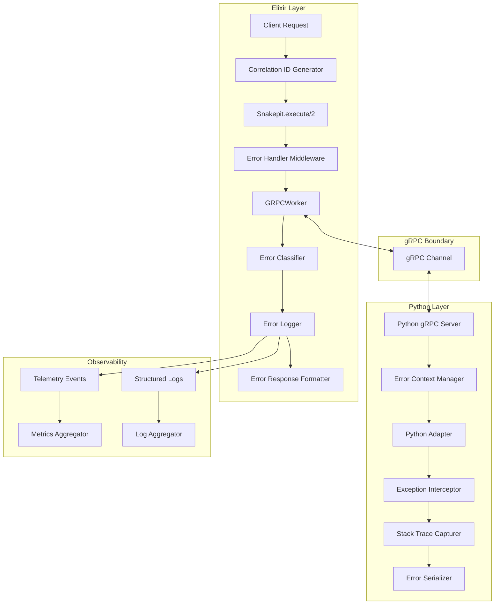
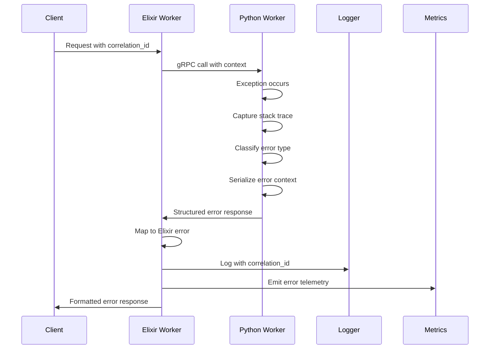

# Design Document

## Overview

The Structured Error Handling & Propagation system transforms Snakepit's error management from ad-hoc exception handling to a comprehensive, observable, and debuggable error infrastructure. The design implements a standardized error taxonomy, seamless Python-to-Elixir error propagation, distributed tracing with correlation IDs, and automated error recovery patterns.

## Architecture

### Component Diagram



### Error Flow Architecture



## Components and Interfaces

### Error Taxonomy

The system implements a hierarchical error classification:

```elixir
defmodule Snakepit.Error do
  @type category :: :validation | :execution | :timeout | :resource | :system | :network
  @type severity :: :low | :medium | :high | :critical
  @type code :: atom()
  
  defstruct [
    :category,        # High-level error category
    :code,           # Specific error code
    :severity,       # Error severity level
    :message,        # Human-readable message
    :details,        # Structured error details
    :correlation_id, # Request correlation ID
    :timestamp,      # When error occurred
    :source,         # Where error originated (elixir/python)
    :context,        # Additional context data
    :stacktrace,     # Full stack trace
    :retry_info      # Retry guidance
  ]
  
  @error_codes %{
    # Validation errors (4xx equivalent)
    invalid_params: %{category: :validation, severity: :medium, retryable: false},
    missing_required: %{category: :validation, severity: :medium, retryable: false},
    type_mismatch: %{category: :validation, severity: :medium, retryable: false},
    
    # Execution errors (5xx equivalent)
    python_exception: %{category: :execution, severity: :high, retryable: false},
    adapter_error: %{category: :execution, severity: :high, retryable: false},
    import_error: %{category: :execution, severity: :high, retryable: false},
    
    # Timeout errors
    operation_timeout: %{category: :timeout, severity: :medium, retryable: true},
    worker_timeout: %{category: :timeout, severity: :high, retryable: true},
    
    # Resource errors
    memory_exhausted: %{category: :resource, severity: :critical, retryable: false},
    worker_unavailable: %{category: :resource, severity: :medium, retryable: true},
    pool_saturated: %{category: :resource, severity: :medium, retryable: true},
    
    # System errors
    grpc_error: %{category: :system, severity: :high, retryable: true},
    worker_crash: %{category: :system, severity: :critical, retryable: true},
    configuration_error: %{category: :system, severity: :critical, retryable: false},
    
    # Network errors
    connection_failed: %{category: :network, severity: :medium, retryable: true},
    network_timeout: %{category: :network, severity: :medium, retryable: true}
  }
end
```

### Correlation ID System

```elixir
defmodule Snakepit.CorrelationID do
  @moduledoc """
  Generates and manages correlation IDs for distributed tracing.
  
  Format: snk_<timestamp>_<node>_<counter>
  Example: snk_1640995200_node1_001234
  """
  
  use GenServer
  
  @doc """
  Generate a new correlation ID for a request.
  """
  def generate() do
    GenServer.call(__MODULE__, :generate)
  end
  
  @doc """
  Extract correlation ID from various contexts.
  """
  def extract(context) when is_map(context) do
    Map.get(context, :correlation_id) || 
    Map.get(context, "correlation_id") ||
    generate()
  end
  
  @doc """
  Inject correlation ID into context.
  """
  def inject(context, correlation_id) when is_map(context) do
    Map.put(context, :correlation_id, correlation_id)
  end
  
  # GenServer implementation
  def init(_) do
    {:ok, %{counter: 0}}
  end
  
  def handle_call(:generate, _from, %{counter: counter} = state) do
    timestamp = System.system_time(:second)
    node_name = node() |> Atom.to_string() |> String.replace("@", "_")
    correlation_id = "snk_#{timestamp}_#{node_name}_#{:io_lib.format("~6..0B", [counter])}"
    
    {:reply, correlation_id, %{state | counter: counter + 1}}
  end
end
```

### Error Handler Middleware

```elixir
defmodule Snakepit.ErrorHandler do
  @moduledoc """
  Centralized error handling middleware for all Snakepit operations.
  """
  
  @doc """
  Wrap an operation with comprehensive error handling.
  """
  def wrap_operation(operation_name, context, fun) do
    correlation_id = Snakepit.CorrelationID.extract(context)
    start_time = System.monotonic_time(:microsecond)
    
    try do
      result = fun.()
      
      # Emit success telemetry
      duration = System.monotonic_time(:microsecond) - start_time
      :telemetry.execute(
        [:snakepit, :operation, :success],
        %{duration_microseconds: duration},
        %{operation: operation_name, correlation_id: correlation_id}
      )
      
      result
    rescue
      error ->
        handle_error(error, operation_name, correlation_id, start_time, __STACKTRACE__)
    catch
      :exit, reason ->
        handle_exit(reason, operation_name, correlation_id, start_time)
    end
  end
  
  defp handle_error(error, operation, correlation_id, start_time, stacktrace) do
    duration = System.monotonic_time(:microsecond) - start_time
    
    structured_error = case error do
      %Snakepit.Error{} = err ->
        %{err | correlation_id: correlation_id}
      
      %{__exception__: true} = exception ->
        classify_elixir_exception(exception, correlation_id, stacktrace)
      
      other ->
        %Snakepit.Error{
          category: :system,
          code: :unknown_error,
          severity: :high,
          message: "Unexpected error: #{inspect(other)}",
          correlation_id: correlation_id,
          timestamp: DateTime.utc_now(),
          source: :elixir,
          stacktrace: stacktrace
        }
    end
    
    # Log structured error
    Logger.error("Operation failed", 
      error: structured_error,
      operation: operation,
      correlation_id: correlation_id,
      duration_ms: duration / 1000
    )
    
    # Emit error telemetry
    :telemetry.execute(
      [:snakepit, :operation, :error],
      %{duration_microseconds: duration},
      %{
        operation: operation,
        correlation_id: correlation_id,
        error_category: structured_error.category,
        error_code: structured_error.code,
        error_severity: structured_error.severity
      }
    )
    
    {:error, structured_error}
  end
end
```

### Python Error Context Manager

```python
# priv/python/snakepit_bridge/error_handling.py

import traceback
import sys
import json
import time
from typing import Any, Dict, Optional, Type
from contextlib import contextmanager

class SnakepitError:
    """Structured error representation for Snakepit."""
    
    def __init__(
        self,
        category: str,
        code: str,
        severity: str,
        message: str,
        correlation_id: Optional[str] = None,
        details: Optional[Dict[str, Any]] = None,
        python_exception: Optional[Exception] = None
    ):
        self.category = category
        self.code = code
        self.severity = severity
        self.message = message
        self.correlation_id = correlation_id
        self.details = details or {}
        self.timestamp = time.time()
        self.source = "python"
        
        # Capture Python exception details if provided
        if python_exception:
            self.python_exception_type = type(python_exception).__name__
            self.python_exception_message = str(python_exception)
            self.python_stacktrace = traceback.format_exception(
                type(python_exception), 
                python_exception, 
                python_exception.__traceback__
            )
        else:
            self.python_exception_type = None
            self.python_exception_message = None
            self.python_stacktrace = traceback.format_stack()
    
    def to_dict(self) -> Dict[str, Any]:
        """Convert to dictionary for gRPC serialization."""
        return {
            "category": self.category,
            "code": self.code,
            "severity": self.severity,
            "message": self.message,
            "correlation_id": self.correlation_id,
            "details": self.details,
            "timestamp": self.timestamp,
            "source": self.source,
            "python_exception_type": self.python_exception_type,
            "python_exception_message": self.python_exception_message,
            "python_stacktrace": self.python_stacktrace
        }

class ErrorClassifier:
    """Classifies Python exceptions into Snakepit error categories."""
    
    ERROR_MAPPINGS = {
        # Validation errors
        ValueError: ("validation", "invalid_params", "medium"),
        TypeError: ("validation", "type_mismatch", "medium"),
        KeyError: ("validation", "missing_required", "medium"),
        
        # Execution errors
        ImportError: ("execution", "import_error", "high"),
        ModuleNotFoundError: ("execution", "import_error", "high"),
        AttributeError: ("execution", "adapter_error", "high"),
        RuntimeError: ("execution", "python_exception", "high"),
        
        # Resource errors
        MemoryError: ("resource", "memory_exhausted", "critical"),
        OSError: ("resource", "system_resource", "high"),
        
        # Timeout errors
        TimeoutError: ("timeout", "operation_timeout", "medium"),
        
        # System errors
        SystemError: ("system", "python_system_error", "critical"),
        SystemExit: ("system", "python_exit", "critical"),
    }
    
    @classmethod
    def classify(cls, exception: Exception) -> tuple:
        """Classify exception into (category, code, severity)."""
        exc_type = type(exception)
        
        # Direct mapping
        if exc_type in cls.ERROR_MAPPINGS:
            return cls.ERROR_MAPPINGS[exc_type]
        
        # Check inheritance hierarchy
        for mapped_type, classification in cls.ERROR_MAPPINGS.items():
            if issubclass(exc_type, mapped_type):
                return classification
        
        # Default classification
        return ("execution", "python_exception", "high")

@contextmanager
def error_context(operation_name: str, correlation_id: Optional[str] = None):
    """Context manager for structured error handling in Python operations."""
    try:
        yield
    except Exception as e:
        category, code, severity = ErrorClassifier.classify(e)
        
        error = SnakepitError(
            category=category,
            code=code,
            severity=severity,
            message=f"Error in {operation_name}: {str(e)}",
            correlation_id=correlation_id,
            details={"operation": operation_name},
            python_exception=e
        )
        
        # Log error for Python-side debugging
        print(f"ERROR [{correlation_id}] {operation_name}: {error.to_dict()}", 
              file=sys.stderr)
        
        # Re-raise as SnakepitError for gRPC handling
        raise SnakepitError from e

def capture_error(exception: Exception, correlation_id: Optional[str] = None) -> SnakepitError:
    """Capture and structure an exception for error reporting."""
    category, code, severity = ErrorClassifier.classify(exception)
    
    return SnakepitError(
        category=category,
        code=code,
        severity=severity,
        message=str(exception),
        correlation_id=correlation_id,
        python_exception=exception
    )
```

### gRPC Error Propagation

```python
# Enhanced gRPC server with error handling

class WorkerServicer(pb2_grpc.WorkerServiceServicer):
    def __init__(self, adapter):
        self.adapter = adapter
    
    async def Execute(self, request, context):
        correlation_id = self._extract_correlation_id(context)
        
        try:
            with error_context("execute_command", correlation_id):
                result = await self.adapter.execute_command(
                    request.command,
                    json.loads(request.args),
                    correlation_id=correlation_id
                )
                
                return pb2.ExecuteResponse(
                    success=True,
                    result=json.dumps(result),
                    correlation_id=correlation_id
                )
                
        except SnakepitError as error:
            return pb2.ExecuteResponse(
                success=False,
                error_data=json.dumps(error.to_dict()),
                correlation_id=correlation_id
            )
        except Exception as e:
            # Fallback for unexpected errors
            error = capture_error(e, correlation_id)
            return pb2.ExecuteResponse(
                success=False,
                error_data=json.dumps(error.to_dict()),
                correlation_id=correlation_id
            )
    
    def _extract_correlation_id(self, context):
        """Extract correlation ID from gRPC metadata."""
        metadata = dict(context.invocation_metadata())
        return metadata.get('correlation-id', f"py_{int(time.time())}")
```

## Data Models

### Error Response Format

```elixir
# Standardized error response structure
%{
  success: false,
  error: %{
    category: "execution",
    code: "python_exception", 
    severity: "high",
    message: "Division by zero in calculate_average",
    correlation_id: "snk_1640995200_node1_001234",
    timestamp: "2021-12-31T23:00:00Z",
    source: "python",
    details: %{
      operation: "calculate_average",
      adapter: "MathAdapter",
      worker_id: "worker_123"
    },
    python_exception: %{
      type: "ZeroDivisionError",
      message: "division by zero",
      stacktrace: [
        "  File \"/app/adapters/math.py\", line 42, in calculate_average",
        "    return sum(values) / len(values)",
        "ZeroDivisionError: division by zero"
      ]
    },
    retry_info: %{
      retryable: false,
      max_attempts: 0,
      backoff_ms: 0
    }
  }
}
```

### Telemetry Event Schema

```elixir
# Error telemetry events
[:snakepit, :operation, :error]
# Measurements: %{duration_microseconds: integer()}
# Metadata: %{
#   operation: string(),
#   correlation_id: string(),
#   error_category: atom(),
#   error_code: atom(),
#   error_severity: atom(),
#   worker_id: string(),
#   adapter: string(),
#   retryable: boolean()
# }

[:snakepit, :error, :aggregated]
# Measurements: %{count: integer(), rate_per_minute: float()}
# Metadata: %{
#   error_code: atom(),
#   time_window: string(),
#   top_operations: [string()]
# }
```

## Error Handling

### Retry Logic with Circuit Breaker

```elixir
defmodule Snakepit.RetryHandler do
  @moduledoc """
  Implements retry logic with exponential backoff and circuit breaker.
  """
  
  defstruct [
    :max_attempts,
    :base_delay_ms,
    :max_delay_ms,
    :backoff_multiplier,
    :circuit_breaker
  ]
  
  def retry_with_backoff(operation, opts \\ []) do
    config = %__MODULE__{
      max_attempts: Keyword.get(opts, :max_attempts, 3),
      base_delay_ms: Keyword.get(opts, :base_delay_ms, 100),
      max_delay_ms: Keyword.get(opts, :max_delay_ms, 5000),
      backoff_multiplier: Keyword.get(opts, :backoff_multiplier, 2.0),
      circuit_breaker: Keyword.get(opts, :circuit_breaker, nil)
    }
    
    do_retry(operation, config, 1, [])
  end
  
  defp do_retry(operation, config, attempt, previous_errors) do
    case operation.() do
      {:ok, result} ->
        {:ok, result}
      
      {:error, %Snakepit.Error{} = error} ->
        if should_retry?(error, attempt, config) do
          delay = calculate_delay(attempt, config)
          Process.sleep(delay)
          
          do_retry(operation, config, attempt + 1, [error | previous_errors])
        else
          # Add retry history to final error
          final_error = %{error | 
            details: Map.put(error.details, :retry_history, %{
              attempts: attempt,
              previous_errors: Enum.reverse(previous_errors),
              gave_up_reason: retry_failure_reason(error, attempt, config)
            })
          }
          
          {:error, final_error}
        end
    end
  end
  
  defp should_retry?(%Snakepit.Error{} = error, attempt, config) do
    attempt < config.max_attempts and
    is_retryable_error?(error) and
    not circuit_breaker_open?(config.circuit_breaker)
  end
  
  defp is_retryable_error?(%Snakepit.Error{code: code}) do
    retryable_codes = [
      :operation_timeout,
      :worker_timeout,
      :worker_unavailable,
      :pool_saturated,
      :grpc_error,
      :worker_crash,
      :connection_failed,
      :network_timeout
    ]
    
    code in retryable_codes
  end
end
```

### Error Aggregation and Analysis

```elixir
defmodule Snakepit.ErrorAggregator do
  @moduledoc """
  Aggregates and analyzes error patterns for monitoring and alerting.
  """
  
  use GenServer
  
  def start_link(opts) do
    GenServer.start_link(__MODULE__, opts, name: __MODULE__)
  end
  
  def record_error(error) do
    GenServer.cast(__MODULE__, {:record_error, error})
  end
  
  def get_error_summary(time_window \\ :last_hour) do
    GenServer.call(__MODULE__, {:get_summary, time_window})
  end
  
  def init(_opts) do
    # Schedule periodic analysis
    :timer.send_interval(60_000, :analyze_errors)
    
    {:ok, %{
      errors: :ets.new(:error_history, [:ordered_set, :private]),
      patterns: %{},
      alerts: []
    }}
  end
  
  def handle_cast({:record_error, error}, state) do
    timestamp = System.system_time(:second)
    :ets.insert(state.errors, {timestamp, error})
    
    # Cleanup old errors (keep last 24 hours)
    cutoff = timestamp - 86400
    :ets.select_delete(state.errors, [{{:"$1", :_}, [{:<, :"$1", cutoff}], [true]}])
    
    {:noreply, state}
  end
  
  def handle_call({:get_summary, time_window}, _from, state) do
    summary = analyze_error_window(state.errors, time_window)
    {:reply, summary, state}
  end
  
  def handle_info(:analyze_errors, state) do
    patterns = detect_error_patterns(state.errors)
    alerts = generate_alerts(patterns, state.alerts)
    
    # Emit aggregated telemetry
    Enum.each(patterns, fn {error_code, stats} ->
      :telemetry.execute(
        [:snakepit, :error, :aggregated],
        %{count: stats.count, rate_per_minute: stats.rate},
        %{error_code: error_code, time_window: "last_hour"}
      )
    end)
    
    {:noreply, %{state | patterns: patterns, alerts: alerts}}
  end
  
  defp analyze_error_window(errors_table, time_window) do
    now = System.system_time(:second)
    window_start = case time_window do
      :last_hour -> now - 3600
      :last_day -> now - 86400
      :last_week -> now - 604800
    end
    
    errors = :ets.select(errors_table, [
      {{:"$1", :"$2"}, [{:>=, :"$1", window_start}], [:"$2"]}
    ])
    
    %{
      total_errors: length(errors),
      error_rate: length(errors) / (now - window_start) * 60, # per minute
      by_category: group_by_category(errors),
      by_code: group_by_code(errors),
      by_severity: group_by_severity(errors),
      top_operations: top_failing_operations(errors, 10)
    }
  end
end
```

## Testing Strategy

### Error Simulation Framework

```elixir
defmodule Snakepit.ErrorSimulator do
  @moduledoc """
  Framework for testing error handling scenarios.
  """
  
  def simulate_python_exception(type, message, stacktrace \\ nil) do
    error_data = %{
      "category" => "execution",
      "code" => "python_exception",
      "severity" => "high",
      "message" => message,
      "python_exception_type" => type,
      "python_exception_message" => message,
      "python_stacktrace" => stacktrace || default_stacktrace(type, message)
    }
    
    {:error, Snakepit.Error.from_python(error_data)}
  end
  
  def simulate_network_error(correlation_id) do
    %Snakepit.Error{
      category: :network,
      code: :connection_failed,
      severity: :medium,
      message: "Connection to Python worker failed",
      correlation_id: correlation_id,
      timestamp: DateTime.utc_now(),
      source: :elixir,
      details: %{simulated: true}
    }
  end
  
  def simulate_timeout_error(operation, duration_ms) do
    %Snakepit.Error{
      category: :timeout,
      code: :operation_timeout,
      severity: :medium,
      message: "Operation #{operation} timed out after #{duration_ms}ms",
      timestamp: DateTime.utc_now(),
      source: :elixir,
      details: %{operation: operation, timeout_ms: duration_ms}
    }
  end
end
```

### Property-Based Error Testing

```elixir
defmodule Snakepit.ErrorHandlingPropertyTest do
  use ExUnit.Case
  use PropCheck
  
  property "all errors have required fields" do
    forall error <- error_generator() do
      # Every error must have these fields
      assert error.category in [:validation, :execution, :timeout, :resource, :system, :network]
      assert is_atom(error.code)
      assert error.severity in [:low, :medium, :high, :critical]
      assert is_binary(error.message)
      assert %DateTime{} = error.timestamp
      assert error.source in [:elixir, :python]
    end
  end
  
  property "error serialization is reversible" do
    forall error <- error_generator() do
      serialized = Snakepit.Error.to_json(error)
      deserialized = Snakepit.Error.from_json(serialized)
      
      # Key fields should be preserved
      assert error.category == deserialized.category
      assert error.code == deserialized.code
      assert error.message == deserialized.message
    end
  end
  
  defp error_generator do
    gen all category <- oneof([:validation, :execution, :timeout, :resource, :system, :network]),
            code <- atom(),
            severity <- oneof([:low, :medium, :high, :critical]),
            message <- utf8() do
      %Snakepit.Error{
        category: category,
        code: code,
        severity: severity,
        message: message,
        timestamp: DateTime.utc_now(),
        source: :elixir
      }
    end
  end
end
```

## Performance Considerations

### Error Handling Overhead

- **Stack trace capture**: <1ms for Python exceptions
- **Error serialization**: <0.5ms for typical errors
- **Correlation ID generation**: <0.1ms
- **Telemetry emission**: <0.2ms (async)
- **Total overhead**: <2ms per error

### Memory Usage

- **Error objects**: ~1KB average size
- **Stack traces**: 2-10KB depending on depth
- **Aggregation buffer**: ~10MB for 24 hours of errors
- **Correlation ID storage**: ~100 bytes per active request

### Optimization Strategies

1. **Lazy stack trace capture** - Only capture full traces for high-severity errors
2. **Async logging** - Non-blocking error logging and telemetry
3. **Error deduplication** - Aggregate identical errors to reduce storage
4. **Sampling** - Sample high-frequency errors to prevent overwhelming logs

## Monitoring and Observability

### Key Metrics to Track

```elixir
# Error rate by category
[:snakepit, :errors, :rate]
# Measurements: %{errors_per_minute: float()}
# Metadata: %{category: atom(), severity: atom()}

# Error resolution time
[:snakepit, :errors, :resolution_time]
# Measurements: %{duration_seconds: integer()}
# Metadata: %{error_code: atom(), resolved_by: string()}

# Correlation ID coverage
[:snakepit, :correlation, :coverage]
# Measurements: %{percentage: float()}
# Metadata: %{time_window: string()}
```

### Alerting Rules

```yaml
# Example Prometheus alerting rules
groups:
- name: snakepit_errors
  rules:
  - alert: SnakepitHighErrorRate
    expr: rate(snakepit_errors_total[5m]) > 10
    for: 2m
    labels:
      severity: warning
    annotations:
      summary: "High error rate in Snakepit"
      description: "Error rate is {{ $value }} errors/minute"
  
  - alert: SnakepitCriticalErrors
    expr: increase(snakepit_errors_total{severity="critical"}[1m]) > 0
    for: 0m
    labels:
      severity: critical
    annotations:
      summary: "Critical errors in Snakepit"
      description: "{{ $value }} critical errors in the last minute"
```

### Dashboard Widgets

1. **Error Rate Timeline** - Errors per minute over time
2. **Error Category Breakdown** - Pie chart of error categories
3. **Top Failing Operations** - List of operations with highest error rates
4. **Error Severity Distribution** - Bar chart of error severities
5. **Correlation ID Coverage** - Percentage of requests with correlation IDs
6. **Mean Time to Resolution** - Average time to resolve errors by type

## Security Considerations

### Sensitive Data Protection

- **Stack trace sanitization** - Remove sensitive data from stack traces
- **Error message filtering** - Prevent sensitive information in error messages
- **Correlation ID anonymization** - Ensure correlation IDs don't leak sensitive data
- **Log access control** - Restrict access to detailed error logs

### Error Information Disclosure

- **Production vs Development** - Different error detail levels
- **Client error responses** - Sanitized errors for external clients
- **Internal error logging** - Full details for internal debugging
- **Audit trail** - Track who accessed error information

## Future Enhancements

### Planned Improvements

1. **Machine Learning Error Classification** - Automatic error categorization
2. **Error Prediction** - Predict likely errors based on patterns
3. **Automated Error Resolution** - Self-healing for common errors
4. **Cross-Service Error Correlation** - Link errors across microservices
5. **Error Impact Analysis** - Measure business impact of errors

### Integration Opportunities

- **External Error Tracking** - Sentry, Rollbar integration
- **APM Integration** - New Relic, DataDog error correlation
- **Incident Management** - PagerDuty, Opsgenie integration
- **Documentation Generation** - Auto-generate error handling docs