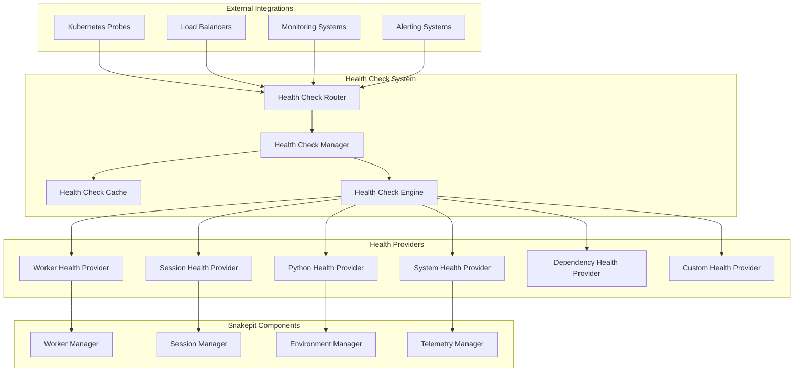

# Design Document

## Overview

The Health Check Endpoints system provides comprehensive HTTP-based health monitoring designed for cloud-native deployments, particularly Kubernetes environments. The system implements standardized health check patterns (liveness, readiness, startup) with detailed diagnostics, configurable criteria, and integration with existing Snakepit telemetry.

The architecture uses a modular health checker framework with pluggable health providers, caching for performance, and comprehensive reporting to enable reliable service orchestration and monitoring.

## Architecture

### High-Level Architecture



### Component Responsibilities

#### Health Check Router
- Provides HTTP endpoints for different health check types
- Handles request routing and response formatting
- Implements authentication and access control
- Manages endpoint documentation and discoverability

#### Health Check Manager
- Orchestrates health check execution across providers
- Manages health check scheduling and caching
- Coordinates health status aggregation and reporting
- Handles health check configuration and updates

#### Health Check Engine
- Executes individual health checks with timeout management
- Implements health check result aggregation logic
- Provides health status calculation and trending
- Manages health check provider lifecycle

#### Health Providers
- Implement specific health checks for different system components
- Provide standardized health status reporting
- Handle component-specific validation and diagnostics
- Support configurable health criteria and thresholds

## Components and Interfaces

### 1. Health Check Router

```elixir
defmodule Snakepit.HealthCheck.Router do
  use Plug.Router
  
  plug :match
  plug :dispatch
  
  # Kubernetes standard probes
  get "/health/live" do
    handle_liveness_probe(conn)
  end
  
  get "/health/ready" do
    handle_readiness_probe(conn)
  end
  
  get "/health/startup" do
    handle_startup_probe(conn)
  end
  
  # Detailed health information
  get "/health" do
    handle_health_index(conn)
  end
  
  get "/health/detailed" do
    handle_detailed_health(conn)
  end
  
  # Component-specific health checks
  get "/health/workers" do
    handle_component_health(conn, :workers)
  end
  
  get "/health/sessions" do
    handle_component_health(conn, :sessions)
  end
  
  get "/health/python" do
    handle_component_health(conn, :python)
  end
  
  defp handle_liveness_probe(conn) do
    case HealthCheckManager.check_liveness() do
      {:ok, :healthy} ->
        send_json_response(conn, 200, %{status: "healthy", timestamp: DateTime.utc_now()})
      {:error, reason} ->
        send_json_response(conn, 503, %{status: "unhealthy", reason: reason, timestamp: DateTime.utc_now()})
    end
  end
  
  defp handle_readiness_probe(conn) do
    case HealthCheckManager.check_readiness() do
      {:ok, :ready} ->
        send_json_response(conn, 200, %{status: "ready", timestamp: DateTime.utc_now()})
      {:ok, :degraded, details} ->
        send_json_response(conn, 200, %{status: "degraded", details: details, timestamp: DateTime.utc_now()})
      {:error, reason} ->
        send_json_response(conn, 503, %{status: "not_ready", reason: reason, timestamp: DateTime.utc_now()})
    end
  end
end
```

### 2. Health Check Manager

```elixir
defmodule Snakepit.HealthCheck.Manager do
  use GenServer
  
  @type health_status :: :healthy | :degraded | :unhealthy
  @type health_result :: %{
    status: health_status(),
    details: map(),
    timestamp: DateTime.t(),
    duration_ms: pos_integer()
  }
  
  @type health_config :: %{
    cache_ttl: pos_integer(),
    timeout: pos_integer(),
    retry_attempts: pos_integer(),
    providers: [atom()],
    thresholds: map()
  }
  
  def check_liveness(opts \\ %{}) do
    execute_health_check(:liveness, opts)
  end
  
  def check_readiness(opts \\ %{}) do
    execute_health_check(:readiness, opts)
  end
  
  def check_startup(opts \\ %{}) do
    execute_health_check(:startup, opts)
  end
  
  def check_detailed(opts \\ %{}) do
    execute_health_check(:detailed, opts)
  end
  
  defp execute_health_check(check_type, opts) do
    cache_key = {check_type, opts}
    
    case get_cached_result(cache_key) do
      {:ok, result} -> {:ok, result}
      :cache_miss -> perform_health_check(check_type, opts)
    end
  end
  
  defp perform_health_check(check_type, opts) do
    start_time = System.monotonic_time(:millisecond)
    
    providers = get_providers_for_check(check_type)
    timeout = get_timeout_for_check(check_type)
    
    results = execute_providers_parallel(providers, timeout)
    aggregated_result = aggregate_health_results(results, check_type)
    
    duration = System.monotonic_time(:millisecond) - start_time
    
    final_result = %{
      status: aggregated_result.status,
      details: aggregated_result.details,
      timestamp: DateTime.utc_now(),
      duration_ms: duration
    }
    
    cache_result({check_type, opts}, final_result)
    emit_health_telemetry(check_type, final_result)
    
    {:ok, final_result}
  end
end
```

### 3. Health Provider Interface

```elixir
defmodule Snakepit.HealthCheck.Provider do
  @moduledoc """
  Behavior for health check providers.
  """
  
  @type health_check_result :: %{
    status: :healthy | :degraded | :unhealthy,
    details: map(),
    metrics: map(),
    warnings: [String.t()],
    errors: [String.t()]
  }
  
  @callback check_health(map()) :: {:ok, health_check_result()} | {:error, term()}
  @callback get_provider_name() :: String.t()
  @callback get_check_timeout() :: pos_integer()
  @callback supports_check_type?(atom()) :: boolean()
end
```

### 4. Worker Health Provider

```elixir
defmodule Snakepit.HealthCheck.Providers.Worker do
  @behaviour Snakepit.HealthCheck.Provider
  
  def check_health(opts \\ %{}) do
    with {:ok, pools} <- get_all_pools(),
         {:ok, worker_stats} <- collect_worker_statistics(pools),
         {:ok, pool_health} <- assess_pool_health(pools, worker_stats) do
      
      overall_status = determine_overall_worker_status(pool_health)
      
      result = %{
        status: overall_status,
        details: %{
          pools: pool_health,
          total_workers: worker_stats.total_workers,
          available_workers: worker_stats.available_workers,
          busy_workers: worker_stats.busy_workers,
          failed_workers: worker_stats.failed_workers
        },
        metrics: %{
          worker_utilization: calculate_utilization(worker_stats),
          average_response_time: worker_stats.avg_response_time,
          error_rate: worker_stats.error_rate,
          queue_depth: worker_stats.total_queue_depth
        },
        warnings: generate_worker_warnings(worker_stats, pool_health),
        errors: generate_worker_errors(pool_health)
      }
      
      {:ok, result}
    end
  end
  
  defp assess_pool_health(pools, worker_stats) do
    pool_assessments = Enum.map(pools, fn pool ->
      pool_stats = Map.get(worker_stats.by_pool, pool.name, %{})
      
      status = cond do
        pool_stats.available_workers == 0 -> :unhealthy
        pool_stats.available_workers < pool.min_workers -> :degraded
        pool_stats.error_rate > 0.1 -> :degraded
        true -> :healthy
      end
      
      {pool.name, %{
        status: status,
        available_workers: pool_stats.available_workers,
        total_workers: pool_stats.total_workers,
        queue_depth: pool_stats.queue_depth,
        error_rate: pool_stats.error_rate,
        avg_response_time: pool_stats.avg_response_time
      }}
    end)
    
    {:ok, Map.new(pool_assessments)}
  end
  
  defp determine_overall_worker_status(pool_health) do
    statuses = Map.values(pool_health) |> Enum.map(& &1.status)
    
    cond do
      Enum.all?(statuses, &(&1 == :unhealthy)) -> :unhealthy
      Enum.any?(statuses, &(&1 == :unhealthy)) -> :degraded
      Enum.any?(statuses, &(&1 == :degraded)) -> :degraded
      true -> :healthy
    end
  end
end
```

### 5. System Health Provider

```elixir
defmodule Snakepit.HealthCheck.Providers.System do
  @behaviour Snakepit.HealthCheck.Provider
  
  def check_health(opts \\ %{}) do
    with {:ok, system_metrics} <- collect_system_metrics(),
         {:ok, beam_health} <- check_beam_health(),
         {:ok, memory_status} <- check_memory_status(),
         {:ok, process_status} <- check_process_status() do
      
      overall_status = determine_system_status(system_metrics, beam_health, memory_status, process_status)
      
      result = %{
        status: overall_status,
        details: %{
          beam: beam_health,
          memory: memory_status,
          processes: process_status,
          uptime: system_metrics.uptime,
          load_average: system_metrics.load_average
        },
        metrics: %{
          cpu_usage: system_metrics.cpu_usage,
          memory_usage: system_metrics.memory_usage,
          process_count: system_metrics.process_count,
          scheduler_utilization: system_metrics.scheduler_utilization
        },
        warnings: generate_system_warnings(system_metrics),
        errors: generate_system_errors(beam_health, memory_status)
      }
      
      {:ok, result}
    end
  end
  
  defp collect_system_metrics() do
    memory_info = :erlang.memory()
    system_info = :erlang.system_info(:system_version)
    
    metrics = %{
      uptime: :erlang.statistics(:wall_clock) |> elem(0),
      memory_usage: calculate_memory_usage(memory_info),
      cpu_usage: get_cpu_usage(),
      process_count: :erlang.system_info(:process_count),
      scheduler_utilization: get_scheduler_utilization(),
      load_average: get_load_average()
    }
    
    {:ok, metrics}
  end
  
  defp check_beam_health() do
    try do
      # Check if BEAM is responsive
      :erlang.system_info(:system_version)
      
      # Check scheduler responsiveness
      schedulers = :erlang.system_info(:schedulers_online)
      
      # Check for any stuck processes
      stuck_processes = detect_stuck_processes()
      
      status = if Enum.empty?(stuck_processes), do: :healthy, else: :degraded
      
      {:ok, %{
        status: status,
        schedulers_online: schedulers,
        stuck_processes: length(stuck_processes),
        system_version: :erlang.system_info(:system_version)
      }}
    rescue
      error -> {:error, {:beam_health_check_failed, error}}
    end
  end
end
```

### 6. Health Check Cache

```elixir
defmodule Snakepit.HealthCheck.Cache do
  use GenServer
  
  @type cache_entry :: %{
    result: map(),
    cached_at: DateTime.t(),
    ttl: pos_integer(),
    access_count: non_neg_integer()
  }
  
  def get_cached_result(cache_key) do
    case :ets.lookup(:health_check_cache, cache_key) do
      [{^cache_key, entry}] ->
        if cache_entry_valid?(entry) do
          :ets.update_counter(:health_check_cache, cache_key, {5, 1})  # Increment access count
          {:ok, entry.result}
        else
          :ets.delete(:health_check_cache, cache_key)
          :cache_miss
        end
      [] ->
        :cache_miss
    end
  end
  
  def cache_result(cache_key, result, ttl \\ nil) do
    default_ttl = Application.get_env(:snakepit, :health_check_cache_ttl, 30_000)
    entry_ttl = ttl || default_ttl
    
    entry = %{
      result: result,
      cached_at: DateTime.utc_now(),
      ttl: entry_ttl,
      access_count: 0
    }
    
    :ets.insert(:health_check_cache, {cache_key, entry})
    :ok
  end
  
  defp cache_entry_valid?(entry) do
    age_ms = DateTime.diff(DateTime.utc_now(), entry.cached_at, :millisecond)
    age_ms < entry.ttl
  end
  
  def start_cache_cleanup_timer() do
    Process.send_after(self(), :cleanup_expired_entries, 60_000)  # Every minute
  end
  
  def handle_info(:cleanup_expired_entries, state) do
    cleanup_expired_entries()
    start_cache_cleanup_timer()
    {:noreply, state}
  end
  
  defp cleanup_expired_entries() do
    :ets.foldl(fn {key, entry}, acc ->
      unless cache_entry_valid?(entry) do
        :ets.delete(:health_check_cache, key)
      end
      acc
    end, nil, :health_check_cache)
  end
end
```

## Data Models

### Health Check Configuration

```elixir
defmodule Snakepit.HealthCheck.Config do
  @type t :: %__MODULE__{
    enabled: boolean(),
    cache_ttl: pos_integer(),
    timeout: pos_integer(),
    retry_attempts: pos_integer(),
    providers: [atom()],
    thresholds: threshold_config(),
    endpoints: endpoint_config(),
    security: security_config()
  }
  
  @type threshold_config :: %{
    worker_availability: float(),
    memory_usage: float(),
    cpu_usage: float(),
    error_rate: float(),
    response_time: pos_integer()
  }
  
  @type endpoint_config :: %{
    enabled_endpoints: [atom()],
    custom_endpoints: map(),
    documentation_enabled: boolean(),
    metrics_enabled: boolean()
  }
  
  @type security_config :: %{
    authentication_required: boolean(),
    allowed_ips: [String.t()],
    rate_limiting: boolean(),
    detailed_info_auth_required: boolean()
  }
  
  defstruct [
    enabled: true,
    cache_ttl: 30_000,
    timeout: 10_000,
    retry_attempts: 2,
    providers: [:system, :worker, :session, :python],
    thresholds: %{
      worker_availability: 0.8,
      memory_usage: 0.85,
      cpu_usage: 0.9,
      error_rate: 0.05,
      response_time: 5000
    },
    endpoints: %{
      enabled_endpoints: [:liveness, :readiness, :startup, :detailed],
      custom_endpoints: %{},
      documentation_enabled: true,
      metrics_enabled: true
    },
    security: %{
      authentication_required: false,
      allowed_ips: [],
      rate_limiting: true,
      detailed_info_auth_required: false
    }
  ]
end
```

### Health Check Result

```elixir
defmodule Snakepit.HealthCheck.Result do
  @type t :: %__MODULE__{
    status: health_status(),
    overall_health: health_status(),
    components: map(),
    metrics: map(),
    warnings: [String.t()],
    errors: [String.t()],
    timestamp: DateTime.t(),
    duration_ms: pos_integer(),
    check_type: atom()
  }
  
  @type health_status :: :healthy | :degraded | :unhealthy
  
  defstruct [
    :status,
    :overall_health,
    components: %{},
    metrics: %{},
    warnings: [],
    errors: [],
    :timestamp,
    :duration_ms,
    :check_type
  ]
end
```

## Error Handling

### Health Check Error Management

```elixir
defmodule Snakepit.HealthCheck.ErrorHandler do
  @type health_error :: 
    :provider_timeout | :provider_crash | :configuration_error |
    :dependency_unavailable | :resource_exhausted | :check_failed
  
  def handle_provider_error(provider, error, context) do
    case error do
      :timeout ->
        log_provider_timeout(provider, context)
        {:error, :provider_timeout, "Health check provider #{provider} timed out"}
        
      {:crash, reason} ->
        log_provider_crash(provider, reason, context)
        {:error, :provider_crash, "Health check provider #{provider} crashed: #{inspect(reason)}"}
        
      {:dependency_error, dependency} ->
        log_dependency_error(provider, dependency, context)
        {:error, :dependency_unavailable, "Dependency #{dependency} unavailable for provider #{provider}"}
        
      _ ->
        log_generic_error(provider, error, context)
        {:error, :check_failed, "Health check failed for provider #{provider}: #{inspect(error)}"}
    end
  end
  
  def handle_aggregation_error(results, error) do
    case error do
      :no_providers ->
        {:error, :configuration_error, "No health check providers configured"}
        
      :all_providers_failed ->
        failed_providers = extract_failed_providers(results)
        {:error, :check_failed, "All health check providers failed: #{Enum.join(failed_providers, ", ")}"}
        
      {:partial_failure, failed_count, total_count} ->
        {:degraded, "#{failed_count}/#{total_count} health check providers failed"}
        
      _ ->
        {:error, :check_failed, "Health check aggregation failed: #{inspect(error)}"}
    end
  end
end
```

## Testing Strategy

### Test Categories

#### 1. Unit Tests
- Individual health provider functionality
- Health check result aggregation logic
- Cache behavior and expiration
- Configuration validation

#### 2. Integration Tests
- End-to-end health check execution
- Kubernetes probe compatibility
- Load balancer integration
- Monitoring system integration

#### 3. Performance Tests
- Health check response time under load
- Cache performance and hit rates
- Concurrent health check execution
- Resource usage during health checks

#### 4. Reliability Tests
- Health check behavior during system stress
- Graceful degradation scenarios
- Provider failure handling
- Network partition resilience

### Mock Health Scenarios

```elixir
defmodule Snakepit.HealthCheck.TestHelpers do
  def create_healthy_system_state() do
    %{
      workers: %{available: 10, total: 10, error_rate: 0.0},
      memory: %{usage: 0.6, available: 0.4},
      cpu: %{usage: 0.3, load_average: 1.2},
      sessions: %{active: 50, storage_healthy: true}
    }
  end
  
  def create_degraded_system_state() do
    %{
      workers: %{available: 6, total: 10, error_rate: 0.08},
      memory: %{usage: 0.87, available: 0.13},
      cpu: %{usage: 0.75, load_average: 4.2},
      sessions: %{active: 200, storage_healthy: true}
    }
  end
  
  def create_unhealthy_system_state() do
    %{
      workers: %{available: 0, total: 10, error_rate: 0.95},
      memory: %{usage: 0.98, available: 0.02},
      cpu: %{usage: 0.99, load_average: 15.0},
      sessions: %{active: 0, storage_healthy: false}
    }
  end
end
```

## Configuration Examples

### Basic Kubernetes Configuration

```elixir
config :snakepit, :health_check,
  enabled: true,
  cache_ttl: 30_000,
  timeout: 10_000,
  
  thresholds: %{
    worker_availability: 0.8,
    memory_usage: 0.85,
    error_rate: 0.05
  },
  
  endpoints: %{
    enabled_endpoints: [:liveness, :readiness, :startup, :detailed]
  }
```

### Advanced Production Configuration

```elixir
config :snakepit, :health_check,
  enabled: true,
  cache_ttl: 15_000,
  timeout: 5_000,
  retry_attempts: 3,
  
  providers: [:system, :worker, :session, :python, :custom],
  
  thresholds: %{
    worker_availability: 0.9,
    memory_usage: 0.8,
    cpu_usage: 0.85,
    error_rate: 0.02,
    response_time: 3000
  },
  
  endpoints: %{
    enabled_endpoints: [:liveness, :readiness, :startup, :detailed, :workers, :sessions],
    custom_endpoints: %{
      "/health/database" => MyApp.DatabaseHealthProvider,
      "/health/cache" => MyApp.CacheHealthProvider
    },
    documentation_enabled: true,
    metrics_enabled: true
  },
  
  security: %{
    authentication_required: false,
    allowed_ips: ["10.0.0.0/8", "172.16.0.0/12", "192.168.0.0/16"],
    rate_limiting: true,
    detailed_info_auth_required: true
  }
```

### Kubernetes Deployment Example

```yaml
apiVersion: apps/v1
kind: Deployment
metadata:
  name: snakepit-app
spec:
  template:
    spec:
      containers:
      - name: snakepit
        image: snakepit:latest
        ports:
        - containerPort: 4000
        livenessProbe:
          httpGet:
            path: /health/live
            port: 4000
          initialDelaySeconds: 30
          periodSeconds: 10
          timeoutSeconds: 5
          failureThreshold: 3
        readinessProbe:
          httpGet:
            path: /health/ready
            port: 4000
          initialDelaySeconds: 5
          periodSeconds: 5
          timeoutSeconds: 3
          failureThreshold: 2
        startupProbe:
          httpGet:
            path: /health/startup
            port: 4000
          initialDelaySeconds: 10
          periodSeconds: 10
          timeoutSeconds: 5
          failureThreshold: 30
```

This design provides a comprehensive health check system that enables reliable Kubernetes deployments and production monitoring while maintaining performance and flexibility for different deployment scenarios.