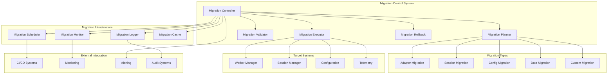

# Design Document

## Overview

The Migration Utilities system provides comprehensive, safe, and automated migration capabilities for Snakepit deployments. It enables seamless transitions between different adapter types, session storage backends, configuration versions, and system upgrades while maintaining data integrity, system availability, and operational safety.

The architecture implements a pluggable migration framework with planning, validation, execution, and rollback phases, supported by comprehensive monitoring, audit trails, and recovery mechanisms.

## Architecture

### High-Level Architecture



### Component Responsibilities

#### Migration Controller
- Orchestrates migration lifecycle and coordination
- Manages migration state and progress tracking
- Coordinates between planning, validation, execution, and rollback phases
- Provides unified API for migration operations

#### Migration Planner
- Analyzes current system state and target configuration
- Creates detailed migration plans with steps and dependencies
- Identifies risks, conflicts, and mitigation strategies
- Generates rollback procedures and recovery plans

#### Migration Validator
- Validates migration feasibility and safety
- Performs dry-run simulations and compatibility checks
- Validates data integrity and system requirements
- Provides pre-migration risk assessment

#### Migration Executor
- Executes migration plans with progress tracking
- Manages zero-downtime migration procedures
- Coordinates component updates and data transfers
- Handles error recovery and partial failure scenarios

## Components and Interfaces

### 1. Migration Controller

```elixir
defmodule Snakepit.Migration.Controller do
  use GenServer
  
  @type migration_spec :: %{
    id: String.t(),
    type: migration_type(),
    source: map(),
    target: map(),
    options: migration_options()
  }
  
  @type migration_type :: 
    :adapter_migration | :session_migration | :config_migration | 
    :data_migration | :custom_migration
  
  @type migration_options :: %{
    dry_run: boolean(),
    zero_downtime: boolean(),
    validation_level: :basic | :full | :strict,
    rollback_enabled: boolean(),
    progress_callback: function() | nil,
    timeout: pos_integer()
  }
  
  @type migration_result :: %{
    status: :success | :failure | :partial,
    migration_id: String.t(),
    duration: pos_integer(),
    steps_completed: pos_integer(),
    steps_total: pos_integer(),
    rollback_info: map() | nil,
    validation_results: [validation_result()],
    errors: [migration_error()]
  }
  
  def plan_migration(migration_spec) do
    GenServer.call(__MODULE__, {:plan_migration, migration_spec})
  end
  
  def execute_migration(migration_id, opts \\ %{}) do
    GenServer.call(__MODULE__, {:execute_migration, migration_id, opts}, :infinity)
  end
  
  def rollback_migration(migration_id, opts \\ %{}) do
    GenServer.call(__MODULE__, {:rollback_migration, migration_id, opts}, :infinity)
  end
  
  def get_migration_status(migration_id) do
    GenServer.call(__MODULE__, {:get_status, migration_id})
  end
  
  def handle_call({:plan_migration, spec}, _from, state) do
    case MigrationPlanner.create_plan(spec) do
      {:ok, plan} ->
        migration_id = generate_migration_id()
        updated_state = store_migration_plan(state, migration_id, plan)
        {:reply, {:ok, migration_id, plan}, updated_state}
      
      {:error, reason} ->
        {:reply, {:error, reason}, state}
    end
  end
  
  def handle_call({:execute_migration, migration_id, opts}, _from, state) do
    case get_migration_plan(state, migration_id) do
      {:ok, plan} ->
        result = execute_migration_plan(plan, opts)
        updated_state = update_migration_status(state, migration_id, result)
        {:reply, {:ok, result}, updated_state}
      
      {:error, reason} ->
        {:reply, {:error, reason}, state}
    end
  end
end
```

### 2. Migration Planner

```elixir
defmodule Snakepit.Migration.Planner do
  @type migration_plan :: %{
    id: String.t(),
    type: atom(),
    steps: [migration_step()],
    dependencies: [String.t()],
    rollback_plan: rollback_plan(),
    estimated_duration: pos_integer(),
    risk_assessment: risk_assessment(),
    validation_requirements: [validation_requirement()]
  }
  
  @type migration_step :: %{
    id: String.t(),
    type: step_type(),
    description: String.t(),
    action: function(),
    rollback_action: function(),
    dependencies: [String.t()],
    estimated_duration: pos_integer(),
    validation: validation_spec()
  }
  
  @type step_type :: 
    :preparation | :validation | :backup | :migration | :verification | :cleanup
  
  def create_plan(migration_spec) do
    with {:ok, current_state} <- analyze_current_state(migration_spec),
         {:ok, target_state} <- analyze_target_state(migration_spec),
         {:ok, compatibility} <- check_compatibility(current_state, target_state),
         {:ok, steps} <- generate_migration_steps(current_state, target_state, migration_spec),
         {:ok, rollback_plan} <- create_rollback_plan(steps),
         {:ok, risk_assessment} <- assess_migration_risks(steps, compatibility) do
      
      plan = %{
        id: generate_plan_id(),
        type: migration_spec.type,
        steps: steps,
        dependencies: extract_dependencies(steps),
        rollback_plan: rollback_plan,
        estimated_duration: calculate_duration(steps),
        risk_assessment: risk_assessment,
        validation_requirements: extract_validations(steps)
      }
      
      {:ok, plan}
    end
  end
  
  defp generate_migration_steps(current_state, target_state, spec) do
    case spec.type do
      :adapter_migration ->
        generate_adapter_migration_steps(current_state, target_state, spec)
      
      :session_migration ->
        generate_session_migration_steps(current_state, target_state, spec)
      
      :config_migration ->
        generate_config_migration_steps(current_state, target_state, spec)
      
      :data_migration ->
        generate_data_migration_steps(current_state, target_state, spec)
      
      :custom_migration ->
        generate_custom_migration_steps(current_state, target_state, spec)
    end
  end
  
  defp generate_adapter_migration_steps(current_state, target_state, spec) do
    steps = [
      create_preparation_step("Analyze custom adapter functionality", current_state),
      create_validation_step("Validate generic adapter compatibility", target_state),
      create_backup_step("Backup current adapter configuration", current_state),
      create_migration_step("Configure generic adapter", target_state),
      create_migration_step("Migrate adapter calls", %{current: current_state, target: target_state}),
      create_verification_step("Validate adapter functionality", target_state),
      create_cleanup_step("Remove old adapter code", current_state)
    ]
    
    {:ok, steps}
  end
  
  defp generate_session_migration_steps(current_state, target_state, spec) do
    steps = [
      create_preparation_step("Prepare session migration", current_state),
      create_validation_step("Validate target session storage", target_state),
      create_backup_step("Backup session data", current_state),
      create_migration_step("Initialize target session storage", target_state),
      create_migration_step("Transfer active sessions", %{current: current_state, target: target_state}),
      create_migration_step("Switch session routing", target_state),
      create_verification_step("Validate session data integrity", target_state),
      create_cleanup_step("Cleanup old session storage", current_state)
    ]
    
    {:ok, steps}
  end
end
```

### 3. Migration Executor

```elixir
defmodule Snakepit.Migration.Executor do
  @type execution_context :: %{
    migration_id: String.t(),
    plan: Snakepit.Migration.Planner.migration_plan(),
    options: map(),
    state: map(),
    progress: execution_progress()
  }
  
  @type execution_progress :: %{
    current_step: pos_integer(),
    total_steps: pos_integer(),
    completed_steps: [String.t()],
    failed_steps: [String.t()],
    start_time: DateTime.t(),
    estimated_completion: DateTime.t()
  }
  
  def execute_plan(plan, options \\ %{}) do
    context = initialize_execution_context(plan, options)
    
    case options[:dry_run] do
      true -> execute_dry_run(context)
      _ -> execute_migration(context)
    end
  end
  
  defp execute_migration(context) do
    with {:ok, context} <- prepare_migration(context),
         {:ok, context} <- execute_migration_steps(context),
         {:ok, context} <- verify_migration(context),
         {:ok, context} <- finalize_migration(context) do
      
      {:ok, create_migration_result(context, :success)}
    else
      {:error, reason, context} ->
        case context.options[:rollback_enabled] do
          true -> 
            {:ok, rollback_context} = rollback_migration(context)
            {:error, reason, create_migration_result(rollback_context, :failure)}
          false ->
            {:error, reason, create_migration_result(context, :failure)}
        end
    end
  end
  
  defp execute_migration_steps(context) do
    Enum.reduce_while(context.plan.steps, {:ok, context}, fn step, {:ok, acc_context} ->
      case execute_step(step, acc_context) do
        {:ok, updated_context} ->
          progress_context = update_progress(updated_context, step)
          emit_progress_event(progress_context)
          {:cont, {:ok, progress_context}}
        
        {:error, reason} ->
          error_context = record_step_failure(acc_context, step, reason)
          {:halt, {:error, reason, error_context}}
      end
    end)
  end
  
  defp execute_step(step, context) do
    Logger.info("Executing migration step: #{step.description}")
    
    start_time = System.monotonic_time(:millisecond)
    
    try do
      case step.action.(context) do
        {:ok, result} ->
          duration = System.monotonic_time(:millisecond) - start_time
          
          case validate_step_result(step, result, context) do
            {:ok, _} ->
              updated_context = record_step_success(context, step, result, duration)
              {:ok, updated_context}
            
            {:error, validation_error} ->
              {:error, {:validation_failed, step.id, validation_error}}
          end
        
        {:error, reason} ->
          {:error, {:step_failed, step.id, reason}}
      end
    rescue
      error ->
        {:error, {:step_crashed, step.id, error}}
    end
  end
end
```

### 4. Session Migration Handler

```elixir
defmodule Snakepit.Migration.SessionMigration do
  @behaviour Snakepit.Migration.Handler
  
  def migrate(source_config, target_config, options \\ %{}) do
    with {:ok, source_adapter} <- initialize_source_adapter(source_config),
         {:ok, target_adapter} <- initialize_target_adapter(target_config),
         {:ok, session_list} <- list_active_sessions(source_adapter),
         {:ok, migration_plan} <- create_session_migration_plan(session_list, options) do
      
      execute_session_migration(source_adapter, target_adapter, migration_plan, options)
    end
  end
  
  defp execute_session_migration(source, target, plan, options) do
    case options[:zero_downtime] do
      true -> execute_zero_downtime_migration(source, target, plan, options)
      _ -> execute_standard_migration(source, target, plan, options)
    end
  end
  
  defp execute_zero_downtime_migration(source, target, plan, options) do
    # Phase 1: Start dual-write mode
    with {:ok, _} <- enable_dual_write_mode(source, target),
         
         # Phase 2: Migrate existing sessions
         {:ok, migration_results} <- migrate_sessions_batch(source, target, plan.sessions, options),
         
         # Phase 3: Validate data consistency
         {:ok, _} <- validate_session_consistency(source, target, plan.sessions),
         
         # Phase 4: Switch read traffic to target
         {:ok, _} <- switch_read_traffic(target),
         
         # Phase 5: Stop dual-write and cleanup source
         {:ok, _} <- disable_dual_write_mode(source, target),
         {:ok, _} <- cleanup_source_sessions(source, plan.sessions) do
      
      {:ok, %{
        migrated_sessions: length(plan.sessions),
        migration_results: migration_results,
        downtime: 0
      }}
    else
      {:error, reason} ->
        # Rollback to source-only mode
        rollback_session_migration(source, target, plan)
        {:error, reason}
    end
  end
  
  defp migrate_sessions_batch(source, target, sessions, options) do
    batch_size = options[:batch_size] || 100
    
    sessions
    |> Enum.chunk_every(batch_size)
    |> Enum.reduce_while({:ok, []}, fn batch, {:ok, acc_results} ->
      case migrate_session_batch(source, target, batch) do
        {:ok, batch_results} ->
          {:cont, {:ok, acc_results ++ batch_results}}
        
        {:error, reason} ->
          {:halt, {:error, reason}}
      end
    end)
  end
  
  defp migrate_session_batch(source, target, session_batch) do
    results = Enum.map(session_batch, fn session_id ->
      case migrate_single_session(source, target, session_id) do
        {:ok, _} -> {:ok, session_id}
        {:error, reason} -> {:error, session_id, reason}
      end
    end)
    
    {successful, failed} = Enum.split_with(results, &match?({:ok, _}, &1))
    
    if Enum.empty?(failed) do
      {:ok, successful}
    else
      {:error, {:batch_migration_failed, failed}}
    end
  end
  
  defp migrate_single_session(source, target, session_id) do
    with {:ok, session_data} <- source.get_session(session_id),
         {:ok, session_metadata} <- source.get_session_metadata(session_id),
         {:ok, _} <- target.create_session(session_id, session_data, session_metadata),
         {:ok, _} <- validate_session_migration(source, target, session_id) do
      
      {:ok, session_id}
    end
  end
end
```

### 5. Adapter Migration Handler

```elixir
defmodule Snakepit.Migration.AdapterMigration do
  @behaviour Snakepit.Migration.Handler
  
  def migrate(custom_adapter_config, generic_adapter_config, options \\ %{}) do
    with {:ok, analysis} <- analyze_custom_adapter(custom_adapter_config),
         {:ok, mapping} <- create_generic_adapter_mapping(analysis, generic_adapter_config),
         {:ok, validation} <- validate_migration_feasibility(analysis, mapping),
         {:ok, migration_plan} <- create_adapter_migration_plan(analysis, mapping, options) do
      
      execute_adapter_migration(migration_plan, options)
    end
  end
  
  defp analyze_custom_adapter(config) do
    adapter_module = config.module
    
    with {:ok, functions} <- extract_adapter_functions(adapter_module),
         {:ok, dependencies} <- analyze_adapter_dependencies(adapter_module),
         {:ok, complexity} <- assess_adapter_complexity(functions, dependencies) do
      
      analysis = %{
        module: adapter_module,
        functions: functions,
        dependencies: dependencies,
        complexity: complexity,
        migration_feasibility: assess_migration_feasibility(functions, complexity)
      }
      
      {:ok, analysis}
    end
  end
  
  defp create_generic_adapter_mapping(analysis, generic_config) do
    mappings = Enum.map(analysis.functions, fn function ->
      case map_function_to_generic(function, generic_config) do
        {:ok, generic_mapping} ->
          {:ok, function.name, generic_mapping}
        
        {:error, :not_mappable} ->
          {:manual_migration_required, function.name, function}
      end
    end)
    
    {automatic_mappings, manual_mappings} = Enum.split_with(mappings, &match?({:ok, _, _}, &1))
    
    mapping = %{
      automatic: Enum.map(automatic_mappings, fn {:ok, name, mapping} -> {name, mapping} end) |> Map.new(),
      manual: Enum.map(manual_mappings, fn {:manual_migration_required, name, func} -> {name, func} end) |> Map.new()
    }
    
    {:ok, mapping}
  end
  
  defp execute_adapter_migration(plan, options) do
    case options[:dry_run] do
      true -> simulate_adapter_migration(plan)
      _ -> perform_adapter_migration(plan, options)
    end
  end
  
  defp perform_adapter_migration(plan, options) do
    with {:ok, _} <- backup_current_configuration(plan),
         {:ok, _} <- configure_generic_adapter(plan.generic_config),
         {:ok, _} <- migrate_adapter_calls(plan.mappings),
         {:ok, _} <- validate_migrated_functionality(plan),
         {:ok, _} <- update_application_configuration(plan) do
      
      case options[:cleanup_old_adapter] do
        true -> cleanup_old_adapter_code(plan)
        _ -> :ok
      end
      
      {:ok, create_migration_summary(plan)}
    else
      {:error, reason} ->
        rollback_adapter_migration(plan)
        {:error, reason}
    end
  end
end
```

## Data Models

### Migration Plan

```elixir
defmodule Snakepit.Migration.Plan do
  @type t :: %__MODULE__{
    id: String.t(),
    type: migration_type(),
    source_state: map(),
    target_state: map(),
    steps: [migration_step()],
    rollback_steps: [rollback_step()],
    dependencies: [String.t()],
    estimated_duration: pos_integer(),
    risk_level: :low | :medium | :high,
    validation_requirements: [validation_requirement()],
    created_at: DateTime.t(),
    created_by: String.t()
  }
  
  @type migration_type :: 
    :adapter_migration | :session_migration | :config_migration | 
    :data_migration | :version_upgrade | :custom_migration
  
  defstruct [
    :id,
    :type,
    :source_state,
    :target_state,
    steps: [],
    rollback_steps: [],
    dependencies: [],
    :estimated_duration,
    :risk_level,
    validation_requirements: [],
    :created_at,
    :created_by
  ]
end
```

### Migration Status

```elixir
defmodule Snakepit.Migration.Status do
  @type t :: %__MODULE__{
    migration_id: String.t(),
    status: migration_status(),
    progress: migration_progress(),
    current_step: String.t() | nil,
    start_time: DateTime.t() | nil,
    end_time: DateTime.t() | nil,
    duration: pos_integer() | nil,
    errors: [migration_error()],
    warnings: [String.t()],
    rollback_available: boolean(),
    metadata: map()
  }
  
  @type migration_status :: 
    :planned | :validating | :executing | :completed | :failed | 
    :rolling_back | :rolled_back | :cancelled
  
  @type migration_progress :: %{
    steps_completed: pos_integer(),
    steps_total: pos_integer(),
    percentage: float(),
    estimated_remaining: pos_integer()
  }
  
  defstruct [
    :migration_id,
    :status,
    :progress,
    :current_step,
    :start_time,
    :end_time,
    :duration,
    errors: [],
    warnings: [],
    rollback_available: false,
    metadata: %{}
  ]
end
```

## Error Handling

### Migration Error Management

```elixir
defmodule Snakepit.Migration.ErrorHandler do
  @type migration_error :: 
    :validation_failed | :step_failed | :rollback_failed | :data_corruption |
    :timeout | :dependency_unavailable | :insufficient_resources | :user_cancelled
  
  def handle_migration_error(error_type, context, original_error) do
    case error_type do
      :validation_failed ->
        handle_validation_error(context, original_error)
        
      :step_failed ->
        handle_step_failure(context, original_error)
        
      :rollback_failed ->
        handle_rollback_failure(context, original_error)
        
      :data_corruption ->
        handle_data_corruption(context, original_error)
        
      _ ->
        handle_generic_error(error_type, context, original_error)
    end
  end
  
  defp handle_validation_error(context, error) do
    Logger.error("Migration validation failed: #{inspect(error)}")
    
    recovery_actions = [
      "Review migration plan and target configuration",
      "Check system requirements and dependencies",
      "Validate source system state",
      "Consider alternative migration approach"
    ]
    
    {:error, %{
      type: :validation_failed,
      message: "Migration validation failed",
      details: error,
      recovery_actions: recovery_actions,
      rollback_required: false
    }}
  end
  
  defp handle_step_failure(context, error) do
    Logger.error("Migration step failed: #{inspect(error)}")
    
    case context.options[:auto_rollback] do
      true ->
        Logger.info("Initiating automatic rollback due to step failure")
        {:rollback, error}
        
      _ ->
        {:error, %{
          type: :step_failed,
          message: "Migration step failed",
          details: error,
          rollback_available: context.rollback_available,
          manual_intervention_required: true
        }}
    end
  end
  
  defp handle_data_corruption(context, error) do
    Logger.critical("Data corruption detected during migration: #{inspect(error)}")
    
    # Immediate rollback for data corruption
    {:emergency_rollback, %{
      type: :data_corruption,
      message: "Data corruption detected - emergency rollback initiated",
      details: error,
      immediate_action_required: true
    }}
  end
end
```

## Testing Strategy

### Test Categories

#### 1. Unit Tests
- Individual migration handler functionality
- Migration plan generation and validation
- Rollback procedure correctness
- Error handling and recovery logic

#### 2. Integration Tests
- End-to-end migration scenarios
- Cross-component migration coordination
- Data integrity validation
- Performance under load

#### 3. Chaos Tests
- Migration failure and recovery scenarios
- Partial failure handling
- Network partition during migration
- Resource exhaustion scenarios

#### 4. Production Simulation Tests
- Large-scale data migration
- Zero-downtime migration validation
- Multi-environment migration consistency
- Performance impact measurement

### Mock Migration Scenarios

```elixir
defmodule Snakepit.Migration.TestHelpers do
  def create_mock_custom_adapter() do
    %{
      module: MockCustomAdapter,
      functions: [
        %{name: "process_data", complexity: :simple, generic_equivalent: "pandas.DataFrame"},
        %{name: "complex_analysis", complexity: :high, generic_equivalent: nil}
      ],
      dependencies: ["pandas", "numpy"],
      migration_feasibility: :partial
    }
  end
  
  def create_mock_session_data(count \\ 100) do
    Enum.map(1..count, fn i ->
      %{
        session_id: "session_#{i}",
        data: %{"key_#{i}" => "value_#{i}"},
        ttl: 3600,
        created_at: DateTime.utc_now()
      }
    end)
  end
  
  def simulate_migration_failure(step_number) do
    fn context ->
      if context.current_step == step_number do
        {:error, :simulated_failure}
      else
        {:ok, context}
      end
    end
  end
end
```

## Configuration Examples

### Basic Migration Configuration

```elixir
config :snakepit, :migration,
  enabled: true,
  auto_rollback: true,
  validation_level: :full,
  progress_reporting: true,
  audit_logging: true
```

### Advanced Migration Configuration

```elixir
config :snakepit, :migration,
  enabled: true,
  auto_rollback: true,
  validation_level: :strict,
  progress_reporting: true,
  audit_logging: true,
  
  # Performance settings
  batch_size: 1000,
  parallel_workers: 4,
  timeout: 3_600_000,  # 1 hour
  
  # Safety settings
  backup_enabled: true,
  backup_retention: 7,  # days
  dry_run_required: true,
  approval_required: true,
  
  # Monitoring integration
  telemetry_enabled: true,
  progress_webhook: "https://monitoring.example.com/migration-progress",
  alert_on_failure: true,
  
  # Custom migration handlers
  custom_handlers: %{
    "custom_adapter_migration" => MyApp.CustomAdapterMigration,
    "database_migration" => MyApp.DatabaseMigration
  }
```

### Migration Execution Examples

```elixir
# Plan a custom to generic adapter migration
{:ok, migration_id, plan} = Snakepit.Migration.Controller.plan_migration(%{
  type: :adapter_migration,
  source: %{type: :custom, module: MyApp.CustomAdapter},
  target: %{type: :generic, libraries: ["pandas", "numpy"]},
  options: %{dry_run: false, zero_downtime: true}
})

# Execute the migration
{:ok, result} = Snakepit.Migration.Controller.execute_migration(migration_id)

# Monitor progress
status = Snakepit.Migration.Controller.get_migration_status(migration_id)

# Rollback if needed
{:ok, rollback_result} = Snakepit.Migration.Controller.rollback_migration(migration_id)
```

This design provides a comprehensive migration system that enables safe, automated, and reversible transitions between different Snakepit configurations while maintaining data integrity and system availability.