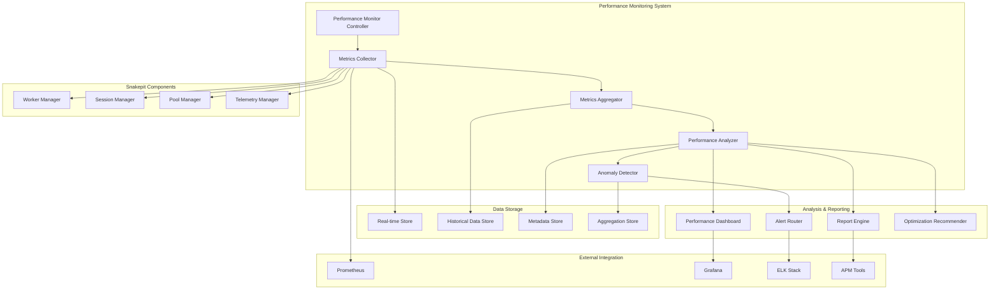

# Design Document

## Overview

The Performance Monitoring system provides comprehensive real-time and historical performance analysis for Snakepit deployments. It implements detailed metrics collection, analysis, and reporting with focus on request duration, throughput analysis, resource utilization, and performance optimization recommendations.

The architecture uses a multi-layered approach with high-performance metrics collection, real-time aggregation, historical analysis, and intelligent alerting to provide actionable performance insights.

## Architecture

### High-Level Architecture



### Component Responsibilities

#### Performance Monitor Controller
- Orchestrates performance monitoring lifecycle and configuration
- Manages metrics collection scheduling and coordination
- Provides unified API for performance monitoring operations
- Handles monitoring system health and self-monitoring

#### Metrics Collector
- Collects high-frequency performance metrics from all system components
- Implements efficient, low-overhead metrics gathering
- Provides real-time metrics streaming and buffering
- Handles metrics normalization and validation

#### Metrics Aggregator
- Performs real-time metrics aggregation and windowing
- Calculates percentiles, rates, and statistical summaries
- Manages time-series data compression and storage
- Provides efficient querying and retrieval capabilities

#### Performance Analyzer
- Analyzes performance trends and patterns
- Generates performance insights and recommendations
- Performs correlation analysis across metrics
- Provides performance forecasting and capacity planning

## Components and Interfaces

### 1. Performance Monitor Controller

```elixir
defmodule Snakepit.Performance.Monitor do
  use GenServer
  
  @type metric_config :: %{
    name: String.t(),
    type: metric_type(),
    collection_interval: pos_integer(),
    retention_period: pos_integer(),
    aggregation_windows: [pos_integer()],
    alert_thresholds: map()
  }
  
  @type metric_type :: 
    :counter | :gauge | :histogram | :summary | :timer
  
  @type performance_report :: %{
    timeframe: {DateTime.t(), DateTime.t()},
    metrics: map(),
    analysis: performance_analysis(),
    recommendations: [optimization_recommendation()],
    alerts: [performance_alert()]
  }
  
  def start_monitoring(config \\ %{}) do
    GenServer.call(__MODULE__, {:start_monitoring, config})
  end
  
  def get_performance_report(timeframe, options \\ %{}) do
    GenServer.call(__MODULE__, {:get_report, timeframe, options})
  end
  
  def get_real_time_metrics(metric_names \\ :all) do
    GenServer.call(__MODULE__, {:get_real_time, metric_names})
  end
  
  def configure_alerts(alert_config) do
    GenServer.call(__MODULE__, {:configure_alerts, alert_config})
  end
  
  def handle_call({:start_monitoring, config}, _from, state) do
    case initialize_monitoring(config) do
      {:ok, monitoring_state} ->
        updated_state = Map.put(state, :monitoring, monitoring_state)
        start_metrics_collection()
        {:reply, :ok, updated_state}
      
      {:error, reason} ->
        {:reply, {:error, reason}, state}
    end
  end
  
  def handle_call({:get_report, timeframe, options}, _from, state) do
    case generate_performance_report(timeframe, options) do
      {:ok, report} -> {:reply, {:ok, report}, state}
      {:error, reason} -> {:reply, {:error, reason}, state}
    end
  end
end
```

### 2. Metrics Collector

```elixir
defmodule Snakepit.Performance.MetricsCollector do
  use GenServer
  
  @type metric_point :: %{
    name: String.t(),
    value: number(),
    timestamp: DateTime.t(),
    tags: map(),
    metadata: map()
  }
  
  @type collection_result :: %{
    collected_count: pos_integer(),
    collection_time: pos_integer(),
    errors: [collection_error()],
    metrics: [metric_point()]
  }
  
  def collect_request_metrics(request_id, start_time, end_time, metadata) do
    duration = DateTime.diff(end_time, start_time, :microsecond)
    
    metrics = [
      create_metric("request.duration", duration, %{
        request_id: request_id,
        pool: metadata.pool,
        worker_type: metadata.worker_type,
        adapter_type: metadata.adapter_type
      }),
      create_metric("request.completed", 1, %{
        status: metadata.status,
        pool: metadata.pool
      })
    ]
    
    emit_metrics(metrics)
  end
  
  def collect_worker_metrics(worker_pid, worker_state) do
    metrics = [
      create_metric("worker.utilization", calculate_utilization(worker_state), %{
        worker_id: worker_state.id,
        pool: worker_state.pool,
        profile: worker_state.profile
      }),
      create_metric("worker.queue_depth", worker_state.queue_depth, %{
        worker_id: worker_state.id,
        pool: worker_state.pool
      }),
      create_metric("worker.active_requests", worker_state.active_requests, %{
        worker_id: worker_state.id,
        pool: worker_state.pool
      })
    ]
    
    emit_metrics(metrics)
  end
  
  def collect_pool_metrics(pool_name, pool_state) do
    metrics = [
      create_metric("pool.throughput", calculate_throughput(pool_state), %{
        pool: pool_name,
        window: "1m"
      }),
      create_metric("pool.capacity_utilization", calculate_capacity_utilization(pool_state), %{
        pool: pool_name
      }),
      create_metric("pool.queue_depth", pool_state.total_queue_depth, %{
        pool: pool_name
      }),
      create_metric("pool.error_rate", calculate_error_rate(pool_state), %{
        pool: pool_name,
        window: "5m"
      })
    ]
    
    emit_metrics(metrics)
  end
  
  def collect_system_metrics() do
    system_info = get_system_info()
    
    metrics = [
      create_metric("system.cpu_utilization", system_info.cpu_usage, %{}),
      create_metric("system.memory_utilization", system_info.memory_usage, %{}),
      create_metric("system.scheduler_utilization", system_info.scheduler_usage, %{}),
      create_metric("system.process_count", system_info.process_count, %{}),
      create_metric("system.gc_frequency", system_info.gc_frequency, %{window: "1m"})
    ]
    
    emit_metrics(metrics)
  end
  
  defp create_metric(name, value, tags) do
    %{
      name: name,
      value: value,
      timestamp: DateTime.utc_now(),
      tags: tags,
      metadata: %{
        collector: __MODULE__,
        collection_method: :direct
      }
    }
  end
end
```

### 3. Metrics Aggregator

```elixir
defmodule Snakepit.Performance.MetricsAggregator do
  use GenServer
  
  @type aggregation_window :: %{
    duration: pos_integer(),
    start_time: DateTime.t(),
    end_time: DateTime.t(),
    metrics: map()
  }
  
  @type aggregated_metric :: %{
    name: String.t(),
    aggregation_type: aggregation_type(),
    value: number(),
    window: aggregation_window(),
    percentiles: map(),
    statistics: metric_statistics()
  }
  
  @type aggregation_type :: 
    :sum | :average | :min | :max | :count | :rate | :percentile
  
  @type metric_statistics :: %{
    count: pos_integer(),
    sum: number(),
    min: number(),
    max: number(),
    mean: number(),
    stddev: number()
  }
  
  def aggregate_metrics(metrics, window_duration) do
    GenServer.call(__MODULE__, {:aggregate, metrics, window_duration})
  end
  
  def get_aggregated_metrics(metric_name, timeframe, aggregation_type) do
    GenServer.call(__MODULE__, {:get_aggregated, metric_name, timeframe, aggregation_type})
  end
  
  def calculate_percentiles(metric_name, timeframe, percentiles \\ [50, 95, 99, 99.9]) do
    GenServer.call(__MODULE__, {:calculate_percentiles, metric_name, timeframe, percentiles})
  end
  
  def handle_call({:aggregate, metrics, window_duration}, _from, state) do
    case perform_aggregation(metrics, window_duration) do
      {:ok, aggregated_metrics} ->
        updated_state = store_aggregated_metrics(state, aggregated_metrics)
        {:reply, {:ok, aggregated_metrics}, updated_state}
      
      {:error, reason} ->
        {:reply, {:error, reason}, state}
    end
  end
  
  defp perform_aggregation(metrics, window_duration) do
    grouped_metrics = group_metrics_by_window(metrics, window_duration)
    
    aggregated = Enum.map(grouped_metrics, fn {window, window_metrics} ->
      aggregations = %{
        request_duration: aggregate_duration_metrics(window_metrics),
        throughput: aggregate_throughput_metrics(window_metrics),
        error_rate: aggregate_error_rate_metrics(window_metrics),
        resource_utilization: aggregate_resource_metrics(window_metrics)
      }
      
      {window, aggregations}
    end)
    
    {:ok, Map.new(aggregated)}
  end
  
  defp aggregate_duration_metrics(metrics) do
    duration_metrics = filter_metrics_by_name(metrics, "request.duration")
    values = Enum.map(duration_metrics, & &1.value)
    
    %{
      count: length(values),
      mean: calculate_mean(values),
      percentiles: calculate_percentiles_from_values(values, [50, 95, 99, 99.9]),
      min: Enum.min(values, fn -> 0 end),
      max: Enum.max(values, fn -> 0 end),
      stddev: calculate_stddev(values)
    }
  end
  
  defp aggregate_throughput_metrics(metrics) do
    completed_requests = count_metrics_by_name(metrics, "request.completed")
    window_duration_seconds = get_window_duration_seconds(metrics)
    
    throughput = completed_requests / window_duration_seconds
    
    %{
      requests_per_second: throughput,
      total_requests: completed_requests,
      window_duration: window_duration_seconds
    }
  end
  
  defp calculate_percentiles_from_values(values, percentiles) do
    sorted_values = Enum.sort(values)
    
    Enum.map(percentiles, fn p ->
      index = round((p / 100) * length(sorted_values)) - 1
      index = max(0, min(index, length(sorted_values) - 1))
      value = Enum.at(sorted_values, index, 0)
      {p, value}
    end)
    |> Map.new()
  end
end
```

### 4. Performance Analyzer

```elixir
defmodule Snakepit.Performance.Analyzer do
  @type performance_analysis :: %{
    summary: performance_summary(),
    trends: performance_trends(),
    anomalies: [performance_anomaly()],
    correlations: [metric_correlation()],
    recommendations: [optimization_recommendation()]
  }
  
  @type performance_summary :: %{
    avg_response_time: number(),
    throughput: number(),
    error_rate: number(),
    resource_utilization: map(),
    capacity_utilization: number()
  }
  
  @type performance_trends :: %{
    response_time_trend: trend_direction(),
    throughput_trend: trend_direction(),
    error_rate_trend: trend_direction(),
    resource_trend: map()
  }
  
  @type trend_direction :: :improving | :degrading | :stable | :volatile
  
  def analyze_performance(timeframe, options \\ %{}) do
    with {:ok, metrics} <- get_metrics_for_timeframe(timeframe),
         {:ok, aggregated} <- aggregate_metrics_for_analysis(metrics),
         {:ok, trends} <- analyze_performance_trends(aggregated, timeframe),
         {:ok, anomalies} <- detect_performance_anomalies(aggregated),
         {:ok, correlations} <- analyze_metric_correlations(aggregated),
         {:ok, recommendations} <- generate_optimization_recommendations(aggregated, trends) do
      
      analysis = %{
        summary: create_performance_summary(aggregated),
        trends: trends,
        anomalies: anomalies,
        correlations: correlations,
        recommendations: recommendations
      }
      
      {:ok, analysis}
    end
  end
  
  defp analyze_performance_trends(metrics, timeframe) do
    window_size = calculate_trend_window_size(timeframe)
    
    trends = %{
      response_time_trend: analyze_response_time_trend(metrics, window_size),
      throughput_trend: analyze_throughput_trend(metrics, window_size),
      error_rate_trend: analyze_error_rate_trend(metrics, window_size),
      resource_trend: analyze_resource_trends(metrics, window_size)
    }
    
    {:ok, trends}
  end
  
  defp analyze_response_time_trend(metrics, window_size) do
    response_times = extract_response_time_series(metrics)
    windows = create_sliding_windows(response_times, window_size)
    
    trend_coefficients = Enum.map(windows, fn window ->
      calculate_linear_regression_slope(window)
    end)
    
    avg_coefficient = Enum.sum(trend_coefficients) / length(trend_coefficients)
    
    cond do
      avg_coefficient < -0.05 -> :improving
      avg_coefficient > 0.05 -> :degrading
      abs(avg_coefficient) < 0.01 -> :stable
      true -> :volatile
    end
  end
  
  defp detect_performance_anomalies(metrics) do
    anomalies = []
    
    # Response time anomalies
    response_time_anomalies = detect_response_time_anomalies(metrics)
    
    # Throughput anomalies
    throughput_anomalies = detect_throughput_anomalies(metrics)
    
    # Error rate anomalies
    error_rate_anomalies = detect_error_rate_anomalies(metrics)
    
    # Resource utilization anomalies
    resource_anomalies = detect_resource_anomalies(metrics)
    
    all_anomalies = anomalies ++ response_time_anomalies ++ throughput_anomalies ++ 
                   error_rate_anomalies ++ resource_anomalies
    
    {:ok, all_anomalies}
  end
  
  defp generate_optimization_recommendations(metrics, trends) do
    recommendations = []
    
    # Response time optimization
    response_time_recs = analyze_response_time_optimization(metrics, trends)
    
    # Throughput optimization
    throughput_recs = analyze_throughput_optimization(metrics, trends)
    
    # Resource optimization
    resource_recs = analyze_resource_optimization(metrics, trends)
    
    # Configuration optimization
    config_recs = analyze_configuration_optimization(metrics, trends)
    
    all_recommendations = recommendations ++ response_time_recs ++ throughput_recs ++ 
                         resource_recs ++ config_recs
    
    {:ok, all_recommendations}
  end
end
```

### 5. Real-Time Dashboard

```elixir
defmodule Snakepit.Performance.Dashboard do
  use Phoenix.LiveView
  
  @type dashboard_state :: %{
    metrics: map(),
    timeframe: {DateTime.t(), DateTime.t()},
    refresh_interval: pos_integer(),
    selected_pools: [String.t()],
    alert_level: alert_level()
  }
  
  @type alert_level :: :normal | :warning | :critical
  
  def mount(_params, _session, socket) do
    if connected?(socket) do
      schedule_refresh()
      subscribe_to_metrics()
    end
    
    initial_state = %{
      metrics: %{},
      timeframe: {DateTime.add(DateTime.utc_now(), -3600), DateTime.utc_now()},
      refresh_interval: 5000,
      selected_pools: [],
      alert_level: :normal
    }
    
    {:ok, assign(socket, initial_state)}
  end
  
  def handle_info(:refresh_metrics, socket) do
    case get_current_metrics(socket.assigns) do
      {:ok, metrics} ->
        updated_socket = assign(socket, :metrics, metrics)
        schedule_refresh()
        {:noreply, updated_socket}
      
      {:error, _reason} ->
        schedule_refresh()
        {:noreply, socket}
    end
  end
  
  def handle_info({:metric_update, metric}, socket) do
    updated_metrics = update_real_time_metric(socket.assigns.metrics, metric)
    alert_level = calculate_alert_level(updated_metrics)
    
    updated_socket = socket
    |> assign(:metrics, updated_metrics)
    |> assign(:alert_level, alert_level)
    
    {:noreply, updated_socket}
  end
  
  def render(assigns) do
    ~H"""
    <div class="performance-dashboard">
      <div class="dashboard-header">
        <h1>Performance Monitoring</h1>
        <div class="alert-indicator" class={alert_class(@alert_level)}>
          <%= @alert_level %>
        </div>
      </div>
      
      <div class="metrics-grid">
        <div class="metric-card">
          <h3>Response Time</h3>
          <div class="metric-value">
            <%= format_duration(@metrics.avg_response_time) %>
          </div>
          <div class="metric-trend">
            <span class={trend_class(@metrics.response_time_trend)}>
              <%= @metrics.response_time_trend %>
            </span>
          </div>
        </div>
        
        <div class="metric-card">
          <h3>Throughput</h3>
          <div class="metric-value">
            <%= @metrics.throughput %> req/s
          </div>
          <div class="metric-trend">
            <span class={trend_class(@metrics.throughput_trend)}>
              <%= @metrics.throughput_trend %>
            </span>
          </div>
        </div>
        
        <div class="metric-card">
          <h3>Error Rate</h3>
          <div class="metric-value">
            <%= Float.round(@metrics.error_rate * 100, 2) %>%
          </div>
          <div class="metric-trend">
            <span class={trend_class(@metrics.error_rate_trend)}>
              <%= @metrics.error_rate_trend %>
            </span>
          </div>
        </div>
        
        <div class="metric-card">
          <h3>CPU Utilization</h3>
          <div class="metric-value">
            <%= Float.round(@metrics.cpu_utilization * 100, 1) %>%
          </div>
        </div>
      </div>
      
      <div class="charts-section">
        <div class="chart-container">
          <canvas id="response-time-chart" phx-hook="ResponseTimeChart"></canvas>
        </div>
        
        <div class="chart-container">
          <canvas id="throughput-chart" phx-hook="ThroughputChart"></canvas>
        </div>
      </div>
      
      <div class="pool-metrics">
        <%= for {pool_name, pool_metrics} <- @metrics.pools do %>
          <div class="pool-card">
            <h4><%= pool_name %></h4>
            <div class="pool-stats">
              <span>Utilization: <%= Float.round(pool_metrics.utilization * 100, 1) %>%</span>
              <span>Queue: <%= pool_metrics.queue_depth %></span>
              <span>Workers: <%= pool_metrics.active_workers %>/<%= pool_metrics.total_workers %></span>
            </div>
          </div>
        <% end %>
      </div>
    </div>
    """
  end
end
```

## Data Models

### Performance Metric

```elixir
defmodule Snakepit.Performance.Metric do
  @type t :: %__MODULE__{
    name: String.t(),
    type: metric_type(),
    value: number(),
    timestamp: DateTime.t(),
    tags: map(),
    metadata: map(),
    aggregation_windows: [aggregation_window()]
  }
  
  @type metric_type :: 
    :counter | :gauge | :histogram | :summary | :timer | :rate
  
  @type aggregation_window :: %{
    duration: pos_integer(),
    aggregation_type: :sum | :avg | :min | :max | :count,
    value: number(),
    sample_count: pos_integer()
  }
  
  defstruct [
    :name,
    :type,
    :value,
    :timestamp,
    tags: %{},
    metadata: %{},
    aggregation_windows: []
  ]
end
```

### Performance Alert

```elixir
defmodule Snakepit.Performance.Alert do
  @type t :: %__MODULE__{
    id: String.t(),
    metric_name: String.t(),
    alert_type: alert_type(),
    severity: severity_level(),
    threshold: number(),
    current_value: number(),
    triggered_at: DateTime.t(),
    resolved_at: DateTime.t() | nil,
    description: String.t(),
    suggested_actions: [String.t()],
    metadata: map()
  }
  
  @type alert_type :: 
    :threshold_exceeded | :anomaly_detected | :trend_degradation | 
    :rate_limit_exceeded | :resource_exhaustion
  
  @type severity_level :: :info | :warning | :critical | :emergency
  
  defstruct [
    :id,
    :metric_name,
    :alert_type,
    :severity,
    :threshold,
    :current_value,
    :triggered_at,
    :resolved_at,
    :description,
    suggested_actions: [],
    metadata: %{}
  ]
end
```

## Error Handling

### Performance Monitoring Error Management

```elixir
defmodule Snakepit.Performance.ErrorHandler do
  @type monitoring_error :: 
    :metrics_collection_failed | :aggregation_failed | :storage_unavailable |
    :analysis_timeout | :dashboard_error | :alert_delivery_failed
  
  def handle_monitoring_error(error_type, context, original_error) do
    case error_type do
      :metrics_collection_failed ->
        handle_collection_failure(context, original_error)
        
      :aggregation_failed ->
        handle_aggregation_failure(context, original_error)
        
      :storage_unavailable ->
        handle_storage_failure(context, original_error)
        
      :analysis_timeout ->
        handle_analysis_timeout(context, original_error)
        
      _ ->
        handle_generic_monitoring_error(error_type, context, original_error)
    end
  end
  
  defp handle_collection_failure(context, error) do
    Logger.warning("Metrics collection failed: #{inspect(error)}")
    
    # Attempt graceful degradation
    case context.fallback_enabled do
      true ->
        enable_reduced_metrics_collection()
        {:degraded_mode, "Operating with reduced metrics collection"}
        
      false ->
        {:error, "Metrics collection unavailable"}
    end
  end
  
  defp handle_storage_failure(context, error) do
    Logger.error("Performance data storage failed: #{inspect(error)}")
    
    # Enable in-memory buffering
    enable_memory_buffering()
    schedule_storage_retry()
    
    {:buffering_mode, "Performance data buffered in memory"}
  end
end
```

## Configuration Examples

### Basic Performance Monitoring Configuration

```elixir
config :snakepit, :performance_monitoring,
  enabled: true,
  collection_interval: 1000,  # 1 second
  retention_period: 2_592_000_000,  # 30 days in milliseconds
  
  metrics: [
    %{name: "request.duration", type: :histogram, percentiles: [50, 95, 99, 99.9]},
    %{name: "request.throughput", type: :rate, window: 60_000},
    %{name: "worker.utilization", type: :gauge},
    %{name: "pool.queue_depth", type: :gauge}
  ],
  
  aggregation_windows: [60_000, 300_000, 900_000],  # 1m, 5m, 15m
  
  alerts: %{
    response_time_p95: %{threshold: 5000, severity: :warning},
    error_rate: %{threshold: 0.05, severity: :critical},
    cpu_utilization: %{threshold: 0.8, severity: :warning}
  }
```

### Advanced Performance Monitoring Configuration

```elixir
config :snakepit, :performance_monitoring,
  enabled: true,
  collection_interval: 500,  # 500ms for high-frequency collection
  retention_period: 7_776_000_000,  # 90 days
  
  # High-resolution metrics
  metrics: [
    %{
      name: "request.duration",
      type: :histogram,
      percentiles: [50, 75, 90, 95, 99, 99.9, 99.99],
      buckets: [1, 5, 10, 25, 50, 100, 250, 500, 1000, 2500, 5000, 10000]
    },
    %{
      name: "request.throughput",
      type: :rate,
      windows: [1000, 5000, 15000, 60000, 300000]
    },
    %{
      name: "worker.performance",
      type: :summary,
      objectives: %{0.5 => 0.05, 0.9 => 0.01, 0.99 => 0.001}
    }
  ],
  
  # Multi-dimensional aggregation
  aggregation_windows: [
    %{duration: 60_000, type: :sliding},      # 1 minute sliding
    %{duration: 300_000, type: :tumbling},    # 5 minute tumbling
    %{duration: 3_600_000, type: :session}    # 1 hour session-based
  ],
  
  # Advanced alerting
  alerts: %{
    response_time_anomaly: %{
      type: :anomaly_detection,
      sensitivity: 0.95,
      min_samples: 100
    },
    throughput_degradation: %{
      type: :trend_analysis,
      threshold: -0.2,  # 20% degradation
      window: 300_000
    },
    resource_exhaustion: %{
      type: :composite,
      conditions: [
        %{metric: "cpu_utilization", operator: :gt, value: 0.9},
        %{metric: "memory_utilization", operator: :gt, value: 0.85}
      ]
    }
  },
  
  # External integrations
  exporters: [
    %{type: :prometheus, endpoint: "/metrics", port: 9090},
    %{type: :statsd, host: "localhost", port: 8125},
    %{type: :influxdb, url: "http://localhost:8086", database: "snakepit"}
  ],
  
  # Performance optimization
  optimization: %{
    auto_recommendations: true,
    recommendation_interval: 3_600_000,  # 1 hour
    learning_enabled: true,
    baseline_period: 604_800_000  # 1 week
  }
```

This design provides a comprehensive performance monitoring system that enables detailed analysis, real-time monitoring, and proactive optimization for production Snakepit deployments.