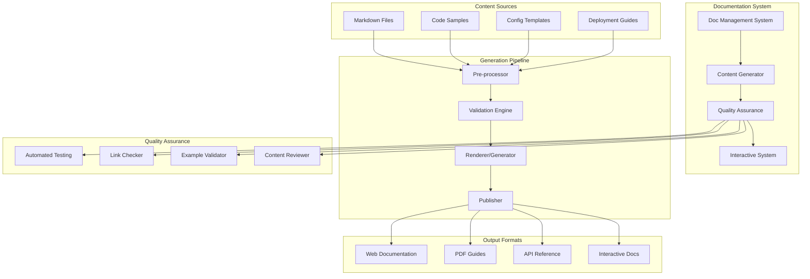

# Design Document

## Overview

The Documentation & Examples system provides comprehensive, maintainable, and interactive documentation for Snakepit production deployments. It implements a multi-layered documentation architecture with automated quality assurance, interactive examples, and platform-specific deployment guides to ensure successful production adoption.

The system uses modern documentation tools, automated testing, and community contribution workflows to maintain high-quality, up-to-date documentation that serves users from initial evaluation through production operation.

## Architecture

### High-Level Architecture



### Component Responsibilities

#### Documentation Management System
- Orchestrates documentation generation and maintenance
- Manages content versioning and release coordination
- Provides unified interface for documentation operations
- Handles documentation deployment and distribution

#### Content Generator
- Processes source content and generates documentation
- Handles template processing and content interpolation
- Manages cross-references and link generation
- Provides content transformation and formatting

#### Quality Assurance System
- Validates documentation accuracy and completeness
- Tests code examples and configuration templates
- Checks links and references for validity
- Ensures consistency and quality standards

#### Interactive System
- Provides interactive documentation experiences
- Manages runnable code examples and tutorials
- Handles user interaction and feedback collection
- Integrates with development environments

## Components and Interfaces

### 1. Documentation Management System

```elixir
defmodule Snakepit.Documentation.Manager do
  @type doc_config :: %{
    source_path: String.t(),
    output_path: String.t(),
    formats: [output_format()],
    validation_level: :basic | :full | :strict,
    interactive_enabled: boolean()
  }
  
  @type output_format :: :html | :pdf | :markdown | :json | :interactive
  
  @type generation_result :: %{
    status: :success | :failure | :partial,
    generated_files: [String.t()],
    validation_results: [validation_result()],
    errors: [doc_error()],
    warnings: [String.t()]
  }
  
  def generate_documentation(config \\ %{}) do
    with {:ok, sources} <- collect_source_content(config),
         {:ok, processed} <- process_content(sources, config),
         {:ok, validated} <- validate_content(processed, config),
         {:ok, generated} <- generate_outputs(validated, config) do
      
      {:ok, %{
        status: :success,
        generated_files: generated.files,
        validation_results: validated.results,
        errors: [],
        warnings: generated.warnings
      }}
    else
      {:error, reason} -> {:error, reason}
    end
  end
  
  def validate_documentation(path, options \\ %{}) do
    with {:ok, content} <- load_documentation(path),
         {:ok, examples} <- extract_code_examples(content),
         {:ok, links} <- extract_links(content),
         {:ok, example_results} <- validate_examples(examples),
         {:ok, link_results} <- validate_links(links) do
      
      {:ok, %{
        example_validation: example_results,
        link_validation: link_results,
        overall_status: determine_overall_status(example_results, link_results)
      }}
    end
  end
  
  def update_documentation(changes, options \\ %{}) do
    case options[:auto_regenerate] do
      true -> 
        regenerate_affected_documentation(changes)
      false -> 
        mark_documentation_stale(changes)
    end
  end
end
```

### 2. Content Generator

```elixir
defmodule Snakepit.Documentation.ContentGenerator do
  @type content_source :: %{
    type: content_type(),
    path: String.t(),
    metadata: map(),
    dependencies: [String.t()]
  }
  
  @type content_type :: 
    :guide | :reference | :tutorial | :example | :api_doc | :config_template
  
  @type generated_content :: %{
    content: String.t(),
    format: String.t(),
    metadata: map(),
    cross_references: [String.t()],
    code_examples: [code_example()]
  }
  
  def generate_deployment_guide(platform, options \\ %{}) do
    template = load_deployment_template(platform)
    
    content = %{
      introduction: generate_introduction(platform),
      prerequisites: generate_prerequisites(platform),
      installation_steps: generate_installation_steps(platform, options),
      configuration: generate_configuration_section(platform, options),
      validation: generate_validation_steps(platform),
      troubleshooting: generate_troubleshooting_section(platform),
      examples: generate_platform_examples(platform)
    }
    
    {:ok, render_template(template, content)}
  end
  
  def generate_api_reference(modules, options \\ %{}) do
    api_docs = Enum.map(modules, fn module ->
      %{
        module: module,
        functions: extract_function_docs(module),
        types: extract_type_docs(module),
        examples: extract_examples(module),
        guides: find_related_guides(module)
      }
    end)
    
    {:ok, render_api_documentation(api_docs, options)}
  end
  
  def generate_configuration_reference(config_schema, options \\ %{}) do
    sections = %{
      overview: generate_config_overview(config_schema),
      sections: generate_config_sections(config_schema),
      examples: generate_config_examples(config_schema),
      migration: generate_migration_guide(config_schema),
      troubleshooting: generate_config_troubleshooting(config_schema)
    }
    
    {:ok, render_configuration_docs(sections, options)}
  end
  
  defp generate_installation_steps(platform, options) do
    base_steps = get_base_installation_steps(platform)
    
    customized_steps = case platform do
      :kubernetes -> 
        add_kubernetes_specific_steps(base_steps, options)
      :docker ->
        add_docker_specific_steps(base_steps, options)
      :aws ->
        add_aws_specific_steps(base_steps, options)
      :gcp ->
        add_gcp_specific_steps(base_steps, options)
      :azure ->
        add_azure_specific_steps(base_steps, options)
      _ ->
        base_steps
    end
    
    add_validation_steps(customized_steps)
  end
end
```

### 3. Example Validator

```elixir
defmodule Snakepit.Documentation.ExampleValidator do
  @type validation_result :: %{
    example_id: String.t(),
    status: :passed | :failed | :skipped,
    execution_time: pos_integer(),
    output: String.t(),
    errors: [String.t()],
    warnings: [String.t()]
  }
  
  def validate_code_examples(examples, options \\ %{}) do
    results = Enum.map(examples, fn example ->
      case example.type do
        :elixir -> validate_elixir_example(example, options)
        :shell -> validate_shell_example(example, options)
        :yaml -> validate_yaml_example(example, options)
        :json -> validate_json_example(example, options)
        :dockerfile -> validate_dockerfile_example(example, options)
        _ -> {:skipped, "Unsupported example type: #{example.type}"}
      end
    end)
    
    {:ok, results}
  end
  
  defp validate_elixir_example(example, options) do
    try do
      # Create temporary test environment
      test_env = create_test_environment(example, options)
      
      # Execute the example code
      {output, exit_code} = execute_in_environment(example.code, test_env)
      
      case exit_code do
        0 -> 
          {:ok, %{
            example_id: example.id,
            status: :passed,
            execution_time: measure_execution_time(),
            output: output,
            errors: [],
            warnings: extract_warnings(output)
          }}
        
        _ ->
          {:error, %{
            example_id: example.id,
            status: :failed,
            execution_time: measure_execution_time(),
            output: output,
            errors: extract_errors(output),
            warnings: []
          }}
      end
    rescue
      error ->
        {:error, %{
          example_id: example.id,
          status: :failed,
          execution_time: 0,
          output: "",
          errors: [inspect(error)],
          warnings: []
        }}
    end
  end
  
  defp validate_yaml_example(example, _options) do
    case YamlElixir.read_from_string(example.code) do
      {:ok, _parsed} ->
        {:ok, %{
          example_id: example.id,
          status: :passed,
          execution_time: 0,
          output: "YAML is valid",
          errors: [],
          warnings: []
        }}
      
      {:error, reason} ->
        {:error, %{
          example_id: example.id,
          status: :failed,
          execution_time: 0,
          output: "",
          errors: ["YAML validation failed: #{reason}"],
          warnings: []
        }}
    end
  end
  
  defp validate_shell_example(example, options) do
    case options[:validate_shell_examples] do
      false -> {:skipped, "Shell example validation disabled"}
      _ -> execute_shell_example(example, options)
    end
  end
end
```

### 4. Interactive Documentation System

```elixir
defmodule Snakepit.Documentation.Interactive do
  use Phoenix.LiveView
  
  @type interactive_session :: %{
    id: String.t(),
    user_id: String.t(),
    environment: String.t(),
    code: String.t(),
    output: String.t(),
    status: :ready | :running | :completed | :error
  }
  
  def mount(_params, session, socket) do
    if connected?(socket) do
      setup_interactive_environment()
    end
    
    initial_state = %{
      current_example: nil,
      execution_history: [],
      environment_status: :ready,
      available_examples: load_interactive_examples()
    }
    
    {:ok, assign(socket, initial_state)}
  end
  
  def handle_event("execute_code", %{"code" => code}, socket) do
    case execute_interactive_code(code, socket.assigns) do
      {:ok, result} ->
        updated_history = [result | socket.assigns.execution_history]
        updated_socket = assign(socket, :execution_history, updated_history)
        {:noreply, updated_socket}
      
      {:error, error} ->
        {:noreply, put_flash(socket, :error, "Execution failed: #{error}")}
    end
  end
  
  def handle_event("load_example", %{"example_id" => example_id}, socket) do
    case load_example(example_id) do
      {:ok, example} ->
        updated_socket = assign(socket, :current_example, example)
        {:noreply, updated_socket}
      
      {:error, _reason} ->
        {:noreply, put_flash(socket, :error, "Failed to load example")}
    end
  end
  
  def render(assigns) do
    ~H"""
    <div class="interactive-documentation">
      <div class="example-selector">
        <h3>Available Examples</h3>
        <%= for example <- @available_examples do %>
          <button phx-click="load_example" phx-value-example_id={example.id}>
            <%= example.title %>
          </button>
        <% end %>
      </div>
      
      <div class="code-editor">
        <h3>Code Editor</h3>
        <form phx-submit="execute_code">
          <textarea name="code" rows="10" cols="80">
            <%= if @current_example, do: @current_example.code, else: "" %>
          </textarea>
          <button type="submit">Execute</button>
        </form>
      </div>
      
      <div class="execution-output">
        <h3>Output</h3>
        <%= for result <- @execution_history do %>
          <div class="execution-result">
            <pre><%= result.output %></pre>
            <%= if result.errors != [] do %>
              <div class="errors">
                <%= for error <- result.errors do %>
                  <div class="error"><%= error %></div>
                <% end %>
              </div>
            <% end %>
          </div>
        <% end %>
      </div>
    </div>
    """
  end
end
```

### 5. Deployment Guide Generator

```elixir
defmodule Snakepit.Documentation.DeploymentGuides do
  def generate_kubernetes_guide(options \\ %{}) do
    sections = [
      generate_k8s_prerequisites(),
      generate_k8s_namespace_setup(),
      generate_k8s_configmap_section(),
      generate_k8s_deployment_section(),
      generate_k8s_service_section(),
      generate_k8s_ingress_section(),
      generate_k8s_monitoring_section(),
      generate_k8s_troubleshooting_section()
    ]
    
    {:ok, compile_guide("Kubernetes Deployment Guide", sections)}
  end
  
  defp generate_k8s_deployment_section() do
    %{
      title: "Deployment Configuration",
      content: """
      ## Deployment Configuration
      
      Create a Kubernetes Deployment for Snakepit with the following configuration:
      
      ```yaml
      apiVersion: apps/v1
      kind: Deployment
      metadata:
        name: snakepit
        labels:
          app: snakepit
      spec:
        replicas: 3
        selector:
          matchLabels:
            app: snakepit
        template:
          metadata:
            labels:
              app: snakepit
          spec:
            containers:
            - name: snakepit
              image: snakepit:latest
              ports:
              - containerPort: 4000
                name: http
              env:
              - name: SNAKEPIT_CONFIG
                valueFrom:
                  configMapKeyRef:
                    name: snakepit-config
                    key: config.exs
              livenessProbe:
                httpGet:
                  path: /health/live
                  port: 4000
                initialDelaySeconds: 30
                periodSeconds: 10
              readinessProbe:
                httpGet:
                  path: /health/ready
                  port: 4000
                initialDelaySeconds: 5
                periodSeconds: 5
              resources:
                requests:
                  memory: "512Mi"
                  cpu: "250m"
                limits:
                  memory: "1Gi"
                  cpu: "500m"
      ```
      
      ### Key Configuration Points:
      
      1. **Replicas**: Set to 3 for high availability
      2. **Health Probes**: Configure liveness and readiness probes
      3. **Resource Limits**: Set appropriate CPU and memory limits
      4. **Configuration**: Mount configuration via ConfigMap
      
      ### Deployment Steps:
      
      1. Apply the deployment configuration:
         ```bash
         kubectl apply -f snakepit-deployment.yaml
         ```
      
      2. Verify the deployment:
         ```bash
         kubectl get deployments
         kubectl get pods -l app=snakepit
         ```
      
      3. Check pod logs:
         ```bash
         kubectl logs -l app=snakepit
         ```
      """,
      examples: [
        %{
          title: "Basic Deployment",
          type: :yaml,
          code: generate_basic_k8s_deployment()
        },
        %{
          title: "Production Deployment with Monitoring",
          type: :yaml,
          code: generate_production_k8s_deployment()
        }
      ]
    }
  end
  
  def generate_docker_guide(options \\ %{}) do
    sections = [
      generate_docker_prerequisites(),
      generate_dockerfile_section(),
      generate_docker_compose_section(),
      generate_docker_networking_section(),
      generate_docker_volumes_section(),
      generate_docker_monitoring_section(),
      generate_docker_troubleshooting_section()
    ]
    
    {:ok, compile_guide("Docker Deployment Guide", sections)}
  end
  
  defp generate_dockerfile_section() do
    %{
      title: "Dockerfile Configuration",
      content: """
      ## Production Dockerfile
      
      Create a multi-stage Dockerfile for optimal production builds:
      
      ```dockerfile
      # Build stage
      FROM elixir:1.15-alpine AS builder
      
      # Install build dependencies
      RUN apk add --no-cache build-base git python3 python3-dev py3-pip
      
      # Set build ENV
      ENV MIX_ENV=prod
      
      # Create app directory
      WORKDIR /app
      
      # Copy mix files
      COPY mix.exs mix.lock ./
      
      # Install hex and rebar
      RUN mix local.hex --force && \\
          mix local.rebar --force
      
      # Install dependencies
      RUN mix deps.get --only prod
      RUN mix deps.compile
      
      # Copy application code
      COPY . .
      
      # Compile application
      RUN mix compile
      
      # Build release
      RUN mix release
      
      # Runtime stage
      FROM alpine:3.18 AS runtime
      
      # Install runtime dependencies
      RUN apk add --no-cache openssl ncurses-libs python3 py3-pip
      
      # Create app user
      RUN addgroup -g 1000 snakepit && \\
          adduser -D -s /bin/sh -u 1000 -G snakepit snakepit
      
      # Create app directory
      WORKDIR /app
      
      # Copy release from builder stage
      COPY --from=builder --chown=snakepit:snakepit /app/_build/prod/rel/snakepit ./
      
      # Install Python dependencies
      COPY requirements.txt .
      RUN pip3 install --no-cache-dir -r requirements.txt
      
      # Switch to app user
      USER snakepit
      
      # Expose port
      EXPOSE 4000
      
      # Health check
      HEALTHCHECK --interval=30s --timeout=3s --start-period=5s --retries=3 \\
        CMD curl -f http://localhost:4000/health/live || exit 1
      
      # Start application
      CMD ["./bin/snakepit", "start"]
      ```
      
      ### Build and Run:
      
      ```bash
      # Build the image
      docker build -t snakepit:latest .
      
      # Run the container
      docker run -d \\
        --name snakepit \\
        -p 4000:4000 \\
        -e SNAKEPIT_SECRET_KEY_BASE=your_secret_key \\
        snakepit:latest
      ```
      """,
      examples: [
        %{
          title: "Development Dockerfile",
          type: :dockerfile,
          code: generate_dev_dockerfile()
        },
        %{
          title: "Production Dockerfile with Security",
          type: :dockerfile,
          code: generate_secure_dockerfile()
        }
      ]
    }
  end
end
```

## Data Models

### Documentation Structure

```elixir
defmodule Snakepit.Documentation.Structure do
  @type documentation_tree :: %{
    guides: [guide()],
    references: [reference()],
    tutorials: [tutorial()],
    examples: [example()],
    api_docs: [api_doc()]
  }
  
  @type guide :: %{
    id: String.t(),
    title: String.t(),
    category: guide_category(),
    content: String.t(),
    sections: [section()],
    examples: [example()],
    last_updated: DateTime.t(),
    version: String.t()
  }
  
  @type guide_category :: 
    :deployment | :configuration | :operations | :security | 
    :performance | :troubleshooting | :migration
  
  @type section :: %{
    id: String.t(),
    title: String.t(),
    content: String.t(),
    subsections: [section()],
    code_examples: [code_example()],
    cross_references: [String.t()]
  }
  
  @type code_example :: %{
    id: String.t(),
    title: String.t(),
    language: String.t(),
    code: String.t(),
    description: String.t(),
    runnable: boolean(),
    validation_status: :passed | :failed | :not_tested
  }
end
```

### Quality Assurance Metrics

```elixir
defmodule Snakepit.Documentation.QualityMetrics do
  @type quality_report :: %{
    overall_score: float(),
    completeness: completeness_metrics(),
    accuracy: accuracy_metrics(),
    usability: usability_metrics(),
    maintenance: maintenance_metrics()
  }
  
  @type completeness_metrics :: %{
    coverage_percentage: float(),
    missing_sections: [String.t()],
    outdated_content: [String.t()],
    broken_links: pos_integer()
  }
  
  @type accuracy_metrics :: %{
    example_success_rate: float(),
    validation_failures: pos_integer(),
    user_reported_issues: pos_integer(),
    last_validation: DateTime.t()
  }
  
  @type usability_metrics :: %{
    user_feedback_score: float(),
    completion_rate: float(),
    time_to_success: pos_integer(),
    common_pain_points: [String.t()]
  }
end
```

## Configuration Examples

### Documentation Generation Configuration

```elixir
config :snakepit, :documentation,
  enabled: true,
  auto_generation: true,
  validation_level: :full,
  
  # Source configuration
  source_paths: [
    "docs/",
    "guides/",
    "examples/",
    "lib/"  # For API docs
  ],
  
  # Output configuration
  output_formats: [:html, :pdf, :interactive],
  output_path: "generated_docs/",
  
  # Quality assurance
  validate_examples: true,
  check_links: true,
  spell_check: true,
  
  # Interactive features
  interactive_enabled: true,
  code_execution_timeout: 30_000,
  
  # Deployment guides
  deployment_platforms: [
    :kubernetes,
    :docker,
    :aws,
    :gcp,
    :azure,
    :bare_metal
  ],
  
  # External integrations
  github_integration: %{
    enabled: true,
    repository: "org/snakepit",
    auto_sync: true
  }
```

This design provides a comprehensive documentation system that ensures high-quality, maintainable, and interactive documentation for successful Snakepit production deployments.