# Design Document

## Overview

The Shared Memory Management System provides cross-platform, secure, and high-performance shared memory infrastructure for Snakepit's zero-copy data transfer capabilities. The system abstracts platform-specific shared memory APIs while providing unified lifecycle management, security controls, and performance optimization.

The architecture implements a layered approach with platform abstraction, memory region management, reference counting, and comprehensive monitoring to ensure reliable operation in production environments.

## Architecture

### High-Level Architecture

```mermaid
graph TB
    subgraph "Shared Memory Management System"
        SMM[SharedMemory Manager]
        RR[Region Registry]
        PAL[Platform Abstraction Layer]
        RC[Reference Counter]
        SC[Security Controller]
    end
    
    subgraph "Platform Implementations"
        LP[Linux POSIX]
        MP[macOS Mach]
        WP[Windows FileMapping]
    end
    
    subgraph "Memory Operations"
        MA[Memory Allocator]
        MM[Memory Mapper]
        MC[Memory Cleaner]
        MS[Memory Synchronizer]
    end
    
    subgraph "Monitoring & Diagnostics"
        PM[Performance Monitor]
        DT[Diagnostic Tools]
        HL[Health Logger]
        AM[Alert Manager]
    end
    
    subgraph "External Integration"
        WM[Worker Manager]
        TM[Telemetry Manager]
        CM[Config Manager]
        EM[Error Manager]
    end
    
    SMM --> RR
    SMM --> PAL
    SMM --> RC
    SMM --> SC
    
    PAL --> LP
    PAL --> MP
    PAL --> WP
    
    SMM --> MA
    SMM --> MM
    SMM --> MC
    SMM --> MS
    
    SMM --> PM
    SMM --> DT
    SMM --> HL
    SMM --> AM
    
    SMM --> WM
    SMM --> TM
    SMM --> CM
    SMM --> EM
```



### Component Responsibilities

#### SharedMemory Manager
- Orchestrates all shared memory operations and lifecycle management
- Provides unified API for memory allocation, mapping, and cleanup
- Coordinates between platform abstraction and application layers
- Manages system-wide memory policies and resource limits

#### Region Registry
- Maintains registry of all active memory regions with metadata
- Tracks region ownership, access patterns, and lifecycle state
- Provides fast lookup and enumeration of memory regions
- Handles region persistence and recovery across system restarts

#### Platform Abstraction Layer
- Abstracts platform-specific shared memory implementations
- Provides unified interface for Linux, macOS, and Windows
- Handles platform-specific optimizations and limitations
- Manages platform-specific security and permission models

#### Reference Counter
- Implements atomic reference counting for memory regions
- Manages cross-process reference tracking and synchronization
- Handles reference count persistence and recovery
- Provides deadlock detection and prevention mechanisms

## Components and Interfaces

### 1. SharedMemory Manager

```elixir
defmodule Snakepit.SharedMemory.Manager do
  use GenServer
  
  @type region_id :: String.t()
  @type region_size :: pos_integer()
  @type region_options :: %{
    permissions: permission_set(),
    timeout: pos_integer(),
    security_level: :standard | :high | :maximum,
    access_mode: :read_only | :read_write,
    cleanup_policy: :automatic | :manual | :reference_counted
  }
  
  @type permission_set :: %{
    owner: :read_write | :read_only,
    group: :read_write | :read_only | :none,
    other: :read_write | :read_only | :none
  }
  
  @type region_info :: %{
    id: region_id(),
    size: region_size(),
    created_at: DateTime.t(),
    last_accessed: DateTime.t(),
    reference_count: non_neg_integer(),
    owner_pid: pid(),
    platform_handle: term(),
    metadata: map()
  }
  
  @doc """
  Allocate a new shared memory region.
  
  ## Options
  - size: Size in bytes to allocate
  - permissions: Access permissions for the region
  - timeout: Automatic cleanup timeout in milliseconds
  - security_level: Security level for the region
  """
  def allocate_region(size, options \\ %{}) do
    GenServer.call(__MODULE__, {:allocate, size, options})
  end
  
  @doc """
  Map an existing shared memory region into the current process.
  """
  def map_region(region_id, options \\ %{}) do
    GenServer.call(__MODULE__, {:map, region_id, options})
  end
  
  @doc """
  Unmap a shared memory region from the current process.
  """
  def unmap_region(region_id) do
    GenServer.call(__MODULE__, {:unmap, region_id})
  end
  
  @doc """
  Deallocate a shared memory region.
  """
  def deallocate_region(region_id) do
    GenServer.call(__MODULE__, {:deallocate, region_id})
  end
  
  @doc """
  Get information about a memory region.
  """
  def get_region_info(region_id) do
    GenServer.call(__MODULE__, {:get_info, region_id})
  end
  
  @doc """
  List all active memory regions.
  """
  def list_regions(filter \\ %{}) do
    GenServer.call(__MODULE__, {:list, filter})
  end
  
  @doc """
  Perform cleanup of stale or orphaned regions.
  """
  def cleanup_regions(options \\ %{}) do
    GenServer.call(__MODULE__, {:cleanup, options})
  end
  
  # GenServer Implementation
  
  def init(opts) do
    state = %{
      platform: detect_platform(),
      config: load_config(opts),
      regions: %{},
      cleanup_timer: nil,
      performance_stats: init_stats()
    }
    
    # Initialize platform-specific resources
    case initialize_platform(state.platform, state.config) do
      {:ok, platform_state} ->
        updated_state = Map.put(state, :platform_state, platform_state)
        schedule_cleanup(updated_state)
        {:ok, updated_state}
      
      {:error, reason} ->
        {:stop, {:platform_init_failed, reason}}
    end
  end
  
  def handle_call({:allocate, size, options}, {from_pid, _}, state) do
    start_time = System.monotonic_time(:microsecond)
    
    case validate_allocation_request(size, options, state) do
      :ok ->
        region_id = generate_region_id()
        
        case allocate_platform_memory(region_id, size, options, state) do
          {:ok, platform_handle} ->
            region_info = %{
              id: region_id,
              size: size,
              created_at: DateTime.utc_now(),
              last_accessed: DateTime.utc_now(),
              reference_count: 1,
              owner_pid: from_pid,
              platform_handle: platform_handle,
              metadata: Map.get(options, :metadata, %{})
            }
            
            # Register region
            updated_state = register_region(state, region_id, region_info)
            
            # Update performance stats
            duration = System.monotonic_time(:microsecond) - start_time
            updated_state = update_allocation_stats(updated_state, duration, size)
            
            {:reply, {:ok, region_id}, updated_state}
          
          {:error, reason} ->
            {:reply, {:error, reason}, state}
        end
      
      {:error, reason} ->
        {:reply, {:error, reason}, state}
    end
  end
  
  def handle_call({:map, region_id, options}, {from_pid, _}, state) do
    case get_region(state, region_id) do
      {:ok, region_info} ->
        case map_platform_memory(region_info, options, state) do
          {:ok, mapped_address} ->
            # Increment reference count
            updated_state = increment_reference_count(state, region_id, from_pid)
            
            {:reply, {:ok, mapped_address}, updated_state}
          
          {:error, reason} ->
            {:reply, {:error, reason}, state}
        end
      
      {:error, reason} ->
        {:reply, {:error, reason}, state}
    end
  end
  
  def handle_call({:unmap, region_id}, {from_pid, _}, state) do
    case unmap_platform_memory(region_id, from_pid, state) do
      :ok ->
        # Decrement reference count
        updated_state = decrement_reference_count(state, region_id, from_pid)
        
        {:reply, :ok, updated_state}
      
      {:error, reason} ->
        {:reply, {:error, reason}, state}
    end
  end
  
  def handle_info(:cleanup_stale_regions, state) do
    updated_state = perform_cleanup(state)
    schedule_cleanup(updated_state)
    {:noreply, updated_state}
  end
  
  def handle_info({:DOWN, _ref, :process, pid, _reason}, state) do
    # Handle process termination - cleanup associated regions
    updated_state = cleanup_process_regions(state, pid)
    {:noreply, updated_state}
  end
  
  # Private Functions
  
  defp validate_allocation_request(size, options, state) do
    cond do
      size <= 0 ->
        {:error, :invalid_size}
      
      size > state.config.max_region_size ->
        {:error, :size_exceeds_limit}
      
      get_total_allocated_memory(state) + size > state.config.max_total_memory ->
        {:error, :memory_limit_exceeded}
      
      length(Map.keys(state.regions)) >= state.config.max_regions ->
        {:error, :region_limit_exceeded}
      
      true ->
        :ok
    end
  end
  
  defp generate_region_id() do
    timestamp = System.system_time(:microsecond)
    random = :crypto.strong_rand_bytes(8) |> Base.encode16(case: :lower)
    "shm_#{timestamp}_#{random}"
  end
  
  defp allocate_platform_memory(region_id, size, options, state) do
    case state.platform do
      :linux -> allocate_posix_shm(region_id, size, options)
      :macos -> allocate_mach_vm(region_id, size, options)
      :windows -> allocate_file_mapping(region_id, size, options)
    end
  end
  
  defp register_region(state, region_id, region_info) do
    # Monitor the owner process
    Process.monitor(region_info.owner_pid)
    
    # Update state
    updated_regions = Map.put(state.regions, region_id, region_info)
    Map.put(state, :regions, updated_regions)
  end
end
```

### 2. Platform Abstraction Layer

```elixir
defmodule Snakepit.SharedMemory.Platform do
  @moduledoc """
  Platform abstraction layer for shared memory operations.
  Provides unified interface across Linux, macOS, and Windows.
  """
  
  @type platform :: :linux | :macos | :windows
  @type platform_handle :: term()
  @type memory_address :: non_neg_integer()
  
  @callback allocate(region_id :: String.t(), size :: pos_integer(), options :: map()) ::
    {:ok, platform_handle()} | {:error, term()}
  
  @callback map(platform_handle(), options :: map()) ::
    {:ok, memory_address()} | {:error, term()}
  
  @callback unmap(memory_address(), size :: pos_integer()) ::
    :ok | {:error, term()}
  
  @callback deallocate(platform_handle()) ::
    :ok | {:error, term()}
  
  @callback get_info(platform_handle()) ::
    {:ok, map()} | {:error, term()}
  
  def detect_platform() do
    case :os.type() do
      {:unix, :linux} -> :linux
      {:unix, :darwin} -> :macos
      {:win32, _} -> :windows
    end
  end
  
  def get_implementation(platform) do
    case platform do
      :linux -> Snakepit.SharedMemory.Platform.Linux
      :macos -> Snakepit.SharedMemory.Platform.MacOS
      :windows -> Snakepit.SharedMemory.Platform.Windows
    end
  end
end
```

### 3. Linux POSIX Implementation

```elixir
defmodule Snakepit.SharedMemory.Platform.Linux do
  @behaviour Snakepit.SharedMemory.Platform
  
  @impl true
  def allocate(region_id, size, options) do
    shm_name = "/snakepit_#{region_id}"
    
    # Create shared memory object
    case create_shm_object(shm_name, size, options) do
      {:ok, fd} ->
        {:ok, %{type: :posix_shm, name: shm_name, fd: fd, size: size}}
      
      {:error, reason} ->
        {:error, {:shm_create_failed, reason}}
    end
  end
  
  @impl true
  def map(platform_handle, options) do
    %{fd: fd, size: size} = platform_handle
    access_mode = Map.get(options, :access_mode, :read_write)
    
    prot_flags = case access_mode do
      :read_only -> [:read]
      :read_write -> [:read, :write]
    end
    
    case :os.cmd('mmap', [fd, size, prot_flags]) do
      {:ok, address} ->
        {:ok, address}
      
      {:error, reason} ->
        {:error, {:mmap_failed, reason}}
    end
  end
  
  @impl true
  def unmap(address, size) do
    case :os.cmd('munmap', [address, size]) do
      :ok -> :ok
      {:error, reason} -> {:error, {:munmap_failed, reason}}
    end
  end
  
  @impl true
  def deallocate(platform_handle) do
    %{name: shm_name, fd: fd} = platform_handle
    
    # Close file descriptor
    :file.close(fd)
    
    # Unlink shared memory object
    case :os.cmd('shm_unlink', [shm_name]) do
      :ok -> :ok
      {:error, reason} -> {:error, {:shm_unlink_failed, reason}}
    end
  end
  
  @impl true
  def get_info(platform_handle) do
    %{name: shm_name, fd: fd, size: size} = platform_handle
    
    case :file.read_file_info(fd) do
      {:ok, file_info} ->
        {:ok, %{
          name: shm_name,
          size: size,
          actual_size: file_info.size,
          access_time: file_info.atime,
          modify_time: file_info.mtime,
          permissions: file_info.mode
        }}
      
      {:error, reason} ->
        {:error, {:stat_failed, reason}}
    end
  end
  
  # Private functions
  
  defp create_shm_object(shm_name, size, options) do
    permissions = Map.get(options, :permissions, 0o600)
    
    # Use NIF or port for actual system calls
    case Snakepit.SharedMemory.NIF.shm_open(shm_name, [:create, :read_write], permissions) do
      {:ok, fd} ->
        case Snakepit.SharedMemory.NIF.ftruncate(fd, size) do
          :ok -> {:ok, fd}
          {:error, reason} -> 
            :file.close(fd)
            {:error, reason}
        end
      
      {:error, reason} ->
        {:error, reason}
    end
  end
end
```

### 4. Reference Counter

```elixir
defmodule Snakepit.SharedMemory.ReferenceCounter do
  use GenServer
  
  @type region_id :: String.t()
  @type process_ref :: pid() | reference()
  
  def start_link(opts \\ []) do
    GenServer.start_link(__MODULE__, opts, name: __MODULE__)
  end
  
  def increment(region_id, process_ref) do
    GenServer.call(__MODULE__, {:increment, region_id, process_ref})
  end
  
  def decrement(region_id, process_ref) do
    GenServer.call(__MODULE__, {:decrement, region_id, process_ref})
  end
  
  def get_count(region_id) do
    GenServer.call(__MODULE__, {:get_count, region_id})
  end
  
  def get_references(region_id) do
    GenServer.call(__MODULE__, {:get_references, region_id})
  end
  
  def init(_opts) do
    # Use :atomics for high-performance atomic operations
    counters = :atomics.new(1000, [{:signed, false}])
    
    state = %{
      counters: counters,
      region_map: %{},  # region_id -> counter_index
      reference_map: %{},  # region_id -> [process_refs]
      next_index: 1
    }
    
    {:ok, state}
  end
  
  def handle_call({:increment, region_id, process_ref}, _from, state) do
    case get_or_create_counter(state, region_id) do
      {:ok, counter_index, updated_state} ->
        # Atomically increment counter
        new_count = :atomics.add_get(updated_state.counters, counter_index, 1)
        
        # Track process reference
        final_state = add_process_reference(updated_state, region_id, process_ref)
        
        {:reply, {:ok, new_count}, final_state}
      
      {:error, reason} ->
        {:reply, {:error, reason}, state}
    end
  end
  
  def handle_call({:decrement, region_id, process_ref}, _from, state) do
    case Map.get(state.region_map, region_id) do
      nil ->
        {:reply, {:error, :region_not_found}, state}
      
      counter_index ->
        # Atomically decrement counter
        new_count = :atomics.sub_get(state.counters, counter_index, 1)
        
        # Remove process reference
        updated_state = remove_process_reference(state, region_id, process_ref)
        
        # If count reaches zero, schedule cleanup
        final_state = if new_count == 0 do
          schedule_region_cleanup(updated_state, region_id)
        else
          updated_state
        end
        
        {:reply, {:ok, new_count}, final_state}
    end
  end
  
  defp get_or_create_counter(state, region_id) do
    case Map.get(state.region_map, region_id) do
      nil ->
        if state.next_index <= :atomics.info(state.counters).size do
          counter_index = state.next_index
          updated_region_map = Map.put(state.region_map, region_id, counter_index)
          updated_state = %{state | 
            region_map: updated_region_map,
            next_index: state.next_index + 1
          }
          {:ok, counter_index, updated_state}
        else
          {:error, :counter_pool_exhausted}
        end
      
      counter_index ->
        {:ok, counter_index, state}
    end
  end
end
```

### 5. Security Controller

```elixir
defmodule Snakepit.SharedMemory.SecurityController do
  @moduledoc """
  Manages security policies and access control for shared memory regions.
  """
  
  @type security_level :: :standard | :high | :maximum
  @type access_policy :: %{
    allowed_processes: [pid()],
    allowed_users: [String.t()],
    encryption_required: boolean(),
    audit_access: boolean()
  }
  
  def validate_access(region_id, requesting_process, operation) do
    with {:ok, policy} <- get_access_policy(region_id),
         :ok <- check_process_permission(policy, requesting_process),
         :ok <- check_operation_permission(policy, operation) do
      :ok
    else
      {:error, reason} -> 
        audit_access_violation(region_id, requesting_process, operation, reason)
        {:error, reason}
    end
  end
  
  def apply_security_policy(region_id, data, security_level) do
    case security_level do
      :standard -> {:ok, data}
      :high -> encrypt_data(data, get_region_key(region_id))
      :maximum -> encrypt_and_sign_data(data, get_region_key(region_id))
    end
  end
  
  def secure_cleanup(region_id, data, security_level) do
    case security_level do
      :standard -> :ok
      :high -> zero_memory(data)
      :maximum -> 
        zero_memory(data)
        audit_cleanup(region_id)
    end
  end
  
  defp encrypt_data(data, key) do
    # Use :crypto for encryption
    iv = :crypto.strong_rand_bytes(16)
    encrypted = :crypto.crypto_one_time(:aes_256_cbc, key, iv, data, true)
    {:ok, iv <> encrypted}
  end
  
  defp zero_memory(data) when is_binary(data) do
    # Overwrite memory with zeros (platform-specific implementation)
    Snakepit.SharedMemory.NIF.secure_zero(data)
  end
end
```

## Data Models

### Memory Region

```elixir
defmodule Snakepit.SharedMemory.Region do
  @type t :: %__MODULE__{
    id: String.t(),
    size: pos_integer(),
    created_at: DateTime.t(),
    last_accessed: DateTime.t(),
    access_count: non_neg_integer(),
    reference_count: non_neg_integer(),
    owner_pid: pid(),
    platform_handle: term(),
    mapped_addresses: [non_neg_integer()],
    permissions: permission_set(),
    security_level: security_level(),
    cleanup_policy: cleanup_policy(),
    metadata: map()
  }
  
  @type permission_set :: %{
    owner: :read_write | :read_only,
    group: :read_write | :read_only | :none,
    other: :read_write | :read_only | :none
  }
  
  @type security_level :: :standard | :high | :maximum
  @type cleanup_policy :: :automatic | :manual | :reference_counted
  
  defstruct [
    :id,
    :size,
    :created_at,
    :last_accessed,
    access_count: 0,
    reference_count: 0,
    :owner_pid,
    :platform_handle,
    mapped_addresses: [],
    permissions: %{owner: :read_write, group: :none, other: :none},
    security_level: :standard,
    cleanup_policy: :automatic,
    metadata: %{}
  ]
end
```

### Performance Statistics

```elixir
defmodule Snakepit.SharedMemory.Stats do
  @type t :: %__MODULE__{
    total_allocations: non_neg_integer(),
    total_deallocations: non_neg_integer(),
    active_regions: non_neg_integer(),
    total_memory_allocated: non_neg_integer(),
    allocation_times: [pos_integer()],
    mapping_times: [pos_integer()],
    cleanup_times: [pos_integer()],
    error_counts: map(),
    last_updated: DateTime.t()
  }
  
  defstruct [
    total_allocations: 0,
    total_deallocations: 0,
    active_regions: 0,
    total_memory_allocated: 0,
    allocation_times: [],
    mapping_times: [],
    cleanup_times: [],
    error_counts: %{},
    last_updated: nil
  ]
end
```

## Error Handling

### Error Classification

```elixir
defmodule Snakepit.SharedMemory.Error do
  @type error_type :: 
    :allocation_failed | :mapping_failed | :permission_denied |
    :region_not_found | :memory_limit_exceeded | :platform_error |
    :security_violation | :corruption_detected | :cleanup_failed
  
  @type error_context :: %{
    region_id: String.t() | nil,
    operation: atom(),
    platform: atom(),
    process_id: pid(),
    timestamp: DateTime.t(),
    additional_info: map()
  }
  
  def handle_error(error_type, context, original_error) do
    case error_type do
      :allocation_failed ->
        handle_allocation_error(context, original_error)
      
      :mapping_failed ->
        handle_mapping_error(context, original_error)
      
      :permission_denied ->
        handle_permission_error(context, original_error)
      
      :security_violation ->
        handle_security_error(context, original_error)
      
      _ ->
        handle_generic_error(error_type, context, original_error)
    end
  end
  
  defp handle_allocation_error(context, error) do
    case error do
      :memory_limit_exceeded ->
        suggest_memory_cleanup()
        {:error, :insufficient_memory, "System memory limit exceeded. Consider increasing limits or cleaning up unused regions."}
      
      :region_limit_exceeded ->
        suggest_region_cleanup()
        {:error, :too_many_regions, "Maximum number of regions exceeded. Clean up unused regions."}
      
      _ ->
        {:error, :allocation_failed, "Memory allocation failed: #{inspect(error)}"}
    end
  end
end
```

## Configuration Examples

### Basic Configuration

```elixir
config :snakepit, :shared_memory,
  enabled: true,
  max_regions: 1000,
  max_region_size: 1_073_741_824,  # 1GB
  max_total_memory: 10_737_418_240,  # 10GB
  cleanup_interval: 60_000,  # 1 minute
  default_timeout: 300_000,  # 5 minutes
  security_level: :standard
```

### Advanced Configuration

```elixir
config :snakepit, :shared_memory,
  enabled: true,
  
  # Resource limits
  max_regions: 10_000,
  max_region_size: 4_294_967_296,  # 4GB
  max_total_memory: 107_374_182_400,  # 100GB
  max_regions_per_process: 100,
  
  # Performance tuning
  cleanup_interval: 30_000,
  default_timeout: 600_000,
  allocation_strategy: :best_fit,
  enable_defragmentation: true,
  
  # Security settings
  security_level: :high,
  encryption_enabled: true,
  audit_access: true,
  secure_cleanup: true,
  
  # Platform-specific settings
  platform_options: %{
    linux: %{
      use_hugepages: true,
      shm_path: "/dev/shm"
    },
    windows: %{
      use_large_pages: true,
      security_descriptor: :default
    }
  },
  
  # Monitoring
  telemetry_enabled: true,
  performance_monitoring: true,
  health_check_interval: 60_000
```

This design provides a comprehensive, secure, and high-performance shared memory management system that serves as the foundation for Snakepit's zero-copy data transfer capabilities.