# Design Document

## Overview

The Memory Safety and Concurrency Control system provides comprehensive thread-safe and process-safe access to shared memory regions in Snakepit's zero-copy architecture. Building on v0.6.0 thread profiles and the shared memory management foundation, this system ensures data integrity through sophisticated synchronization primitives, deadlock prevention, and crash recovery mechanisms.

The architecture implements a layered approach with platform-specific optimizations, lock-free algorithms for performance-critical paths, and comprehensive monitoring to ensure safe concurrent operations in production environments.

## Architecture

### High-Level Architecture

```mermaid
graph TB
    subgraph "Memory Safety & Concurrency Control"
        MSC[Memory Safety Controller]
        SM[Synchronization Manager]
        RC[Reference Counter]
        DD[Deadlock Detector]
        CR[Crash Recovery]
    end
    
    subgraph "Synchronization Primitives"
        RWL[Reader-Writer Locks]
        MTX[Mutexes & Semaphores]
        LF[Lock-Free Operations]
        MB[Memory Barriers]
        CS[Condition Synchronization]
    end
    
    subgraph "Concurrency Patterns"
        PA[Priority-Based Access]
        AP[Access Pattern Optimizer]
        CM[Consistency Models]
        WF[Wait-Free Algorithms]
    end
    
    subgraph "Safety Mechanisms"
        OD[Orphan Detection]
        LC[Lifecycle Coordination]
        FT[Fault Tolerance]
        ER[Error Recovery]
    end
    
    subgraph "Integration Layer"
        TP[Thread Profile Integration]
        SMI[Shared Memory Integration]
        PM[Performance Monitor]
        DT[Diagnostic Tools]
    end
    
    MSC --> SM
    MSC --> RC
    MSC --> DD
    MSC --> CR
    
    SM --> RWL
    SM --> MTX
    SM --> LF
    SM --> MB
    SM --> CS
    
    MSC --> PA
    MSC --> AP
    MSC --> CM
    MSC --> WF
    
    CR --> OD
    CR --> LC
    CR --> FT
    CR --> ER
    
    MSC --> TP
    MSC --> SMI
    MSC --> PM
    MSC --> DT
```



### Component Responsibilities

#### Memory Safety Controller
- Orchestrates all memory safety and concurrency operations
- Manages synchronization strategy selection and optimization
- Coordinates between different synchronization mechanisms
- Provides unified API for safe memory access operations

#### Synchronization Manager
- Implements and manages various synchronization primitives
- Handles lock acquisition, release, and coordination
- Manages timeout-based operations and deadlock prevention
- Provides performance-optimized synchronization strategies

#### Reference Counter
- Implements atomic reference counting across process boundaries
- Manages memory region lifecycle based on reference counts
- Handles reference count persistence and crash recovery
- Provides reference count monitoring and debugging capabilities

#### Deadlock Detector
- Monitors lock acquisition patterns for potential deadlocks
- Implements deadlock detection algorithms and prevention strategies
- Provides deadlock resolution and recovery mechanisms
- Maintains deadlock statistics and analysis capabilities

## Components and Interfaces

### 1. Memory Safety Controller

```elixir
defmodule Snakepit.MemorySafety.Controller do
  use GenServer
  
  @type access_mode :: :read_only | :read_write | :write_only
  @type priority_level :: :low | :normal | :high | :critical
  @type consistency_model :: :sequential | :relaxed | :weak
  
  @type access_request :: %{
    region_id: String.t(),
    access_mode: access_mode(),
    priority: priority_level(),
    timeout: pos_integer(),
    consistency: consistency_model(),
    requester_id: pid() | String.t()
  }
  
  @type access_token :: %{
    token_id: String.t(),
    region_id: String.t(),
    access_mode: access_mode(),
    acquired_at: DateTime.t(),
    expires_at: DateTime.t(),
    synchronization_info: map()
  }
  
  @doc """
  Request safe access to a shared memory region.
  Returns an access token that must be used for all operations.
  """
  def request_access(access_request) do
    GenServer.call(__MODULE__, {:request_access, access_request})
  end
  
  @doc """
  Release access to a shared memory region.
  """
  def release_access(access_token) do
    GenServer.call(__MODULE__, {:release_access, access_token})
  end
  
  @doc """
  Perform a safe memory operation with automatic synchronization.
  """
  def safe_operation(access_token, operation_fun) do
    GenServer.call(__MODULE__, {:safe_operation, access_token, operation_fun})
  end
  
  @doc """
  Get current synchronization status for a memory region.
  """
  def get_sync_status(region_id) do
    GenServer.call(__MODULE__, {:get_sync_status, region_id})
  end
  
  # GenServer Implementation
  
  def init(opts) do
    state = %{
      active_accesses: %{},  # token_id => access_info
      region_locks: %{},     # region_id => lock_info
      sync_strategies: %{},  # region_id => strategy
      performance_stats: init_performance_stats(),
      config: load_config(opts)
    }
    
    # Initialize synchronization subsystems
    {:ok, _} = SynchronizationManager.start_link(opts)
    {:ok, _} = DeadlockDetector.start_link(opts)
    {:ok, _} = CrashRecovery.start_link(opts)
    
    # Schedule periodic cleanup and monitoring
    schedule_periodic_tasks()
    
    {:ok, state}
  end
  
  def handle_call({:request_access, request}, {from_pid, _}, state) do
    start_time = System.monotonic_time(:microsecond)
    
    case validate_access_request(request, state) do
      :ok ->
        case acquire_synchronization(request, from_pid, state) do
          {:ok, access_token, updated_state} ->
            # Update performance statistics
            duration = System.monotonic_time(:microsecond) - start_time
            final_state = update_access_stats(updated_state, duration, request)
            
            {:reply, {:ok, access_token}, final_state}
          
          {:error, reason} ->
            {:reply, {:error, reason}, state}
        end
      
      {:error, reason} ->
        {:reply, {:error, reason}, state}
    end
  end
  
  def handle_call({:safe_operation, access_token, operation_fun}, _from, state) do
    case validate_access_token(access_token, state) do
      {:ok, access_info} ->
        case execute_safe_operation(access_token, operation_fun, access_info, state) do
          {:ok, result, updated_state} ->
            {:reply, {:ok, result}, updated_state}
          
          {:error, reason} ->
            {:reply, {:error, reason}, state}
        end
      
      {:error, reason} ->
        {:reply, {:error, reason}, state}
    end
  end
  
  defp acquire_synchronization(request, from_pid, state) do
    strategy = determine_sync_strategy(request, state)
    
    case strategy do
      :reader_writer_lock ->
        acquire_rw_lock(request, from_pid, state)
      
      :mutex ->
        acquire_mutex(request, from_pid, state)
      
      :lock_free ->
        acquire_lock_free(request, from_pid, state)
      
      :priority_based ->
        acquire_priority_lock(request, from_pid, state)
    end
  end
  
  defp determine_sync_strategy(request, state) do
    region_stats = get_region_stats(request.region_id, state)
    
    cond do
      request.priority == :critical ->
        :priority_based
      
      region_stats.read_ratio > 0.8 ->
        :reader_writer_lock
      
      region_stats.contention_level < 0.1 ->
        :lock_free
      
      true ->
        :mutex
    end
  end
end
```

### 2. Synchronization Manager

```elixir
defmodule Snakepit.MemorySafety.SynchronizationManager do
  use GenServer
  
  @type lock_type :: :mutex | :rw_lock | :semaphore | :condition
  @type lock_mode :: :shared | :exclusive
  
  @type lock_request :: %{
    region_id: String.t(),
    lock_type: lock_type(),
    lock_mode: lock_mode(),
    timeout: pos_integer(),
    priority: atom()
  }
  
  def acquire_lock(lock_request) do
    GenServer.call(__MODULE__, {:acquire_lock, lock_request})
  end
  
  def release_lock(lock_id) do
    GenServer.call(__MODULE__, {:release_lock, lock_id})
  end
  
  def try_lock(lock_request) do
    GenServer.call(__MODULE__, {:try_lock, lock_request})
  end
  
  def get_lock_status(region_id) do
    GenServer.call(__MODULE__, {:get_lock_status, region_id})
  end
  
  def init(opts) do
    state = %{
      locks: %{},           # lock_id => lock_state
      region_locks: %{},    # region_id => [lock_ids]
      wait_queues: %{},     # region_id => priority_queue
      lock_stats: %{},      # region_id => statistics
      config: opts
    }
    
    # Initialize platform-specific synchronization
    platform_state = initialize_platform_sync()
    
    {:ok, Map.put(state, :platform, platform_state)}
  end
  
  def handle_call({:acquire_lock, request}, {from_pid, _}, state) do
    case can_acquire_immediately?(request, state) do
      true ->
        case perform_lock_acquisition(request, from_pid, state) do
          {:ok, lock_id, updated_state} ->
            {:reply, {:ok, lock_id}, updated_state}
          
          {:error, reason} ->
            {:reply, {:error, reason}, state}
        end
      
      false ->
        case should_wait?(request, state) do
          true ->
            updated_state = add_to_wait_queue(request, from_pid, state)
            {:noreply, updated_state}
          
          false ->
            {:reply, {:error, :would_block}, state}
        end
    end
  end
  
  defp perform_lock_acquisition(request, from_pid, state) do
    lock_id = generate_lock_id()
    
    case request.lock_type do
      :mutex ->
        acquire_mutex_lock(lock_id, request, from_pid, state)
      
      :rw_lock ->
        acquire_rw_lock(lock_id, request, from_pid, state)
      
      :semaphore ->
        acquire_semaphore_lock(lock_id, request, from_pid, state)
      
      :condition ->
        acquire_condition_lock(lock_id, request, from_pid, state)
    end
  end
  
  defp acquire_rw_lock(lock_id, request, from_pid, state) do
    case request.lock_mode do
      :shared ->
        # Multiple readers can acquire shared locks
        case has_exclusive_locks?(request.region_id, state) do
          false ->
            lock_state = create_shared_lock_state(lock_id, request, from_pid)
            updated_state = add_lock(state, lock_id, lock_state)
            {:ok, lock_id, updated_state}
          
          true ->
            {:error, :exclusive_lock_held}
        end
      
      :exclusive ->
        # Exclusive lock requires no other locks
        case has_any_locks?(request.region_id, state) do
          false ->
            lock_state = create_exclusive_lock_state(lock_id, request, from_pid)
            updated_state = add_lock(state, lock_id, lock_state)
            {:ok, lock_id, updated_state}
          
          true ->
            {:error, :other_locks_held}
        end
    end
  end
end
```

### 3. Lock-Free Operations

```elixir
defmodule Snakepit.MemorySafety.LockFree do
  @moduledoc """
  Lock-free and wait-free operations for high-performance memory access.
  Uses atomic operations and compare-and-swap for synchronization.
  """
  
  @type atomic_ref :: reference()
  @type cas_result :: {:ok, term()} | {:retry, term()} | {:error, term()}
  
  def create_atomic_counter(initial_value \\ 0) do
    :atomics.new(1, [{:signed, true}])
    |> tap(&:atomics.put(&1, 1, initial_value))
  end
  
  def atomic_increment(atomic_ref, amount \\ 1) do
    :atomics.add_get(atomic_ref, 1, amount)
  end
  
  def atomic_decrement(atomic_ref, amount \\ 1) do
    :atomics.sub_get(atomic_ref, 1, amount)
  end
  
  def compare_and_swap(atomic_ref, expected, new_value) do
    case :atomics.compare_exchange(atomic_ref, 1, expected, new_value) do
      :ok -> {:ok, new_value}
      actual_value -> {:retry, actual_value}
    end
  end
  
  def lock_free_update(atomic_ref, update_fun) do
    lock_free_update_loop(atomic_ref, update_fun, 0)
  end
  
  defp lock_free_update_loop(atomic_ref, update_fun, retry_count) when retry_count < 1000 do
    current_value = :atomics.get(atomic_ref, 1)
    new_value = update_fun.(current_value)
    
    case compare_and_swap(atomic_ref, current_value, new_value) do
      {:ok, result} -> {:ok, result}
      {:retry, _} -> lock_free_update_loop(atomic_ref, update_fun, retry_count + 1)
    end
  end
  
  defp lock_free_update_loop(_atomic_ref, _update_fun, retry_count) do
    {:error, {:max_retries_exceeded, retry_count}}
  end
  
  def wait_free_read(atomic_ref) do
    # Wait-free read operation - always completes in bounded time
    :atomics.get(atomic_ref, 1)
  end
  
  def lock_free_queue_push(queue_ref, item) do
    # Implementation of lock-free queue using atomic operations
    # This is a simplified version - production would use more sophisticated algorithms
    current_queue = :atomics.get(queue_ref, 1)
    new_queue = [item | current_queue]
    
    case compare_and_swap(queue_ref, current_queue, new_queue) do
      {:ok, _} -> :ok
      {:retry, _} -> lock_free_queue_push(queue_ref, item)
    end
  end
  
  def lock_free_queue_pop(queue_ref) do
    current_queue = :atomics.get(queue_ref, 1)
    
    case current_queue do
      [] -> {:error, :empty}
      [head | tail] ->
        case compare_and_swap(queue_ref, current_queue, tail) do
          {:ok, _} -> {:ok, head}
          {:retry, _} -> lock_free_queue_pop(queue_ref)
        end
    end
  end
end
```

### 4. Deadlock Detector

```elixir
defmodule Snakepit.MemorySafety.DeadlockDetector do
  use GenServer
  
  @type resource_id :: String.t()
  @type process_id :: pid() | String.t()
  @type dependency_graph :: %{process_id() => [resource_id()]}
  
  def start_link(opts \\ []) do
    GenServer.start_link(__MODULE__, opts, name: __MODULE__)
  end
  
  def register_lock_request(process_id, resource_id) do
    GenServer.cast(__MODULE__, {:lock_request, process_id, resource_id})
  end
  
  def register_lock_acquired(process_id, resource_id) do
    GenServer.cast(__MODULE__, {:lock_acquired, process_id, resource_id})
  end
  
  def register_lock_released(process_id, resource_id) do
    GenServer.cast(__MODULE__, {:lock_released, process_id, resource_id})
  end
  
  def check_for_deadlocks() do
    GenServer.call(__MODULE__, :check_deadlocks)
  end
  
  def init(opts) do
    state = %{
      waiting_for: %{},      # process_id => [resource_ids]
      holding: %{},          # process_id => [resource_ids]
      resource_owners: %{},  # resource_id => process_id
      deadlock_history: [],
      config: opts
    }
    
    # Schedule periodic deadlock detection
    schedule_deadlock_check()
    
    {:ok, state}
  end
  
  def handle_cast({:lock_request, process_id, resource_id}, state) do
    updated_state = add_waiting_dependency(state, process_id, resource_id)
    
    # Check for immediate deadlock
    case detect_deadlock_cycle(updated_state) do
      {:deadlock, cycle} ->
        Logger.warning("Potential deadlock detected: #{inspect(cycle)}")
        resolve_deadlock(cycle, updated_state)
      
      :no_deadlock ->
        {:noreply, updated_state}
    end
  end
  
  def handle_cast({:lock_acquired, process_id, resource_id}, state) do
    updated_state = state
    |> remove_waiting_dependency(process_id, resource_id)
    |> add_holding_dependency(process_id, resource_id)
    |> set_resource_owner(resource_id, process_id)
    
    {:noreply, updated_state}
  end
  
  def handle_cast({:lock_released, process_id, resource_id}, state) do
    updated_state = state
    |> remove_holding_dependency(process_id, resource_id)
    |> clear_resource_owner(resource_id)
    
    {:noreply, updated_state}
  end
  
  def handle_call(:check_deadlocks, _from, state) do
    case detect_deadlock_cycle(state) do
      {:deadlock, cycle} ->
        {:reply, {:deadlock_detected, cycle}, state}
      
      :no_deadlock ->
        {:reply, :no_deadlock, state}
    end
  end
  
  def handle_info(:periodic_deadlock_check, state) do
    case detect_deadlock_cycle(state) do
      {:deadlock, cycle} ->
        Logger.warning("Periodic deadlock check found cycle: #{inspect(cycle)}")
        updated_state = resolve_deadlock(cycle, state)
        schedule_deadlock_check()
        {:noreply, updated_state}
      
      :no_deadlock ->
        schedule_deadlock_check()
        {:noreply, state}
    end
  end
  
  defp detect_deadlock_cycle(state) do
    # Build dependency graph: process -> resources it's waiting for
    dependency_graph = build_dependency_graph(state)
    
    # Use DFS to detect cycles in the wait-for graph
    case find_cycle_in_graph(dependency_graph) do
      {:cycle, cycle} -> {:deadlock, cycle}
      :no_cycle -> :no_deadlock
    end
  end
  
  defp build_dependency_graph(state) do
    Enum.reduce(state.waiting_for, %{}, fn {process_id, resource_ids}, acc ->
      # For each resource the process is waiting for, find who owns it
      dependencies = Enum.flat_map(resource_ids, fn resource_id ->
        case Map.get(state.resource_owners, resource_id) do
          nil -> []
          owner_process -> [owner_process]
        end
      end)
      
      Map.put(acc, process_id, dependencies)
    end)
  end
  
  defp find_cycle_in_graph(graph) do
    visited = MapSet.new()
    rec_stack = MapSet.new()
    
    Enum.reduce_while(Map.keys(graph), :no_cycle, fn node, _acc ->
      case dfs_cycle_detection(graph, node, visited, rec_stack, []) do
        {:cycle, cycle} -> {:halt, {:cycle, cycle}}
        :no_cycle -> {:cont, :no_cycle}
      end
    end)
  end
  
  defp dfs_cycle_detection(graph, node, visited, rec_stack, path) do
    cond do
      MapSet.member?(rec_stack, node) ->
        # Found a cycle
        cycle_start = Enum.find_index(path, &(&1 == node))
        cycle = Enum.drop(path, cycle_start || 0) ++ [node]
        {:cycle, cycle}
      
      MapSet.member?(visited, node) ->
        :no_cycle
      
      true ->
        new_visited = MapSet.put(visited, node)
        new_rec_stack = MapSet.put(rec_stack, node)
        new_path = path ++ [node]
        
        neighbors = Map.get(graph, node, [])
        
        Enum.reduce_while(neighbors, :no_cycle, fn neighbor, _acc ->
          case dfs_cycle_detection(graph, neighbor, new_visited, new_rec_stack, new_path) do
            {:cycle, cycle} -> {:halt, {:cycle, cycle}}
            :no_cycle -> {:cont, :no_cycle}
          end
        end)
    end
  end
  
  defp resolve_deadlock(cycle, state) do
    # Simple resolution strategy: abort the youngest transaction in the cycle
    victim_process = select_deadlock_victim(cycle, state)
    
    Logger.info("Resolving deadlock by aborting process: #{inspect(victim_process)}")
    
    # Send abort signal to the victim process
    send_abort_signal(victim_process)
    
    # Update state to reflect the aborted process
    cleanup_aborted_process(state, victim_process)
  end
  
  defp select_deadlock_victim(cycle, _state) do
    # Simple strategy: select the first process in the cycle
    # More sophisticated strategies could consider:
    # - Process priority
    # - Amount of work done
    # - Resources held
    List.first(cycle)
  end
end
```

### 5. Crash Recovery System

```elixir
defmodule Snakepit.MemorySafety.CrashRecovery do
  use GenServer
  
  @type recovery_state :: %{
    orphaned_locks: [String.t()],
    corrupted_regions: [String.t()],
    recovery_actions: [recovery_action()],
    last_recovery: DateTime.t()
  }
  
  @type recovery_action :: %{
    type: :cleanup_lock | :validate_region | :reset_counters,
    target: String.t(),
    status: :pending | :completed | :failed
  }
  
  def start_link(opts \\ []) do
    GenServer.start_link(__MODULE__, opts, name: __MODULE__)
  end
  
  def register_process(process_id, resources) do
    GenServer.cast(__MODULE__, {:register_process, process_id, resources})
  end
  
  def detect_crash(process_id) do
    GenServer.call(__MODULE__, {:detect_crash, process_id})
  end
  
  def initiate_recovery() do
    GenServer.call(__MODULE__, :initiate_recovery)
  end
  
  def get_recovery_status() do
    GenServer.call(__MODULE__, :get_recovery_status)
  end
  
  def init(opts) do
    state = %{
      monitored_processes: %{},  # process_id => {ref, resources}
      recovery_state: %{
        orphaned_locks: [],
        corrupted_regions: [],
        recovery_actions: [],
        last_recovery: nil
      },
      config: opts
    }
    
    # Schedule periodic orphan detection
    schedule_orphan_detection()
    
    {:ok, state}
  end
  
  def handle_cast({:register_process, process_id, resources}, state) do
    # Monitor the process for crashes
    ref = Process.monitor(process_id)
    
    updated_processes = Map.put(state.monitored_processes, process_id, {ref, resources})
    updated_state = %{state | monitored_processes: updated_processes}
    
    {:noreply, updated_state}
  end
  
  def handle_call({:detect_crash, process_id}, _from, state) do
    case Map.get(state.monitored_processes, process_id) do
      nil ->
        {:reply, {:error, :process_not_monitored}, state}
      
      {_ref, resources} ->
        # Process crashed, initiate recovery for its resources
        recovery_actions = create_recovery_actions(process_id, resources)
        updated_recovery_state = %{state.recovery_state | 
          recovery_actions: state.recovery_state.recovery_actions ++ recovery_actions
        }
        
        updated_state = %{state | recovery_state: updated_recovery_state}
        
        # Execute recovery actions
        execute_recovery_actions(recovery_actions)
        
        {:reply, {:ok, :recovery_initiated}, updated_state}
    end
  end
  
  def handle_info({:DOWN, ref, :process, pid, reason}, state) do
    # Process crashed, find its resources and initiate recovery
    case find_process_by_ref(state.monitored_processes, ref) do
      {process_id, resources} ->
        Logger.warning("Process #{inspect(process_id)} crashed with reason: #{inspect(reason)}")
        
        recovery_actions = create_recovery_actions(process_id, resources)
        execute_recovery_actions(recovery_actions)
        
        # Remove from monitored processes
        updated_processes = Map.delete(state.monitored_processes, process_id)
        updated_state = %{state | monitored_processes: updated_processes}
        
        {:noreply, updated_state}
      
      nil ->
        {:noreply, state}
    end
  end
  
  def handle_info(:detect_orphans, state) do
    orphaned_resources = detect_orphaned_resources(state)
    
    case orphaned_resources do
      [] ->
        schedule_orphan_detection()
        {:noreply, state}
      
      orphans ->
        Logger.info("Detected orphaned resources: #{inspect(orphans)}")
        
        recovery_actions = Enum.map(orphans, fn resource ->
          %{
            type: :cleanup_orphan,
            target: resource,
            status: :pending
          }
        end)
        
        execute_recovery_actions(recovery_actions)
        
        updated_recovery_state = %{state.recovery_state |
          orphaned_locks: state.recovery_state.orphaned_locks ++ orphans,
          recovery_actions: state.recovery_state.recovery_actions ++ recovery_actions
        }
        
        updated_state = %{state | recovery_state: updated_recovery_state}
        
        schedule_orphan_detection()
        {:noreply, updated_state}
    end
  end
  
  defp create_recovery_actions(process_id, resources) do
    Enum.map(resources, fn resource ->
      %{
        type: determine_recovery_type(resource),
        target: resource,
        process_id: process_id,
        status: :pending
      }
    end)
  end
  
  defp execute_recovery_actions(actions) do
    Enum.each(actions, fn action ->
      Task.start(fn -> execute_single_recovery_action(action) end)
    end)
  end
  
  defp execute_single_recovery_action(action) do
    case action.type do
      :cleanup_lock ->
        cleanup_orphaned_lock(action.target)
      
      :validate_region ->
        validate_memory_region(action.target)
      
      :reset_counters ->
        reset_reference_counters(action.target)
      
      :cleanup_orphan ->
        cleanup_orphaned_resource(action.target)
    end
  end
  
  defp cleanup_orphaned_lock(lock_id) do
    # Force release the orphaned lock
    case SynchronizationManager.force_release_lock(lock_id) do
      :ok ->
        Logger.info("Successfully cleaned up orphaned lock: #{lock_id}")
      
      {:error, reason} ->
        Logger.error("Failed to cleanup orphaned lock #{lock_id}: #{inspect(reason)}")
    end
  end
  
  defp validate_memory_region(region_id) do
    # Validate memory region integrity
    case SharedMemory.Manager.validate_region(region_id) do
      {:ok, :valid} ->
        Logger.info("Memory region #{region_id} validation passed")
      
      {:error, :corrupted} ->
        Logger.error("Memory region #{region_id} is corrupted, marking as invalid")
        SharedMemory.Manager.mark_region_invalid(region_id)
      
      {:error, reason} ->
        Logger.error("Failed to validate region #{region_id}: #{inspect(reason)}")
    end
  end
end
```

## Data Models

### Access Control State

```elixir
defmodule Snakepit.MemorySafety.AccessState do
  @type t :: %__MODULE__{
    region_id: String.t(),
    access_mode: :read_only | :read_write | :write_only,
    holders: [holder_info()],
    waiters: [waiter_info()],
    lock_type: :mutex | :rw_lock | :semaphore,
    created_at: DateTime.t(),
    last_accessed: DateTime.t(),
    access_count: non_neg_integer(),
    contention_level: float()
  }
  
  @type holder_info :: %{
    process_id: pid() | String.t(),
    acquired_at: DateTime.t(),
    access_mode: atom(),
    priority: atom()
  }
  
  @type waiter_info :: %{
    process_id: pid() | String.t(),
    requested_at: DateTime.t(),
    access_mode: atom(),
    priority: atom(),
    timeout: pos_integer()
  }
  
  defstruct [
    :region_id,
    :access_mode,
    holders: [],
    waiters: [],
    :lock_type,
    :created_at,
    :last_accessed,
    access_count: 0,
    contention_level: 0.0
  ]
end
```

This design provides comprehensive memory safety and concurrency control that ensures safe, high-performance access to shared memory regions while preventing race conditions, deadlocks, and data corruption in Snakepit's zero-copy architecture.