# Snakepit Architecture Diagrams

> Visual reference for Snakepit v0.7.2 architecture

## System Overview

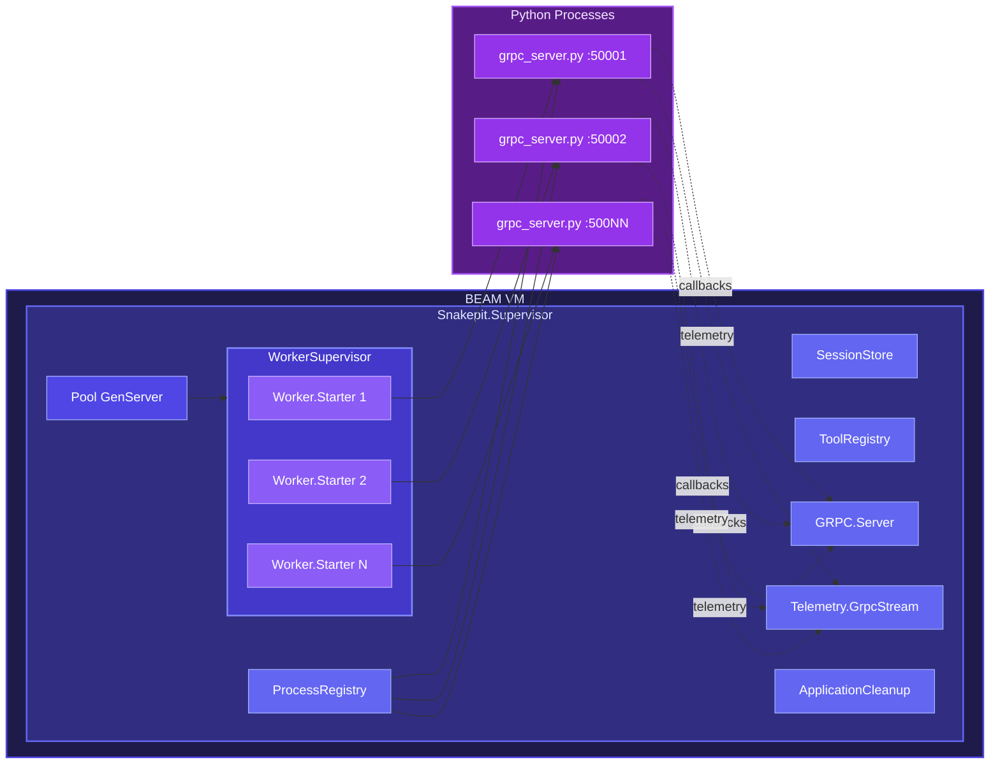

## Supervision Tree

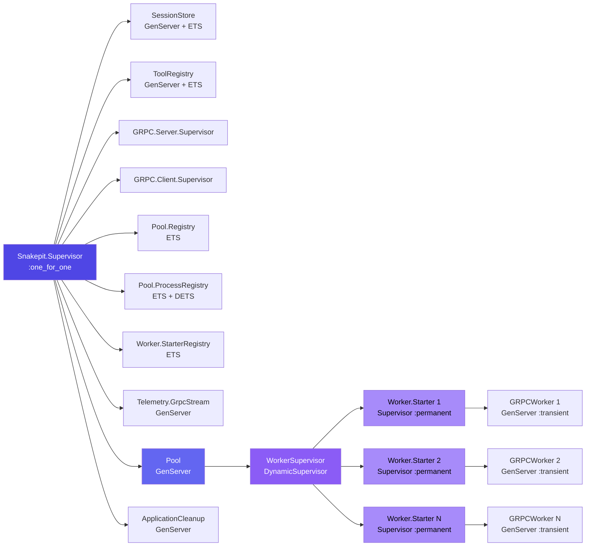

## Request Flow

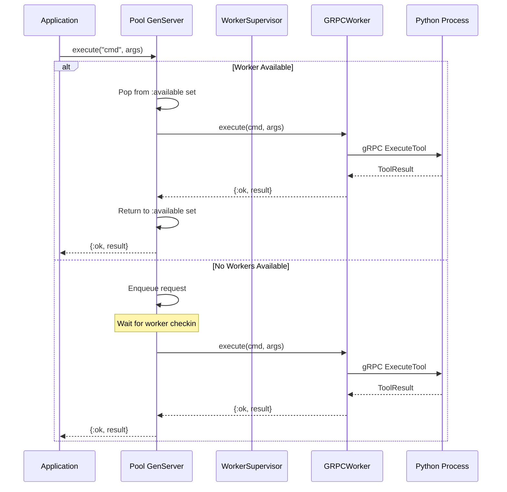

## Worker Startup Sequence

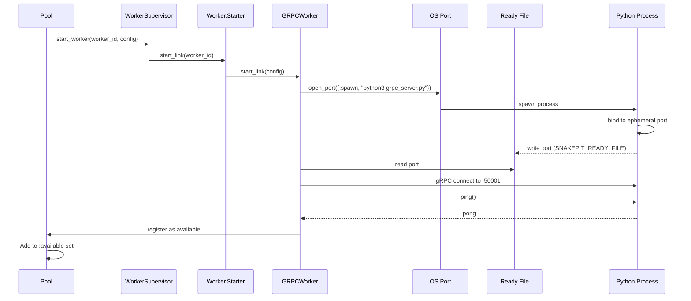

## Session Affinity Flow

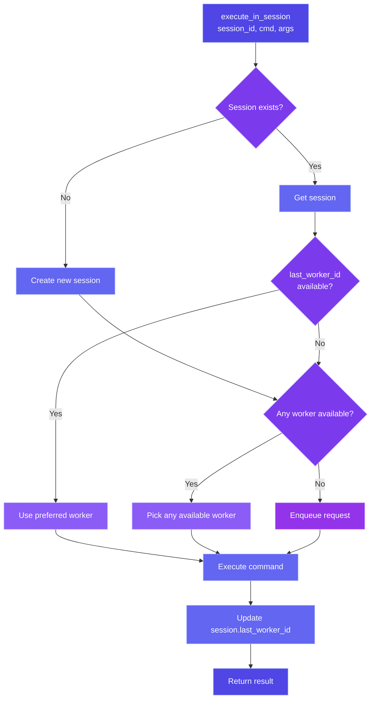

## Streaming Flow

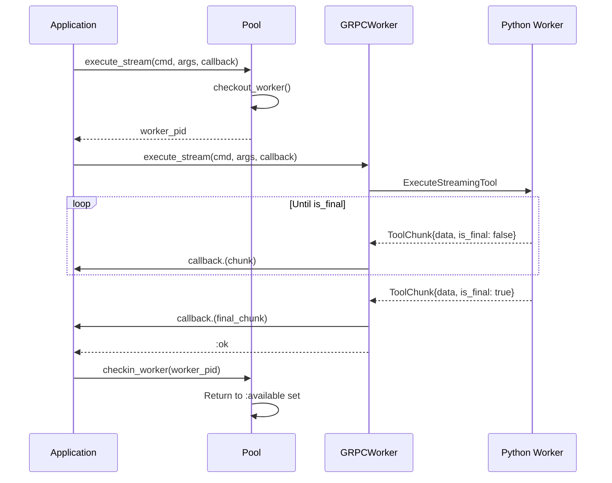

## Telemetry Event Flow

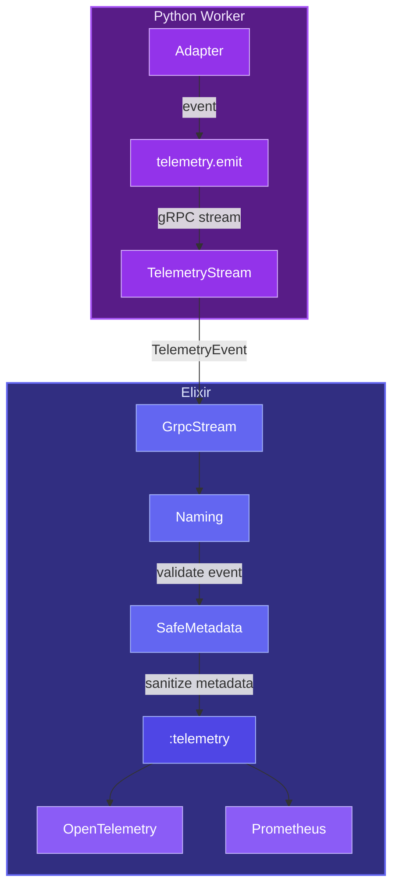

## Worker Profiles

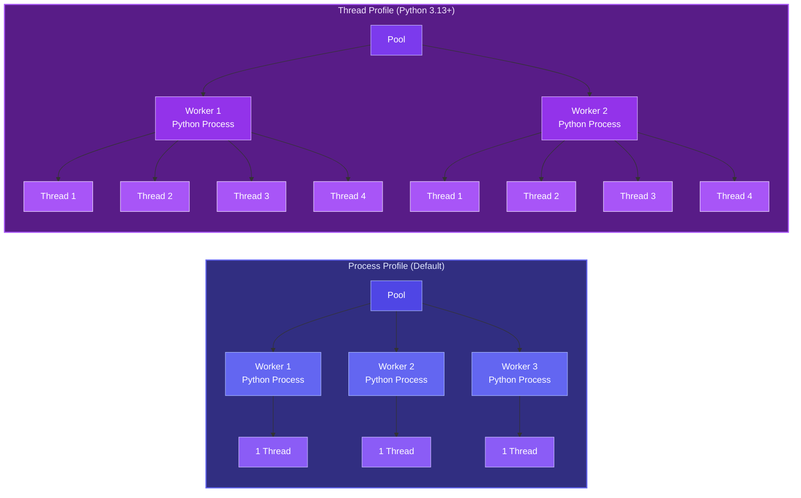

## Heartbeat Monitoring

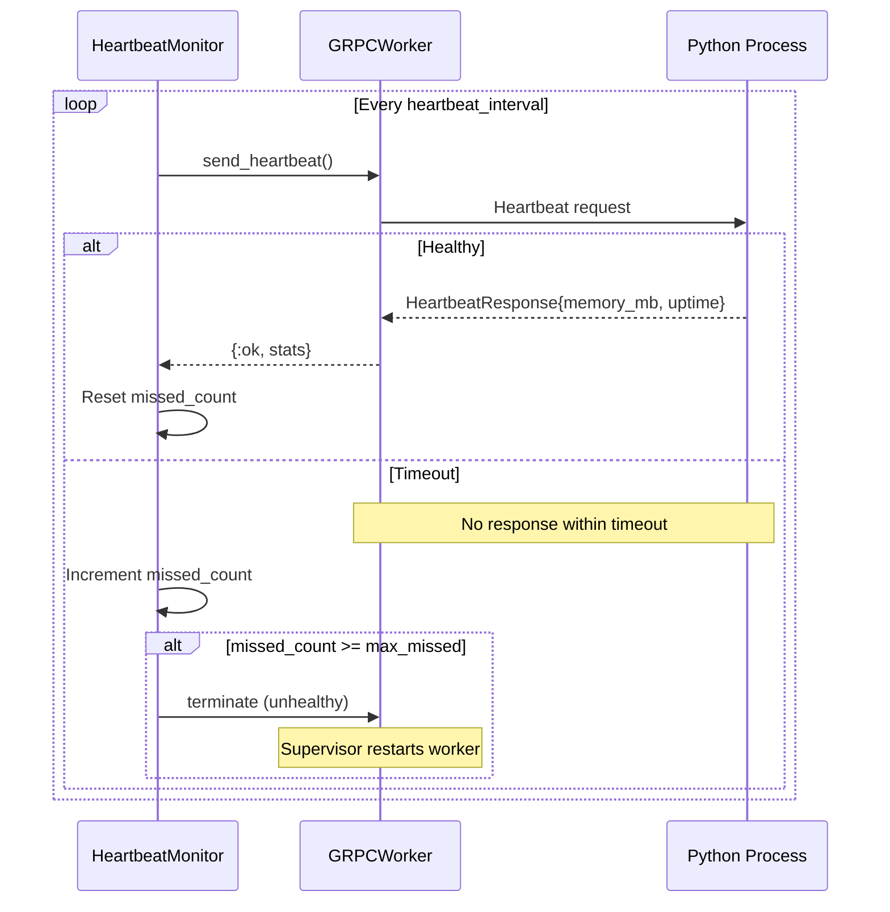

## Graceful Shutdown

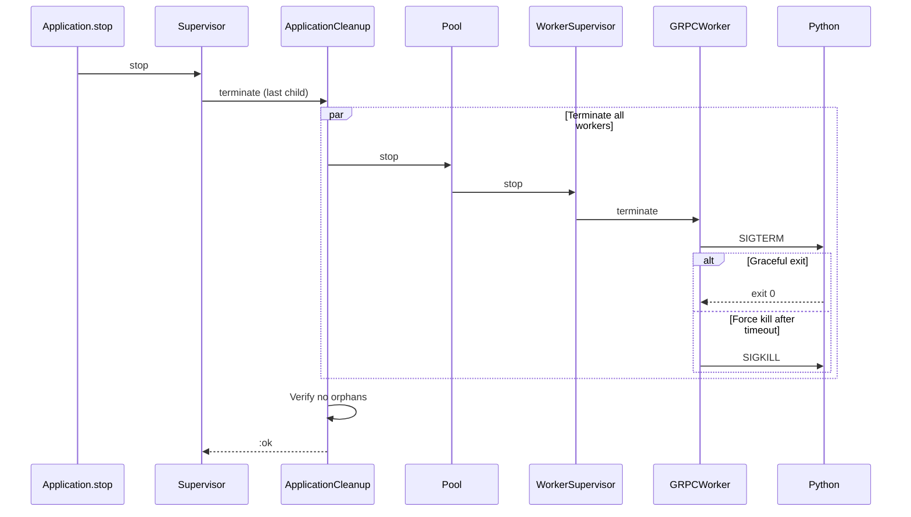

## Error Recovery

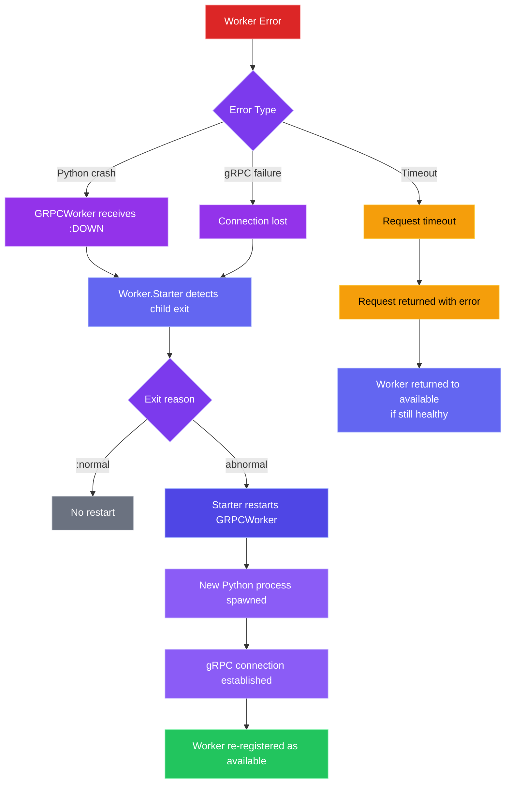

## Configuration Merge

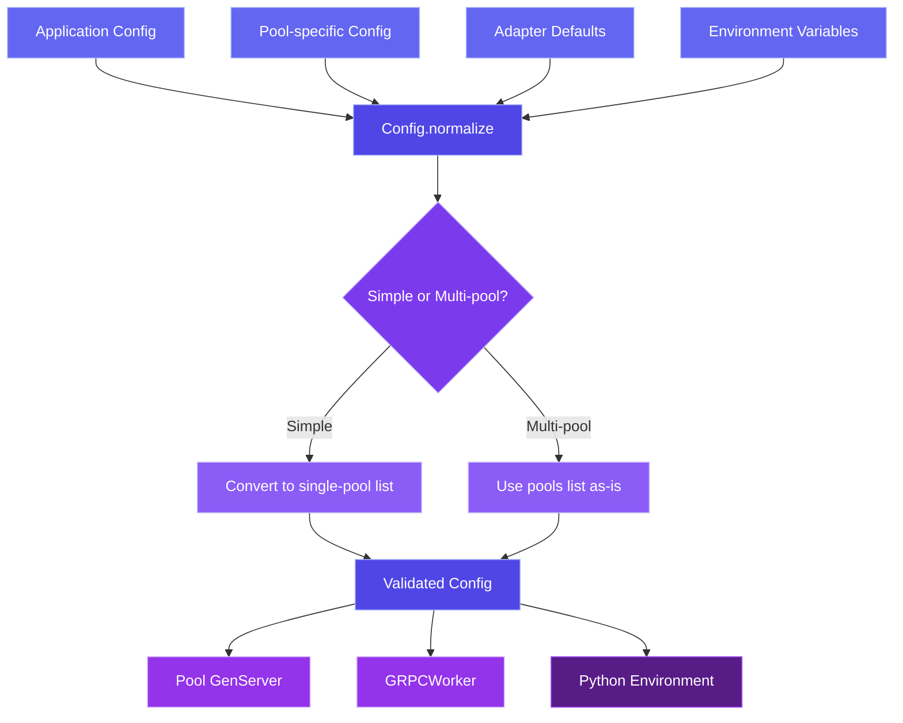

**Note**: Simple format (`pool_size: N, adapter_module: X`) is auto-converted to multi-pool format for internal use. Both formats are fully supported.

## Component Summary

| Component | Type | Purpose |
|-----------|------|---------|
| Snakepit.Supervisor | Supervisor | Top-level OTP supervision |
| Pool | GenServer | Request distribution, worker tracking |
| WorkerSupervisor | DynamicSupervisor | Dynamic worker management |
| Worker.Starter | Supervisor | Per-worker crash isolation |
| GRPCWorker | GenServer | Python process + gRPC connection |
| SessionStore | GenServer + ETS | Session management with TTL |
| ToolRegistry | GenServer + ETS | Bidirectional tool registration |
| ProcessRegistry | GenServer + ETS/DETS | External PID tracking |
| Telemetry.GrpcStream | GenServer | Python telemetry folding |
| ApplicationCleanup | GenServer | Shutdown guarantees |
