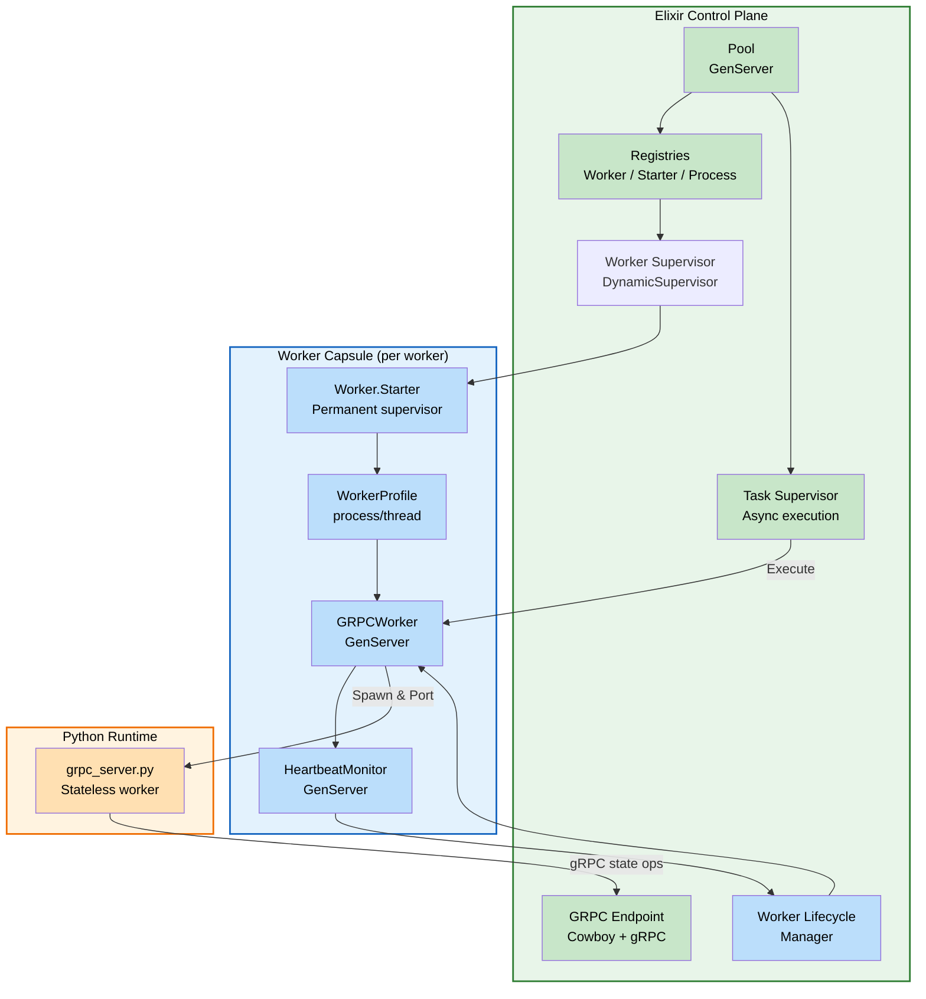
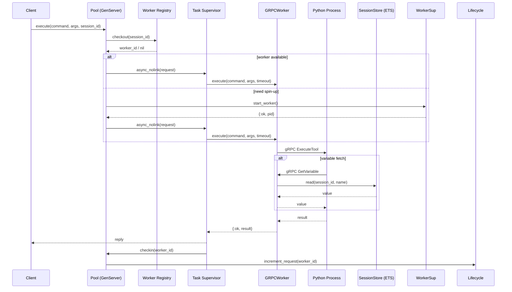
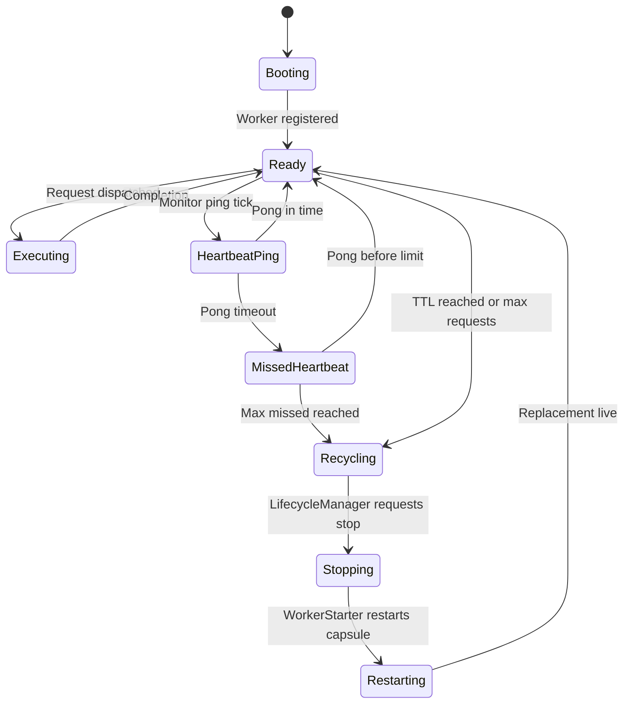

# Snakepit Performance Architecture Diagrams (v0.6.0)  

High-performance behaviour in Snakepit is anchored in constant-time routing, concurrent worker startup, and proactive health management. The diagrams below highlight the control-plane mechanics that keep latency low while tolerating heavy churn in external Python processes.

## Key Performance Features

- Dual worker profiles (process or thread) surfaced through the same pool API
- Non-blocking pool backed by `Task.Supervisor.async_nolink/2`
- ETS-backed registries with O(1) worker lookup and session affinity
- Heartbeat-driven failure detection feeding back into OTP supervision
- Lifecycle-driven recycling to cap memory growth and tail latency

---

## 1. Control Plane & Worker Capsule (performance focus)

**Highlights**
- Worker capsules contain all per-worker processes, so supervisor restarts are local.
- LifecycleManager tracks request budgets and TTLs to trigger proactive replacement without blocking the pool.
- HeartbeatMonitor feeds latency and timeout metrics back to LifecycleManager, enabling fast detection of wedged workers.
- OpenTelemetry spans/metrics originate in the Pool + Worker capsule layers; enable them via `config :snakepit, opentelemetry: %{enabled: true}` (Elixir) and the Python requirements listed in `priv/python/requirements.txt` for cross-language correlation.

---

## 2. Request Flow Sequence (with session affinity)

**Observations**
- Pool is never blocked by work execution; it immediately returns after scheduling via the Task Supervisor.
- Registry lookups and ETS-backed session reads stay O(1), keeping queue times predictable even with 100+ workers.
- LifecycleManager is notified about completed requests so TTL/request budgets stay accurate.

---

## 3. Health, Recycling, and Restart Loop

**Notes**
- Heartbeat failures and lifecycle thresholds converge on the same recycling path, ensuring consistent restart semantics.
- When Recycling triggers, `Snakepit.ProcessKiller` cleans up OS processes before the supervisor brings the capsule back online.
- Restart intensity is governed by `WorkerSupervisor` limits, keeping cluster stability under heavy churn.
