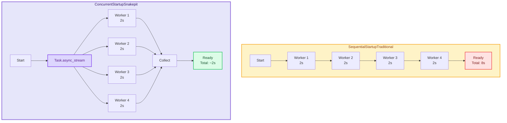

## 1. Overall System Architecture - High Performance Overview

```mermaid
graph LR
    ElixirOTPLayer["Elixir OTP Layer"]
    subgraph ElixirOTPLayer
        Client["Client API"]
        Pool["Pool Manager<br/>⚡ Non-blocking async"]
        TaskSup["Task Supervisor<br/>⚡ Isolated execution"]
        
        WorkerManagement["Worker Management"]
        subgraph WorkerManagement
            WorkerSup["Worker Supervisor<br/>⚡ Dynamic workers"]
            Starter1["Worker Starter 1<br/>🔄 Auto-restart"]
            Starter2["Worker Starter 2<br/>🔄 Auto-restart"]
            StarterN["Worker Starter N<br/>🔄 Auto-restart"]
            Worker1["Worker 1<br/>GenServer"]
            Worker2["Worker 2<br/>GenServer"]
            WorkerN["Worker N<br/>GenServer"]
        end
        
        HighPerformanceRegistries["High Performance Registries"]
        subgraph HighPerformanceRegistries
            Registry["Worker Registry<br/>⚡ O(1) lookups"]
            ProcReg["Process Registry<br/>⚡ PID tracking"]
            StarterReg["Starter Registry<br/>⚡ Supervisor tracking"]
        end
        
        SessionStoreETS["Session Store ETS"]
        subgraph SessionStoreETS
            SessionStore["Session Store<br/>⚡ Concurrent R/W<br/>📊 Decentralized counters"]
            GlobalPrograms["Global Programs<br/>⚡ Public table access"]
        end
    end
    
    ExternalProcesses["External Processes"]
    subgraph ExternalProcesses
        Python1["Python Process 1<br/>🐍 Port communication"]
        Python2["Python Process 2<br/>🐍 Port communication"]
        PythonN["Python Process N<br/>🐍 Port communication"]
    end
    
    Client -->|"⚡ Async call"| Pool
    Pool -->|"⚡ O(1) checkout"| Registry
    Pool -->|"🎯 Session affinity"| SessionStore
    Pool -->|"⚡ Task.async_nolink"| TaskSup
    TaskSup -->|Execute| Worker1
    TaskSup -->|Execute| Worker2
    TaskSup -->|Execute| WorkerN
    
    WorkerSup -->|Supervise| Starter1
    WorkerSup -->|Supervise| Starter2
    WorkerSup -->|Supervise| StarterN
    
    Starter1 -->|Auto-restart| Worker1
    Starter2 -->|Auto-restart| Worker2
    StarterN -->|Auto-restart| WorkerN
    
    Worker1 -->|Binary protocol<br/>4-byte frames| Python1
    Worker2 -->|Binary protocol<br/>4-byte frames| Python2
    WorkerN -->|Binary protocol<br/>4-byte frames| PythonN
    
    Worker1 -->|Register| Registry
    Worker2 -->|Register| Registry
    WorkerN -->|Register| Registry
    
    Worker1 -->|Track PID| ProcReg
    Worker2 -->|Track PID| ProcReg
    WorkerN -->|Track PID| ProcReg
    
    style ElixirOTPLayer fill:#e6e6fa,stroke:#9370db,stroke-width:3px,color:#2e1065
    style WorkerManagement fill:#f3e8ff,stroke:#a855f7,stroke-width:2px,color:#581c87
    style HighPerformanceRegistries fill:#f3e8ff,stroke:#a855f7,stroke-width:2px,color:#581c87
    style SessionStoreETS fill:#f3e8ff,stroke:#a855f7,stroke-width:2px,color:#581c87
    style ExternalProcesses fill:#f0f9ff,stroke:#0ea5e9,stroke-width:2px,color:#0c4a6e
    style Pool fill:#ddd6fe,stroke:#7c3aed,stroke-width:2px,color:#581c87
    style SessionStore fill:#ddd6fe,stroke:#7c3aed,stroke-width:2px,color:#581c87
    style Registry fill:#ddd6fe,stroke:#7c3aed,stroke-width:2px,color:#581c87
    style TaskSup fill:#ddd6fe,stroke:#7c3aed,stroke-width:2px,color:#581c87
```

## 2. Request Flow - Performance Critical Path

```mermaid
sequenceDiagram
    participant C as Client
    participant P as Pool<br/>⚡ Non-blocking
    participant TS as TaskSupervisor<br/>⚡ Isolated
    participant R as Registry<br/>⚡ O(1)
    participant S as SessionStore<br/>⚡ ETS
    participant W as Worker
    participant E as External Process
    
    C->>P: execute(command, args)
    
    alt Session-based request
        P->>S: get_preferred_worker<br/>⚡ O(1) ETS lookup
        S-->>P: worker_id or nil
    end
    
    P->>R: checkout_worker<br/>⚡ O(1) via Registry
    R-->>P: worker_id
    
    P->>TS: Task.async_nolink<br/>⚡ Non-blocking
    Note over P: Pool returns immediately<br/>to handle next request
    
    TS->>W: GenServer.call
    W->>E: Port.command<br/>⚡ Binary protocol
    E-->>W: Response<br/>⚡ 4-byte framed
    W-->>TS: Result
    TS-->>C: GenServer.reply<br/>⚡ Direct to client
    
    TS->>P: checkin_worker<br/>⚡ Cast (async)
    
    alt Queued requests exist
        P->>P: Process next<br/>from queue
    else No queued requests
        P->>R: Mark available<br/>⚡ O(1) update
    end
```

## 3. ETS Tables Architecture - High Performance Storage

```mermaid
graph LR
    SessionStoreETSTables["Session Store ETS Tables"]
    subgraph SessionStoreETSTables
        SessionsTable["Sessions Table"]
        subgraph SessionsTable
            ST[":snakepit_sessions<br/>⚡ read_concurrency: true<br/>⚡ write_concurrency: true<br/>⚡ decentralized_counters: true"]
            
            S1["Key: session_1<br/>Value: {last_accessed, ttl, session_data}"]
            S2["Key: session_2<br/>Value: {last_accessed, ttl, session_data}"]
            SN["Key: session_N<br/>Value: {last_accessed, ttl, session_data}"]
        end
        
        GlobalProgramsTable["Global Programs Table"]
        subgraph GlobalProgramsTable
            GP[":snakepit_sessions_global_programs<br/>⚡ Same optimizations"]
            
            P1["Key: program_1<br/>Value: {data, timestamp}"]
            P2["Key: program_2<br/>Value: {data, timestamp}"]
            PN["Key: program_N<br/>Value: {data, timestamp}"]
        end
    end
    
    OptimizedOperations["Optimized Operations"]
    subgraph OptimizedOperations
        Read["⚡ Concurrent reads<br/>No locking"]
        Write["⚡ Concurrent writes<br/>Decentralized counters"]
        Cleanup["⚡ select_delete<br/>Atomic batch cleanup"]
    end
    
    ST --> S1
    ST --> S2
    ST --> SN
    
    GP --> P1
    GP --> P2
    GP --> PN
    
    Read --> ST
    Read --> GP
    Write --> ST
    Write --> GP
    Cleanup --> ST
    Cleanup --> GP
    
    style SessionStoreETSTables fill:#e6e6fa,stroke:#9370db,stroke-width:3px,color:#2e1065
    style SessionsTable fill:#f3e8ff,stroke:#a855f7,stroke-width:2px,color:#581c87
    style GlobalProgramsTable fill:#f3e8ff,stroke:#a855f7,stroke-width:2px,color:#581c87
    style OptimizedOperations fill:#f3e8ff,stroke:#a855f7,stroke-width:2px,color:#581c87
    style ST fill:#ddd6fe,stroke:#7c3aed,stroke-width:2px,color:#581c87
    style GP fill:#ddd6fe,stroke:#7c3aed,stroke-width:2px,color:#581c87
    style Read fill:#ddd6fe,stroke:#7c3aed,stroke-width:2px,color:#581c87
    style Write fill:#ddd6fe,stroke:#7c3aed,stroke-width:2px,color:#581c87
    style Cleanup fill:#ddd6fe,stroke:#7c3aed,stroke-width:2px,color:#581c87
```

## 4. Worker Lifecycle - Performance & Reliability

```mermaid
stateDiagram-v2
    [*] --> Starting: Pool requests worker
    
    Starting --> Initializing: Port opened<br/>⚡ Parallel startup
    
    Initializing --> Ready: Init ping OK<br/>📊 Telemetry emitted
    Initializing --> Failed: Timeout/Error
    
    Ready --> Busy: Request received<br/>⚡ O(1) checkout
    Busy --> Ready: Response sent<br/>⚡ O(1) checkin
    
    Ready --> HealthCheck: Periodic check<br/>⏱️ Every 30s
    HealthCheck --> Ready: Healthy
    HealthCheck --> Unhealthy: Failed
    
    Unhealthy --> Restarting: Supervisor detects
    Failed --> Restarting: Auto-restart
    
    Restarting --> Starting: ♻️ Via Starter
    
    Ready --> Terminating: Shutdown signal
    Busy --> Terminating: Graceful shutdown
    
    Terminating --> [*]: Process cleaned up
    
    note right of Ready
        ⚡ Worker pool maintains
        hot workers ready for
        immediate use
    end note
    
    note right of Busy
        ⚡ Non-blocking async
        execution via Task
        Supervisor
    end note
```

## 5. Concurrent Initialization Performance

## 6. Request Queueing & Load Distribution

```mermaid
graph LR
    HighPerformanceRequestHandling["High Performance Request Handling"]
    subgraph HighPerformanceRequestHandling
        RequestQueue["Request Queue"]
        subgraph RequestQueue
            Q[":queue (Erlang)<br/>⚡ FIFO<br/>⚡ O(1) operations"]
            R1["Request 1"]
            R2["Request 2"]
            R3["Request 3"]
            RN["Request N"]
        end
        
        WorkerPoolState["Worker Pool State"]
        subgraph WorkerPoolState
            Available["MapSet<br/>⚡ O(1) member check<br/>⚡ O(1) add/remove"]
            Busy["Map<br/>⚡ O(1) lookup"]
            
            AW1["Worker 1"]
            AW2["Worker 2"]
            BW3["Worker 3 🔴"]
            BW4["Worker 4 🔴"]
        end
        
        LoadDistribution["Load Distribution"]
        subgraph LoadDistribution
            Check{"Worker<br/>Available?"}
            Assign["Assign to worker<br/>⚡ O(1)"]
            Queue["Queue request<br/>⚡ O(1)"]
            Dequeue["Process from queue<br/>⚡ O(1)"]
        end
    end
    
    R1 --> Check
    R2 --> Check
    R3 --> Check
    RN --> Check
    
    Check -->|Yes| Assign
    Check -->|No| Queue
    
    Queue --> Q
    Q --> Dequeue
    
    Assign --> Available
    Available --> AW1
    Available --> AW2
    
    Busy --> BW3
    Busy --> BW4
    
    Dequeue -->|Worker freed| Assign
    
    style HighPerformanceRequestHandling fill:#e6e6fa,stroke:#9370db,stroke-width:3px,color:#2e1065
    style RequestQueue fill:#f3e8ff,stroke:#a855f7,stroke-width:2px,color:#581c87
    style WorkerPoolState fill:#f3e8ff,stroke:#a855f7,stroke-width:2px,color:#581c87
    style LoadDistribution fill:#f3e8ff,stroke:#a855f7,stroke-width:2px,color:#581c87
    style Q fill:#ddd6fe,stroke:#7c3aed,stroke-width:2px,color:#581c87
    style Available fill:#ddd6fe,stroke:#7c3aed,stroke-width:2px,color:#581c87
    style Check fill:#ddd6fe,stroke:#7c3aed,stroke-width:2px,color:#581c87
```

## 7. Process Registry - O(1) Performance

```mermaid
graph LR
    RegistryArchitecture["Registry Architecture"]
    subgraph RegistryArchitecture
        WorkerRegistry["Worker Registry"]
        subgraph WorkerRegistry
            WR["Elixir Registry<br/>⚡ :unique keys<br/>⚡ O(1) operations"]
            WK1["worker_1 → PID1"]
            WK2["worker_2 → PID2"]
            WKN["worker_N → PIDN"]
        end
        
        ProcessRegistryETS["Process Registry ETS"]
        subgraph ProcessRegistryETS
            PR["Process Registry<br/>⚡ :protected table<br/>⚡ read_concurrency"]
            PK1["worker_1 → {pid, os_pid, fingerprint}"]
            PK2["worker_2 → {pid, os_pid, fingerprint}"]
            PKN["worker_N → {pid, os_pid, fingerprint}"]
        end
        
        StarterRegistry["Starter Registry"]
        subgraph StarterRegistry
            SR["Starter Registry<br/>⚡ Supervisor tracking"]
            SK1["worker_1 → Starter PID1"]
            SK2["worker_2 → Starter PID2"]
            SKN["worker_N → Starter PIDN"]
        end
    end
    
    O1Operations["O(1) Operations"]
    subgraph O1Operations
        Op1["via_tuple lookup<br/>⚡ Direct to worker"]
        Op2["Reverse lookup<br/>⚡ PID to worker_id"]
        Op3["OS PID tracking<br/>⚡ Cleanup guarantee"]
    end
    
    WR --> WK1
    WR --> WK2
    WR --> WKN
    
    PR --> PK1
    PR --> PK2
    PR --> PKN
    
    SR --> SK1
    SR --> SK2
    SR --> SKN
    
    Op1 --> WR
    Op2 --> WR
    Op3 --> PR
    
    style RegistryArchitecture fill:#e6e6fa,stroke:#9370db,stroke-width:3px,color:#2e1065
    style WorkerRegistry fill:#f3e8ff,stroke:#a855f7,stroke-width:2px,color:#581c87
    style ProcessRegistryETS fill:#f3e8ff,stroke:#a855f7,stroke-width:2px,color:#581c87
    style StarterRegistry fill:#f3e8ff,stroke:#a855f7,stroke-width:2px,color:#581c87
    style O1Operations fill:#f3e8ff,stroke:#a855f7,stroke-width:2px,color:#581c87
    style WR fill:#ddd6fe,stroke:#7c3aed,stroke-width:2px,color:#581c87
    style PR fill:#ddd6fe,stroke:#7c3aed,stroke-width:2px,color:#581c87
    style SR fill:#ddd6fe,stroke:#7c3aed,stroke-width:2px,color:#581c87
```

