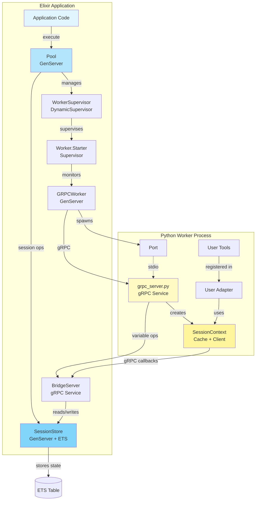
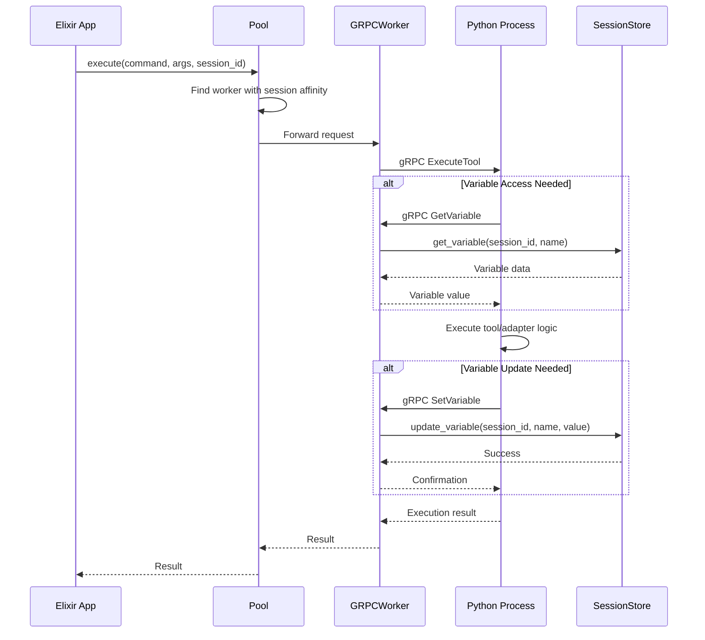
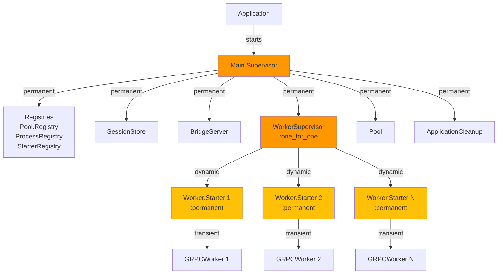
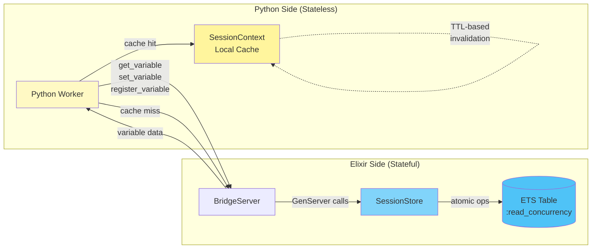
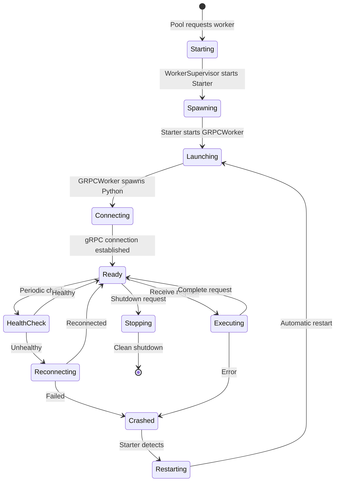
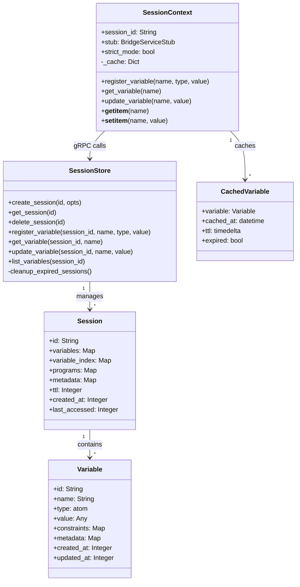
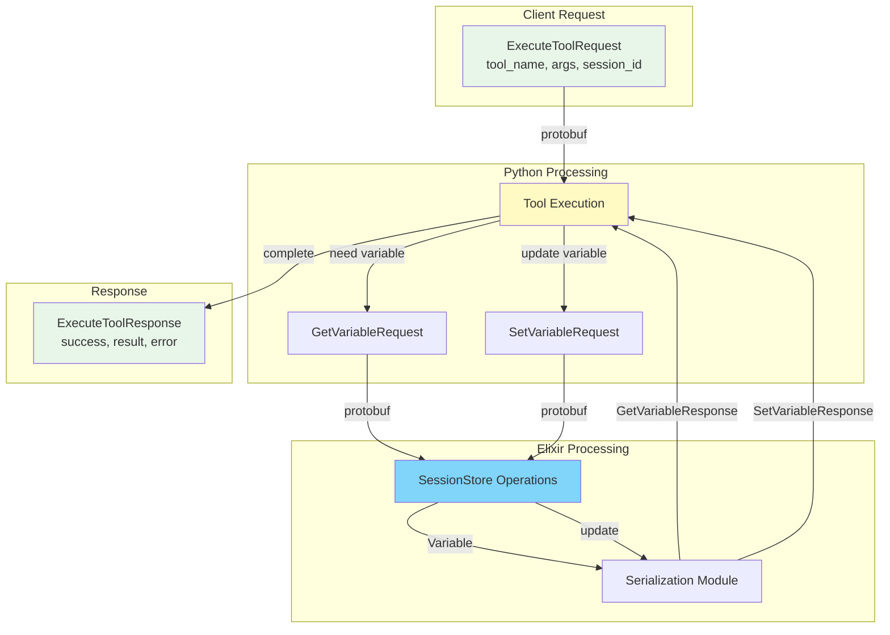
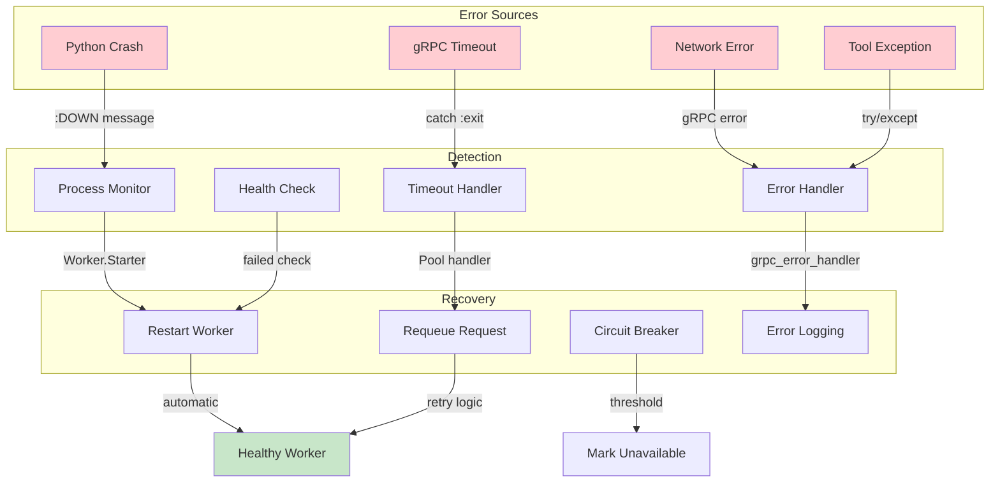

# Snakepit Architecture Diagrams

## 1. High-Level System Architecture

## 2. Request Flow Sequence

## 3. Supervision Tree

## 4. State Management Flow

## 5. Worker Lifecycle

## 6. Variable System Architecture

## 7. Protocol Message Flow

## 8. Error Handling & Recovery

## Usage Notes

These diagrams illustrate:

1. **System Architecture**: The overall structure and component relationships
2. **Request Flow**: How a request moves through the system
3. **Supervision Tree**: OTP supervision hierarchy for fault tolerance
4. **State Management**: How state is centralized in Elixir
5. **Worker Lifecycle**: States a worker goes through
6. **Variable System**: Class structure for variable management
7. **Protocol Flow**: How gRPC messages flow between components
8. **Error Handling**: How errors are detected and recovered from

To render these diagrams, use any tool that supports Mermaid syntax, such as:
- GitHub/GitLab (renders automatically in markdown)
- Mermaid Live Editor (https://mermaid.live)
- VS Code with Mermaid extension
- Many documentation tools (MkDocs, Docusaurus, etc.)