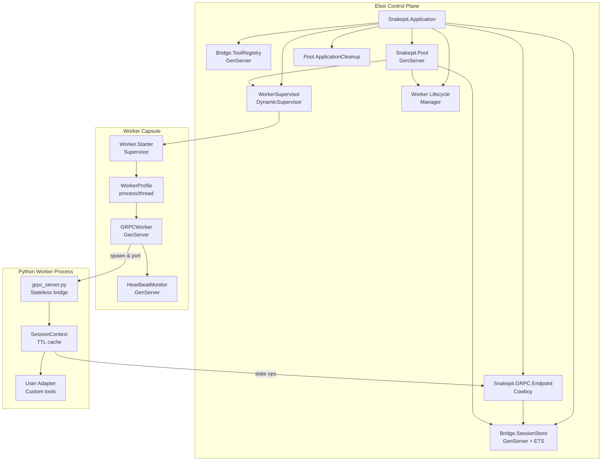
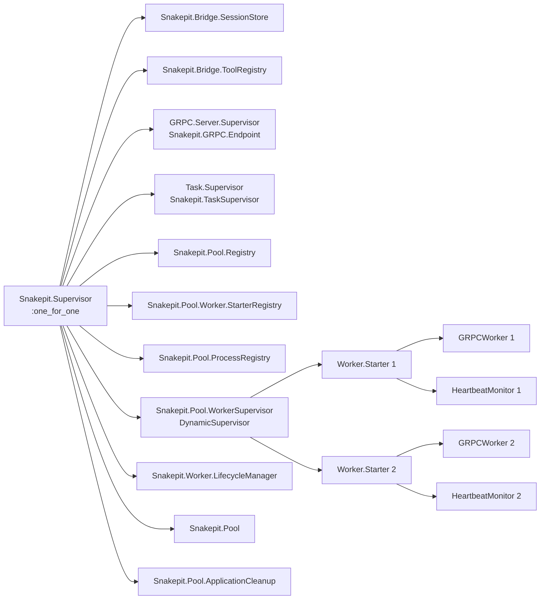
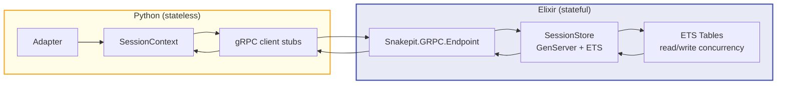
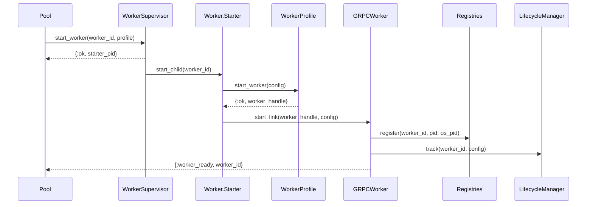
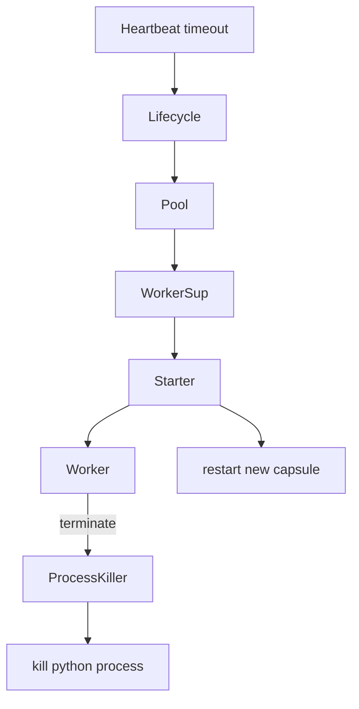

# Snakepit Architecture Diagrams (v0.6.0)  

These diagrams complement the performance view by focusing on system boundaries, supervision, state flow, and recovery paths after the worker profile and heartbeat upgrades.

## 1. High-Level System Overview

**Takeaways**
- Python stays stateless; all persistent data lives in the SessionStore.
- Worker capsules isolate failures so restart intensity is contained to the affected worker.
- LifecycleManager bridges runtime metrics (requests, TTLs) with supervision without blocking the hot path.

---

## 2. Supervision Tree (runtime)

**Notes**
- `Snakepit.Pool.ApplicationCleanup` is intentionally last so it terminates first, guaranteeing external processes are reaped.
- Heartbeat monitors live directly under each WorkerStarter, keeping restarts local.
- Base services (SessionStore, ToolRegistry) stay up even when pooling is disabled for tests.

---

## 3. State Management and Session Flow

**Highlights**
- SessionContext caches reads with TTL to reduce round-trips but always writes through to Elixir.
- ETS tables use decentralized counters to avoid contention when thousands of requests per second hit the store.
- Cleanup routines (`select_delete`) are coordinated from the SessionStore GenServer to keep invariants intact.
- OTEL exporters span both halves of the architecture: set `config :snakepit, opentelemetry: %{enabled: true}` on the Elixir side and install the Python bridge requirements so cross-language traces/log correlation stays intact.

---

## 4. Worker Startup & Registration

**Implications**
- Worker profiles can encapsulate bespoke startup logic (process vs. thread) without leaking details to the pool.
- Lifecycle tracking begins immediately, ensuring TTL enforcement even for never-used workers.
- Registries receive both BEAM pid and OS pid, enabling deterministic cleanup on crash.

---

## 5. Failure Handling & Cleanup

**Summary**
- Heartbeat or lifecycle signals prompt the pool to remove the worker from routing and ask the supervisor for a fresh capsule.
- `Snakepit.ProcessKiller` issues POSIX signals (TERM then KILL) so zombie Python processes do not survive restarts.
- Once cleanup finishes, the WorkerSupervisor starts a replacement and the pool re-registers it, restoring capacity.
