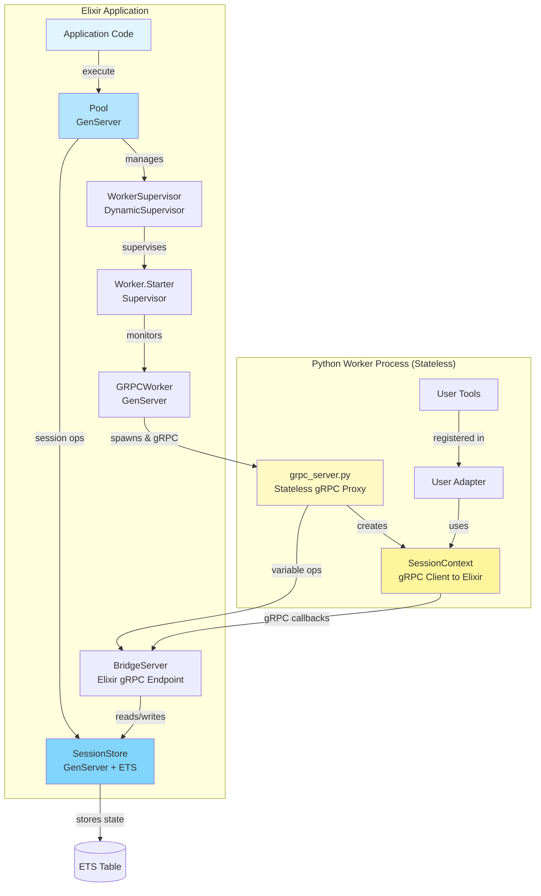
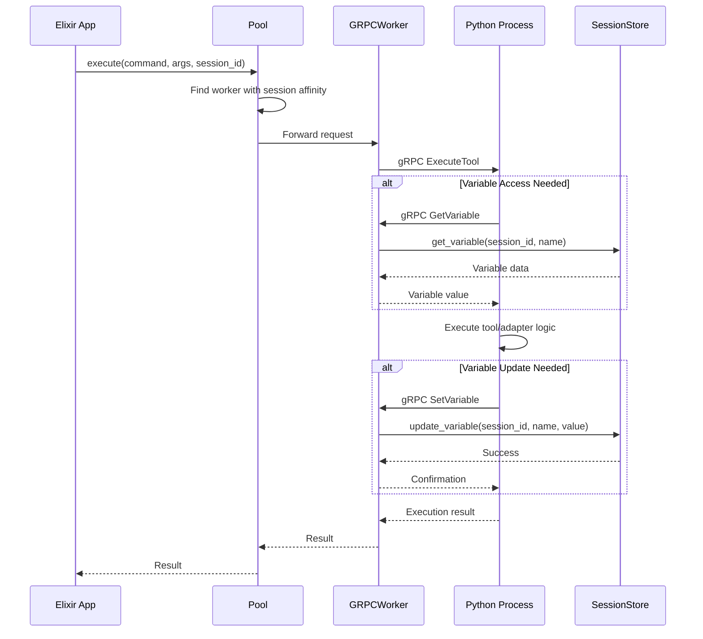
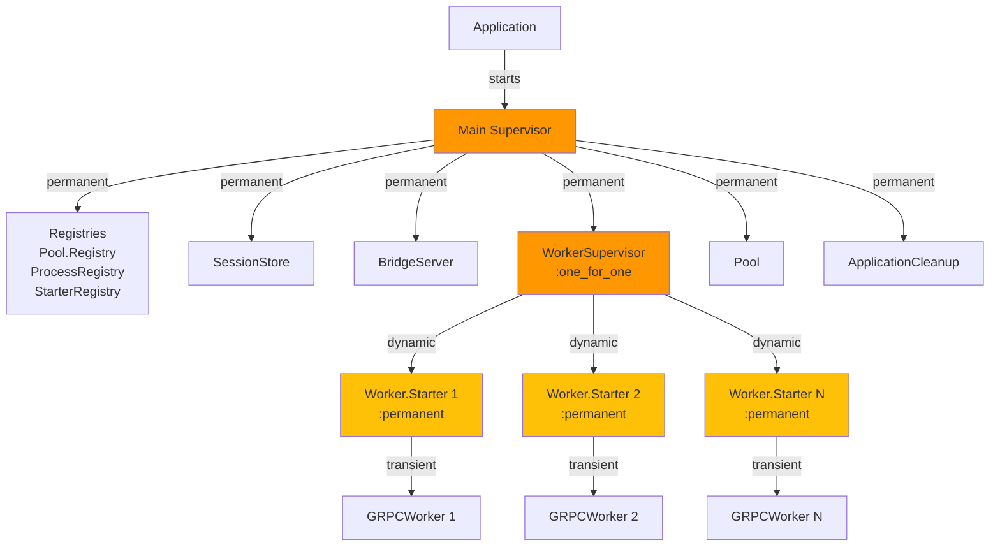
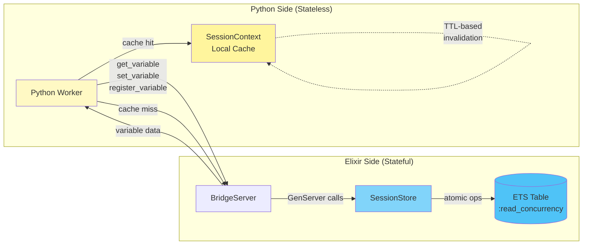
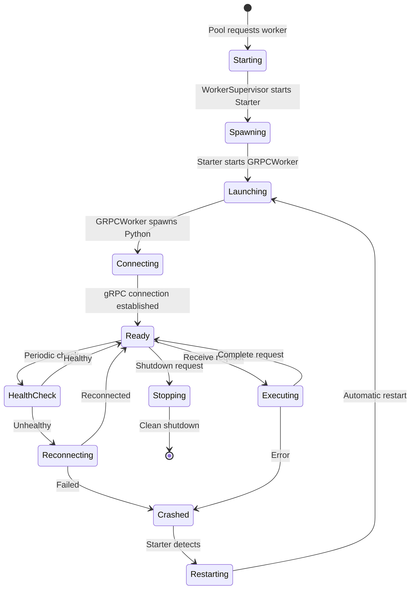
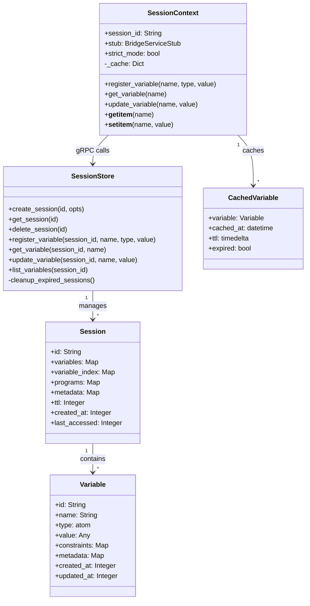
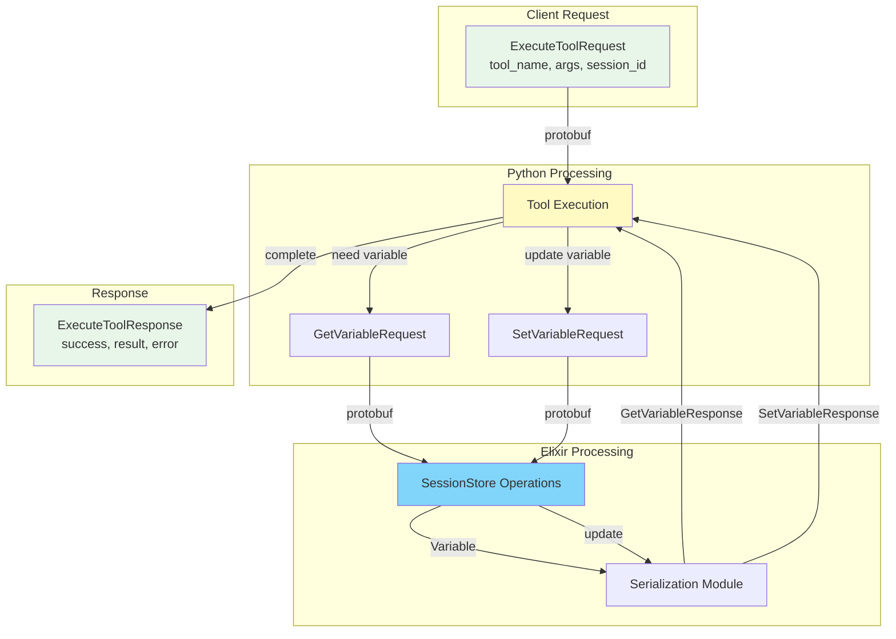
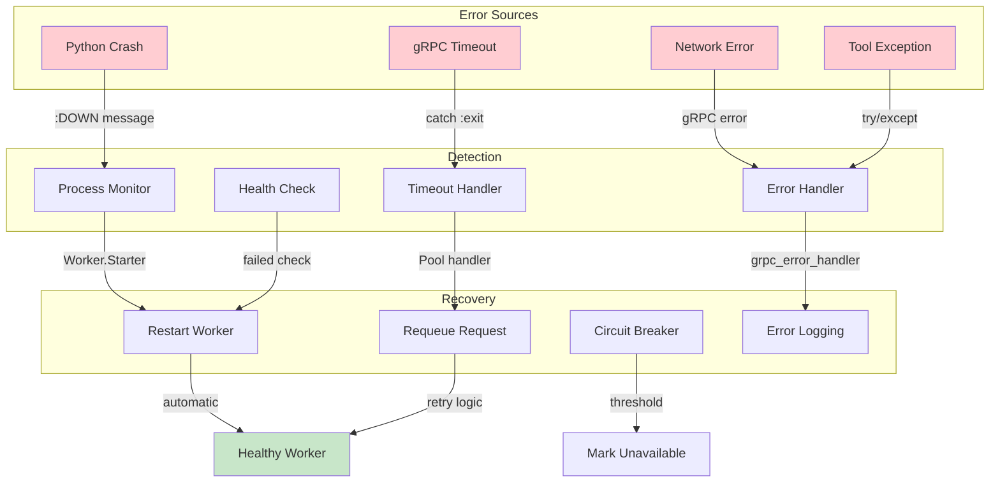

# Snakepit Architecture Diagrams (v0.4.0+)

This document provides comprehensive Mermaid diagrams that illustrate Snakepit's system architecture, focusing on component relationships, data flow, and operational patterns. These diagrams complement the performance-focused diagrams in DIAGS.md by showing the complete system design.

## Diagram Overview

1. **High-Level System Architecture** - Component relationships and communication patterns
2. **Request Flow Sequence** - Step-by-step execution flow with session and variable management
3. **Supervision Tree** - OTP supervision hierarchy for fault tolerance
4. **State Management Flow** - How state is centralized in Elixir while Python workers remain stateless  
5. **Worker Lifecycle** - State transitions during worker lifetime
6. **Variable System Architecture** - Class structure for type-safe variable management
7. **Protocol Message Flow** - gRPC message flow between components
8. **Error Handling & Recovery** - How errors are detected and recovered from

These diagrams are essential for understanding how Snakepit achieves its design goals of high performance, fault tolerance, and clean separation of concerns.

## 1. High-Level System Architecture

This diagram shows the overall system components and their relationships. Key insights:
- **Python workers are completely stateless** - `grpc_server.py` acts as a pure proxy, forwarding all state operations (variables, sessions, programs) to the Elixir SessionStore
- **All state management happens in Elixir SessionStore** with ETS backing, enabling easy scaling and crash recovery
- **BridgeServer** is the Elixir gRPC endpoint (`Snakepit.GRPC.Endpoint`) that Python workers connect to for state operations

## 2. Request Flow Sequence

This sequence shows how variable access patterns work. Key points:
- **Python workers are stateless proxies** - All GetVariable/SetVariable calls are forwarded to Elixir's SessionStore
- **SessionContext** in Python (`session_context.py`) is a lightweight gRPC client that calls back to Elixir
- **No local state** is maintained in Python between requests, enabling crash recovery and horizontal scaling

## 3. Supervision Tree

The supervision tree implements the "Permanent Wrapper" pattern where Worker.Starters supervise individual workers. This decouples the Pool from worker restart logic and provides automatic recovery.

## 4. State Management Flow

This diagram illustrates the key architectural principle: **stateless Python workers with centralized Elixir state**.

Implementation details:
- **Python side**: `priv/python/grpc_server.py` (stateless proxy) and `session_context.py` (gRPC client)
- **Elixir side**: `Snakepit.Bridge.SessionStore` (GenServer + ETS) and `Snakepit.GRPC.BridgeServer` (gRPC endpoint)
- **SessionContext cache** is request-scoped only - no persistent state between requests
- All state operations (get_variable, set_variable, register_variable) proxy to Elixir via gRPC

## 5. Worker Lifecycle

The worker lifecycle emphasizes fault tolerance and automatic recovery. Workers transition through well-defined states with automatic restart via the supervision tree when failures occur.

## 6. Variable System Architecture

The variable system class diagram shows the relationship between Elixir-side storage (SessionStore) and Python-side access (SessionContext).

Key architecture points:
- **SessionStore** (`lib/snakepit/bridge/session_store.ex`) - Manages all persistent state in ETS
- **SessionContext** (`priv/python/snakepit_bridge/session_context.py`) - Lightweight gRPC client for Python adapters
- **CachedVariable** in SessionContext is request-scoped only - no persistent cache between requests
- **Type-safe variable management** across language boundaries via protobuf serialization

## 7. Protocol Message Flow

This message flow diagram shows how gRPC protobuf messages flow through the system.

Implementation files:
- **Protocol definitions**: `priv/proto/snakepit_bridge.proto`
- **Python protobuf bindings**: `priv/python/snakepit_bridge_pb2.py` and `snakepit_bridge_pb2_grpc.py`
- **Elixir protobuf bindings**: `lib/snakepit/grpc/snakepit_bridge.pb.ex`
- **Elixir BridgeServer**: `lib/snakepit/grpc/bridge_server.ex`
- **Python grpc_server**: `priv/python/grpc_server.py` (stateless proxy)

The protocol handles both tool execution and variable management through a unified gRPC interface.

## 8. Error Handling & Recovery

The error handling diagram shows Snakepit's multi-layered approach to fault tolerance. Various detection mechanisms feed into recovery strategies, ensuring system resilience.

## Architecture Principles Illustrated

These diagrams demonstrate key architectural principles that make Snakepit production-ready:

1. **Stateless Workers**: Python processes hold no persistent state, enabling easy scaling
2. **Centralized State**: All session data managed in Elixir SessionStore with ETS backing
3. **Fault Tolerance**: Multi-level supervision with automatic recovery
4. **Performance**: Non-blocking operations and concurrent execution throughout
5. **Type Safety**: Structured variable system with validation and constraints
6. **Protocol Efficiency**: Modern gRPC with protobuf for reliable communication

## Rendering These Diagrams

To render these diagrams, use any tool that supports Mermaid syntax:
- **GitHub/GitLab**: Renders automatically in markdown
- **Mermaid Live Editor**: https://mermaid.live  
- **VS Code**: Install Mermaid extension
- **Documentation Tools**: MkDocs, Docusaurus, GitBook, etc.
- **ExDoc**: These diagrams are included in the generated documentation

The diagrams provide visual understanding of how Snakepit achieves its design goals of high performance, fault tolerance, and clean separation between Elixir orchestration and Python execution.