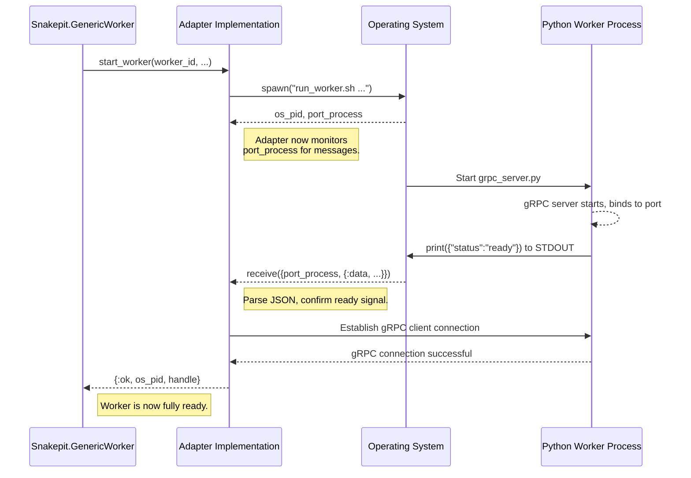

# Snakepit Adapter Behaviour Specification

- **Date**: 2025-07-30
- **Status**: Revised
- **Author**: Gemini Engineering Expert

## 1. Executive Summary

This document specifies the architecture and formal contract for the `Snakepit.Adapter` behaviour. This behaviour is the cornerstone of the entire DSPex ecosystem, providing the clean and robust abstraction layer that separates the generic **Infrastructure** (`snakepit`) from specific **Runtimes** (e.g., `dspex_runtime_py`).

The core principle is to establish a "perfect seam" that allows `snakepit` to be a pure, protocol-agnostic process management engine. It achieves this by delegating all runtime-specific logic—such as how to start, communicate with, and terminate a worker process—to a concrete adapter implementation. This design is fundamental to the platform's modularity, testability, and future extensibility.

## 2. Design Principles

The `Snakepit.Adapter` architecture is guided by the following principles:

- **Single Responsibility Principle (SRP):** `snakepit` has one responsibility: to manage the lifecycle of external OS processes. The adapter has one responsibility: to manage the communication with a *specific type* of external process.
- **Dependency Inversion Principle (DIP):** The high-level `snakepit` infrastructure does not depend on the low-level runtime details (Python, gRPC). Instead, both depend on an abstraction—the `Snakepit.Adapter` behaviour.
- **Protocol Agnosticism:** `snakepit` has zero knowledge of the communication protocol (gRPC, HTTP, STDIN/OUT) used by the worker processes. This logic is entirely encapsulated within the adapter.
- **Deterministic Synchronization:** The system must not rely on arbitrary timers (`Process.sleep`) for process coordination. All readiness checks must be based on explicit signals between processes.

## 3. The `Snakepit.Adapter` Behaviour Definition

The contract is defined by the callbacks specified in the `Snakepit.Adapter` module. Any module wishing to act as a runtime for `snakepit` must implement these callbacks.

```elixir
# apps/snakepit/lib/snakepit/adapter.ex

defmodule Snakepit.Adapter do
  @moduledoc """
  The behaviour (interface) for a Snakepit worker adapter.

  This contract defines the "perfect seam" between the generic `snakepit`
  infrastructure and a specific runtime implementation (like Python/gRPC).
  `snakepit` knows nothing about the implementation; it only calls the
  functions defined in this contract.
  """

  @typedoc "The opaque state managed by the adapter for a single worker."
  @type handle :: any()

  @typedoc "The opaque state managed by the adapter for the entire pool."
  @type adapter_state :: any()

  @doc """
  Called once when the pool starts.

  This function should be used to initialize any shared resources the adapter
  needs, such as starting an Elixir-side gRPC server for callbacks.
  """
  @callback init(config :: keyword()) :: {:ok, adapter_state} | {:error, any()}

  @doc """
  Starts one external worker process and returns a handle to it.

  This is the most critical hook in the system. The implementation MUST
  return the actual OS-level Process ID (PID) of the spawned worker.
  `snakepit` uses this OS PID to track the process and guarantee cleanup
  of orphaned processes, but it remains entirely ignorant of how the
  process was started.

  The returned `handle` is opaque to `snakepit` and is passed back to
  all other adapter callbacks for this specific worker.
  """
  @callback start_worker(worker_id :: term(), adapter_state :: adapter_state) ::
              {:ok, os_pid :: pid(), handle} | {:error, any()}

  @doc """
  Executes a command on a specific worker.

  `snakepit` calls this function to delegate a task to the worker. The adapter
  is responsible for serializing the command and arguments, sending them
  over the transport, and deserializing the response.
  """
  @callback execute(handle, command :: String.t(), args :: map()) ::
              {:ok, result :: any()} | {:error, any()}

  @doc """
  Called when a worker process is being shut down.

  This function should gracefully terminate the worker process and clean up
  any resources associated with the specific `handle`, such as closing
  network connections or ports.
  """
  @callback terminate(handle, reason :: term()) :: :ok
end
```

## 4. The Contract: Responsibilities of Each Party

### `snakepit` (The Engine) Promises To:

1.  **Manage Lifecycle:** Call `init/1` once at startup, `start_worker/2` for each worker, and `terminate/2` for each worker on shutdown.
2.  **Supervise:** Automatically restart a worker (by calling `start_worker/2` again) if its managing Elixir process crashes.
3.  **Track OS Processes:** Receive the `os_pid` from `start_worker/2` and register it in the `Snakepit.Pool.ProcessRegistry`.
4.  **Prevent Orphans:** On application startup, use the `ProcessRegistry` to find and forcefully terminate any processes from a previous, crashed VM run.

### The Adapter Implementation (The Runtime) Promises To:

1.  **Implement All Callbacks:** Provide a concrete implementation for every function in the `Snakepit.Adapter` behaviour.
2.  **Return the OS PID:** Correctly spawn an external process in `start_worker/2` and return its true OS-level PID. **This is a non-negotiable part of the contract.**
3.  **Implement Deterministic Startup:** The `start_worker/2` function must not return until the external process is fully initialized and ready to accept requests. This must be achieved via a signal (e.g., a message on STDOUT) from the worker process, not a timer.
4.  **Manage Communication:** Handle all protocol-specific logic (e.g., gRPC connection management, message serialization/deserialization) within its callbacks.
5.  **Manage Environment:** Handle all language-specific environmental concerns, such as pointing to the correct Python virtual environment (`venv`) and ensuring all dependencies are available.

## 5. Robust Synchronization and Environment Management

A production-grade system cannot rely on `Process.sleep`. The adapter must implement a robust, signal-based synchronization mechanism for worker startup.

### 5.1. The Signaling Protocol

The recommended approach is for the worker process to communicate its readiness over its standard output stream (`STDOUT`).

1.  **Worker-Side:** After the Python `grpc_server.py` script has successfully started its gRPC server and is listening on its port, it must print a single, machine-readable JSON line to `STDOUT`.
    ```json
    {"status": "ready", "port": 54321, "pid": 12345}
    ```
2.  **Adapter-Side:** The Elixir adapter, having started the worker via `Port.open`, will listen for this specific JSON message on the port. It will not consider the worker "started" until this message is received and parsed. This guarantees that any subsequent gRPC connection attempt will succeed.

### 5.2. Python Environment Management

The adapter is responsible for ensuring the Python worker runs in the correct environment with the correct dependencies. This is best achieved by creating a wrapper script.

**`priv/python/run_worker.sh`**
```bash
#!/bin/bash
# This script ensures the correct Python environment is activated.

# Exit immediately if a command exits with a non-zero status.
set -e

# Get the directory of the script
DIR="$( cd "$( dirname "${BASH_SOURCE[0]}" )" &> /dev/null && pwd )"

# Activate the virtual environment
source "$DIR/venv/bin/activate"

# Execute the actual Python gRPC server, passing all arguments
exec python "$DIR/grpc_server.py" "$@"
```

The Elixir adapter will then execute this shell script instead of `python` directly, ensuring the `venv` is always activated.

## 6. Worker Lifecycle Sequence Diagram (Revised)

This diagram illustrates the improved, signal-based flow of control.



## 7. Example Implementation (Revised)

This revised example demonstrates the robust startup sequence without `Process.sleep`.

```elixir
# apps/dspex_runtime_py/lib/adapter.ex

defmodule DSPex.Runtime.Py.Adapter do
  @behaviour Snakepit.Adapter

  # The handle now includes the Port for message passing.
  defstruct handle(grpc_channel: nil, port_process: nil)

  @impl Snakepit.Adapter
  def start_worker(_worker_id, _adapter_state) do
    # 1. Define the path to the wrapper script and arguments.
    executable = "priv/python/run_worker.sh"
    args = [] # Port can be discovered from the ready signal

    # 2. Spawn the process via an Elixir Port.
    port_process = Port.open({:spawn_executable, executable}, [:binary, :exit_status, args: args])
    os_pid = Port.info(port_process, :os_pid)

    # 3. Wait for the readiness signal from the Python script.
    case wait_for_ready_signal(port_process, 5000) do
      {:ok, ready_data} ->
        # 4. The signal was received. Connect the gRPC client.
        port = ready_data["port"]
        {:ok, channel} = GRPC.Stub.connect("localhost:#{port}")

        handle = %__MODULE__.handle{
          grpc_channel: channel,
          port_process: port_process
        }

        # 5. Return the OS PID and the handle, fulfilling the contract.
        {:ok, os_pid, handle}

      {:error, reason} ->
        # The worker failed to start in time.
        Port.close(port_process)
        {:error, {:worker_start_timeout, reason}}
    end
  end

  # ... other callbacks (execute, terminate) remain the same ...

  defp wait_for_ready_signal(port_process, timeout) do
    receive do
      {^port_process, {:data, data}} ->
        case Jason.decode(data) do
          {:ok, %{"status" => "ready"} = ready_data} ->
            {:ok, ready_data}
          _ ->
            # Not the ready signal, keep waiting
            wait_for_ready_signal(port_process, timeout)
        end
      {^port_process, {:exit_status, status}} ->
        {:error, {:exited, status}}
    after
      timeout ->
        {:error, :timeout}
    end
  end
end
```

## 8. Conclusion

The `Snakepit.Adapter` behaviour is the essential decoupling mechanism that enables a professional, platform-grade system. By requiring a deterministic, signal-based synchronization for worker startup, we eliminate a major source of potential race conditions and instability. This revised specification, which explicitly forbids `Process.sleep` in favor of a message-passing contract, provides a much more robust and reliable foundation for the entire Snakepit ecosystem.