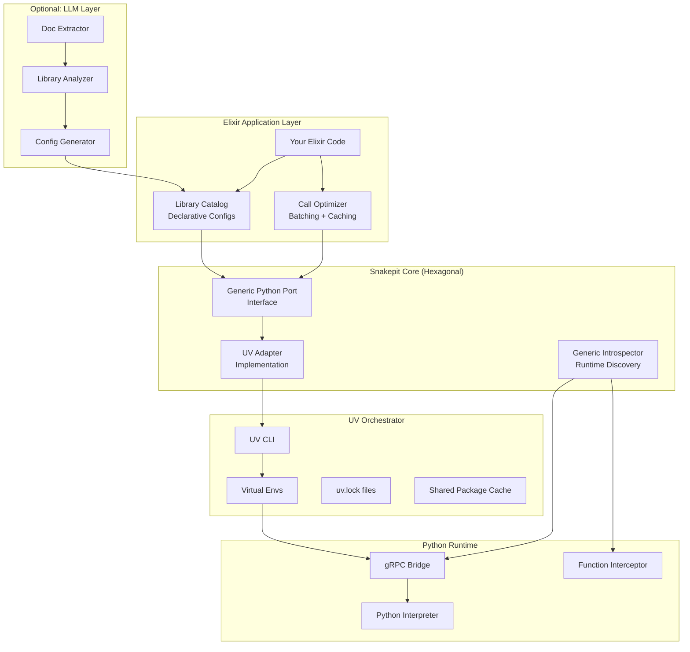

# Snakepit: Zero-Code Python Integration for Enterprise Elixir

## Vision: The Ultimate Python-Elixir Bridge

You want **Snakepit to become the Ecto of Python integration** - a zero-friction, declarative system where:

1. **No Python code needed** - Pure configuration declares what you want
2. **No Elixir adapter code** - Generic introspection handles everything
3. **Automatic dependency management** - UV handles all Python packages
4. **Hexagonal architecture** - Clean layers, swappable infrastructure
5. **LLM-assisted setup** (future) - AI generates configs from docs

---

## The Missing Pieces: What Your Plans Don't Cover

After reviewing `v0.7.0_2-01_generic-python-adapter` and `v0.7.0_2-02_python-environment-management`, here's what needs to be added:

### 1. **UV as First-Class Orchestrator**

Your env management design treats UV as "just another detector". But UV should be **the foundation**:

```elixir
# Current design (too generic)
config :snakepit, :environment,
  detection_order: [:uv, :poetry, :conda, :venv, :system]

# What you need (UV-first)
config :snakepit,
  orchestrator: :uv,  # UV manages EVERYTHING
  fallback: :venv     # Only if UV unavailable
```

**Why UV-first matters:**
- UV handles **virtual envs + package installation + lockfiles** in one tool
- UV is **10-100x faster** than pip/poetry
- UV has **native dependency resolution** (no more pip conflicts)
- UV supports **inline script dependencies** (like Rust's Cargo)

**Missing design element:** A `Snakepit.UV.Orchestrator` module that:
- Creates project-scoped UV environments automatically
- Installs dependencies from `pyproject.toml` or config
- Manages Python version selection (UV can install Python itself!)
- Handles lockfile generation/sync

---

### 2. **Declarative Library Registry**

Your generic adapter design focuses on **runtime introspection**. But for true zero-code, you need **compile-time declaration**:

```elixir
# Missing: A declarative library catalog
defmodule MyApp.PythonLibs do
  use Snakepit.LibraryCatalog
  
  library :pandas do
    package "pandas>=2.0.0"
    
    # Auto-discovered functions become Elixir functions
    import_functions [:read_csv, :DataFrame]
    
    # Type hints for compile-time validation
    function :read_csv do
      param :filepath, :string, required: true
      param :sep, :string, default: ","
      returns :dataframe
    end
  end
  
  library :sklearn do
    package "scikit-learn>=1.3.0"
    
    # Import entire modules with namespacing
    import_module "ensemble.RandomForestClassifier"
    import_module "metrics.accuracy_score"
  end
end

# Usage (pure Elixir, zero Python)
df = MyApp.PythonLibs.Pandas.read_csv("data.csv")
model = MyApp.PythonLibs.Sklearn.RandomForestClassifier.new()
```

**Missing design elements:**
- **Compile-time catalog validation** - Check if functions exist during compilation
- **Type mapping registry** - Elixir types ↔ Python types (DataFrame → struct, etc.)
- **Macro system** - Generate Elixir modules from library definitions
- **Documentation integration** - Pull Python docstrings into ExDoc

---

### 3. **Inline Dependency Declaration**

Your env management design requires **external pyproject.toml**. But UV supports **inline dependencies**:

```elixir
# Missing: Inline dependency declaration
defmodule MyApp.DataPipeline do
  use Snakepit.Workflow
  
  # Declare dependencies inline (like Elixir's mix.exs)
  python_deps do
    package "pandas", ">=2.0.0"
    package "numpy", "~>1.24"
    package "scikit-learn", ">=1.3.0"
  end
  
  # UV automatically creates a venv and installs these
  def run(data_path) do
    Snakepit.execute("pandas.read_csv", %{filepath: data_path})
  end
end
```

**How this works with UV:**
```bash
# Snakepit generates this under the hood:
uv venv .snakepit/my_app_data_pipeline
uv pip install pandas>=2.0.0 numpy~=1.24 scikit-learn>=1.3.0
```

**Missing design elements:**
- **Dependency DSL** - Elixir macro for declaring Python packages
- **Per-module environments** - Isolated envs for different workflows
- **Lockfile generation** - UV creates `uv.lock` automatically
- **Cache sharing** - Multiple apps share UV cache for speed

---

### 4. **Function Call Optimization**

Your generic adapter design uses **gRPC for every call**. This is slow for high-throughput scenarios. You need:

```elixir
# Missing: Call batching and caching
defmodule Snakepit.Optimizer do
  # Batch multiple calls into one gRPC roundtrip
  def batch_execute(calls) do
    Snakepit.execute_batch([
      {"pandas.read_csv", %{filepath: "data1.csv"}},
      {"pandas.read_csv", %{filepath: "data2.csv"}},
      {"numpy.mean", %{array: [1, 2, 3]}}
    ])
  end
  
  # Cache pure functions automatically
  @snakepit_cache ttl: 3600  # Cache for 1 hour
  def expensive_computation(data) do
    Snakepit.execute("sklearn.decomposition.PCA.fit", data)
  end
end
```

**Missing design elements:**
- **Call batching** - Combine multiple Python calls into one gRPC message
- **Result memoization** - Cache pure function results (configurable per function)
- **Streaming optimization** - Use gRPC streaming for large data transfers
- **Lazy evaluation** - Defer Python execution until results are needed

---

### 5. **LLM Integration Layer**

Your plans mention "LLM tooling" but don't design it. Here's what you need:

```elixir
# Future: LLM-assisted library integration
mix snakepit.add huggingface/transformers

# LLM reads transformers docs and generates:
defmodule MyApp.PythonLibs.Transformers do
  use Snakepit.LibraryCatalog
  
  library :transformers do
    package "transformers>=4.30.0"
    
    # LLM discovers common usage patterns
    function :pipeline do
      param :task, :string, 
        enum: ["sentiment-analysis", "text-generation", "translation"]
      param :model, :string, optional: true
      returns :pipeline_object
      
      doc """
      Create a Hugging Face pipeline for common NLP tasks.
      
      ## Examples
      
          iex> pipeline = Transformers.pipeline("sentiment-analysis")
          iex> Transformers.Pipeline.predict(pipeline, "I love Elixir!")
          %{label: "POSITIVE", score: 0.9998}
      """
    end
  end
end
```

**Missing design elements:**
- **Library analysis agent** - LLM reads Python docs and generates configs
- **Usage pattern extraction** - Find common function call patterns
- **Example generation** - Create Elixir examples from Python docs
- **Type inference** - Guess Elixir types from Python type hints

---

## The Complete Architecture



---

## Revised Design: UV-Centric Architecture

### Phase 1: UV as Dependency Manager

```elixir
defmodule Snakepit.UV.Manager do
  @moduledoc """
  UV-first environment and dependency management.
  
  UV handles:
  - Virtual environment creation
  - Package installation with lockfiles
  - Python version management (UV can install Python!)
  - Dependency resolution (Rust-powered, faster than pip)
  """
  
  @doc """
  Initialize a UV environment for a Snakepit app.
  
  ## Example
  
      Snakepit.UV.Manager.init_project(
        name: "my_ml_app",
        python_version: "3.11",
        dependencies: [
          "pandas>=2.0.0",
          "scikit-learn~=1.3",
          "torch"
        ]
      )
  
  This creates:
  - .snakepit/my_ml_app/.venv (isolated environment)
  - .snakepit/my_ml_app/uv.lock (reproducible builds)
  - .snakepit/my_ml_app/pyproject.toml (UV config)
  """
  def init_project(opts) do
    project_name = Keyword.fetch!(opts, :name)
    python_version = Keyword.get(opts, :python_version, "3.11")
    dependencies = Keyword.get(opts, :dependencies, [])
    
    project_dir = Path.join([".snakepit", project_name])
    
    # Step 1: Create project directory
    File.mkdir_p!(project_dir)
    
    # Step 2: Initialize UV project
    System.cmd("uv", ["init", "--python", python_version], cd: project_dir)
    
    # Step 3: Add dependencies
    Enum.each(dependencies, fn dep ->
      System.cmd("uv", ["add", dep], cd: project_dir)
    end)
    
    # Step 4: Create lockfile
    System.cmd("uv", ["lock"], cd: project_dir)
    
    {:ok, %{
      project_dir: project_dir,
      venv_path: Path.join(project_dir, ".venv"),
      python_executable: Path.join([project_dir, ".venv", "bin", "python"]),
      lockfile: Path.join(project_dir, "uv.lock")
    }}
  end
  
  @doc """
  Sync environment with lockfile (reproducible installs).
  """
  def sync_environment(project_dir) do
    case System.cmd("uv", ["sync"], cd: project_dir) do
      {output, 0} -> {:ok, output}
      {error, code} -> {:error, {code, error}}
    end
  end
  
  @doc """
  Add a new dependency to existing project.
  """
  def add_dependency(project_dir, package_spec) do
    System.cmd("uv", ["add", package_spec], cd: project_dir)
  end
end
```

---

### Phase 2: Declarative Library Catalog

```elixir
defmodule Snakepit.LibraryCatalog do
  @moduledoc """
  Declarative Python library integration.
  
  ## Example
  
      defmodule MyApp.ML do
        use Snakepit.LibraryCatalog
        
        library :sklearn do
          package "scikit-learn>=1.3.0"
          
          module "ensemble" do
            class "RandomForestClassifier" do
              method :fit, params: [:X, :y]
              method :predict, params: [:X]
            end
          end
          
          module "metrics" do
            function :accuracy_score, params: [:y_true, :y_pred]
          end
        end
      end
      
      # Generated Elixir API:
      model = MyApp.ML.Sklearn.Ensemble.RandomForestClassifier.new()
      MyApp.ML.Sklearn.Ensemble.RandomForestClassifier.fit(model, X_train, y_train)
      predictions = MyApp.ML.Sklearn.Ensemble.RandomForestClassifier.predict(model, X_test)
  """
  
  defmacro __using__(_opts) do
    quote do
      import Snakepit.LibraryCatalog
      Module.register_attribute(__MODULE__, :libraries, accumulate: true)
      
      @before_compile Snakepit.LibraryCatalog
    end
  end
  
  defmacro library(name, do: block) do
    quote do
      @libraries {unquote(name), unquote(Macro.escape(block))}
    end
  end
  
  defmacro package(package_spec) do
    quote do
      @current_library_package unquote(package_spec)
    end
  end
  
  defmacro module(name, do: block) do
    quote do
      # Generate nested module structure
      module_name = String.to_atom("Elixir.#{__MODULE__}.#{unquote(name)}")
      
      defmodule module_name do
        unquote(block)
      end
    end
  end
  
  defmacro function(name, opts \\ []) do
    quote do
      def unquote(name)(args) do
        function_path = "#{@current_library}.#{unquote(name)}"
        Snakepit.execute(function_path, args)
      end
    end
  end
  
  defmacro __before_compile__(_env) do
    quote do
      # At compile time:
      # 1. Validate library configs
      # 2. Check if dependencies are installed
      # 3. Generate Elixir wrapper functions
      # 4. Create ExDoc documentation
      
      def __catalog__() do
        @libraries
      end
    end
  end
end
```

---

### Phase 3: Optimized Execution Layer

```elixir
defmodule Snakepit.Execution.Optimizer do
  @moduledoc """
  Optimize Python function calls with batching, caching, and streaming.
  """
  
  @doc """
  Batch multiple Python calls into one gRPC roundtrip.
  
  ## Example
  
      results = Snakepit.Execution.Optimizer.batch_execute([
        {"pandas.read_csv", %{filepath: "data1.csv"}},
        {"pandas.read_csv", %{filepath: "data2.csv"}},
        {"numpy.mean", %{array: [1, 2, 3]}}
      ])
  """
  def batch_execute(calls) do
    # Collect multiple calls
    call_ids = Enum.map(calls, fn _ -> :erlang.unique_integer([:positive]) end)
    
    # Send batch request via gRPC
    batch_request = %{
      batch_id: :erlang.unique_integer([:positive]),
      calls: Enum.zip(call_ids, calls) |> Enum.map(fn {id, {func, args}} ->
        %{call_id: id, function: func, arguments: args}
      end)
    }
    
    case Snakepit.GRPC.Client.execute_batch(batch_request) do
      {:ok, results} ->
        # Map results back to original call order
        {:ok, Enum.map(call_ids, fn id -> 
          Enum.find(results, fn r -> r.call_id == id end).result
        end)}
      error -> error
    end
  end
  
  @doc """
  Cache function results based on arguments.
  
  ## Example
  
      # This only calls Python once
      result1 = Snakepit.Execution.Optimizer.cached_execute(
        "expensive.computation", %{data: [1, 2, 3]}, ttl: 3600
      )
      
      # Cached (no Python call)
      result2 = Snakepit.Execution.Optimizer.cached_execute(
        "expensive.computation", %{data: [1, 2, 3]}, ttl: 3600
      )
  """
  def cached_execute(function, args, opts \\ []) do
    ttl = Keyword.get(opts, :ttl, 300)  # 5 minutes default
    
    cache_key = :erlang.phash2({function, args})
    
    case Cachex.get(:snakepit_cache, cache_key) do
      {:ok, nil} ->
        # Cache miss - execute and cache
        case Snakepit.execute(function, args) do
          {:ok, result} ->
            Cachex.put(:snakepit_cache, cache_key, result, ttl: :timer.seconds(ttl))
            {:ok, result}
          error -> error
        end
      
      {:ok, cached_result} ->
        # Cache hit
        {:ok, cached_result}
    end
  end
end
```

---

### Phase 4: LLM-Assisted Library Integration

```elixir
defmodule Snakepit.AI.LibraryAnalyzer do
  @moduledoc """
  Use LLM to analyze Python libraries and generate Snakepit configs.
  
  ## Example
  
      # Analyze a library from PyPI
      mix snakepit.analyze transformers
      
      # LLM generates MyApp.PythonLibs.Transformers module
      # with common usage patterns discovered from docs
  """
  
  @doc """
  Analyze a Python library using LLM.
  
  Steps:
  1. Fetch library docs from PyPI/GitHub
  2. Send to LLM with prompt: "Generate Snakepit catalog config"
  3. Parse LLM response into Elixir module
  4. Validate generated code
  5. Write to project
  """
  def analyze_library(package_name, opts \\ []) do
    # Step 1: Fetch library metadata
    {:ok, metadata} = fetch_pypi_metadata(package_name)
    {:ok, docs} = fetch_library_docs(metadata.docs_url)
    
    # Step 2: Generate catalog with LLM
    prompt = """
    Generate a Snakepit LibraryCatalog configuration for the Python library: #{package_name}
    
    Library documentation:
    #{docs}
    
    Output format:
    ```elixir
    defmodule MyApp.PythonLibs.#{String.capitalize(package_name)} do
      use Snakepit.LibraryCatalog
      
      library :#{package_name} do
        package "#{package_name}>=#{metadata.latest_version}"
        
        # Discover common functions/classes
        # ...
      end
    end
    ```
    
    Focus on the most commonly used functions and classes.
    Include parameter types and return types where obvious.
    """
    
    {:ok, llm_response} = call_llm(prompt)
    
    # Step 3: Parse and validate
    {:ok, catalog_code} = extract_code(llm_response)
    {:ok, _ast} = Code.string_to_quoted(catalog_code)
    
    # Step 4: Write to project
    target_file = Path.join(["lib", "my_app", "python_libs", "#{package_name}.ex"])
    File.write!(target_file, catalog_code)
    
    {:ok, target_file}
  end
  
  defp call_llm(prompt) do
    # Use Claude/GPT-4 via API
    # (Implementation details omitted)
  end
end
```

---

## Configuration System

### Unified Config Format

```elixir
# config/config.exs
config :snakepit,
  # UV as orchestrator
  orchestrator: Snakepit.UV.Manager,
  uv_config: %{
    python_version: "3.11",
    cache_dir: ".snakepit/cache",
    project_dir: ".snakepit/projects"
  },
  
  # Library catalog
  libraries: [
    %{
      name: :pandas,
      package: "pandas>=2.0.0",
      auto_discover: true,  # Introspect at runtime
      cache_functions: true
    },
    %{
      name: :sklearn,
      package: "scikit-learn>=1.3.0",
      modules: [
        "ensemble.RandomForestClassifier",
        "metrics.accuracy_score"
      ]
    },
    %{
      name: :transformers,
      package: "transformers>=4.30.0",
      # LLM-generated config
      generated_by: :llm,
      generated_at: ~U[2024-01-15 10:00:00Z]
    }
  ],
  
  # Execution optimization
  execution: %{
    enable_batching: true,
    enable_caching: true,
    cache_ttl: 300,  # seconds
    max_batch_size: 100
  },
  
  # LLM integration (optional)
  llm: %{
    enabled: true,
    provider: :anthropic,
    model: "claude-3-opus",
    api_key: {:system, "ANTHROPIC_API_KEY"}
  }
```

---

## Usage Examples

### Example 1: Pure Configuration (Zero Code)

```elixir
# config/python_libs.exs
config :snakepit, :libraries,
  pandas: [
    package: "pandas>=2.0.0",
    functions: [:read_csv, :DataFrame]
  ],
  numpy: [
    package: "numpy>=1.24",
    functions: [:array, :mean, :std]
  ]

# That's it! No Python code, no Elixir adapter code.

# Usage in your app:
df = Snakepit.Pandas.read_csv("data.csv")
mean = Snakepit.Numpy.mean([1, 2, 3, 4, 5])
```

### Example 2: Declarative Catalog

```elixir
defmodule MyApp.ML do
  use Snakepit.LibraryCatalog
  
  library :sklearn do
    package "scikit-learn>=1.3.0"
    
    module "ensemble" do
      class "RandomForestClassifier" do
        method :fit
        method :predict
        method :score
      end
    end
  end
end

# Usage:
model = MyApp.ML.Sklearn.Ensemble.RandomForestClassifier.new()
MyApp.ML.Sklearn.Ensemble.RandomForestClassifier.fit(model, X, y)
```

### Example 3: LLM-Generated (Future)

```bash
# Terminal
$ mix snakepit.add huggingface/transformers

# LLM analyzes transformers and generates:
```

```elixir
# lib/my_app/python_libs/transformers.ex (auto-generated)
defmodule MyApp.PythonLibs.Transformers do
  use Snakepit.LibraryCatalog
  
  library :transformers do
    package "transformers>=4.30.0"
    
    function :pipeline, params: [:task, :model]
    
    module "AutoModel" do
      class "AutoModelForSequenceClassification" do
        method :from_pretrained, params: [:model_name]
      end
    end
  end
end
```

---

## Critical Tech Decisions

### 1. UV vs Poetry/Conda

**Decision: Make UV the default, support others as fallback**

| Factor | UV | Poetry | Conda |
|--------|-----|--------|-------|
| Speed | ⚡⚡⚡ 10-100x faster | ⚡ Baseline | ⚡ Slow |
| Lockfiles | ✅ uv.lock | ✅ poetry.lock | ⚠️ Limited |
| Python install | ✅ Can install Python | ❌ No | ✅ Yes |
| Elixir integration | ✅ Simple CLI | ⚠️ Complex API | ⚠️ Complex |
| Ecosystem | 🆕 Rust-powered | 📦 Mature | 📦 Data science |

**Recommendation:** UV-first with Poetry/Conda fallback for existing projects.

### 2. Runtime vs Compile-Time Introspection

**Decision: Hybrid approach**

- **Compile-time:** Validate library configs, generate Elixir modules
- **Runtime:** Discover functions for auto-complete and error messages

### 3. gRPC vs Direct Python Interop

**Decision: Keep gRPC but optimize**

- gRPC provides clean boundary and error handling
- Add batching and caching to mitigate overhead
- Future: Explore Rustler NIF for ultra-low-latency calls

### 4. LLM Integration: Now or Later?

**Decision: Phase 4 (future enhancement)**

- Core system should work without LLM
- LLM is **icing on the cake** for discoverability
- Start with manual configs, add LLM later

---

## Roadmap

### MVP (Phase 1-2): 2-3 months
- ✅ UV orchestrator
- ✅ Declarative library catalog
- ✅ Basic introspection
- ✅ Config-driven dependency management

### Production-Ready (Phase 3): 1-2 months
- ✅ Call batching and caching
- ✅ Streaming optimization
- ✅ Comprehensive error handling
- ✅ Documentation generation

### Enterprise (Phase 4): 3+ months
- ✅ LLM-assisted library integration
- ✅ Multi-tenant isolation
- ✅ Advanced monitoring and telemetry

---

## Missing Technical Details You Need

1. **gRPC Batching Protocol**
   - Design protobuf schema for batch requests
   - Handle partial failures in batches
   - Streaming vs request-response trade-offs

2. **Type System Design**
   - Elixir struct ↔ Python dict mapping
   - NumPy array ↔ Elixir binary
   - Pandas DataFrame ↔ Elixir map/struct
   - Custom type adapters (pluggable)

3. **Compile-Time Validation**
   - How to validate Python libraries at compile time?
   - What happens if library is missing during compilation?
   - Hot code reloading when Python changes

4. **LLM Prompt Engineering**
   - Few-shot examples for library analysis
   - How to handle hallucinations?
   - Validation of LLM-generated code

5. **Security Considerations**
   - Sandboxing Python code execution
   - Preventing arbitrary code injection
   - Audit logging for compliance

6. **Performance Benchmarks**
   - Target latency: <5ms per Python call (cached)
   - Throughput: 10,000+ calls/sec (batched)
   - Memory overhead: <50MB per worker

---

**This is the path to zero-code Python integration in enterprise Elixir.** UV handles environments, introspection handles discovery, and LLMs handle boilerplate. Your Elixir stays clean.
