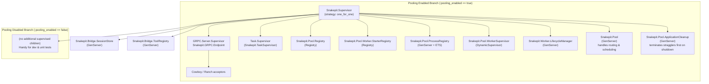

# Snakepit Supervision Tree

The diagram below captures the runtime supervision hierarchy that `Snakepit.Application` boots. Two child sets exist:

* **Base children** are always started (session store + tool registry).
* **Pooling branch** is added when `:pooling_enabled` is `true` in application config. This is the common production path.

**Notes**

- `GRPC.Server.Supervisor` encapsulates the gRPC endpoint; `Snakepit.GRPC.Endpoint` defines the service handlers.
- `Snakepit.Pool.WorkerSupervisor` dynamically supervises each `Snakepit.GRPCWorker` (and other adapter workers) under a `:one_for_one` strategy.
- `Snakepit.Pool.ProcessRegistry` tracks OS-level worker PIDs and exposes run-id based cleanup used by watchdog/process killer flows.
- `Snakepit.Pool.ApplicationCleanup` is intentionally **last** so it terminates **first**, allowing it to reap external processes before other supervisors shut down.
