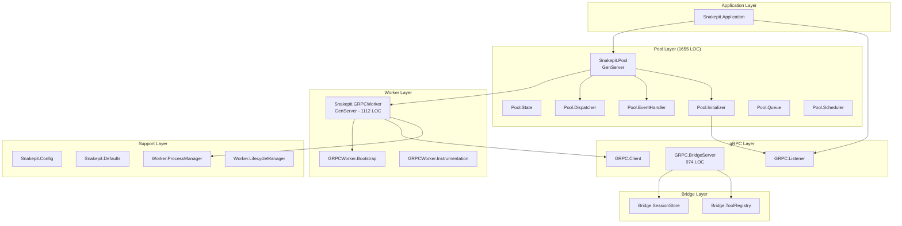
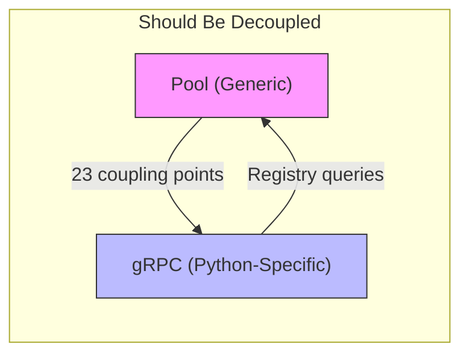
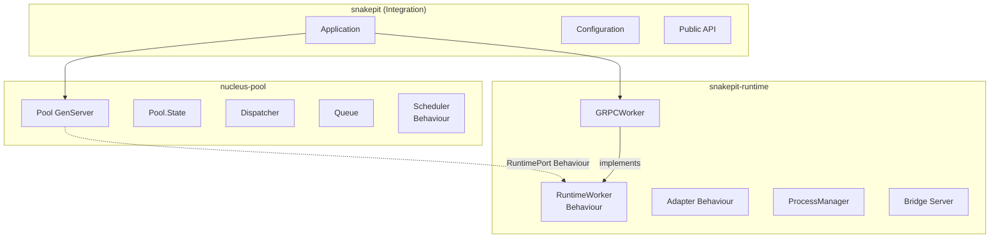

# Snakepit Refactoring Investigation: Executive Summary

## Document Purpose

This document provides a high-level overview of the Snakepit refactoring investigation, synthesizing findings from comprehensive code analysis aimed at modularizing the system into separate, reusable libraries aligned with the Nucleus Architecture vision.

---

## 1. Current Architecture Overview

Snakepit is an Elixir library for managing Python worker processes via gRPC communication. The system currently operates as a monolithic library with tightly coupled components.

### Core Components



### Key Statistics

| Component | Lines of Code | Complexity |
|-----------|---------------|------------|
| `Pool.Pool` | 1655 | High |
| `GRPCWorker` | 1112 | High |
| `GRPC.BridgeServer` | 974 | Medium |
| `Pool.State` | 200 | Low |
| `Pool.Initializer` | 401 | Medium |
| **Total Core** | ~5000+ | High |

---

## 2. Key Coupling Issues Identified

### 2.1 Critical Coupling Points (23 Total)

The investigation identified **23 direct coupling points** between the Pool/Core layer and the gRPC/Worker layer:

#### Category 1: Hardcoded Module References (High Impact)

| Location | Coupling Point | Impact |
|----------|----------------|--------|
| `pool/state.ex:40` | `worker_module || Snakepit.GRPCWorker` | Default worker module hardcoded |
| `pool/pool.ex:1492` | `Snakepit.GRPCWorker` fallback | Forces gRPC dependency |
| `grpc/bridge_server.ex:481` | `GRPCWorker` validation | Tight worker type coupling |

#### Category 2: Direct Cross-Layer Calls (Medium Impact)

| Location | Call | Issue |
|----------|------|-------|
| `pool/initializer.ex:119-127` | `GRPC.Listener.await_ready()` | Pool depends on gRPC startup |
| `grpc/bridge_server.ex:331,474` | `PoolRegistry.get_worker_pid()` | BridgeServer queries Pool layer |

#### Category 3: Script/Path Dependencies (Low Impact)

| Location | Dependency |
|----------|------------|
| `adapters/grpc_python.ex:89-94` | Script path selection logic |
| `adapters/grpc_python.ex:76-86` | `--max-workers` flag parsing |

### 2.2 Architectural Violations



---

## 3. Recommended Three-Library Split

Based on the Nucleus Architecture vision, we recommend splitting Snakepit into three libraries:

### 3.1 Library Structure



### 3.2 Library Responsibilities

| Library | Purpose | Size Estimate |
|---------|---------|---------------|
| **snakepit-runtime** | Python IPC, gRPC workers, process management | ~3500 LOC |
| **nucleus-pool** | Generic pooling, scheduling, queue management | ~2500 LOC |
| **snakepit** | Integration, configuration, public API | ~1500 LOC |

---

## 4. Proposed Behaviour Interfaces

### 4.1 RuntimePort (for nucleus-pool to call runtime)

```elixir
defmodule Nucleus.Ports.Runtime do
  @doc "Initialize a worker with given configuration"
  @callback init(config :: map()) :: {:ok, state :: term()} | {:error, reason :: term()}

  @doc "Execute a command on the worker"
  @callback execute(state :: term(), command :: String.t(), args :: map(), opts :: keyword()) ::
    {:ok, result :: term()} | {:error, reason :: term()}

  @doc "Execute a streaming command"
  @callback execute_stream(state :: term(), command :: String.t(), args :: map(),
    callback :: function(), opts :: keyword()) :: :ok | {:error, reason :: term()}

  @doc "Check worker health"
  @callback health_check(state :: term()) :: :ok | {:error, reason :: term()}

  @doc "Get worker capabilities"
  @callback capabilities(state :: term()) :: [atom()]

  @doc "Graceful shutdown"
  @callback terminate(reason :: term(), state :: term()) :: :ok
end
```

### 4.2 SchedulerStrategy (for pluggable scheduling)

```elixir
defmodule Nucleus.Pool.SchedulerStrategy do
  @doc "Select next available worker"
  @callback select_worker(available :: MapSet.t(), opts :: keyword()) ::
    {:ok, worker_id :: term()} | {:error, :no_workers}

  @doc "Handle session affinity routing"
  @callback route_session(session_id :: String.t(), workers :: list(), opts :: keyword()) ::
    {:ok, worker_id :: term()} | :no_preference
end
```

---

## 5. Migration Roadmap

### Phase 1: Interface Extraction (Low Risk)

1. Define `Nucleus.Ports.Runtime` behaviour
2. Define `Nucleus.Pool.SchedulerStrategy` behaviour
3. Extract interface modules without moving code
4. Add behaviour annotations to existing modules

### Phase 2: Module Reorganization (Medium Risk)

1. Create `snakepit-runtime` package structure
2. Move gRPC-specific code to runtime package
3. Create `nucleus-pool` package structure
4. Move generic pool code to pool package

### Phase 3: Dependency Inversion (High Impact)

1. Replace hardcoded module references with config
2. Inject dependencies via application configuration
3. Update Pool to use RuntimePort behaviour
4. Update initialization to be runtime-agnostic

### Phase 4: Validation & Testing

1. Verify all 23 coupling points resolved
2. Run full integration test suite
3. Test with alternative runtime implementations
4. Performance benchmarking

---

## 6. Risk Assessment

| Risk | Probability | Impact | Mitigation |
|------|-------------|--------|------------|
| Breaking changes to public API | Medium | High | Maintain facade layer |
| Performance regression | Low | Medium | Benchmark before/after |
| Test coverage gaps | Medium | Medium | Add integration tests first |
| Dependency cycle introduction | Low | High | Use hex dependency analysis |

---

## 7. Document Index

| Document | Purpose |
|----------|---------|
| `01_pool_state_machine.md` | Pool GenServer state machine diagram |
| `02_grpc_worker_state_machine.md` | GRPCWorker lifecycle state machine |
| `03_bridge_server_state_machine.md` | BridgeServer request handling |
| `10_dependency_graph.md` | Full module dependency analysis |
| `11_coupling_hotspots.md` | Detailed coupling analysis |
| `13_runtime_extraction_plan.md` | snakepit-runtime extraction plan |
| `14_pool_extraction_plan.md` | nucleus-pool extraction plan |
| `18_configuration_analysis.md` | Configuration system analysis |
| `23_three_library_split_plan.md` | Master split implementation plan |

---

## 8. Conclusion

The Snakepit codebase is well-architected but has accumulated coupling between its pool management and Python runtime concerns. The recommended three-library split will:

1. **Enable reuse**: `nucleus-pool` can manage any external runtime (Rust, Node.js, etc.)
2. **Improve testability**: Each library can be tested in isolation
3. **Support Nucleus Architecture**: Clean integration path with Mesh and ALTAR
4. **Reduce complexity**: Smaller, focused libraries are easier to maintain

The migration can be executed incrementally with minimal disruption to existing users by maintaining backward-compatible facades.

---

*Generated: 2026-01-11*
*Investigation conducted using comprehensive static analysis of 88 source files*
