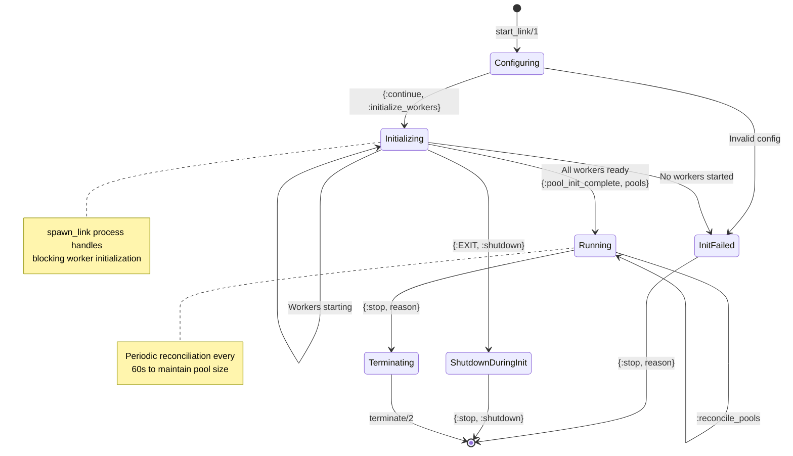
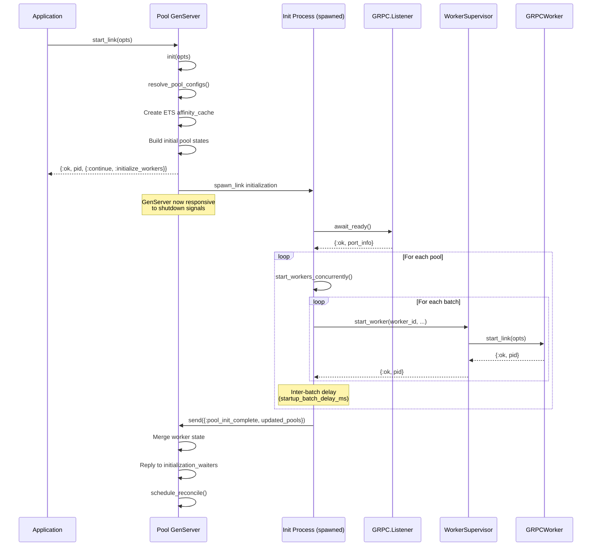
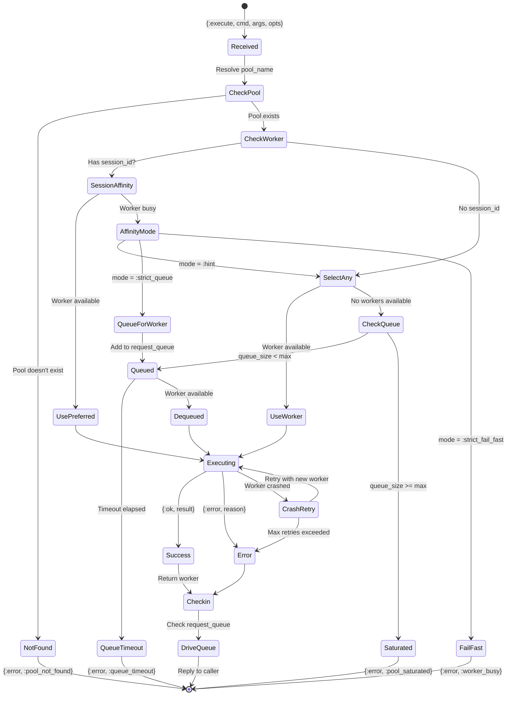
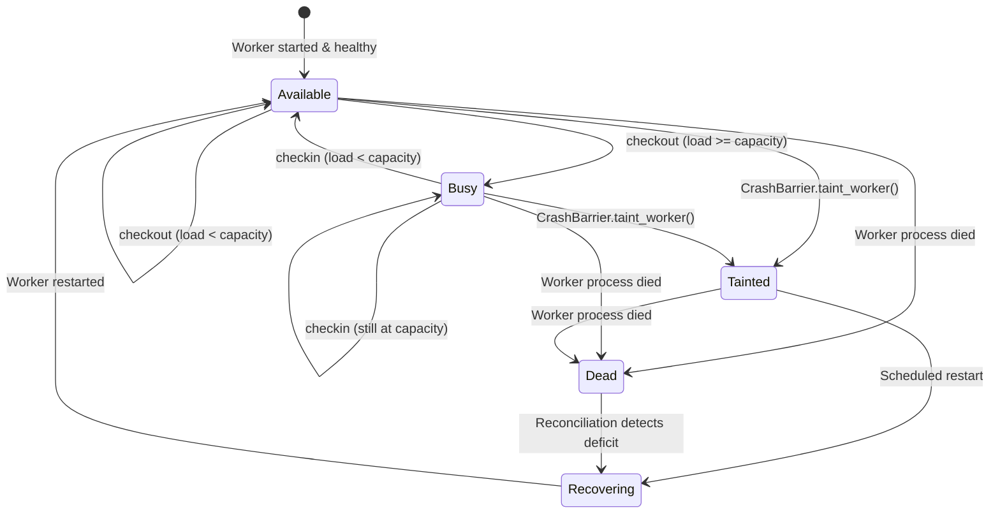
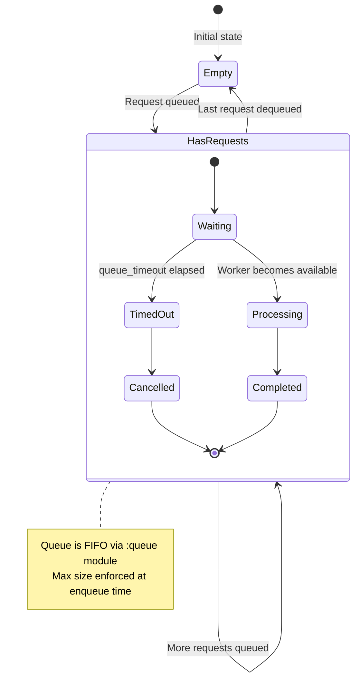
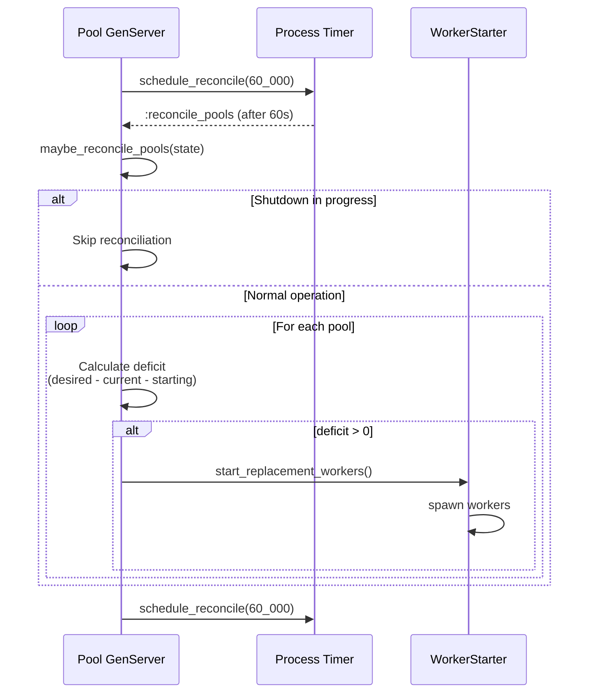
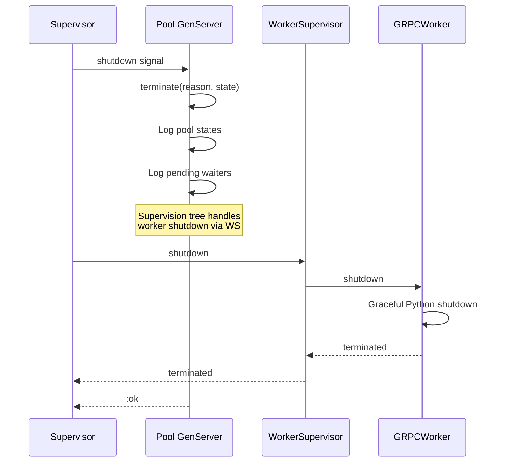

# Pool GenServer State Machine Analysis

## Overview

The `Snakepit.Pool` module (`lib/snakepit/pool/pool.ex`) is the central orchestrator for worker management. This document provides detailed state machine diagrams and analysis of its lifecycle, message handling, and state transitions.

---

## 1. Top-Level State Structure

```elixir
# lib/snakepit/pool/pool.ex:34-47
defstruct [
  :pools,              # Map of pool_name => Pool.State
  :affinity_cache,     # ETS table for session->worker mapping
  :default_pool,       # Default pool name for backward compat
  initializing: false, # True during async initialization
  init_start_time: nil,# Timestamp for measuring init duration
  reconcile_ref: nil   # Periodic reconciliation timer reference
]
```

### Per-Pool State (`Pool.State`)

```elixir
# lib/snakepit/pool/state.ex:7-26
defstruct [
  :name,                    # Pool identifier atom
  :size,                    # Target number of workers
  :workers,                 # List of worker IDs
  :available,               # MapSet of available worker IDs
  :worker_loads,            # Map worker_id => current_load
  :worker_capacities,       # Map worker_id => max_capacity
  :capacity_strategy,       # :pool | :hybrid | :profile
  :request_queue,           # :queue of pending requests
  :cancelled_requests,      # Set of cancelled request refs
  :stats,                   # Aggregate statistics
  :initialized,             # Boolean - workers started?
  :startup_timeout,
  :queue_timeout,
  :max_queue_size,
  :worker_module,           # Module implementing worker behaviour
  :adapter_module,          # Adapter for external process
  :pool_config,             # Full configuration map
  initialization_waiters: [] # List of {from} tuples
]
```

---

## 2. Pool Lifecycle State Machine



---

## 3. Initialization Flow Detail



### Key Code References

| Step | File:Line | Description |
|------|-----------|-------------|
| Init entry | `pool.ex:347-358` | `init/1` callback |
| Config resolution | `pool.ex:1006-1020` | `resolve_pool_configs/0` |
| Worker start | `pool.ex:399-401` | `handle_continue(:initialize_workers)` |
| Spawn init | `initializer.ex:35-38` | Non-blocking spawn_link |
| GRPC wait | `initializer.ex:119-127` | `ensure_grpc_listener_ready!/0` |
| Batch startup | `initializer.ex:212-239` | `start_worker_batches/8` |
| Init complete | `pool.ex:405-473` | `handle_info({:pool_init_complete, ...})` |

---

## 4. Request Execution State Machine



### Dispatcher Code Flow

```elixir
# lib/snakepit/pool/dispatcher.ex - Key functions
def execute(state, pool_name, command, args, opts, from, context)
  # 1. Validate pool exists
  # 2. Check initialization status
  # 3. Try checkout_worker
  # 4. Either execute immediately or queue

def maybe_queue_request(pool_state, request, from, pool_name)
  # 1. Check max_queue_size
  # 2. Schedule queue_timeout
  # 3. Add to request_queue
```

---

## 5. Worker Availability State Machine



### Worker Load Tracking

```elixir
# lib/snakepit/pool/state.ex:104-123
def increment_worker_load(pool_state, worker_id) do
  pool_state = ensure_worker_capacity(pool_state, worker_id)
  new_load = worker_load(pool_state, worker_id) + 1
  capacity = effective_capacity(pool_state, worker_id)

  new_loads = Map.put(pool_state.worker_loads, worker_id, new_load)

  new_available =
    if new_load < capacity do
      MapSet.put(pool_state.available, worker_id)
    else
      MapSet.delete(pool_state.available, worker_id)
    end

  %{pool_state | worker_loads: new_loads, available: new_available}
end
```

---

## 6. Queue Management State Machine



### Queue Data Structure

```elixir
# Request tuple format in queue
{command, args, opts, from, timer_ref, deadline_ms}

# Key operations (lib/snakepit/pool/queue.ex)
def enqueue(queue, request) -> {:ok, queue} | {:error, :queue_full}
def dequeue(queue) -> {{:value, request}, queue} | {:empty, queue}
def cancel(queue, from) -> queue
```

---

## 7. Reconciliation Loop



### Reconciliation Code

```elixir
# lib/snakepit/pool/pool.ex:851-859
defp reconcile_pools(state) do
  if supervisor_alive?() do
    Enum.each(state.pools, fn {pool_name, pool_state} ->
      maybe_spawn_replacements(pool_name, pool_state)
    end)
  end
  state
end

# lib/snakepit/pool/pool.ex:861-869
defp maybe_spawn_replacements(pool_name, pool_state) do
  desired = desired_worker_count(pool_state)
  starter_count = starter_count_for_pool(pool_name)
  deficit = max(desired - starter_count, 0)

  if deficit > 0 do
    spawn_count = min(deficit, Defaults.pool_reconcile_batch_size())
    spawn_replacement_workers(pool_name, pool_state, spawn_count)
  end
end
```

---

## 8. Handle_Info Message Handlers

| Message | Handler Location | Purpose |
|---------|------------------|---------|
| `{:pool_init_complete, pools}` | `pool.ex:405-473` | Worker init completed |
| `{:EXIT, pid, reason}` | `pool.ex:479-512` | Linked process died |
| `{:queue_timeout, pool, from}` | `pool.ex:515-517` | Queue wait expired |
| `{:DOWN, ref, :process, pid, reason}` | `pool.ex:525-527` | Monitored process died |
| `{:reply_to_waiter, from}` | `pool.ex:529-533` | Staggered waiter reply |
| `:reconcile_pools` | `pool.ex:535-539` | Periodic reconciliation |
| `{ref, _result}` | `pool.ex:545-547` | Task completion |

---

## 9. Shutdown Sequence



### Terminate Implementation

```elixir
# lib/snakepit/pool/pool.ex:976-1001
def terminate(reason, state) do
  SLog.info(@log_category, "Pool manager terminating: #{inspect(reason)}")

  Enum.each(state.pools, fn {pool_name, pool_state} ->
    SLog.debug(@log_category, """
    Pool #{pool_name} shutdown state:
      Initialized: #{pool_state.initialized}
      Workers: #{length(pool_state.workers)}
      Available: #{MapSet.size(pool_state.available)}
      Busy: #{busy_worker_count(pool_state)}
      Queued: #{:queue.len(pool_state.request_queue)}
      Waiters: #{length(pool_state.initialization_waiters)}
    """)
  end)

  :ok
end
```

---

## 10. Modularization Implications

### Components to Extract to nucleus-pool

- `Pool.State` - Generic pool state management
- `Pool.Dispatcher` - Request routing logic
- `Pool.Queue` - Queue management
- `Pool.Scheduler` - Worker selection strategies
- `Pool.EventHandler` - Event processing

### Components to Keep in snakepit

- Worker-specific configuration resolution
- gRPC listener await logic (via behaviour callback)
- Adapter module references

### New Abstractions Needed

1. **RuntimePort Behaviour**: Abstract worker management
2. **SchedulerStrategy Behaviour**: Pluggable scheduling
3. **InitializationDelegate**: Runtime-specific startup

---

*Generated: 2026-01-11*
*Source: lib/snakepit/pool/pool.ex (1655 lines)*
