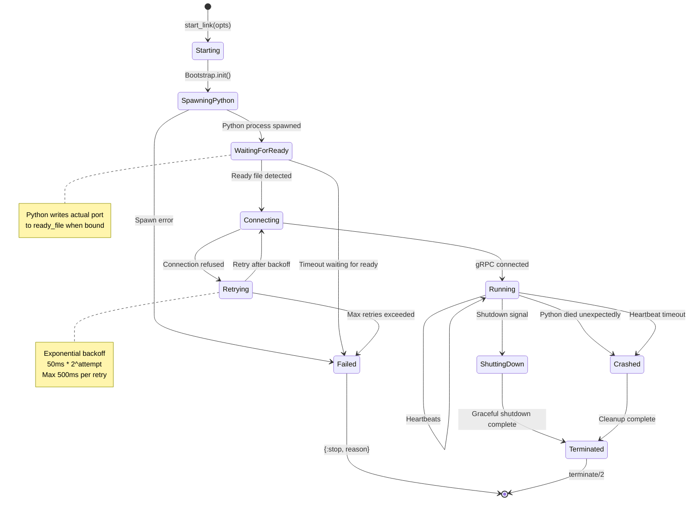
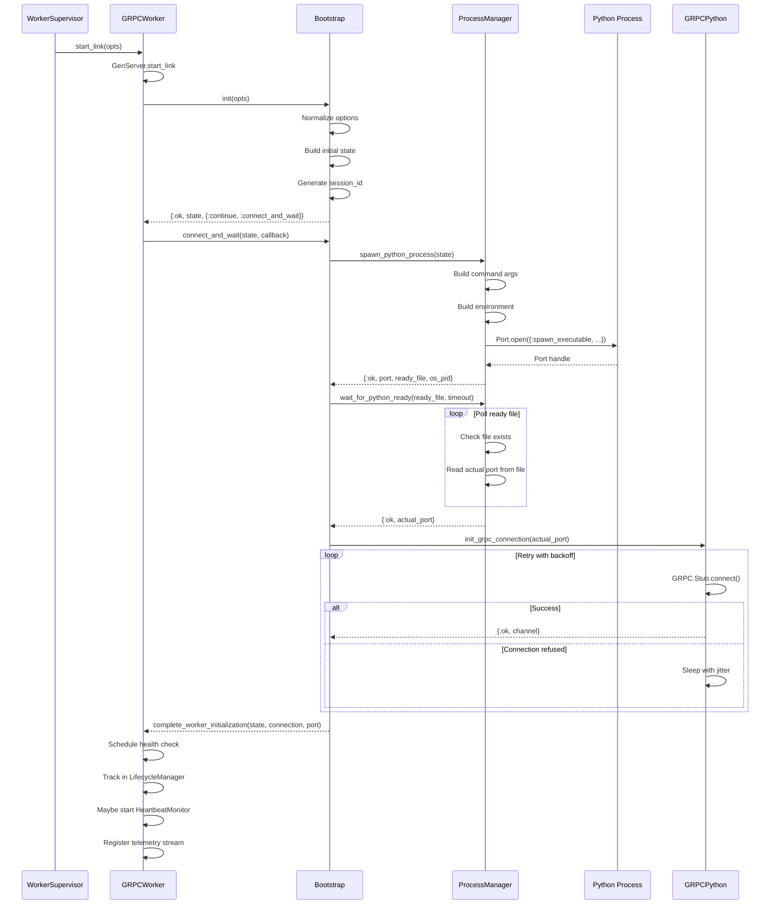
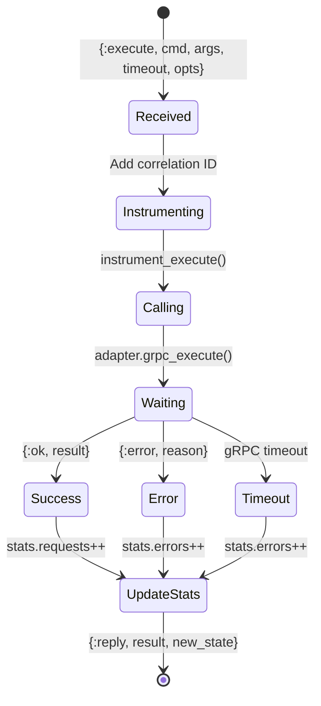
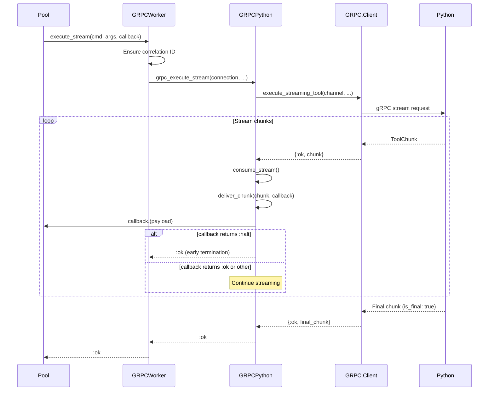
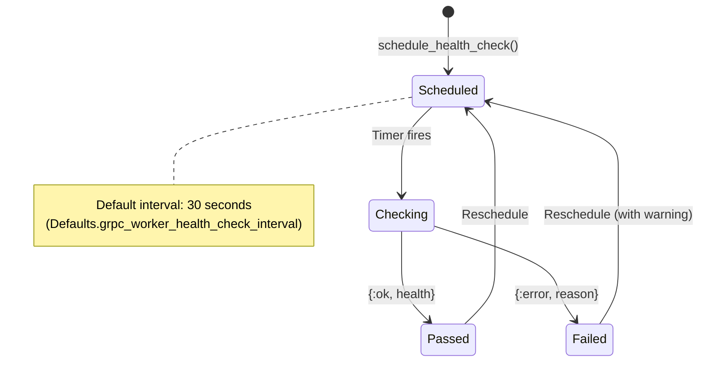
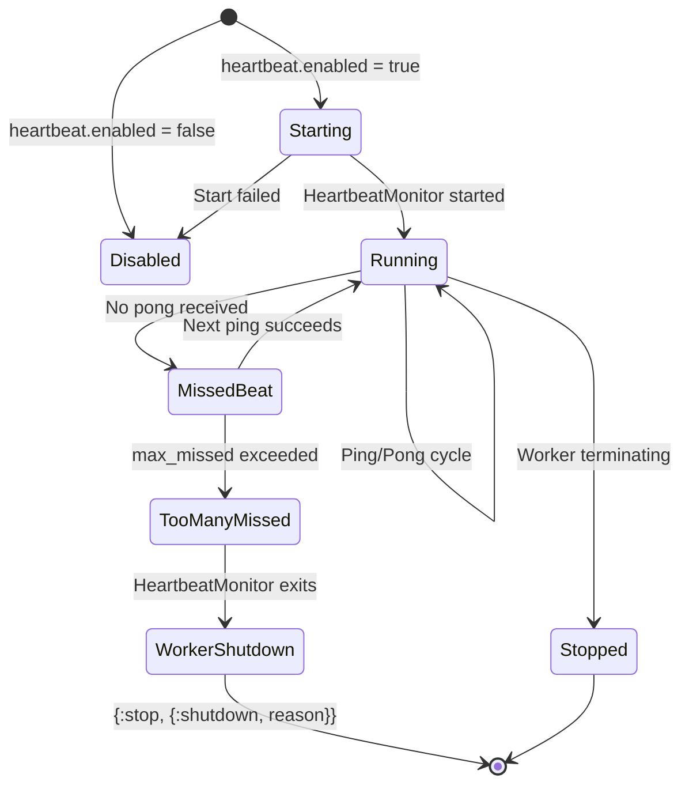
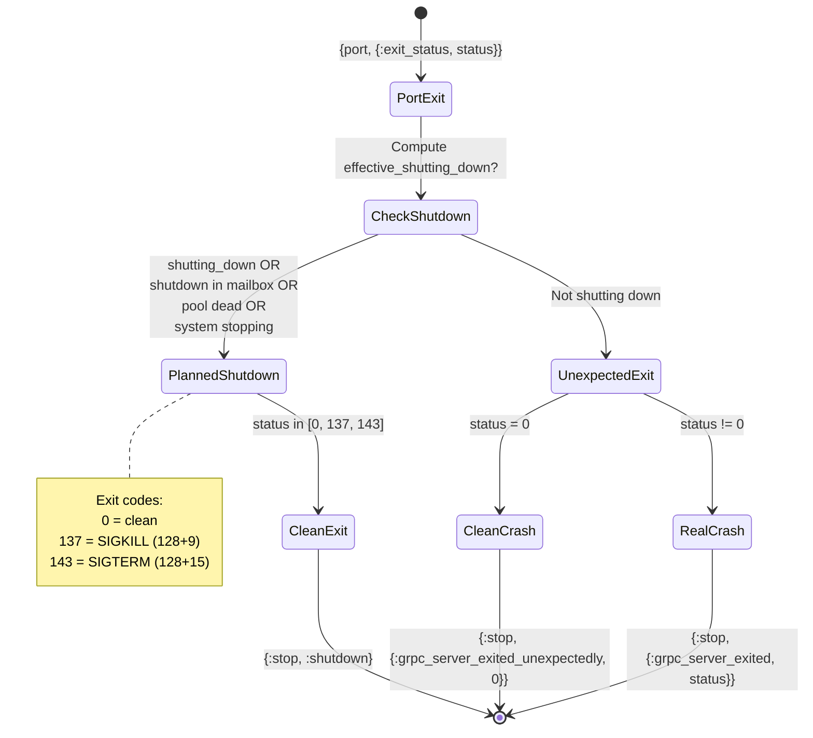
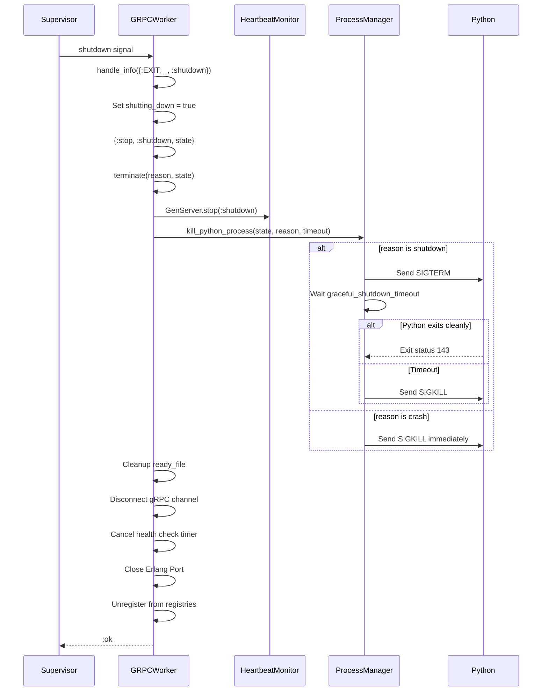

# GRPCWorker State Machine Analysis

## Overview

The `Snakepit.GRPCWorker` module (`lib/snakepit/grpc_worker.ex`) manages individual gRPC connections to Python processes. This document details its state machine, lifecycle, and message handling.

---

## 1. Worker State Structure

```elixir
# lib/snakepit/grpc_worker.ex:60-78
@type worker_state :: %{
  adapter: module(),           # Adapter module (e.g., GRPCPython)
  connection: map() | nil,     # gRPC channel connection
  port: integer(),             # Actual gRPC port Python is listening on
  process_pid: integer() | nil,# OS PID of Python process
  pgid: integer() | nil,       # Process group ID
  process_group?: boolean(),   # Whether using process groups
  server_port: port() | nil,   # Erlang Port for Python process
  id: String.t(),              # Unique worker identifier
  pool_name: atom() | pid(),   # Owning pool reference
  health_check_ref: reference() | nil,  # Health check timer
  heartbeat_monitor: pid() | nil,       # HeartbeatMonitor process
  heartbeat_config: map(),     # Heartbeat configuration
  ready_file: String.t(),      # Path to readiness file
  stats: map(),                # Request statistics
  session_id: String.t(),      # Worker's session ID
  worker_config: map(),        # Full worker configuration
  shutting_down: boolean()     # Shutdown in progress flag
}
```

---

## 2. Worker Lifecycle State Machine



---

## 3. Initialization Sequence



### Key Code References

| Step | File:Line | Function |
|------|-----------|----------|
| Init entry | `grpc_worker.ex:274-277` | `init/1` |
| Bootstrap init | `grpc_worker/bootstrap.ex` | `init/1` |
| Connect & wait | `grpc_worker.ex:304-306` | `handle_continue(:connect_and_wait)` |
| Spawn Python | `worker/process_manager.ex` | `spawn_python_process/1` |
| Wait ready | `worker/process_manager.ex` | `wait_for_python_ready/2` |
| gRPC connect | `adapters/grpc_python.ex:151-159` | `init_grpc_connection/1` |
| Connection retry | `adapters/grpc_python.ex:170-206` | `retry_connect/4` |
| Complete init | `grpc_worker.ex:279-301` | `complete_worker_initialization/3` |

---

## 4. Request Execution Flow



### Execute Implementation

```elixir
# lib/snakepit/grpc_worker.ex:313-350
def handle_call({:execute, command, args, timeout, opts}, _from, state) do
  args_with_corr = Instrumentation.ensure_correlation(args)

  case Instrumentation.instrument_execute(
         :execute,
         state,
         command,
         args_with_corr,
         timeout,
         fn instrumented_args ->
           state.adapter.grpc_execute(
             state.connection,
             state.session_id,
             command,
             instrumented_args,
             timeout,
             opts
           )
         end
       ) do
    {:ok, result} ->
      new_state = update_stats(state, :success)
      {:reply, {:ok, result}, new_state}

    {:error, reason} ->
      new_state = update_stats(state, :error)
      {:reply, {:error, reason}, new_state}
  end
end
```

---

## 5. Streaming Execution Flow



---

## 6. Health Check State Machine



### Health Check Implementation

```elixir
# lib/snakepit/grpc_worker.ex:496-509
def handle_info(:health_check, state) do
  case make_health_check(state) do
    {:ok, _health} ->
      health_ref = schedule_health_check()
      {:noreply, %{state | health_check_ref: health_ref}}

    {:error, reason} ->
      SLog.warning(@log_category, "Health check failed: #{reason}")
      health_ref = schedule_health_check()
      {:noreply, %{state | health_check_ref: health_ref}}
  end
end

# lib/snakepit/grpc_worker.ex:1020-1032
defp make_health_check(state) do
  case Client.health(state.connection.channel, inspect(self())) do
    {:ok, health_response} -> {:ok, health_response}
    {:error, reason} -> {:error, Error.grpc_error(...)}
  end
end
```

---

## 7. Heartbeat Monitor Integration



### Heartbeat Configuration

```elixir
# Default heartbeat config (from Bootstrap)
%{
  enabled: false,           # Disabled by default
  ping_interval_ms: 10_000, # 10 seconds between pings
  timeout_ms: 5_000,        # 5 second timeout per ping
  max_missed_heartbeats: 3, # 3 misses before shutdown
  initial_delay_ms: 5_000,  # Wait 5s after startup
  dependent: true           # Link monitor to worker
}
```

---

## 8. Python Process Exit Handling



### Exit Status Handler

```elixir
# lib/snakepit/grpc_worker.ex:575-653
def handle_info({port, {:exit_status, status}}, %{server_port: port} = state) do
  # Drain remaining output
  remaining_output = ProcessManager.drain_port_buffer(port, 200)

  # Compute effective shutdown status
  effective_shutting_down? =
    state.shutting_down or
      shutdown_pending_in_mailbox?() or
      not pool_alive?(state.pool_name) or
      Snakepit.Shutdown.in_progress?() or
      system_stopping?()

  case {status, effective_shutting_down?} do
    {s, true} when s in [0, 137, 143] ->
      {:stop, :shutdown, state}

    {0, false} ->
      {:stop, {:grpc_server_exited_unexpectedly, 0}, state}

    {_nonzero, _} ->
      {:stop, {:grpc_server_exited, status}, state}
  end
end
```

---

## 9. Graceful Shutdown Sequence



### Terminate Implementation

```elixir
# lib/snakepit/grpc_worker.ex:729-746
def terminate(reason, state) do
  SLog.debug(@log_category, "GRPCWorker.terminate/2 for #{state.id}")

  planned? = shutdown_reason?(reason) or reason == :normal
  Instrumentation.emit_worker_terminated_telemetry(state, reason, planned?)

  cleanup_heartbeat(state, reason)
  ProcessManager.kill_python_process(state, reason, graceful_shutdown_timeout())
  ProcessManager.cleanup_ready_file(state.ready_file)
  cleanup_resources(state)

  :ok
end

# lib/snakepit/grpc_worker.ex:753-759
defp cleanup_resources(state) do
  disconnect_connection(state.connection)
  cancel_health_check_timer(state.health_check_ref)
  close_server_port(state.server_port)
  GrpcStream.unregister_worker(state.id)
  ProcessRegistry.unregister_worker(state.id)
end
```

---

## 10. Timeout Configuration

| Timeout | Default | Source | Purpose |
|---------|---------|--------|---------|
| `graceful_shutdown_timeout` | 6000ms | Config | Python shutdown wait |
| `supervisor_shutdown_timeout` | 8000ms | Derived | Supervisor wait = graceful + 2s |
| `health_check_interval` | 30000ms | Defaults | Between health checks |
| `execute_timeout` | 300000ms | Defaults | Single execution |
| `stream_timeout` | 600000ms | Defaults | Streaming execution |

---

## 11. Modularization Implications

### Components to Keep in snakepit-runtime

- All of `GRPCWorker` - core runtime functionality
- `GRPCWorker.Bootstrap` - initialization logic
- `GRPCWorker.Instrumentation` - telemetry
- `Worker.ProcessManager` - Python process management
- Heartbeat monitoring

### New Runtime Behaviour to Implement

```elixir
defmodule Snakepit.Runtime.Worker do
  @callback start_link(opts :: keyword()) :: GenServer.on_start()
  @callback execute(worker, command, args, opts) :: {:ok, result} | {:error, reason}
  @callback execute_stream(worker, command, args, callback, opts) :: :ok | {:error, reason}
  @callback get_health(worker) :: {:ok, health} | {:error, reason}
  @callback terminate(reason, state) :: :ok
end
```

### Dependencies on Pool Layer

| Dependency | Location | Resolution Strategy |
|------------|----------|---------------------|
| `PoolRegistry.get_worker_pid` | `execute/5` | Injected via config |
| `Pool reporting ready` | `Bootstrap` | Callback/behaviour |
| `LifecycleManager.track_worker` | `complete_init` | Optional integration |

---

*Generated: 2026-01-11*
*Source: lib/snakepit/grpc_worker.ex (1112 lines)*
