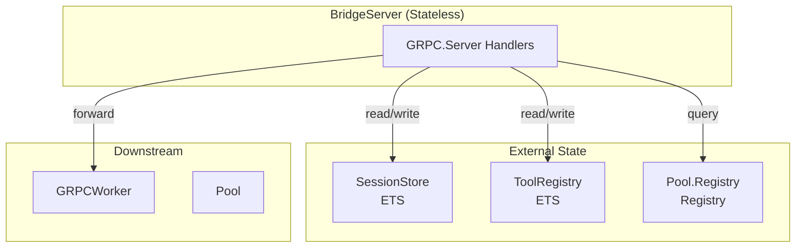
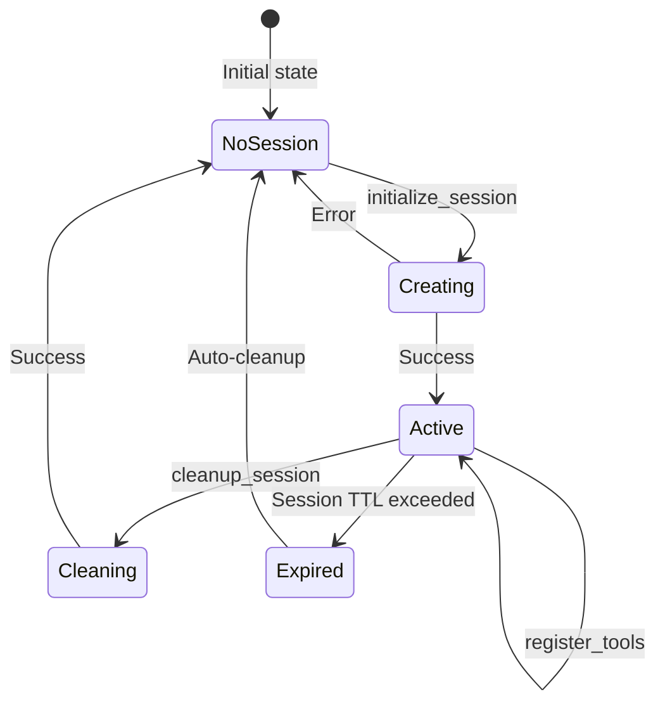
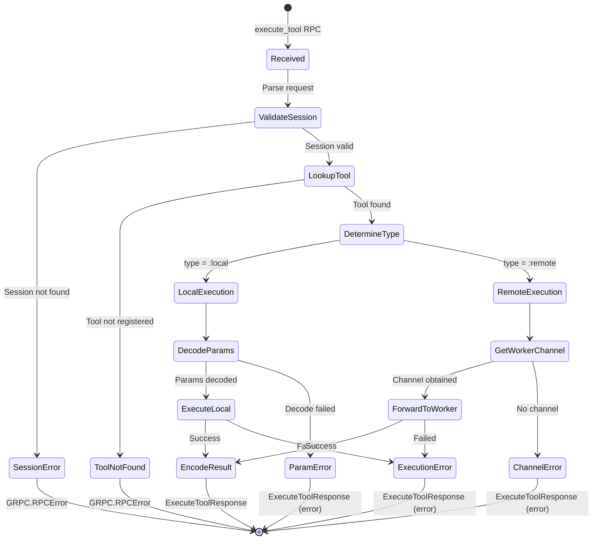
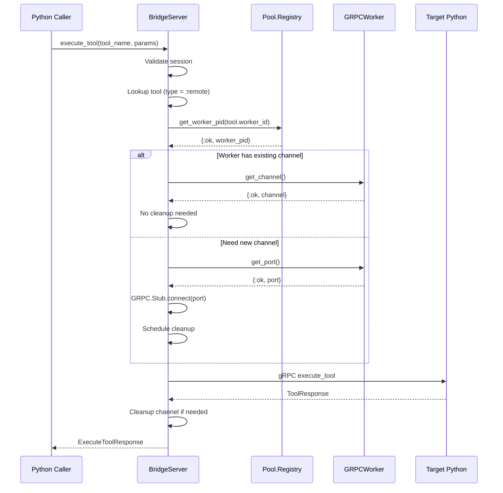
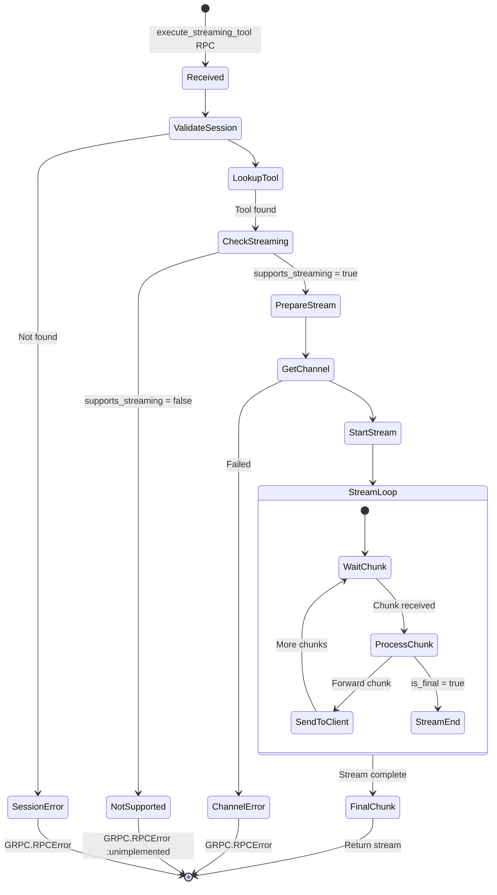
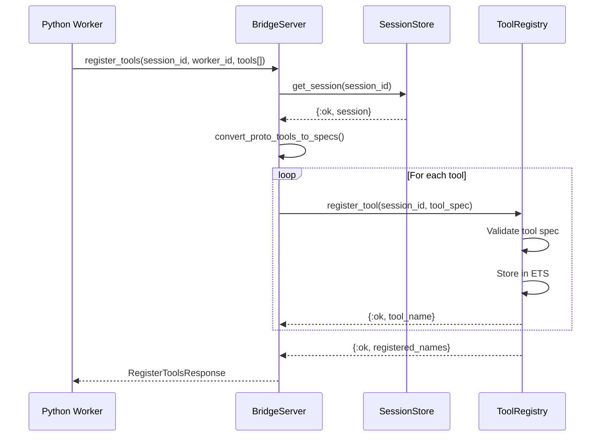
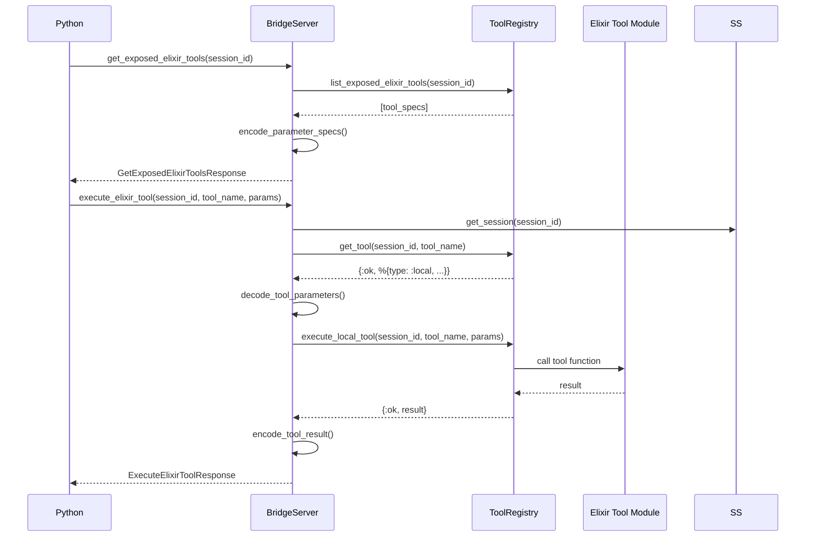
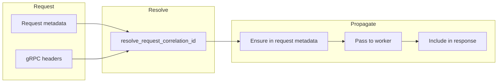

# BridgeServer State Machine Analysis

## Overview

The `Snakepit.GRPC.BridgeServer` module (`lib/snakepit/grpc/bridge_server.ex`) handles incoming gRPC requests from Python processes, managing tool execution and session lifecycle. This document analyzes its request handling patterns and state transitions.

---

## 1. BridgeServer Role

Unlike Pool and GRPCWorker which are GenServers with persistent state, BridgeServer is a **stateless gRPC service handler**. Each RPC call is independent, relying on external state stores (SessionStore, ToolRegistry).



---

## 2. RPC Endpoints

| Endpoint | Type | Purpose |
|----------|------|---------|
| `ping` | Unary | Health check / connectivity test |
| `initialize_session` | Unary | Create new session |
| `cleanup_session` | Unary | Delete session |
| `get_session` | Unary | Retrieve session metadata |
| `heartbeat` | Unary | Keep session alive |
| `execute_tool` | Unary | Execute registered tool |
| `execute_streaming_tool` | Server-stream | Execute with chunked response |
| `register_tools` | Unary | Register Python tools |
| `get_exposed_elixir_tools` | Unary | List available Elixir tools |
| `execute_elixir_tool` | Unary | Call Elixir tool from Python |

---

## 3. Session Management Flow



### Session Operations

```elixir
# Initialize Session (bridge_server.ex:55-72)
def initialize_session(request, _stream) do
  case SessionStore.create_session(request.session_id, metadata: request.metadata) do
    {:ok, _session} ->
      %InitializeSessionResponse{success: true, ...}
    {:error, reason} ->
      raise GRPC.RPCError, status: :internal, message: format_error(reason)
  end
end

# Cleanup Session (bridge_server.ex:75-87)
def cleanup_session(%CleanupSessionRequest{session_id: session_id}, _stream) do
  SessionStore.delete_session(session_id)
  %CleanupSessionResponse{success: true, resources_cleaned: 1}
end
```

---

## 4. Tool Execution State Machine



### Tool Execution Code Flow

```elixir
# Main execute_tool handler (bridge_server.ex:135-173)
def execute_tool(%ExecuteToolRequest{} = request, stream) do
  start_time = System.monotonic_time(:millisecond)
  correlation_id = resolve_request_correlation_id(request, stream)
  request = ensure_request_correlation(request, correlation_id)

  with {:ok, _session} <- SessionStore.get_session(request.session_id),
       {:ok, tool} <- ToolRegistry.get_tool(request.session_id, request.tool_name),
       {:ok, result} <- execute_tool_handler(tool, request, request.session_id, correlation_id) do
    # Success response
    execution_time = System.monotonic_time(:millisecond) - start_time
    {encoded_result, binary_result} = encode_tool_result(result)
    %ExecuteToolResponse{success: true, result: encoded_result, ...}
  else
    {:error, reason} ->
      %ExecuteToolResponse{success: false, error_message: format_error(reason), ...}
  end
end
```

---

## 5. Remote Tool Forwarding



### Worker Channel Management

```elixir
# Ensure worker channel (bridge_server.ex:448-462)
defp ensure_worker_channel(worker_id) do
  case get_existing_worker_channel(worker_id) do
    {:ok, channel} ->
      {:ok, channel, fn -> :ok end}  # No cleanup needed

    {:error, _reason} ->
      with {:ok, port} <- get_worker_port(worker_id),
           {:ok, channel} <- create_worker_channel(port) do
        {:ok, channel, fn -> disconnect_channel(channel) end}
      end
  end
end

# Get existing channel from worker (bridge_server.ex:464-471)
defp get_existing_worker_channel(worker_id) do
  with {:ok, pid, metadata} <- fetch_worker_safely(worker_id),
       :ok <- validate_worker_module(metadata) do
    GRPCWorker.get_channel(pid)
  end
end
```

---

## 6. Streaming Tool Execution



### Stream Forwarding Implementation

```elixir
# Forward stream from worker to client (bridge_server.ex:612-648)
defp forward_worker_stream(worker_stream, grpc_stream, start_time_ms, tool) do
  acc0 = %{sent: 0, final_seen?: false}

  result =
    Enum.reduce_while(worker_stream, acc0, fn item, acc ->
      case normalize_stream_item(item) do
        {:ok, %ToolChunk{} = chunk} ->
          final_seen? = acc.final_seen? or chunk.is_final
          chunk = maybe_decorate_final_chunk(chunk, start_time_ms, tool)

          case safe_send_reply(grpc_stream, chunk) do
            :ok -> {:cont, %{acc | sent: acc.sent + 1, final_seen?: final_seen?}}
            {:error, reason} -> {:halt, {:error, {:stream_send_failed, reason}}}
          end

        :skip -> {:cont, acc}
        {:error, reason} -> {:halt, {:error, reason}}
      end
    end)

  # Ensure final chunk sent
  case result do
    {:error, reason} -> {:error, reason}
    %{final_seen?: true} -> :ok
    %{final_seen?: false} = acc ->
      send_synthetic_final_chunk(grpc_stream, start_time_ms, tool, acc.sent)
  end
end
```

---

## 7. Tool Registration Flow



### Tool Spec Conversion

```elixir
# Convert protobuf tools to internal specs (bridge_server.ex:801-816)
defp convert_proto_tools_to_specs(tools, worker_id) do
  Enum.map(tools, fn tool_reg ->
    %{
      name: tool_reg.name,
      description: tool_reg.description,
      parameters: tool_reg.parameters,
      metadata: Map.put(
        tool_reg.metadata,
        "supports_streaming",
        to_string(tool_reg.supports_streaming)
      ),
      worker_id: worker_id
    }
  end)
end
```

---

## 8. Elixir Tool Exposure

BridgeServer also allows Python to call Elixir tools:



---

## 9. Error Handling Patterns

| Error Type | gRPC Status | Handler |
|------------|-------------|---------|
| Session not found | `NOT_FOUND` | `raise GRPC.RPCError` |
| Tool not found | `NOT_FOUND` | `raise GRPC.RPCError` |
| Invalid parameters | `INVALID_ARGUMENT` | Return error in response |
| Streaming not supported | `UNIMPLEMENTED` | `raise GRPC.RPCError` |
| Worker unavailable | `UNAVAILABLE` | Return error in response |
| Internal error | `INTERNAL` | `raise GRPC.RPCError` |

### Error Formatting

```elixir
# Error format handlers (bridge_server.ex:740-770)
defp format_error(reason) when is_binary(reason), do: reason
defp format_error(reason) when is_atom(reason), do: to_string(reason)
defp format_error({:error, reason}), do: format_error(reason)
defp format_error({:invalid_parameter, key, reason}), do: "Invalid parameter #{key}: ..."
defp format_error({:remote_execution_failed, reason}), do: "Remote tool execution failed: ..."
defp format_error(reason), do: inspect(reason)
```

---

## 10. Correlation ID Flow



---

## 11. Modularization Implications

### Components to Move to snakepit-runtime

- Entire `GRPC.BridgeServer` module
- Tool parameter encoding/decoding
- Stream forwarding logic
- Correlation ID handling

### Dependencies to Abstract

| Current | Abstraction Needed |
|---------|-------------------|
| `PoolRegistry.get_worker_pid` | WorkerRegistry behaviour |
| `PoolRegistry.fetch_worker` | WorkerRegistry behaviour |
| `GRPCWorker.get_channel` | RuntimeWorker behaviour |

### Coupling Points to Resolve

1. **Line 331**: `PoolRegistry.get_worker_pid(worker_id)` - Abstract
2. **Line 474**: `PoolRegistry.fetch_worker(worker_id)` - Abstract
3. **Line 481**: `GRPCWorker` type check - Use behaviour

---

*Generated: 2026-01-11*
*Source: lib/snakepit/grpc/bridge_server.ex (974 lines)*
