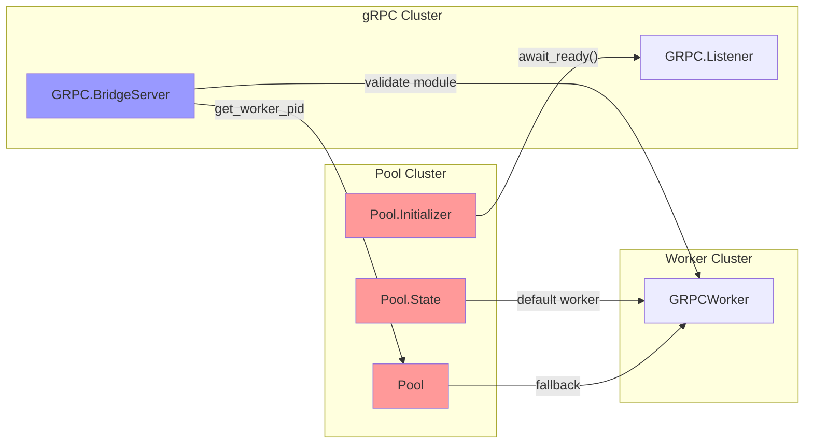
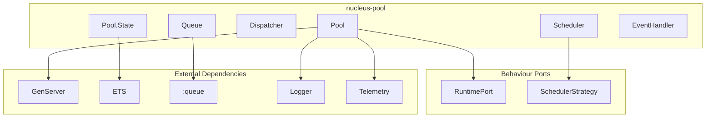
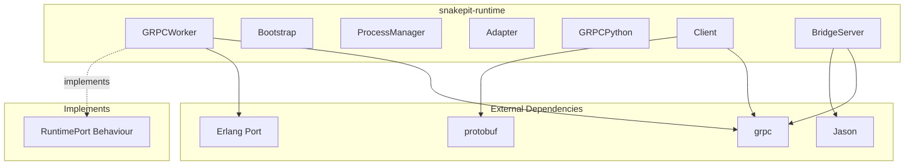
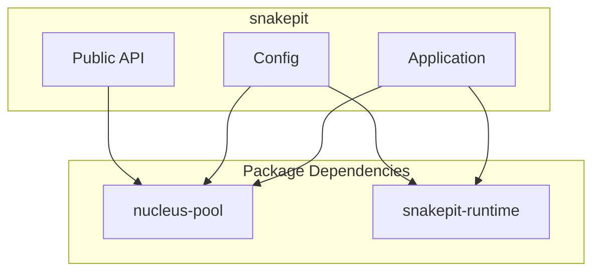
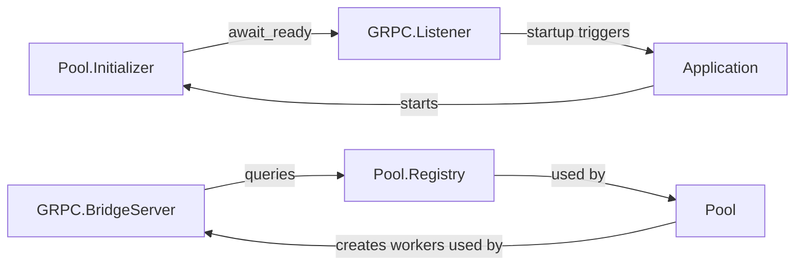

# Snakepit Module Dependency Graph

## Overview

This document provides a comprehensive analysis of module dependencies within the Snakepit codebase. Understanding these dependencies is critical for planning the modularization into separate libraries.

---

## 1. High-Level Module Clusters

```mermaid
graph TB
    subgraph "Application Cluster"
        App[Snakepit.Application]
        Config[Snakepit.Config]
        Defaults[Snakepit.Defaults]
        Shutdown[Snakepit.Shutdown]
    end

    subgraph "Pool Cluster"
        Pool[Snakepit.Pool]
        PoolState[Pool.State]
        PoolDispatcher[Pool.Dispatcher]
        PoolEventHandler[Pool.EventHandler]
        PoolInitializer[Pool.Initializer]
        PoolQueue[Pool.Queue]
        PoolScheduler[Pool.Scheduler]
        PoolRegistry[Pool.Registry]
        WorkerSupervisor[Pool.WorkerSupervisor]
        WorkerStarter[Pool.Worker.Starter]
    end

    subgraph "Worker Cluster"
        GRPCWorker[Snakepit.GRPCWorker]
        WorkerBootstrap[GRPCWorker.Bootstrap]
        WorkerInstrumentation[GRPCWorker.Instrumentation]
        ProcessManager[Worker.ProcessManager]
        LifecycleManager[Worker.LifecycleManager]
        Configuration[Worker.Configuration]
    end

    subgraph "gRPC Cluster"
        GRPCListener[GRPC.Listener]
        GRPCBridgeServer[GRPC.BridgeServer]
        GRPCClient[GRPC.Client]
        GRPCEndpoint[GRPC.Endpoint]
    end

    subgraph "Bridge Cluster"
        SessionStore[Bridge.SessionStore]
        ToolRegistry[Bridge.ToolRegistry]
        Session[Bridge.Session]
    end

    subgraph "Adapter Cluster"
        AdapterBehaviour[Snakepit.Adapter]
        GRPCPython[Adapters.GRPCPython]
    end

    subgraph "Support Cluster"
        Error[Snakepit.Error]
        Logger[Snakepit.Logger]
        CrashBarrier[Snakepit.CrashBarrier]
        Telemetry[Snakepit.Telemetry]
    end

    App --> Pool
    App --> GRPCListener
    App --> WorkerSupervisor
    App --> SessionStore

    Pool --> PoolState
    Pool --> PoolDispatcher
    Pool --> PoolEventHandler
    Pool --> PoolInitializer
    Pool --> GRPCWorker
    Pool --> PoolRegistry
    Pool --> CrashBarrier

    PoolInitializer --> GRPCListener
    PoolInitializer --> WorkerSupervisor

    GRPCWorker --> WorkerBootstrap
    GRPCWorker --> GRPCClient
    GRPCWorker --> ProcessManager
    GRPCWorker --> GRPCPython

    GRPCBridgeServer --> SessionStore
    GRPCBridgeServer --> ToolRegistry
    GRPCBridgeServer --> PoolRegistry
    GRPCBridgeServer --> GRPCWorker

    GRPCPython --> AdapterBehaviour
```



---

## 2. Detailed Dependency Matrix

### 2.1 Pool Module Dependencies

| Module | Depends On | Depended By |
|--------|------------|-------------|
| `Pool` | State, Dispatcher, EventHandler, Initializer, Queue, Scheduler, Registry, Config, Defaults, Error, Logger, CrashBarrier, Shutdown, GRPCWorker | Application, BridgeServer |
| `Pool.State` | Config, Defaults | Pool, Dispatcher, EventHandler |
| `Pool.Dispatcher` | State, Queue, Config, Defaults, Error | Pool |
| `Pool.EventHandler` | State, Queue, Config, Defaults, Logger | Pool |
| `Pool.Initializer` | State, Config, Defaults, Logger, WorkerSupervisor, **GRPC.Listener** | Pool |
| `Pool.Registry` | - (Registry wrapper) | Pool, GRPCWorker, BridgeServer |
| `Pool.WorkerSupervisor` | WorkerStarter | Pool, Initializer |

### 2.2 Worker Module Dependencies

| Module | Depends On | Depended By |
|--------|------------|-------------|
| `GRPCWorker` | Bootstrap, Instrumentation, Client, ProcessManager, LifecycleManager, Registry, Defaults, Error, Logger | Pool, BridgeServer |
| `GRPCWorker.Bootstrap` | ProcessManager, Configuration, Defaults, Logger | GRPCWorker |
| `Worker.ProcessManager` | PythonRuntime, Logger | GRPCWorker, Bootstrap |
| `Worker.LifecycleManager` | Config, Defaults | GRPCWorker, Pool |

### 2.3 gRPC Module Dependencies

| Module | Depends On | Depended By |
|--------|------------|-------------|
| `GRPC.Listener` | Config, Defaults, Logger | Application, **Pool.Initializer** |
| `GRPC.BridgeServer` | SessionStore, ToolRegistry, **PoolRegistry**, **GRPCWorker**, Client, Logger | Endpoint |
| `GRPC.Client` | Protobuf modules, Error | GRPCWorker, BridgeServer |
| `GRPC.Endpoint` | BridgeServer | Listener |

### 2.4 Bridge Module Dependencies

| Module | Depends On | Depended By |
|--------|------------|-------------|
| `Bridge.SessionStore` | Session, Defaults, Logger | BridgeServer, Pool |
| `Bridge.ToolRegistry` | Defaults, Logger | BridgeServer |
| `Bridge.Session` | - | SessionStore |

---

## 3. Cross-Cluster Dependencies (Coupling Points)

These are the **problematic dependencies** that must be resolved for clean modularization:



### Coupling Points Detail

| # | From | To | Location | Type | Severity |
|---|------|-----|----------|------|----------|
| 1 | Pool.Initializer | GRPC.Listener | `initializer.ex:119-127` | Direct call | **HIGH** |
| 2 | Pool.State | GRPCWorker | `state.ex:40` | Default value | HIGH |
| 3 | Pool | GRPCWorker | `pool.ex:1491-1493` | Fallback | HIGH |
| 4 | GRPC.BridgeServer | Pool.Registry | `bridge_server.ex:331` | Query | MEDIUM |
| 5 | GRPC.BridgeServer | Pool.Registry | `bridge_server.ex:474` | Query | MEDIUM |
| 6 | GRPC.BridgeServer | GRPCWorker | `bridge_server.ex:481` | Type check | MEDIUM |
| 7 | Pool.Dispatcher | CrashBarrier | `dispatcher.ex` | Integration | LOW |
| 8 | Pool.EventHandler | LifecycleManager | `event_handler.ex` | Integration | LOW |

---

## 4. Dependency Direction Analysis

### 4.1 Current (Problematic) Direction

```
Pool Layer ←→ gRPC Layer (bidirectional coupling)
```

Both layers depend on each other, creating a cycle that prevents clean separation.

### 4.2 Target (Clean) Direction

```
Integration Layer → Pool Layer → Runtime Behaviour ← Runtime Implementation
```

Pool depends on abstract behaviour, runtime implements behaviour, integration wires them together.

---

## 5. Module Size Analysis

| Module | Lines | Functions | Complexity |
|--------|-------|-----------|------------|
| `pool/pool.ex` | 1655 | 82 | Very High |
| `grpc_worker.ex` | 1112 | 56 | High |
| `grpc/bridge_server.ex` | 974 | 45 | High |
| `pool/initializer.ex` | 401 | 23 | Medium |
| `adapters/grpc_python.ex` | 368 | 18 | Medium |
| `pool/state.ex` | 200 | 14 | Low |
| `pool/dispatcher.ex` | ~250 | 15 | Medium |
| `pool/event_handler.ex` | ~200 | 12 | Medium |

---

## 6. Dependency by Package (Future Structure)

### 6.1 nucleus-pool Dependencies



**External deps**: Only Elixir/OTP standard libraries

### 6.2 snakepit-runtime Dependencies



**External deps**: grpc, protobuf, jason

### 6.3 snakepit (Integration) Dependencies



---

## 7. Circular Dependency Analysis

### Current Cycles Detected



### Resolution Strategy

1. **Break Listener dependency**: Use callback/event instead of direct call
2. **Abstract Registry**: Create behaviour for worker lookup
3. **Inject worker module**: Configuration-based instead of hardcoded

---

## 8. Import Analysis

### Most Imported Modules

| Module | Import Count | By Modules |
|--------|--------------|------------|
| `Snakepit.Defaults` | 25+ | Nearly all modules |
| `Snakepit.Logger` | 20+ | Most modules |
| `Snakepit.Error` | 15+ | Pool, Worker, gRPC |
| `Snakepit.Config` | 12+ | Pool, Worker, App |
| `Pool.Registry` | 8 | Pool, Worker, Bridge |

### Recommendation

- `Defaults` and `Logger` are utility modules - fine to keep widely imported
- `Error` should move to shared utility package
- `Config` should be split between packages
- `Registry` access should be abstracted behind behaviour

---

## 9. Test Dependency Analysis

Test modules also reveal coupling patterns:

| Test Module | Tests | Dependencies Mocked |
|-------------|-------|---------------------|
| `pool_test.exs` | Pool behaviour | GRPCWorker, Listener |
| `grpc_worker_test.exs` | Worker behaviour | Python process |
| `bridge_server_test.exs` | gRPC endpoints | SessionStore, Registry |
| `integration/*` | Full system | None (full stack) |

**Implication**: Tests already know about coupling points and mock at those boundaries.

---

## 10. Dependency Resolution Roadmap

### Phase 1: Define Abstractions

```elixir
# New behaviour in nucleus-pool
defmodule Nucleus.Ports.Runtime do
  @callback init(config) :: {:ok, state} | {:error, reason}
  @callback execute(state, command, args, opts) :: result
  @callback terminate(reason, state) :: :ok
end

# New behaviour for startup coordination
defmodule Nucleus.Pool.InitCallback do
  @callback pre_worker_init(pool_state) :: :ok | {:error, reason}
  @callback post_worker_init(pool_state, workers) :: :ok
end
```

### Phase 2: Inject Dependencies

```elixir
# In pool config
config :nucleus_pool,
  runtime_module: Snakepit.GRPCWorker,
  init_callback: Snakepit.GRPCInitCallback

# Pool uses behaviour instead of hardcoded module
worker_module = Config.get(:runtime_module) || DefaultWorker
```

### Phase 3: Move Modules

| Current Location | New Package | New Location |
|------------------|-------------|--------------|
| `lib/snakepit/pool/` | nucleus-pool | `lib/nucleus/pool/` |
| `lib/snakepit/grpc_worker.ex` | snakepit-runtime | `lib/snakepit/runtime/worker.ex` |
| `lib/snakepit/grpc/` | snakepit-runtime | `lib/snakepit/runtime/grpc/` |
| `lib/snakepit/application.ex` | snakepit | `lib/snakepit/application.ex` |

---

*Generated: 2026-01-11*
*Analysis based on 88 source files in lib/snakepit/*
