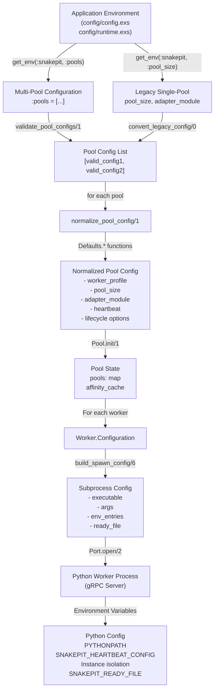
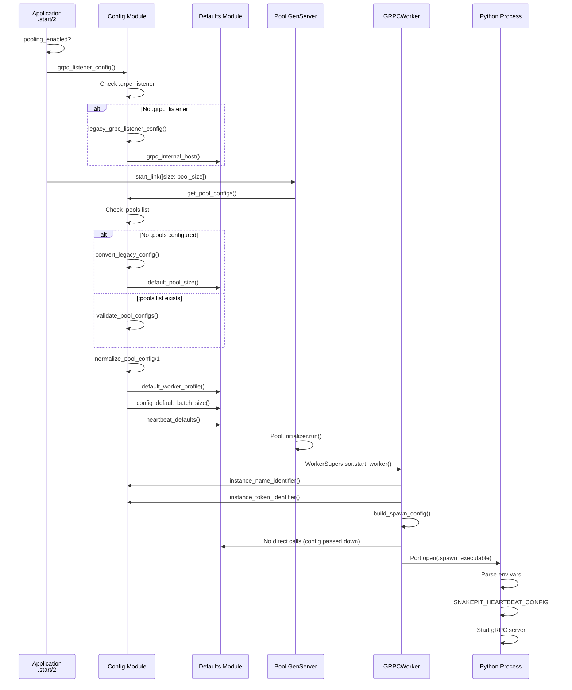

# Snakepit Configuration System Analysis

**Document**: Configuration System Deep Dive  
**Date**: January 11, 2026  
**Scope**: Complete analysis of configuration architecture, scopes, and coupling points

---

## Executive Summary

The Snakepit configuration system is **multi-layered with three independent resolution paths** that can create confusion and maintenance complexity:

1. **Application Configuration** (`Application.get_env/3`) - Elixir's built-in mechanism
2. **Environment Variables** - Runtime overrides
3. **Defaults Module** - Centralized hardcoded fallbacks

Configuration flows through **five distinct scopes** (application → pool → worker → lifecycle → request), with **tight coupling** to specific modules and difficult-to-predict resolution order. The system supports both legacy single-pool and new multi-pool configurations, but the transition logic creates **significant backward compatibility overhead**.

---

## 1. Configuration Module Analysis

### File: `/home/home/p/g/n/snakepit/lib/snakepit/config.ex` (1055 lines)

#### Configuration Structure

The `Config` module implements a **tiered configuration resolution pattern**:

```
┌─────────────────────────────────────────────────────────────────────┐
│ Application.get_env(:snakepit, key)                                 │
│ ↓                                                                   │
│ System.get_env("SNAKEPIT_INSTANCE_NAME")  [Environment Variables]  │
│ ↓                                                                   │
│ Defaults.* functions                       [Hardcoded Defaults]    │
└─────────────────────────────────────────────────────────────────────┘
```

**Key Functions**:

| Function | Purpose | Lines | Notes |
|----------|---------|-------|-------|
| `get_pool_configs/0` | Main entry point for pool resolution | 188-201 | Handles legacy → new config conversion |
| `validate_pool_config/1` | Validates a single pool config | 209-222 | Type checks and constraint validation |
| `normalize_pool_config/1` | Fills in defaults for a pool | 237-282 | Creates canonical config structure |
| `get_pool_config/1` | Retrieves config for named pool | 298-302 | Wrapper around `find_pool_by_name/2` |
| `heartbeat_defaults/0` | Merges heartbeat overrides | 355-359 | Cross-language sync point with Python |

#### Core Resolution Logic

**Lines 188-201: Legacy Config Conversion**

```elixir
def get_pool_configs do
  case Application.get_env(:snakepit, :pools) do
    nil ->
      # Legacy configuration - convert to new format
      convert_legacy_config()
    pools when is_list(pools) ->
      # New multi-pool configuration
      validate_pool_configs(pools)
    invalid ->
      {:error, {:invalid_pools_config, invalid}}
  end
end
```

**Two Configuration Paths Converge Here**:
- **Path 1 (Legacy)**: `pool_size`, `adapter_module`, `pool_config` → converted to modern format
- **Path 2 (New)**: `:pools` list → validated directly

#### Backward Compatibility Handling

**Lines 363-407: `convert_legacy_config/0` - Complex Legacy Translation**

The system maintains support for legacy keys:

```
Legacy Keys                    → Modern Field
─────────────────────────────────────────────
Application.get_env(:snakepit, :pool_size)        → %{pool_size: ...}
Application.get_env(:snakepit, :adapter_module)   → %{adapter_module: ...}
Application.get_env(:snakepit, :pool_config)      → nested fields
Application.get_env(:snakepit, :affinity)         → %{affinity: ...}
Application.get_env(:snakepit, :capacity_strategy) → %{capacity_strategy: ...}
```

**Cost**: 45 lines of conversion + fallback logic spread throughout the system.

#### Validation Pipeline

**Lines 209-222: Multi-Step Validation**

```elixir
def validate_pool_config(config) when is_map(config) do
  with :ok <- validate_required_fields(config),
       :ok <- validate_profile(config),
       :ok <- validate_capacity_strategy(config),
       :ok <- validate_pool_size(config),
       :ok <- validate_affinity(config),
       :ok <- validate_lifecycle_options(config) do
    {:ok, normalize_pool_config(config)}
  end
end
```

Each validator is isolated:
- `validate_required_fields/1` (440-452) - Only checks `:name` is present
- `validate_profile/1` (455-462) - Checks `:worker_profile` ∈ `[:process, :thread]`
- `validate_capacity_strategy/1` (465-475) - Checks `:capacity_strategy` ∈ `[:pool, :profile, :hybrid]`
- `validate_pool_size/1` (478-485) - Checks positive integer
- `validate_affinity/1` (488-506) - Supports string and atom normalization
- `validate_lifecycle_options/1` (509-512) - Delegates to TTL and max_requests validators

#### Normalization to Canonical Form

**Lines 237-282: `normalize_pool_config/1` - Creates Standardized Structure**

Fills in defaults for all configuration levels:

```elixir
base_config =
  config
  |> Map.put_new(:worker_profile, Defaults.default_worker_profile())
  |> Map.put_new(:pool_size, Defaults.default_pool_size())
  |> Map.put_new(:adapter_args, [])
  |> Map.put_new(:adapter_env, [])
  |> Map.put_new(:worker_ttl, :infinity)
  |> Map.put_new(:worker_max_requests, :infinity)
  |> Map.put(:capacity_strategy, capacity_strategy)
  |> Map.put(:affinity, normalize_affinity(...))

heartbeat = merge_with_heartbeat_defaults(...)

case profile do
  :process ->
    base_config
    |> Map.put_new(:startup_batch_size, Defaults.config_default_batch_size())
    |> Map.put_new(:startup_batch_delay_ms, Defaults.config_default_batch_delay())
  :thread ->
    base_config
    |> Map.put_new(:threads_per_worker, Defaults.config_default_threads_per_worker())
    |> Map.put_new(:thread_safety_checks, false)
  _ -> base_config
end
```

**Result**: Guaranteed complete structure with no missing keys.

#### gRPC Listener Configuration

**Lines 597-619: Three Listener Modes**

```elixir
def grpc_listener_config do
  case Application.get_env(:snakepit, :grpc_listener) do
    nil ->
      legacy_grpc_listener_config()        # Fallback to :grpc_port / :grpc_host
    config when is_map(config) or is_list(config) ->
      normalize_grpc_listener_config(config)
    invalid ->
      {:error, {:invalid_grpc_listener_config, invalid}}
  end
end
```

**Three Modes Supported**:

| Mode | Entry | Port Assignment | Use Case |
|------|-------|-----------------|----------|
| `:internal` | Lines 915-926 | OS-assigned (0) | Internal only, workers on localhost |
| `:external` | Lines 929-951 | Fixed port | Single worker on remote host |
| `:external_pool` | Lines 954-982 | Pool from base_port | Multiple workers on different ports |

#### Instance Isolation Configuration

**Lines 677-755: Three Instance-Scoping Mechanisms**

1. **Instance Name** (Lines 679-686): Human-readable identifier
   - Source: `Application.get_env(:snakepit, :instance_name)` OR `System.get_env("SNAKEPIT_INSTANCE_NAME")`
   - Normalization: Lines 757-777 handle empty strings, "nil", "null", "none"

2. **Instance Token** (Lines 691-699): Strong isolation for concurrent runs
   - Source: `Application.get_env(:snakepit, :instance_token)` OR `System.get_env("SNAKEPIT_INSTANCE_TOKEN")`
   - Fallback: `Defaults.instance_token()` (nil by default)

3. **Data Directory** (Lines 746-755): Persistent state location
   - Source: `Application.get_env(:snakepit, :data_dir)` OR `System.get_env("SNAKEPIT_DATA_DIR")`
   - Fallback: `priv/data` subdirectory

#### Heartbeat Configuration Synchronization

**Lines 157-170: Cross-Language Contract**

```elixir
@base_heartbeat_config_template %{
  enabled: true,
  dependent: true
}

@heartbeat_known_keys [
  :enabled,
  :ping_interval_ms,
  :timeout_ms,
  :max_missed_heartbeats,
  :initial_delay_ms,
  :dependent
]
```

**Critical Note** (Lines 99-101):
> Heartbeat options are mirrored in `snakepit_bridge.heartbeat.HeartbeatConfig`, so any new keys added here must be added to the Python struct and documented in the heartbeat guides to keep both sides in sync.

This is a **tight coupling point** - Config changes require Python changes.

---

## 2. Defaults Module Analysis

### File: `/home/home/p/g/n/snakepit/lib/snakepit/defaults.ex` (1233 lines)

#### Comprehensive Default Catalog

The Defaults module centralizes **all hardcoded default values** into getter functions that support runtime overrides via `Application.get_env/3`.

#### Timeout Profiles (Lines 115-149)

A **recent addition (v0.8.8+)** that enables profile-based timeout configuration without code changes:

```elixir
@timeout_profiles %{
  balanced: %{
    default_timeout: 300_000,
    stream_timeout: 900_000,
    queue_timeout: 10_000
  },
  production: %{
    default_timeout: 300_000,
    stream_timeout: 900_000,
    queue_timeout: 10_000
  },
  production_strict: %{
    default_timeout: 60_000,
    stream_timeout: 300_000,
    queue_timeout: 5_000
  },
  development: %{
    default_timeout: 900_000,
    stream_timeout: 3_600_000,
    queue_timeout: 60_000
  },
  ml_inference: %{
    default_timeout: 900_000,
    stream_timeout: 3_600_000,
    queue_timeout: 60_000
  },
  batch: %{
    default_timeout: 3_600_000,
    stream_timeout: :infinity,
    queue_timeout: 300_000
  }
}
```

**Selection** (Lines 164-167):
```elixir
@spec timeout_profile() :: atom()
def timeout_profile do
  Application.get_env(:snakepit, :timeout_profile, :balanced)
end
```

#### Timeout Budget Management (Lines 243-251)

Sophisticated margin-based calculation:

```elixir
@spec rpc_timeout(timeout()) :: timeout()
def rpc_timeout(:infinity), do: :infinity

def rpc_timeout(total_timeout) when is_integer(total_timeout) do
  margins = worker_call_margin_ms() + pool_reply_margin_ms()
  result = total_timeout - margins
  max(result, 1)  # Floor at minimum usable timeout
end
```

**Margins**:
- `worker_call_margin_ms()` = 1000ms (GenServer.call overhead)
- `pool_reply_margin_ms()` = 200ms (Pool reply overhead)

This ensures **inner timeouts expire before outer GenServer.call timeouts**, producing structured errors instead of unhandled exits.

#### Default Organization (Categories)

| Category | Functions | Count | Key Examples |
|----------|-----------|-------|--------------|
| Timeout Profiles | `timeout_profile/0`, `default_timeout/0`, `stream_timeout/0`, `queue_timeout/0` | 4 | Core timing strategies |
| Pool Timeouts | `pool_request_timeout/0`, `pool_streaming_timeout/0`, `pool_queue_timeout/0`, `checkout_timeout/0` | 4 | Operation-specific timeouts |
| Pool Sizing | `default_pool_size/0`, `pool_max_queue_size/0`, `pool_max_workers/0` | 3 | Capacity limits |
| Startup Configuration | `pool_startup_batch_size/0`, `pool_startup_batch_delay_ms/0` | 2 | Batch startup tuning |
| Heartbeat Configuration | `heartbeat_ping_interval_ms/0`, `heartbeat_timeout_ms/0`, `heartbeat_max_missed/0`, `heartbeat_initial_delay_ms/0` | 4 | Worker health monitoring |
| gRPC Configuration | `grpc_num_acceptors/0`, `grpc_max_connections/0`, `grpc_socket_backlog/0`, `grpc_listener_*` | 8+ | Network tuning |
| Lifecycle Management | `lifecycle_check_interval/0`, `lifecycle_health_check_interval/0` | 2 | Worker recycling intervals |
| Instance Isolation | `instance_token/0` | 1 | Runtime scoping |
| Process Registry | `process_registry_cleanup_interval/0`, `process_registry_unregister_cleanup_delay/0` | 3 | PID tracking cleanup |

#### Three-Level Resolution Pattern

Every default function follows this pattern:

```elixir
@spec function_name() :: type()
def function_name do
  Application.get_env(:snakepit, :config_key, hardcoded_default)
end
```

**Example** (Lines 347-351):

```elixir
@spec default_pool_size() :: pos_integer()
def default_pool_size do
  Application.get_env(:snakepit, :default_pool_size, System.schedulers_online() * 2)
end
```

#### Environment Variable Coupling

Defaults module is mostly **isolated from environment variables**, except for a few exceptions:

- `instance_token/0` (Line 878-881): No env var fallback defined here; handled in `Config`
- Most env var reads happen in `Config` module (e.g., `SNAKEPIT_INSTANCE_NAME`)

---

## 3. Worker Configuration

### File: `/home/home/p/g/n/snakepit/lib/snakepit/worker/configuration.ex` (317 lines)

Worker-level configuration bridges pool-level config to actual Python subprocess invocation.

#### Key Functions

| Function | Purpose | Lines |
|----------|---------|-------|
| `resolve_pool_identifier/2` | Determines unique pool ID | 11-22 |
| `normalize_worker_config/5` | Enriches config with worker metadata | 24-30 |
| `build_spawn_config/6` | Constructs subprocess launch parameters | 32-62 |

#### Spawn Configuration Assembly

**Lines 32-62: `build_spawn_config/6` - Converts Config → Subprocess Args**

```elixir
def build_spawn_config(
      adapter,
      worker_config,
      heartbeat_config,
      port,
      elixir_address,
      worker_id
    ) do
  python_executable = adapter.executable_path()
  adapter_args = resolve_adapter_args(adapter, worker_config)
  adapter_env = worker_config
    |> Map.get(:adapter_env, [])
    |> merge_with_default_adapter_env()
  heartbeat_env_json = encode_heartbeat_env(heartbeat_config)
  ready_file = build_ready_file(worker_id)
  script_path = determine_script_path(adapter, adapter_args)
  args = build_spawn_args(adapter_args, port, elixir_address)
  env_entries = build_env_entries(adapter_env, heartbeat_env_json, ready_file)

  %{
    executable: python_executable,
    script_path: script_path,
    args: args,
    process_group?: process_group_spawn?(),
    env_entries: env_entries,
    ready_file: ready_file
  }
end
```

#### Adapter Environment Merging (Lines 213-274)

Complex priority resolution for environment variables:

```elixir
defp merge_with_default_adapter_env(env) do
  existing = normalize_adapter_env_entries(env)
  defaults = default_adapter_env()

  existing_keys =
    existing
    |> Enum.map(fn {key, _} -> String.downcase(key) end)
    |> MapSet.new()

  defaults
  |> Enum.reject(fn {key, _value} -> MapSet.member?(existing_keys, String.downcase(key)) end)
  |> Kernel.++(existing)
end
```

**Default Environment Sources** (Lines 227-273):

1. **PYTHONPATH Construction**:
   ```elixir
   pythonpath =
     [System.get_env("PYTHONPATH"), 
      priv_python, 
      repo_priv_python, 
      snakebridge_priv_python]
     |> Enum.reject(&(&1 in [nil, ""]))
     |> Enum.uniq()
     |> Enum.join(path_sep)
   ```

2. **Python Interpreter Selection**:
   ```elixir
   interpreter =
     Application.get_env(:snakepit, :python_executable) ||
       System.get_env("SNAKEPIT_PYTHON") ||
       GRPCPython.executable_path()
   ```

3. **Process Group Environment**:
   ```elixir
   process_group_env =
     if Application.get_env(:snakepit, :process_group_kill, true) and
          Snakepit.ProcessKiller.process_group_supported?() do
       [{"SNAKEPIT_PROCESS_GROUP", "1"}]
     else
       []
     end
   ```

4. **Extra Runtime Environment**:
   ```elixir
   extra_env =
     Snakepit.PythonRuntime.config()
     |> Map.get(:extra_env, %{})
     |> normalize_adapter_env_entries()
   
   base ++ process_group_env ++ extra_env ++ Snakepit.PythonRuntime.runtime_env()
   ```

#### Heartbeat Environment JSON (Lines 173-194)

Encodes heartbeat config as JSON environment variable:

```elixir
defp encode_heartbeat_env(config) when is_map(config) do
  config
  |> Map.new()
  |> Map.take([
    :enabled,
    :ping_interval_ms,
    :timeout_ms,
    :max_missed_heartbeats,
    :initial_delay_ms,
    :dependent
  ])
  |> Enum.reduce(%{}, fn
    {:ping_interval_ms, value}, acc -> Map.put(acc, "interval_ms", value)
    {key, value}, acc -> Map.put(acc, to_string(key), value)
  end)
  |> Enum.reject(fn {_key, value} -> is_nil(value) end)
  |> Map.new()
  |> case do
    %{} = map when map == %{} -> nil
    map -> Jason.encode!(map)
  end
end
```

This is **passed as `SNAKEPIT_HEARTBEAT_CONFIG` env var** and parsed by Python bridge code.

---

## 4. Lifecycle Configuration

### File: `/home/home/p/g/n/snakepit/lib/snakepit/worker/lifecycle_config.ex` (134 lines)

Isolates the subset of worker configuration needed for lifecycle decisions.

#### Lifecycle Configuration Struct (Lines 11-26)

```elixir
@enforce_keys [:pool_name, :worker_module, :adapter_module, :profile_module]
defstruct [
  :pool_name,
  :pool_identifier,
  :worker_module,
  :adapter_module,
  :worker_profile,
  :profile_module,
  :raw_worker_ttl,
  :worker_ttl_seconds,
  :worker_max_requests,
  :memory_threshold_mb,
  adapter_args: [],
  adapter_env: [],
  base_worker_config: %{}
]
```

#### TTL Normalization (Lines 126-132)

Converts various TTL formats to seconds:

```elixir
defp normalize_ttl(:infinity), do: :infinity
defp normalize_ttl({value, :seconds}) when is_integer(value), do: value
defp normalize_ttl({value, :minutes}) when is_integer(value), do: value * 60
defp normalize_ttl({value, :hours}) when is_integer(value), do: value * 3600
defp normalize_ttl({value, :days}) when is_integer(value), do: value * 86_400
defp normalize_ttl(value) when is_integer(value) and value >= 0, do: value
defp normalize_ttl(_), do: :infinity
```

#### Conversion to Worker Config (Lines 59-63)

Creates a worker config from the canonical lifecycle data:

```elixir
@spec to_worker_config(t(), String.t()) :: map()
def to_worker_config(%__MODULE__{} = config, worker_id) when is_binary(worker_id) do
  config.base_worker_config
  |> Map.put(:worker_id, worker_id)
end
```

---

## 5. Configuration Scopes and Flow

### Scope Hierarchy

```
APPLICATION LEVEL (config/config.exs, config/runtime.exs)
  ↓
  Configuration keys like:
  - :pools, :adapter_module, :pool_size
  - :grpc_listener, :instance_name
  - Timeout profiles, thread limits
  
POOL LEVEL (per-pool configuration)
  ↓
  Config.get_pool_configs() → list of pool configs
  Each pool has:
  - name: atom
  - adapter_module: module
  - pool_size: integer
  - heartbeat: map (pool-specific overrides)
  - worker_profile: :process | :thread
  
WORKER LEVEL (per-worker configuration)
  ↓
  Worker.Configuration.normalize_worker_config()
  Adds:
  - worker_id: string (unique identifier)
  - adapter_args: list
  - adapter_env: list
  - pool_name: atom
  - pool_identifier: atom | nil
  
LIFECYCLE LEVEL (worker recycling decisions)
  ↓
  Worker.LifecycleConfig
  Extracts TTL, max_requests, profile info
  
REQUEST LEVEL (per-request configuration)
  ↓
  opts: keyword() in Pool.execute/3
  Can override:
  - :timeout
  - :deadline_ms
  - :session_id (for affinity)
```

### Resolution Points

| Scope | Function | Resolution Order | File |
|-------|----------|------------------|------|
| Application | `Application.get_env/3` | 1. App config, 2. System env (manual), 3. Default | config/config.exs |
| Pool | `Config.get_pool_configs/0` | 1. `:pools` list, 2. Legacy conversion | config.ex:188-201 |
| Pool | `Config.normalize_pool_config/1` | 1. User input, 2. Profile defaults, 3. Base defaults | config.ex:237-282 |
| Worker | `Config.heartbeat_defaults/0` | 1. `:heartbeat` override, 2. Legacy per-key, 3. Base template | config.ex:355-359 |
| Lifecycle | `LifecycleConfig.build/3` | 1. Config value, 2. Inline default (map), 3. Base module default | lifecycle_config.ex:65-117 |
| Request | Caller | 1. Call option, 2. Defaults.pool_request_timeout/0 | pool.ex:61-85 |

---

## 6. Configuration Flow in Application Startup

### From Application Start to Worker Ready

```
Snakepit.Application.start/2
  │
  ├─ configure_logging() [lines 340-351]
  │  └─ Application.get_env(:snakepit, :grpc_log_level)
  │
  ├─ Check pooling_enabled [line 68]
  │  └─ Application.get_env(:snakepit, :pooling_enabled, false)
  │
  ├─ Set Python thread limits [lines 36-65]
  │  └─ Application.get_env(:snakepit, :python_thread_limits)
  │  └─ PythonThreadLimits.resolve()
  │
  ├─ Start gRPC Listener [line 118]
  │  └─ Config.grpc_listener_config()
  │     ├─ Application.get_env(:snakepit, :grpc_listener)
  │     └─ Fallback: legacy_grpc_listener_config() [lines 858-871]
  │
  ├─ Start Pool (if pooling_enabled) [line 136]
  │  └─ {Snakepit.Pool, [size: pool_size]}
  │
  └─ Pool initialization via Snakepit.Pool.init/1
     └─ resolve_pool_configs() [pool.ex:1006-1020]
        └─ Config.get_pool_configs()
           ├─ Check Application.get_env(:snakepit, :pools)
           └─ Fallback: convert_legacy_config() [config.ex:363-407]
```

### Worker Startup Subprocess Creation

```
Snakepit.Pool.WorkerSupervisor spawns worker
  │
  └─ Snakepit.GRPCWorker.start_link/1
     │
     ├─ Worker.Configuration.build_spawn_config/6
     │  ├─ resolver_adapter_args() [lines 86-94]
     │  │  └─ Map.get(worker_config, :adapter_args, [])
     │  │  └─ Fallback: adapter.script_args()
     │  │
     │  ├─ merge_with_default_adapter_env() [lines 213-225]
     │  │  ├─ User adapter_env [from pool config]
     │  │  ├─ Default env: PYTHONPATH, interpreter, process group, extra
     │  │  └─ User env takes precedence
     │  │
     │  ├─ build_spawn_args() [lines 107-114]
     │  │  ├─ adapter_args
     │  │  ├─ --port (from gRPC listener)
     │  │  ├─ --elixir-address
     │  │  ├─ --snakepit-run-id [from ProcessRegistry.get_beam_run_id()]
     │  │  ├─ --snakepit-instance-name [from Config.instance_name_identifier()]
     │  │  └─ --snakepit-instance-token [from Config.instance_token_identifier()]
     │  │
     │  └─ build_env_entries() [lines 166-171]
     │     ├─ adapter_env entries
     │     ├─ SNAKEPIT_HEARTBEAT_CONFIG [encoded from heartbeat config]
     │     ├─ SNAKEPIT_READY_FILE
     │     └─ SNAKEPIT_LOG_LEVEL
     │
     └─ Port.open(:spawn_executable, options)
        └─ Python subprocess starts with environment variables
```

---

## 7. Multi-Pool Configuration

### Configuration Format

#### Legacy Single-Pool (Still Supported)

```elixir
config :snakepit,
  adapter_module: Snakepit.Adapters.GRPCPython,
  pool_size: 100,
  pool_config: %{
    startup_batch_size: 8,
    startup_batch_delay_ms: 750
  }
```

**Converted to** (Lines 363-407):
```elixir
[%{
  name: :default,
  worker_profile: :process,
  pool_size: 100,
  adapter_module: Snakepit.Adapters.GRPCPython,
  adapter_args: [],
  adapter_env: [],
  capacity_strategy: :pool,
  affinity: :hint,
  startup_batch_size: 8,
  startup_batch_delay_ms: 750,
  # ... plus all normalized defaults
}]
```

#### Modern Multi-Pool Configuration

```elixir
config :snakepit,
  pools: [
    %{
      name: :default,
      worker_profile: :process,
      pool_size: 100,
      adapter_module: Snakepit.Adapters.GRPCPython,
      heartbeat: %{ping_interval_ms: 3_000}
    },
    %{
      name: :hpc,
      worker_profile: :thread,
      pool_size: 4,
      threads_per_worker: 16,
      adapter_module: Snakepit.Adapters.GRPCPython
    }
  ]
```

**Validation** (Lines 409-427):
```elixir
defp validate_pool_configs(pools) do
  results = Enum.map(pools, fn pool -> validate_pool_config(pool) end)
  
  errors = Enum.filter(results, fn {:error, _} -> true; _ -> false end)
  
  if Enum.empty?(errors) do
    configs = Enum.map(results, fn {:ok, config} -> config end)
    check_duplicate_names(configs)
  else
    {:error, {:validation_failed, errors}}
  end
end
```

#### Duplicate Name Detection (Lines 429-437)

```elixir
defp check_duplicate_names(configs) do
  names = Enum.map(configs, & &1.name)
  duplicates = names -- Enum.uniq(names)

  if Enum.empty?(duplicates) do
    {:ok, configs}
  else
    {:error, {:duplicate_pool_names, duplicates}}
  end
end
```

### Multi-Pool State Management

In `Snakepit.Pool` (Lines 34-47):

```elixir
defstruct [
  :pools,                    # Map of pool_name => State
  :affinity_cache,           # Shared across all pools
  :default_pool,             # Default pool name for backward compatibility
  initializing: false,
  init_start_time: nil,
  reconcile_ref: nil
]
```

**Pool Resolution** (pool.ex:1006-1020):
```elixir
defp resolve_pool_configs do
  case Config.get_pool_configs() do
    {:ok, configs} when is_list(configs) and configs != [] ->
      SLog.info(@log_category, "Initializing #{length(configs)} pool(s)")
      {:ok, configs}
    {:ok, []} ->
      SLog.warning(@log_category, "No pool configs found, using legacy defaults")
      {:ok, [%{name: :default}]}
    {:error, reason} ->
      SLog.error(@log_category, "Pool configuration error: #{inspect(reason)}")
      {:error, {:invalid_pool_config, reason}}
  end
end
```

---

## 8. Mermaid Diagrams

### Configuration Hierarchy



### Configuration Resolution Flow



---

## 9. Configuration Coupling Analysis

### Tight Coupling Points

#### 1. Cross-Language Heartbeat Synchronization (CRITICAL)

**File**: `config.ex` Lines 99-101, 157-170, 544-589

```
Snakepit.Config
    ↓ (Must match)
snakepit_bridge.heartbeat.HeartbeatConfig (Python)
```

**Problem**: Adding a heartbeat config key requires:
1. Adding to `@heartbeat_known_keys` (line 162-169)
2. Adding to Python `HeartbeatConfig` struct
3. Updating heartbeat guides
4. Both changes must be in sync, or workers won't start

**Impact**: Breaking changes possible if Python bridge isn't updated.

#### 2. Application Configuration Dependencies

**Pattern**: Direct reads from application config throughout the system

Files with `Application.get_env(:snakepit, ...)` calls:
- `application.ex`: 7 calls (Lines 38, 68, 74, 107, 162, 187, 269, 278, 280, 354)
- `config.ex`: 30+ calls spread throughout
- `worker/configuration.ex`: 4 calls (Lines 100, 162, 251, 302)
- `pool/pool.ex`: 1 call (Line 62)
- `defaults.ex`: 50+ calls (one per default function)
- Many other modules

**Problem**: Configuration is not a single module concern; distributed throughout codebase. Changes to config keys could affect many files.

#### 3. Adapter Module Coupling

**Pattern**: Config assumes specific adapter interface

Files: `config.ex` Lines 375, `worker/configuration.ex` Lines 40, 90, 96-104

```elixir
adapter.executable_path()        # Expected interface
adapter.script_args()            # Expected interface
adapter.script_path()            # Expected interface
```

**Problem**: If adding a new adapter type, must implement these methods. No adapter registry or discovery mechanism.

#### 4. Default-Dependent Initialization Order

**Pattern**: Defaults module assumes certain application state

Example: `config.ex` Line 374
```elixir
pool_size: Application.get_env(:snakepit, :pool_size, Defaults.default_pool_size())
```

**Problem**: If `default_pool_size()` changes (reads from app config), effects cascade unpredictably through initialization.

#### 5. Worker Profile Module Discovery (Lines 340-346)

```elixir
@spec get_profile_module(pool_config()) :: module()
def get_profile_module(config) when is_map(config) do
  case Map.get(config, :worker_profile, :process) do
    :process -> Snakepit.WorkerProfile.Process
    :thread -> Snakepit.WorkerProfile.Thread
  end
end
```

**Problem**: Hardcoded module paths. Adding a new profile type requires code changes to Config module.

#### 6. Instance Isolation Scattered Across Multiple Modules

**Pattern**: Instance name/token referenced in 4+ files

- `config.ex`: 30+ lines (resolution, normalization, identifiers)
- `worker/configuration.ex`: 20+ lines (adds to spawn args)
- `pool/process_registry.ex`: Used for cleanup
- `pool/application_cleanup.ex`: Used for cleanup

**Problem**: Instance isolation logic is implicit and scattered. Changing isolation strategy requires edits in multiple places.

---

## 10. Recommendations for Decoupling

### Priority 1: Formalize Configuration Protocol

**Goal**: Reduce scattered `Application.get_env/3` calls

```elixir
# Create a Configuration Context module
defmodule Snakepit.ConfigContext do
  @moduledoc "Single source of truth for runtime configuration"
  
  def get_app_config(key, default \\ nil) do
    Application.get_env(:snakepit, key, default)
  end
  
  def get_system_override(env_key, app_key) do
    System.get_env(env_key) || Application.get_env(:snakepit, app_key)
  end
  
  # ... wrap all direct Application.get_env calls
end
```

**Impact**:
- Centralizes all config access in one module
- Makes it easier to inject test configuration
- Enables configuration validation at a single point
- Reduces coupling to Application module

### Priority 2: Decouple Heartbeat Config Schema

**Goal**: Eliminate cross-language synchronization burden

```elixir
# Create a protocol-based approach
defmodule Snakepit.Heartbeat.ConfigValidator do
  @doc "Validates heartbeat config against schema"
  def validate(config) do
    required_keys = [
      :enabled,
      :ping_interval_ms,
      :timeout_ms,
      :max_missed_heartbeats,
      :initial_delay_ms,
      :dependent
    ]
    
    case validate_keys(config, required_keys) do
      :ok -> {:ok, config}
      error -> error
    end
  end
  
  defp validate_keys(config, required_keys) do
    missing = Enum.filter(required_keys, &(not Map.has_key?(config, &1)))
    if Enum.empty?(missing), do: :ok, else: {:error, {:missing_keys, missing}}
  end
end
```

**Then in tests**: Mock/validate that Python receives what Elixir sends.

### Priority 3: Introduce Configuration Builder Pattern

**Goal**: Make multi-pool configuration more discoverable

```elixir
defmodule Snakepit.PoolConfigBuilder do
  def new(name) do
    %{
      name: name,
      worker_profile: :process,
      adapter_module: Snakepit.Adapters.GRPCPython
    }
  end
  
  def with_size(config, size) do
    Map.put(config, :pool_size, size)
  end
  
  def with_profile(config, profile) do
    Map.put(config, :worker_profile, profile)
  end
  
  def with_heartbeat(config, heartbeat_overrides) do
    Map.put(config, :heartbeat, heartbeat_overrides)
  end
  
  # ... chainable methods
end
```

**Usage**:
```elixir
config :snakepit,
  pools: [
    Snakepit.PoolConfigBuilder.new(:default)
      |> .with_size(100)
      |> .with_profile(:process),
    
    Snakepit.PoolConfigBuilder.new(:hpc)
      |> .with_size(4)
      |> .with_profile(:thread)
  ]
```

### Priority 4: Extract Adapter Registry Pattern

**Goal**: Decouple hardcoded adapter discovery

```elixir
defmodule Snakepit.AdapterRegistry do
  @doc "Register an adapter module for configuration resolution"
  def register(name, module, opts \\ []) do
    Application.put_env(:snakepit, {:adapter, name}, module)
  end
  
  def get_adapter(name) do
    Application.get_env(:snakepit, {:adapter, name})
  end
  
  def resolve_module(config) do
    module = Map.get(config, :adapter_module)
    
    if module && Code.ensure_loaded?(module) do
      {:ok, module}
    else
      {:error, {:adapter_not_found, module}}
    end
  end
end
```

### Priority 5: Separate Validation from Normalization

**Goal**: Make config pipeline more testable and composable

```elixir
defmodule Snakepit.ConfigPipeline do
  def validate_and_normalize(raw_config) do
    with :ok <- validate_structure(raw_config),
         :ok <- validate_values(raw_config),
         normalized <- apply_defaults(raw_config),
         :ok <- validate_normalized(normalized) do
      {:ok, normalized}
    end
  end
end
```

**Enables**:
- Testing validation without normalization
- Incremental validation (early error detection)
- Composition with other validators
- Better error messages

### Priority 6: Eliminate Legacy Config Path

**Goal**: Reduce maintenance burden

**Timeline**:
1. Deprecation period (1-2 releases): Log warnings for legacy config
2. Next major version: Remove legacy conversion logic

**Benefits**:
- Simpler `Config.get_pool_configs/0`
- Fewer test cases (no legacy conversion tests)
- Clearer mental model (one config path)

**Migration guide** (in documentation):
```elixir
# BEFORE (Legacy)
config :snakepit,
  adapter_module: Snakepit.Adapters.GRPCPython,
  pool_size: 100

# AFTER (Modern)
config :snakepit,
  pools: [
    %{
      name: :default,
      adapter_module: Snakepit.Adapters.GRPCPython,
      pool_size: 100
    }
  ]
```

---

## 11. Configuration Coupling Matrix

| Component | Coupled To | Type | Severity | File Reference |
|-----------|-----------|------|----------|---|
| Config | Defaults | Hard (calls) | Medium | config.ex:239-277 |
| Config | Application env | Hard (direct) | High | config.ex:throughout |
| Worker.Configuration | Config | Hard (calls) | High | worker/config.ex:142-154 |
| Worker.Configuration | Adapter module | Hard (interface) | Medium | worker/config.ex:40,90,96 |
| Worker.LifecycleConfig | Config | Medium (copied vals) | Low | lifecycle_config.ex:74-75 |
| Heartbeat Config | Python bridge | Hard (schema) | High | config.ex:99-101 |
| gRPC Listener | Config | Hard (calls) | High | application.ex:233 |
| Pool | Config | Hard (calls) | High | pool.ex:1007 |
| Pool | Application env | Medium (indirect) | Medium | pool.ex:62 |
| Defaults | Application env | Medium (fallback) | Medium | defaults.ex:throughout |
| Instance Isolation | Config + multiple modules | Medium (scattered) | Medium | config.ex:679-755, worker/config.ex:141-159 |

---

## 12. Summary of Key Findings

### Strengths

1. **Comprehensive defaults mechanism**: Every configurable parameter has a documented default (Defaults module)
2. **Backward compatibility**: Legacy single-pool configuration still works
3. **Profile-based timeouts**: Recent addition (v0.8.8+) enables powerful deployment strategies
4. **Structured heartbeat config**: JSON encoding ensures Python side works correctly
5. **Multi-pool support**: Modern configuration format is clean and extensible

### Weaknesses

1. **Three resolution paths for configuration**: Application env, System env, and Defaults make it hard to predict resolution order
2. **Scattered configuration access**: 50+ files call `Application.get_env/3` directly
3. **Legacy code path**: Supporting old config format adds 45 lines of conversion logic
4. **Cross-language schema coupling**: Heartbeat config changes require Python updates
5. **Implicit configuration defaults**: Not obvious which defaults apply at which scope
6. **No configuration registry**: Adapter modules are hardcoded strings in Config
7. **Complex environment merging**: Worker env variable handling spans 60+ lines with 4-level nesting

### Risks

1. **Configuration validation happens late**: Pool configs only validated when Pool starts (could fail at runtime)
2. **No configuration preview**: Can't print what the effective configuration will be without tracing through all scopes
3. **Difficult to test configuration changes**: Config is baked into application at startup
4. **Instance isolation logic is scattered**: Changes to isolation strategy require edits in 4+ files
5. **Heartbeat config is source of truth in Elixir**: Python side is a copy; sync issues possible

---

## 13. Files Modified by Configuration System

Core configuration files:
- `/home/home/p/g/n/snakepit/lib/snakepit/config.ex` (1055 lines)
- `/home/home/p/g/n/snakepit/lib/snakepit/defaults.ex` (1233 lines)
- `/home/home/p/g/n/snakepit/lib/snakepit/worker/configuration.ex` (317 lines)
- `/home/home/p/g/n/snakepit/lib/snakepit/worker/lifecycle_config.ex` (134 lines)
- `/home/home/p/g/n/snakepit/lib/snakepit/application.ex` (361 lines)

Configuration usage in 25+ other files throughout the codebase.

---

**Document Complete** | Generated: 2026-01-11 | Analyst: Configuration System Specialist
