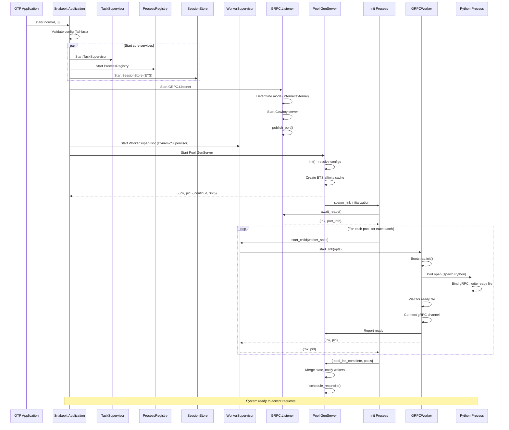
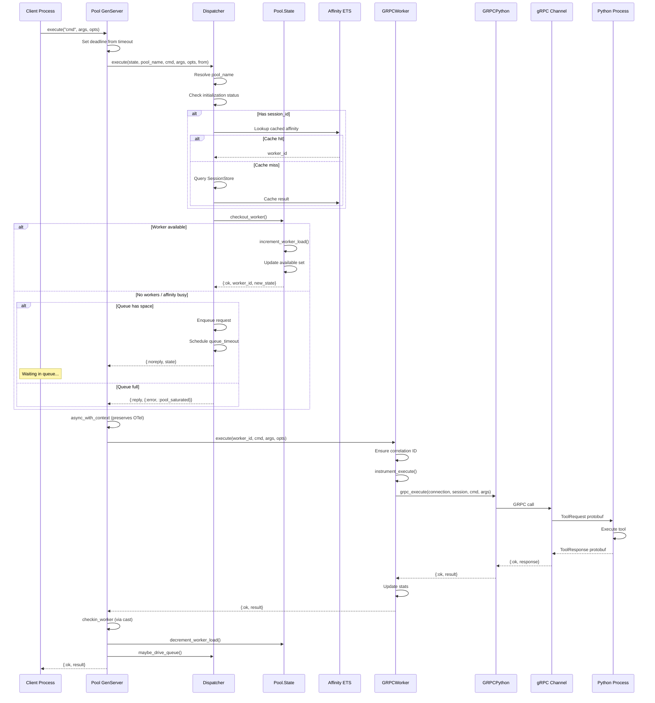
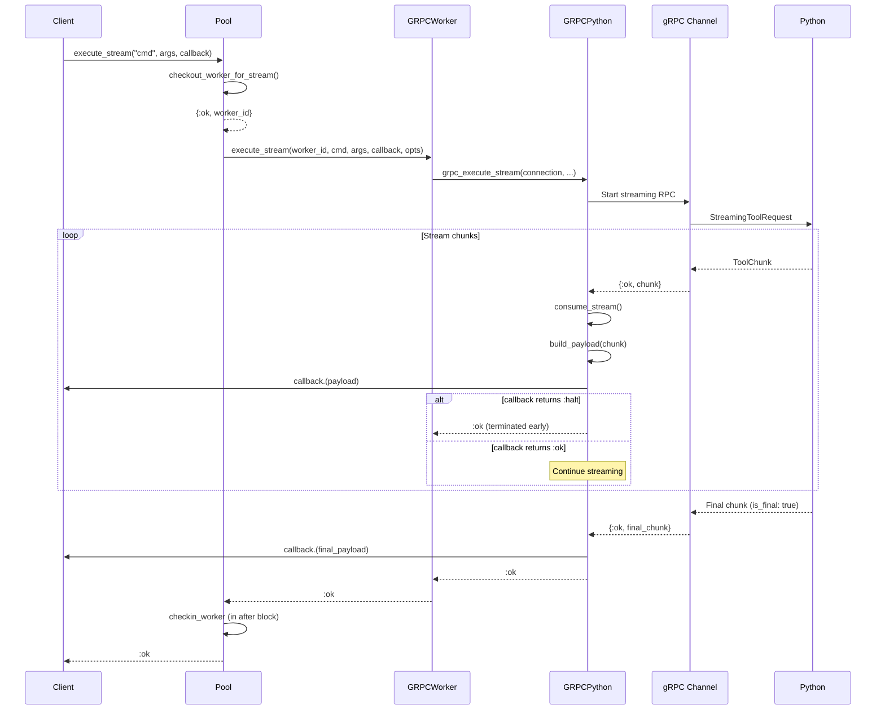
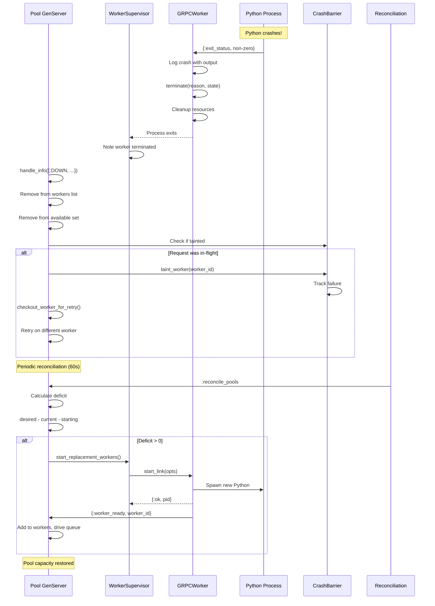
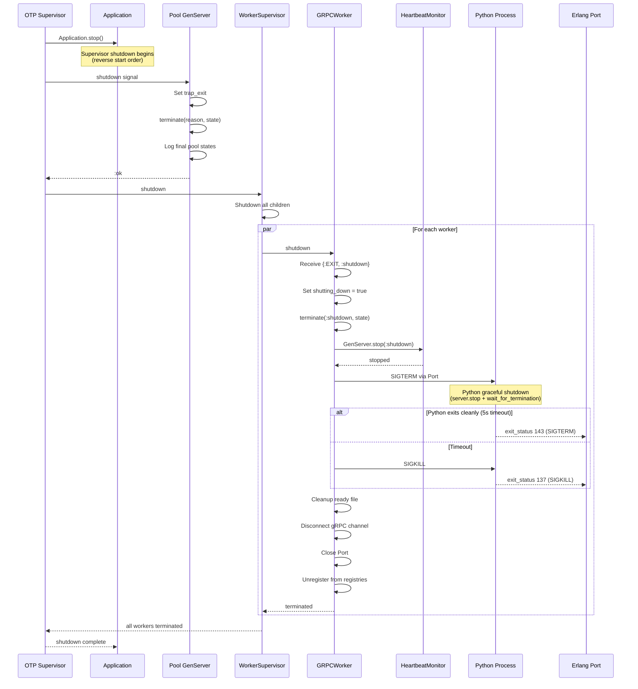
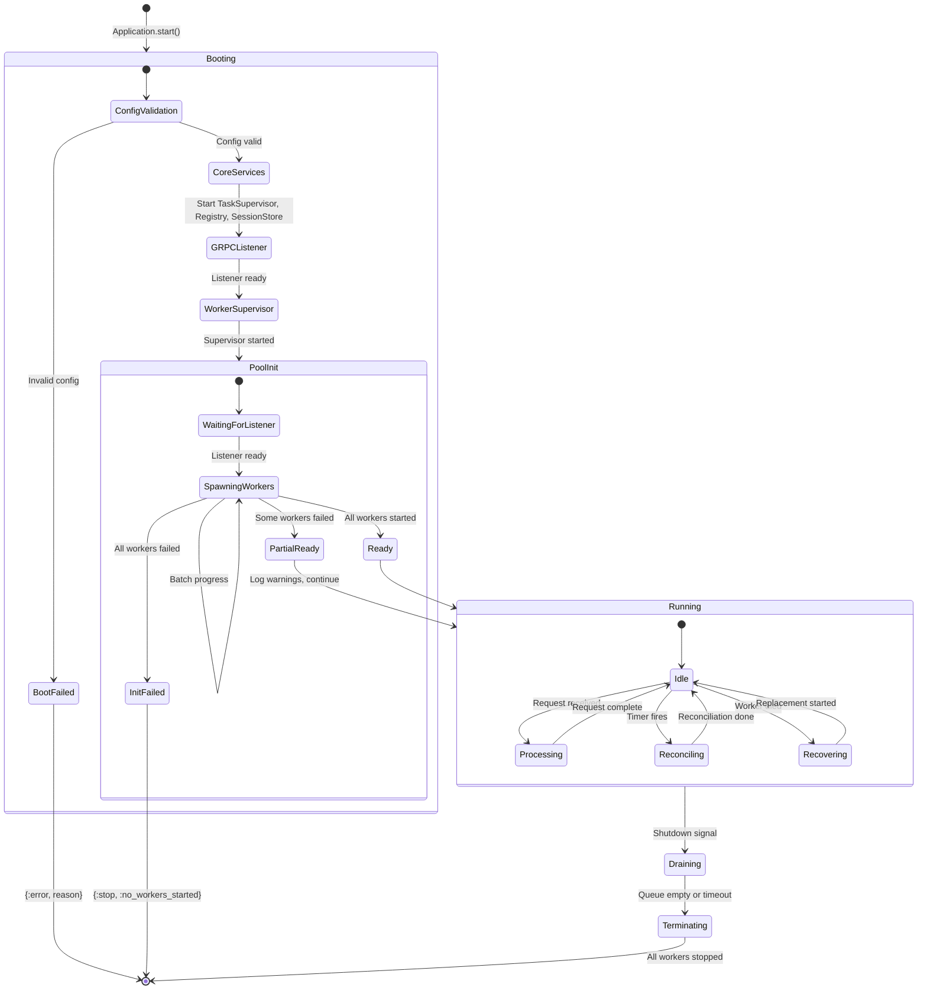
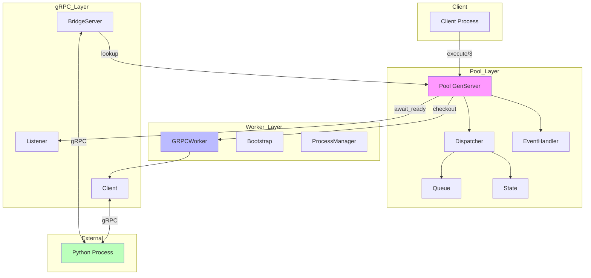
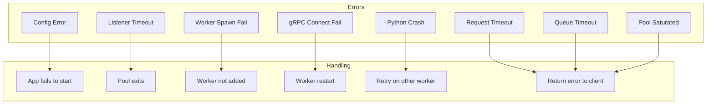

# Combined System State Machine

## Overview

This document provides system-wide state machine diagrams showing how all Snakepit components interact during key operations: startup, request handling, failure recovery, and shutdown.

---

## 1. System Startup Sequence

---

## 2. Request Lifecycle

---

## 3. Streaming Request Flow

---

## 4. Worker Failure and Recovery

---

## 5. Graceful Shutdown Sequence

---

## 6. Combined High-Level State Machine

---

## 7. Message Flow Diagram

---

## 8. Timing Constraints

| Operation | Timeout | Configurable |
|-----------|---------|--------------|
| Pool startup | 120s | `startup_timeout` |
| Listener ready | 30s | `listener_await_timeout_ms` |
| Worker gRPC connect | 5 retries, ~1.5s max | Internal |
| Request execution | 300s | `timeout` option |
| Streaming execution | 600s | `timeout` option |
| Queue wait | 30s | `queue_timeout` |
| Health check interval | 30s | `health_check_interval` |
| Heartbeat interval | 10s | `ping_interval_ms` |
| Graceful shutdown | 6s | `graceful_shutdown_timeout_ms` |
| Supervisor shutdown | 8s | Derived (graceful + 2s) |
| Reconciliation interval | 60s | `reconcile_interval_ms` |

---

## 9. Error Propagation Paths

---

*Generated: 2026-01-11*
*Combines analysis from Pool, GRPCWorker, and BridgeServer state machines*
