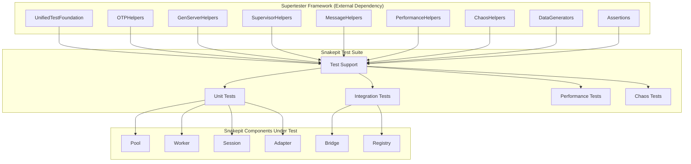

# Design Document

## Overview

This design outlines the comprehensive test infrastructure overhaul for Snakepit using the Supertester framework (github.com/nshkrdotcom/supertester), following the established OTP testing standards documented in docs/code-standards/comprehensive-otp-testing-standards.md.

The current state shows critical gaps including:
- **Minimal test coverage** (only basic module existence test)
- **No OTP-compliant testing patterns** 
- **No usage of proven test helpers** from Supertester
- **No adherence to established code standards**

The solution involves integrating Snakepit with Supertester as a test dependency, implementing all tests using Supertester's OTP helpers, and following the comprehensive testing standards to achieve reliable, maintainable tests.

## Architecture

### High-Level Architecture



### Dependency Integration

```elixir
# In snakepit/mix.exs
defp deps do
  [
    # ... existing deps ...
    {:supertester, github: "nshkrdotcom/supertester", only: :test}
  ]
end
```

### Test Organization Following Code Standards

```
test/
├── support/
│   ├── snakepit_test_helpers.ex    # Snakepit-specific helpers using Supertester
│   ├── mock_adapter.ex              # Mock adapter following OTP patterns
│   └── test_scenarios.ex            # Common test scenarios
├── unit/
│   ├── pool_test.exs               # Using Supertester.OTPHelpers
│   ├── worker_test.exs             # Using Supertester.GenServerHelpers
│   ├── session_test.exs            # Using Supertester isolation
│   ├── adapter_test.exs            # Using Supertester mocking
│   └── bridge_protocol_test.exs    # Using Supertester assertions
├── integration/
│   ├── pool_worker_test.exs        # Using Supertester.SupervisorHelpers
│   ├── session_pool_test.exs       # Using Supertester integration patterns
│   └── registry_test.exs           # Using Supertester.MessageHelpers
├── performance/
│   ├── pool_benchmark_test.exs     # Using Supertester.PerformanceHelpers
│   └── stress_test.exs             # Using Supertester workload patterns
└── chaos/
    ├── worker_failure_test.exs      # Using Supertester.ChaosHelpers
    └── pool_recovery_test.exs       # Using Supertester recovery verification
```

## Components and Interfaces

### 1. Test Support Integration with Supertester

#### Snakepit.TestHelpers
**Purpose**: Snakepit-specific test utilities built on top of Supertester.

```elixir
defmodule Snakepit.TestHelpers do
  @moduledoc """
  Snakepit-specific test helpers built on Supertester framework.
  Follows comprehensive-otp-testing-standards.md patterns.
  """
  
  import Supertester.OTPHelpers
  import Supertester.GenServerHelpers
  import Supertester.DataGenerators
  
  @doc """
  Sets up an isolated Snakepit pool using Supertester patterns.
  No Process.sleep, proper OTP synchronization.
  """
  def with_isolated_pool(opts \\ [], fun) do
    pool_name = unique_process_name("snakepit_pool")
    
    pool_opts = Keyword.merge([
      name: pool_name,
      size: 2,
      adapter: Snakepit.MockAdapter
    ], opts)
    
    {:ok, pool} = setup_isolated_genserver(Snakepit.Pool, "pool_test", pool_opts)
    
    # Wait for pool initialization using OTP patterns
    wait_for_genserver_sync(pool)
    
    try do
      fun.(pool)
    after
      cleanup_on_exit(fn -> GenServer.stop(pool) end)
    end
  end
  
  @doc """
  Creates test adapter configuration using Supertester patterns.
  """
  def test_adapter_config(overrides \\ []) do
    Keyword.merge([
      module: Snakepit.MockAdapter,
      startup_delay: 0,
      command_delay: 0,
      failure_rate: 0
    ], overrides)
  end
  
  @doc """
  Waits for pool to have expected worker count without sleep.
  """
  def wait_for_worker_count(pool, expected_count, timeout \\ 5000) do
    # Use Supertester's wait pattern
    wait_until(fn ->
      {:ok, stats} = call_with_timeout(pool, :get_stats)
      length(stats.workers) == expected_count
    end, timeout)
  end
end
```

#### Snakepit.MockAdapter
**Purpose**: OTP-compliant mock adapter for testing.

```elixir
defmodule Snakepit.MockAdapter do
  @behaviour Snakepit.Adapter
  
  use GenServer
  import Supertester.OTPHelpers
  
  # Adapter behaviour implementation following OTP patterns
  def start_worker(config, opts \\ []) do
    # Use Supertester's isolated process creation
    name = unique_process_name("mock_worker")
    GenServer.start_link(__MODULE__, {config, opts}, name: name)
  end
  
  def execute_command(worker_pid, command, args, opts \\ []) do
    call_with_timeout(worker_pid, {:execute, command, args, opts})
  end
  
  def stop_worker(worker_pid, reason) do
    GenServer.stop(worker_pid, reason)
  end
  
  # GenServer callbacks with test controls
  def init({config, _opts}) do
    state = %{
      config: config,
      responses: %{},
      delays: %{},
      command_history: [],
      failure_injection: nil
    }
    {:ok, state}
  end
  
  def handle_call({:execute, command, args, _opts}, _from, state) do
    # Record command for verification
    state = update_in(state.command_history, &[{command, args, System.monotonic_time()} | &1])
    
    # Apply configured delays without Process.sleep
    if delay = state.delays[command] do
      # Use OTP timer instead of sleep
      Process.send_after(self(), {:delayed_response, command}, delay)
      {:noreply, state}
    else
      response = get_response(state, command, args)
      {:reply, response, state}
    end
  end
  
  # Test control functions
  def set_response(worker_pid, command, response) do
    GenServer.call(worker_pid, {:set_response, command, response})
  end
  
  def inject_failure(worker_pid, failure_type) do
    GenServer.call(worker_pid, {:inject_failure, failure_type})
  end
end
```

### 2. Unit Test Specifications Using Supertester

#### Pool Manager Tests
```elixir
defmodule Snakepit.PoolTest do
  use ExUnit.Case, async: true
  
  import Supertester.OTPHelpers
  import Supertester.GenServerHelpers
  import Supertester.Assertions
  import Snakepit.TestHelpers
  
  describe "pool initialization" do
    test "starts with configured number of workers" do
      with_isolated_pool([size: 3], fn pool ->
        # No Process.sleep needed
        wait_for_worker_count(pool, 3)
        assert_genserver_state(pool, fn state ->
          length(state.workers) == 3
        end)
      end)
    end
    
    test "handles concurrent worker initialization" do
      # Supertester handles concurrent testing properly
      operations = for i <- 1..5, do: {:call, :get_stats}
      
      with_isolated_pool([size: 5], fn pool ->
        {:ok, results} = concurrent_calls(pool, operations, 5)
        assert Enum.all?(results, &match?({:ok, _}, &1))
      end)
    end
    
    test "respects startup timeout configuration" do
      slow_adapter = test_adapter_config(startup_delay: 100)
      
      assert_raise RuntimeError, ~r/startup timeout/, fn ->
        with_isolated_pool([adapter_config: slow_adapter, startup_timeout: 50], fn _pool ->
          :ok
        end)
      end
    end
  end
  
  describe "request handling with OTP patterns" do
    setup do
      {:ok, pool} = setup_isolated_genserver(Snakepit.Pool, "request_test", size: 2)
      %{pool: pool}
    end
    
    test "distributes requests to available workers", %{pool: pool} do
      # Use Supertester's stress testing
      {:ok, stats} = stress_test_server(pool, [
        {:call, {:execute, "ping", %{}, []}},
        {:call, {:execute, "ping", %{}, []}},
        {:call, {:execute, "ping", %{}, []}}
      ], 5000)
      
      assert stats.completed == 3
      assert stats.errors == 0
    end
    
    test "queues requests when workers busy" do
      # Test without Process.sleep using Supertester patterns
      with_isolated_pool([size: 1], fn pool ->
        # Make worker busy
        task1 = Task.async(fn ->
          call_with_timeout(pool, {:execute, "slow", %{}, []}, 5000)
        end)
        
        # Ensure first request is processing
        wait_for_genserver_sync(pool)
        
        # Second request should queue
        task2 = Task.async(fn ->
          call_with_timeout(pool, {:execute, "fast", %{}, []}, 5000)
        end)
        
        # Verify queueing using OTP patterns
        assert_genserver_state(pool, fn state ->
          :queue.len(state.request_queue) > 0
        end)
        
        Task.await_many([task1, task2])
      end)
    end
  end
  
  describe "worker management following OTP standards" do
    test "tracks worker state accurately" do
      import Supertester.SupervisorHelpers
      
      with_isolated_pool([size: 3], fn pool ->
        # Get worker PIDs safely
        {:ok, stats} = get_server_state_safely(pool)
        worker_pids = stats.workers
        
        # Verify all workers alive
        Enum.each(worker_pids, &assert_process_alive/1)
        
        # Kill a worker
        [worker | _] = worker_pids
        Process.exit(worker, :kill)
        
        # Wait for supervisor recovery without sleep
        wait_for_process_death(worker)
        wait_for_supervisor_restart(pool)
        
        # Verify pool recovered
        assert_genserver_responsive(pool)
        wait_for_worker_count(pool, 3)
      end)
    end
  end
end
```

#### Session Management Tests
```elixir
defmodule Snakepit.SessionTest do
  use ExUnit.Case, async: true
  
  import Supertester.OTPHelpers
  import Supertester.DataGenerators
  import Supertester.Assertions
  import Snakepit.TestHelpers
  
  describe "session affinity with OTP patterns" do
    test "maintains worker affinity across requests" do
      session_id = unique_session_id("test")
      
      with_isolated_pool([size: 3], fn pool ->
        # First request establishes affinity
        {:ok, result1} = Snakepit.execute_in_session(session_id, "get_pid", %{})
        worker_pid1 = result1.pid
        
        # Subsequent requests use same worker
        for _ <- 1..5 do
          {:ok, result} = Snakepit.execute_in_session(session_id, "get_pid", %{})
          assert result.pid == worker_pid1
        end
        
        # Different session uses different worker
        other_session = unique_session_id("other")
        {:ok, result2} = Snakepit.execute_in_session(other_session, "get_pid", %{})
        
        # May get same worker with small pool, but verify session tracking
        assert_genserver_state(pool, fn state ->
          Map.has_key?(state.sessions, session_id) and
          Map.has_key?(state.sessions, other_session)
        end)
      end)
    end
    
    test "handles concurrent session operations" do
      # Use Supertester's concurrent testing
      session_ids = for i <- 1..10, do: unique_session_id("concurrent_#{i}")
      
      with_isolated_pool([size: 5], fn pool ->
        # Concurrent session creation
        tasks = for session_id <- session_ids do
          Task.async(fn ->
            Snakepit.execute_in_session(session_id, "init", %{})
          end)
        end
        
        results = Task.await_many(tasks, 5000)
        assert Enum.all?(results, &match?({:ok, _}, &1))
        
        # Verify all sessions tracked
        assert_genserver_state(pool, fn state ->
          Enum.all?(session_ids, &Map.has_key?(state.sessions, &1))
        end)
      end)
    end
  end
end
```

### 3. Integration Tests Using Supertester

```elixir
defmodule Snakepit.PoolWorkerIntegrationTest do
  use ExUnit.Case, async: true
  
  import Supertester.SupervisorHelpers
  import Supertester.OTPHelpers
  import Supertester.Assertions
  
  describe "pool-worker supervision integration" do
    test "pool supervisor restarts failed workers" do
      {:ok, supervisor} = setup_isolated_supervisor(
        Snakepit.WorkerSupervisor,
        "integration_test"
      )
      
      # Start pool under supervisor
      {:ok, pool} = Supervisor.start_child(supervisor, {
        Snakepit.Pool,
        [name: unique_process_name("supervised_pool"), size: 3]
      })
      
      # Get initial worker
      [worker | _] = get_child_pids(supervisor)
      
      # Test restart strategy
      test_child_restart_strategies(supervisor, [
        {:kill_child, worker, :one_for_one}
      ])
      
      # Verify pool still functional
      assert_genserver_responsive(pool)
      assert_all_children_alive(supervisor)
    end
  end
end
```

### 4. Performance Tests Using Supertester

```elixir
defmodule Snakepit.PoolBenchmarkTest do
  use ExUnit.Case, async: false
  
  import Supertester.PerformanceHelpers
  import Snakepit.TestHelpers
  
  @tag :benchmark
  describe "pool performance benchmarks" do
    test "measures throughput with varying worker counts" do
      for worker_count <- [1, 2, 4, 8, 16] do
        with_isolated_pool([size: worker_count], fn pool ->
          result = benchmark_operations([
            {"simple command", fn -> 
              Snakepit.execute("echo", %{msg: "test"}, pool: pool)
            end}
          ], 1000)
          
          assert_performance_within_bounds(result, %{
            max_time: 5000,
            min_throughput: worker_count * 100  # ops/sec
          })
        end)
      end
    end
    
    test "workload pattern testing" do
      with_isolated_pool([size: 4], fn pool ->
        # Test different workload patterns from Supertester
        for pattern <- [:steady, :burst, :ramp_up] do
          result = workload_pattern_test(
            fn -> Snakepit.execute("work", %{}, pool: pool) end,
            pattern
          )
          
          # No regression from baseline
          assert_no_performance_regression(result, get_baseline(pattern))
        end
      end)
    end
  end
end
```

### 5. Chaos Tests Using Supertester

```elixir
defmodule Snakepit.WorkerFailureChaosTest do
  use ExUnit.Case, async: true
  
  import Supertester.ChaosHelpers
  import Supertester.Assertions
  import Snakepit.TestHelpers
  
  @tag :chaos
  describe "worker failure resilience" do
    test "recovers from random worker crashes" do
      with_isolated_pool([size: 5], fn pool ->
        # Get initial state
        {:ok, initial_state} = GenServer.call(pool, :get_stats)
        
        # Inject random failures
        chaos_scenario = [
          {:random_process_kill, 2, 1000},
          {:memory_pressure, 50, 2000},
          {:cpu_spike, 90, 1000}
        ]
        
        # Run chaos test
        {:ok, chaos_result} = chaos_test_orchestrator(
          chaos_scenario,
          :sequential,
          target: pool
        )
        
        # Verify recovery
        {:ok, recovery_verified} = verify_system_recovery(
          initial_state,
          timeout: 10_000
        )
        
        assert recovery_verified
        assert_genserver_responsive(pool)
        assert_resilience_to_chaos(pool, chaos_scenario)
      end)
    end
  end
end
```

## Test Execution Strategy

### Following Code Standards

All tests must follow docs/code-standards/comprehensive-otp-testing-standards.md:

1. **Zero Process.sleep** - Use Supertester synchronization helpers
2. **Isolated processes** - Use Supertester's unique naming
3. **Proper monitoring** - Use Supertester's lifecycle helpers
4. **OTP patterns** - Follow Supertester's established patterns

### CI/CD Integration

```yaml
# .github/workflows/test.yml
test:
  steps:
    - name: Run tests with Supertester
      run: |
        mix deps.get
        mix test --cover
        mix test.pattern_check  # Verify no Process.sleep
        mix test.isolation_check # Verify proper isolation
```

### Quality Gates

- All tests must use `async: true` with Supertester isolation
- Zero Process.sleep usage (enforced by pattern check)
- >90% code coverage
- All Supertester assertions must pass
- Follow comprehensive-otp-testing-standards.md

## Success Metrics

### Quantitative Metrics
- **Test coverage** >90% using Supertester patterns
- **Test execution** <30 seconds with async: true
- **Zero Process.sleep** usage verified by tooling
- **All tests use Supertester** helpers and assertions
- **Performance baselines** established with PerformanceHelpers

### Qualitative Metrics
- **Consistent with code standards** in comprehensive-otp-testing-standards.md
- **Educational value** demonstrating proper Supertester usage
- **Maintainable tests** following established patterns
- **Clear diagnostics** from Supertester assertions
- **Reliable CI/CD** with no flaky tests