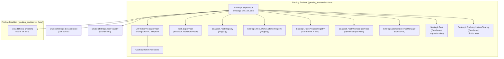

# Snakepit Supervision Tree

The following Mermaid diagram captures the runtime supervision tree that
`Snakepit.Application` boots. Two sets of children exist:

- **Base services** always start (session store + tool registry).
- **Pooling branch** activates when `:pooling_enabled` is true, which is the
  typical production configuration.

**Notes**

- `GRPC.Server.Supervisor` encapsulates `Snakepit.GRPC.Endpoint` which exposes
  the Elixir bridge services.
- `Snakepit.Pool.WorkerSupervisor` dynamically supervises worker GenServers
  (`Snakepit.GRPCWorker` et al.) under a `:one_for_one` strategy.
- `Snakepit.Pool.ProcessRegistry` tracks external OS PIDs and run IDs to ensure
  cleanup routines know which processes belong to the current BEAM instance.
- `Snakepit.Pool.ApplicationCleanup` is intentionally listed last so it
  terminates first and can reap external processes before other supervisors
  shut down.
