# Snakepit Supervision Tree

The following Mermaid diagram captures the runtime supervision tree that
`Snakepit.Application` boots. Two sets of children exist:

- **Base services** always start (session/tool registries, PID tracking, cleanup).
- **Pooling branch** activates when `:pooling_enabled` is true, which is the
  typical production configuration.

```mermaid
flowchart TD
    A["Snakepit.Supervisor\n(strategy: one_for_one)"]
    A --> B["Snakepit.Bridge.SessionStore\n(GenServer)"]
    A --> C["Snakepit.Bridge.ToolRegistry\n(GenServer)"]
    A --> C1["Snakepit.Pool.Registry\n(Registry)"]
    A --> C2["Snakepit.Pool.ProcessRegistry\n(GenServer + ETS/DETS)"]
    A --> C3["Snakepit.ETSOwner\n(GenServer)"]
    A --> C4["Task.Supervisor\n(Snakepit.TaskSupervisor)"]
    A --> C5["Snakepit.Pool.ApplicationCleanup\n(GenServer)\nstops after pool children"]

    subgraph "Pooling Enabled (:pooling_enabled == true)"
        direction TB
        A --> D["Snakepit.GRPC.ClientSupervisor\n(Supervisor)"]
        A --> E["Snakepit.GRPC.Listener\n(GenServer)"]
        E --> E1["Cowboy/Ranch Acceptors"]
        A --> F["Snakepit.Telemetry.GrpcStream\n(GenServer)"]
        A --> G["Snakepit.Pool.Worker.StarterRegistry\n(Registry)"]
        A --> H["Snakepit.WorkerProfile.Thread.CapacityStore\n(GenServer)"]
        A --> I["Snakepit.Pool.WorkerSupervisor\n(DynamicSupervisor)"]
        A --> J["Snakepit.Worker.LifecycleManager\n(GenServer)"]
        A --> K["Snakepit.Pool\n(GenServer)\nrequest routing"]
    end

    subgraph "Pooling Disabled (:pooling_enabled == false)"
        direction TB
        A --> M["(no additional children)\nuseful for tests"]
    end
```

**Notes**

- `Snakepit.GRPC.Listener` starts the gRPC endpoint on an ephemeral or explicit
  port and publishes the assigned port for worker bootstraps.
- `Snakepit.Pool.WorkerSupervisor` dynamically supervises worker GenServers
  (`Snakepit.GRPCWorker` et al.) under a `:one_for_one` strategy.
- `Snakepit.Pool.ProcessRegistry` tracks external OS PIDs and run IDs to ensure
  cleanup routines know which processes belong to the current BEAM instance.
- `Snakepit.ETSOwner` owns shared ETS tables to ensure table persistence
  across the application lifecycle:
  - `:snakepit_worker_taints` - Used by the crash barrier to track tainted workers
  - `:snakepit_zero_copy_handles` - Used by DLPack/Arrow zero-copy transfers

  **Why centralized ownership matters**: ETS tables are destroyed when their
  owning process exits. If a short-lived process (e.g., a Task spawned during
  pool initialization) creates a table, that table disappears when the Task
  completes. By delegating table creation to ETSOwner, tables persist for the
  full application lifetime regardless of which process first triggers their
  creation.

  ETSOwner is a "base child" (always started) because the taint registry and
  zero-copy systems must be available even when pooling is disabled (e.g., in
  test environments that use the components independently).
- `Snakepit.Pool.ApplicationCleanup` is listed as a base child so it is always
  available to reap external processes during shutdown and runs after pool
  children terminate.
